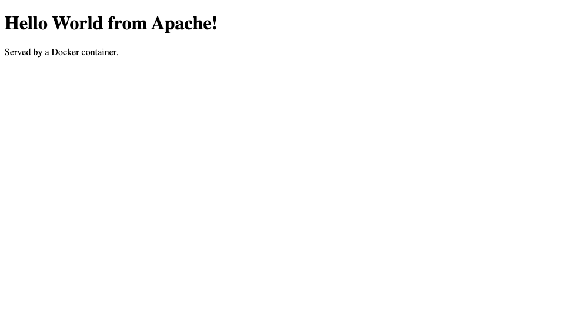

# Apache (httpd) — Hello World

| | |
|---|---|
| Base image | `httpd:2.4-alpine` |
| App | [`index.html`](./index.html) — a static page, copied into Apache's document root `/usr/local/apache2/htdocs/` |
| Container port | 80 (published on 8081) |

No application code and no `CMD`: the base image already starts `httpd` in the foreground, so the whole `Dockerfile` is one `COPY`.

## Build & run

```bash
docker build -t hello-apache .
docker run -d --name hello-apache -p 8081:80 hello-apache
curl http://localhost:8081
```

Expected: the "Hello World from Apache" page.

Verified transcript: [`../run-and-verify-all.txt`](../run-and-verify-all.txt)

## Screenshot

The running container serving the page in a browser:


