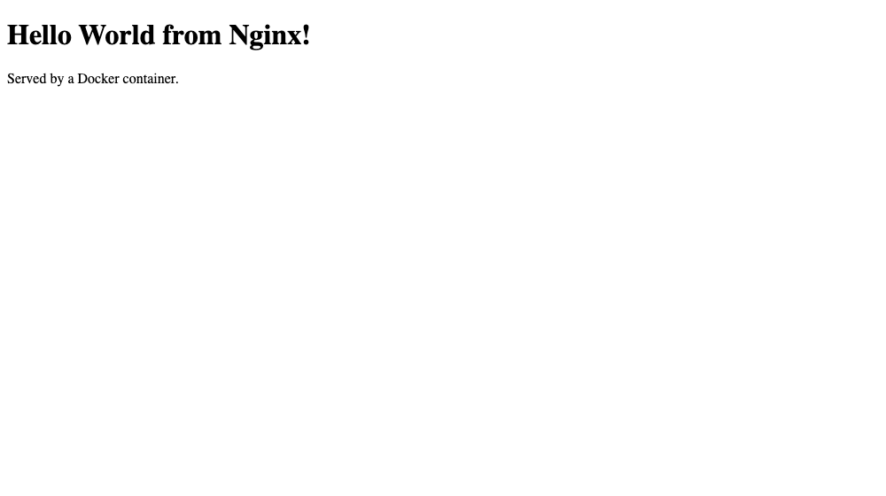

# Task 5 — Docker Fundamentals: Hello World across 6 platforms

Six containerized "Hello World" web apps, each in its own folder with the app code and a `Dockerfile`, built, run, and verified with a real HTTP request **and** a browser screenshot.

Folder names follow the structure the assignment specifies (`nodejs-app`, `python-app`, `java-app`, `Apache-app`, `React-app`, `nginx-app`).

| Folder | Platform | Host port | How it serves "Hello World" | Screenshot |
|---|---|---|---|---|
| [`nodejs-app/`](./nodejs-app/) | Node.js | 3000 | Built-in `http` module, no framework | [png](./screenshots/nodejs-app.png) |
| [`python-app/`](./python-app/) | Python | 5001 | `http.server.BaseHTTPRequestHandler`, stdlib only | [png](./screenshots/python-app.png) |
| [`java-app/`](./java-app/) | Java | 8080 | `com.sun.net.httpserver.HttpServer` (JDK built-in), multi-stage build (compile in a JDK image, run in a slim JRE image) | [png](./screenshots/java-app.png) |
| [`Apache-app/`](./Apache-app/) | Apache | 8081 | Static `index.html` served by `httpd:2.4-alpine` | [png](./screenshots/Apache-app.png) |
| [`React-app/`](./React-app/) | React | 8083 | React component mounted with `ReactDOM.createRoot`; React/ReactDOM production builds vendored locally and served by Nginx — no CDN dependency, no `npm install` in the build | [png](./screenshots/React-app.png) |
| [`nginx-app/`](./nginx-app/) | Nginx | 8082 | Static `index.html` served by `nginx:alpine` | [png](./screenshots/nginx-app.png) |

Full transcript of building, running and verifying all six: [`run-and-verify-all.txt`](./run-and-verify-all.txt).

## Build and run everything

```bash
docker build -t hello-nodejs ./nodejs-app  && docker run -d --name hello-nodejs -p 3000:3000 hello-nodejs
docker build -t hello-python ./python-app  && docker run -d --name hello-python -p 5001:5000 hello-python
docker build -t hello-java   ./java-app    && docker run -d --name hello-java   -p 8080:8080 hello-java
docker build -t hello-apache ./Apache-app  && docker run -d --name hello-apache -p 8081:80   hello-apache
docker build -t hello-nginx  ./nginx-app   && docker run -d --name hello-nginx  -p 8082:80   hello-nginx
docker build -t hello-react  ./React-app   && docker run -d --name hello-react  -p 8083:80   hello-react
docker ps
```

## Verification — every app answered over HTTP

`docker ps` with all six running (full transcript: [`run-and-verify-all.txt`](./run-and-verify-all.txt)):

```
$ docker ps
NAMES          IMAGE          STATUS          PORTS
hello-react    hello-react    Up 31 seconds   0.0.0.0:8083->80/tcp
hello-nginx    hello-nginx    Up 31 seconds   0.0.0.0:8082->80/tcp
hello-apache   hello-apache   Up 31 seconds   0.0.0.0:8081->80/tcp
hello-java     hello-java     Up 32 seconds   0.0.0.0:8080->8080/tcp
hello-python   hello-python   Up 32 seconds   0.0.0.0:5001->5000/tcp
hello-nodejs   hello-nodejs   Up 32 seconds   0.0.0.0:3000->3000/tcp
```

Then each one verified with a real HTTP request:

```
### Node.js - curl http://localhost:3000
<h1>Hello World from Node.js!</h1><p>Served by a Docker container.</p>

### Python - curl http://localhost:5001
<h1>Hello World from Python!</h1><p>Served by a Docker container.</p>

### Java - curl http://localhost:8080
<h1>Hello World from Java!</h1><p>Served by a Docker container.</p>

### Apache - curl http://localhost:8081
<h1>Hello World from Apache!</h1>

### Nginx - curl http://localhost:8082
<h1>Hello World from Nginx!</h1>

### React - curl http://localhost:8083
<div id="root">Hello World from React! (fallback text, replaced once React mounts)</div>
```

The React one is worth a note: `curl` shows the *fallback* text because React hasn't run yet — a plain HTTP fetch has no JavaScript engine. The screenshot below is taken in a real browser, where React mounts and replaces it with the actual component output. That's why a screenshot is better evidence than `curl` for this one app.

## Image sizes built

```
$ docker images | grep hello-
hello-python    latest    87.8MB
hello-nginx     latest     102MB
hello-react     latest     102MB
hello-apache    latest     105MB
hello-nodejs    latest     194MB
hello-java      latest     286MB
```

Python-Alpine is the smallest; Java is the largest even *with* a multi-stage build, because a JRE is simply big. Nginx and React are near-identical since React here is static files served by the same Nginx base.

## Screenshots

| Node.js | Python | Java |
|---|---|---|
|  |  |  |

| Apache | Nginx | React |
|---|---|---|
|  |  |  |

## Two notes on the environment

**Python is published on host port 5001, not 5000.** The container still listens on 5000; only the host-side mapping differs. On macOS, port 5000 is already held by the OS itself (Control Center / AirPlay Receiver), which answers `403` before Docker ever sees the request:

```
$ lsof -nP -iTCP:5000 -sTCP:LISTEN
COMMAND    PID        USER   FD   TYPE  NODE NAME
ControlCe  447 lakshya0025  12u  IPv4   TCP *:5000 (LISTEN)
```

**Image sizes** in the transcript are from an `aarch64` (Apple Silicon) Docker host, so they will differ slightly on an `x86_64` machine.
