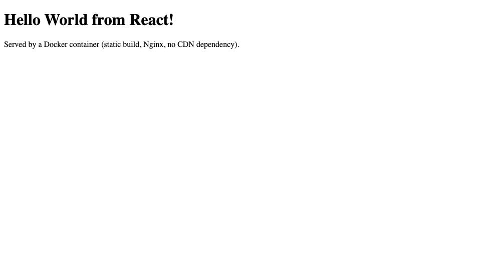

# React — Hello World

| | |
|---|---|
| Base image | `nginx:alpine` |
| App | [`index.html`](./index.html) — mounts a real React component with `ReactDOM.createRoot(...).render(...)` |
| Container port | 80 (published on 8083) |

## Why there's no `npm install` here

The usual React container is a two-stage build: `npm ci && npm run build` in a Node image, then copy `dist/` into Nginx. That needs a working npm registry at image-build time and pulls a large toolchain.

This exercise keeps the same *end result* — a React component rendering in the browser, served as static files by Nginx — while staying self-contained: React and ReactDOM's **production UMD builds are vendored into this folder** ([`react.production.min.js`](./react.production.min.js), [`react-dom.production.min.js`](./react-dom.production.min.js)) and copied in alongside the HTML. No CDN dependency at runtime, no network access needed during the build, and the image stays as small as the Nginx one.

## Build & run

```bash
docker build -t hello-react .
docker run -d --name hello-react -p 8083:80 hello-react
curl http://localhost:8083
```

Expected: the page HTML, with React mounting "Hello World from React!" in the browser.

Verified transcript: [`../run-and-verify-all.txt`](../run-and-verify-all.txt)

## Screenshot

The running container serving the page in a browser:


