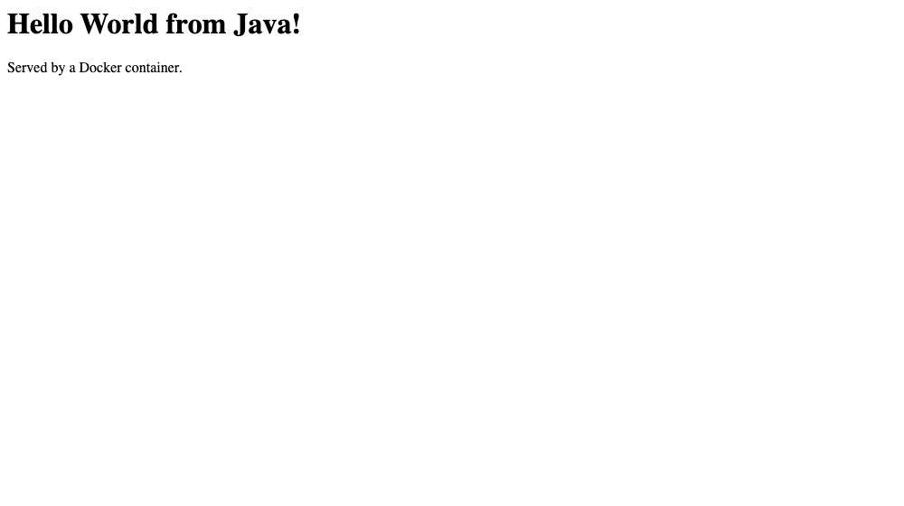

# Java — Hello World (multi-stage build)

| | |
|---|---|
| Base images | `eclipse-temurin:21-jdk-alpine` (build stage) → `eclipse-temurin:21-jre-alpine` (runtime stage) |
| App | [`App.java`](./App.java) — `com.sun.net.httpserver.HttpServer`, built into the JDK, so no Maven/Gradle and no external libraries |
| Container port | 8080 |

This is the only fundamentals app that needs a **compile step**, so it uses a two-stage `Dockerfile`: stage 1 runs `javac` in a full JDK image, stage 2 starts from a JRE-only image and copies just the `.class` files across with `COPY --from=build`. The compiler and its toolchain never end up in the shipped image. (Multi-stage builds are explored further in [Task 6](../../06-docker-advanced/multi-stage-build/).)

## Build & run

```bash
docker build -t hello-java .
docker run -d --name hello-java -p 8080:8080 hello-java
curl http://localhost:8080
```

Expected: `<h1>Hello World from Java!</h1><p>Served by a Docker container.</p>`

Verified transcript: [`../run-and-verify-all.txt`](../run-and-verify-all.txt)

## Screenshot

The running container serving the page in a browser:


