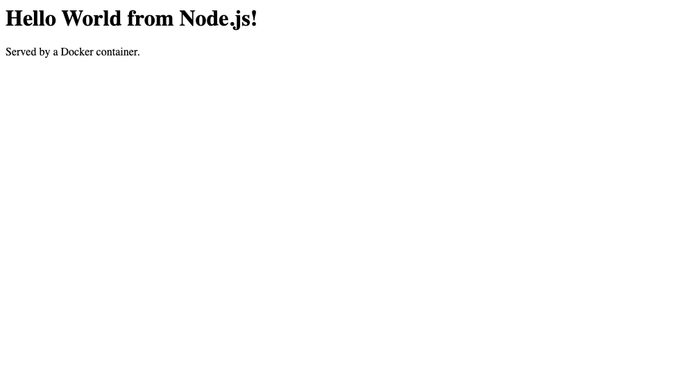

# Node.js — Hello World

| | |
|---|---|
| Base image | `node:20-alpine` |
| App | [`app.js`](./app.js) — Node's built-in `http` module, no framework, no dependencies (so no `package.json`/`npm install` needed) |
| Container port | 3000 |

## Build & run

```bash
docker build -t hello-nodejs .
docker run -d --name hello-nodejs -p 3000:3000 hello-nodejs
curl http://localhost:3000
```

Expected: `<h1>Hello World from Node.js!</h1><p>Served by a Docker container.</p>`

Verified transcript: [`../run-and-verify-all.txt`](../run-and-verify-all.txt)

## Screenshot

The running container serving the page in a browser:


