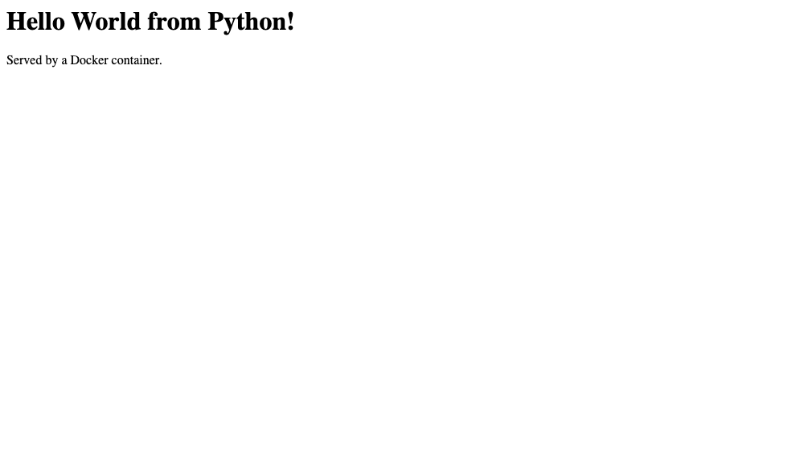

# Python — Hello World

| | |
|---|---|
| Base image | `python:3.12-alpine` |
| App | [`app.py`](./app.py) — `http.server.BaseHTTPRequestHandler` from the standard library, so there's nothing to `pip install` |
| Container port | 5000 (published on host port 5001) |

## Build & run

```bash
docker build -t hello-python .
docker run -d --name hello-python -p 5001:5000 hello-python
curl http://localhost:5001
```

Expected: `<h1>Hello World from Python!</h1><p>Served by a Docker container.</p>`

Verified transcript: [`../run-and-verify-all.txt`](../run-and-verify-all.txt)

## Why host port 5001?

The container listens on 5000 as normal, but on macOS port 5000 on the *host* is
already taken by the OS (Control Center / AirPlay Receiver), which answers `403`
before Docker sees the request. Only the host-side mapping changed.

## Screenshot

The running container serving the page in a browser:


