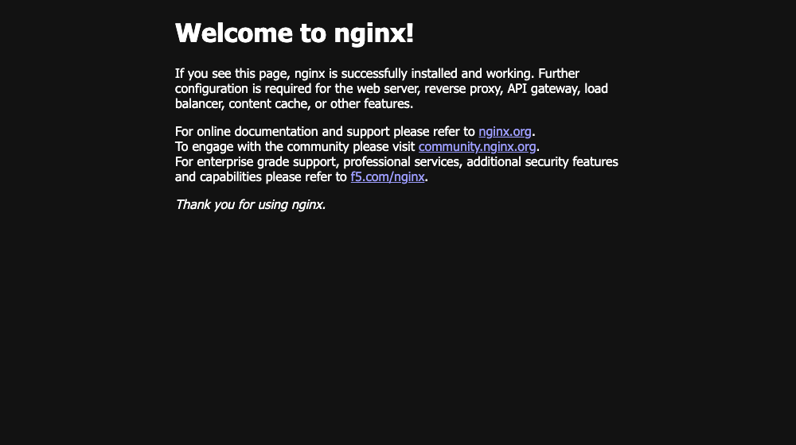

# Docker Networking Task 1 — 3 containers, 3 networks, backend on 2 networks

Exactly the topology the assignment asks for: a **Frontend**, a **Backend** and a **Database** container, three separate user-defined networks, and the backend attached to **two** of them.

| Container | Image | Networks |
|---|---|---|
| `frontend` | `nginx:alpine` | `frontend-net` |
| `backend` | `alpine` (busybox `httpd` on :5000) | `frontend-net` **and** `db-net` ← the two-network container |
| `database` | `mysql:8.4` | `db-net` |
| *(none)* | — | `backend-net` — the third network, used below to demonstrate isolation |

```
frontend ──frontend-net── backend ──db-net── database
                                                      backend-net (separate, reaches nothing)
```

The backend is the only container on two networks, which is what makes it the sole path between the frontend and the database. That is the whole point of the layout: the database is never exposed to the frontend tier.

Full transcript: [`three-tier-demo-output.txt`](./three-tier-demo-output.txt).

## Setup

```bash
docker network create frontend-net
docker network create backend-net
docker network create db-net

docker run -d --name frontend --network frontend-net -p 8085:80 nginx:alpine
docker run -d --name database --network db-net -e MYSQL_ROOT_PASSWORD=rootpw -e MYSQL_DATABASE=appdb mysql:8.4
docker run -d --name backend  --network frontend-net alpine \
  sh -c "apk add --no-cache busybox-extras >/dev/null && mkdir -p /www && echo backend-tier-OK > /www/index.html && httpd -f -p 5000 -h /www"

# add the backend to its SECOND network
docker network connect db-net backend
```

Confirming the two-network membership:

```
$ docker inspect backend --format '{{range $k,$v := .NetworkSettings.Networks}}{{$k}} {{end}}'
db-net frontend-net

frontend-net   -> frontend backend
backend-net    ->
db-net         -> database backend
```

## Connectivity results

| From | To | Shared network? | Result |
|---|---|---|---|
| `frontend` | `backend:5000` | yes (`frontend-net`) | ✅ `backend-tier-OK` |
| `backend` | `database:3306` | yes (`db-net`) | ✅ DNS → `172.20.0.2`, TCP 3306 reachable |
| `frontend` | `database:3306` | **no** | ❌ `nc: bad address 'database'` — name does not even resolve |
| container on `backend-net` | any tier | **no** | ❌ nothing resolves |

The failures matter as much as the successes: Docker's embedded DNS only resolves container names **within a shared network**, so the isolation is enforced at name-resolution time, before any packet is sent.

```
$ docker exec frontend wget -qO- http://backend:5000/
backend-tier-OK

$ docker exec backend getent hosts database
172.20.0.2        database  database

$ docker exec frontend nc -z -w 3 database 3306
nc: bad address 'database'
```

## Screenshot

The frontend tier serving on `localhost:8085`:



## Note on the Alpine backend

`alpine`'s busybox build does not include the `httpd` applet, so the container installs `busybox-extras` (which provides it) at start-up. It is still the plain `alpine` image the assignment asks for — nothing is baked into a custom image.
