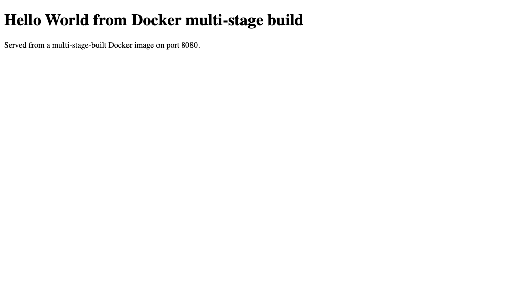

# Docker Multi-Stage Build — Submission

| | |
|---|---|
| **Name** | Lakshya Mewara |
| **Enrollment number** | 24BCS10290 |
| **Repository** | https://github.com/LAKSHYAMEWARA0025/devops-heros |
| **Date run** | 3 September 2026 |
| **Environment** | Docker 29.5.2, `aarch64` Docker host (Colima VM on macOS) |

## Task 1 — Build and run the multi-stage Dockerfile

```bash
docker build -f Dockerfile -t gohello-multistage .
docker run -d --name gohello -p 8080:8080 gohello-multistage
```

## Evidence 1 — the application running successfully

`curl http://localhost:8080` returns the required string:

```html
<!doctype html>
<html>
<head><title>Multi-stage build</title></head>
<body>
<h1>Hello World from Docker multi-stage build</h1>
<p>Served from a multi-stage-built Docker image on port 8080.</p>
</body>
</html>
```

Screenshot of the application in a browser:



## Evidence 2 — `docker ps` showing the container on port 8080

```
$ docker ps
NAMES     IMAGE                STATUS                  PORTS
gohello   gohello-multistage   Up Less than a second   0.0.0.0:8080->8080/tcp, [::]:8080->8080/tcp
```

The `PORTS` column confirms the container is published on **port 8080**.

## Bonus — the size saving the multi-stage build achieves

| Image | Final base | Size |
|---|---|---|
| `gohello-singlestage` | `golang:1.22-alpine` | 440 MB |
| `gohello-multistage` | `scratch` | **10.5 MB** |

**42x smaller** for the same running application.

## Task 3 — three or more application types deployed with Docker

Six are deployed in [`../../05-docker-fundamentals/`](../../05-docker-fundamentals/): Node.js, Python, Java, Apache, React and Nginx — each with its own folder, `Dockerfile`, verified HTTP response and screenshot.

## Reproducing everything

Raw transcripts, captured as the commands ran:

- [`build-comparison-output.txt`](./build-comparison-output.txt) — both builds, the size comparison, `docker ps`, and the verified HTTP response
- [`README.md`](./README.md) — how multi-stage builds work and why `scratch` is usable here
