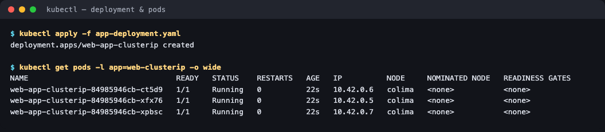
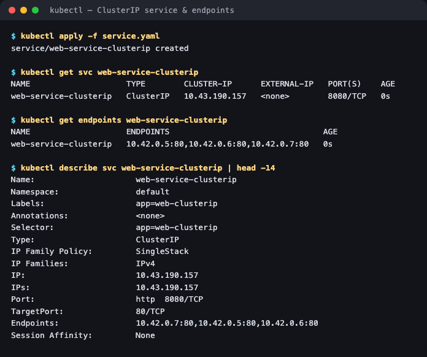
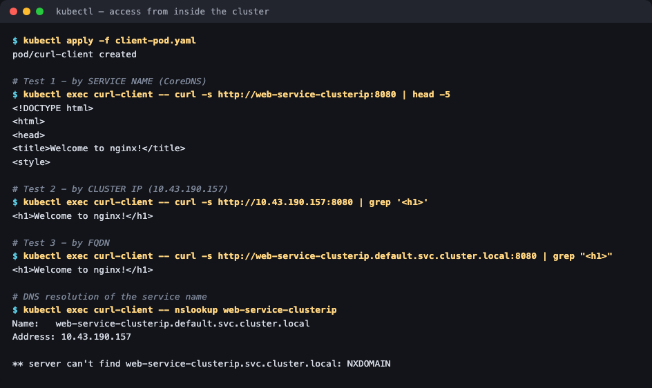

# 01 — ClusterIP Service

**Homework submission** · Lakshya Mewara · 24BCS10290

> **Cluster used:** k3s `v1.35.0+k3s1` running in a Colima VM on macOS (Apple Silicon).
> k3s uses `10.42.0.0/16` for pods and `10.43.0.0/16` for services, so the IPs below differ
> from the `10.244.x` / `10.96.x` examples in the session notes — the behaviour is identical.

---

## What a ClusterIP is

`ClusterIP` is the **default** Service type. Kubernetes allocates a stable, virtual IP from the service subnet that is reachable **only from inside the cluster**, and load-balances traffic across every healthy Pod matching the selector.

**The problem it solves:** Pods are mortal. Every restart or reschedule gives a Pod a brand-new IP, so hardcoding `http://10.42.0.5:80` in a frontend breaks the moment that Pod dies. A ClusterIP gives you one name and one IP that never change, and Kubernetes keeps the list of real Pods behind it up to date.

```
        client pod ──► web-service-clusterip:8080  (VIP 10.43.190.157)
                                  │
                      [kube-proxy L4 load balancing]
                ┌─────────────────┼─────────────────┐
                ▼                 ▼                 ▼
          10.42.0.5:80      10.42.0.6:80      10.42.0.7:80
```

---

## Step 1 — Deploy the backend

```bash
kubectl apply -f app-deployment.yaml
kubectl get pods -l app=web-clusterip -o wide
```



```
deployment.apps/web-app-clusterip created

NAME                                 READY   STATUS    RESTARTS   AGE   IP          NODE
web-app-clusterip-84985946cb-ct5d9   1/1     Running   0          22s   10.42.0.6   colima
web-app-clusterip-84985946cb-xfx76   1/1     Running   0          22s   10.42.0.5   colima
web-app-clusterip-84985946cb-xpbsc   1/1     Running   0          22s   10.42.0.7   colima
```

Three replicas, three different Pod IPs — exactly the IPs we must *not* hardcode anywhere.

## Step 2 — Create the Service, and check the Endpoints

```bash
kubectl apply -f service.yaml
kubectl get svc web-service-clusterip
kubectl get endpoints web-service-clusterip
```



```
NAME                    TYPE        CLUSTER-IP      EXTERNAL-IP   PORT(S)    AGE
web-service-clusterip   ClusterIP   10.43.190.157   <none>        8080/TCP   0s

NAME                    ENDPOINTS                                AGE
web-service-clusterip   10.42.0.5:80,10.42.0.6:80,10.42.0.7:80   0s
```

**This is the step that proves the Service actually works.** `EXTERNAL-IP` is `<none>` — that's the definition of ClusterIP, no outside access. And the `ENDPOINTS` column lists all three Pod IPs on port **80**, which means the label selector matched and kube-proxy has real backends to route to. An empty endpoint list here is the single most common ClusterIP bug, and it always means the selector doesn't match the Pod labels.

Note the two different ports: the Service is reached on **8080** (`port`) but forwards to **80** (`targetPort`) where nginx actually listens.

## Step 3 — Access it from inside the cluster, three ways

```bash
kubectl apply -f client-pod.yaml
kubectl exec curl-client -- curl -s http://web-service-clusterip:8080          # by name
kubectl exec curl-client -- curl -s http://10.43.190.157:8080                  # by IP
kubectl exec curl-client -- curl -s http://web-service-clusterip.default.svc.cluster.local:8080   # by FQDN
```



All three return the nginx welcome page:

```
<!DOCTYPE html>
<html>
<head>
<title>Welcome to nginx!</title>
...
<h1>Welcome to nginx!</h1>
```

And the DNS record CoreDNS created for the Service:

```
$ kubectl exec curl-client -- nslookup web-service-clusterip
Name:   web-service-clusterip.default.svc.cluster.local
Address: 10.43.190.157

** server can't find web-service-clusterip.svc.cluster.local: NXDOMAIN
```

That `NXDOMAIN` line is **not an error** — it's the resolver walking the search list from `/etc/resolv.conf` (`default.svc.cluster.local`, then `svc.cluster.local`, then `cluster.local`). The first entry matched and returned the right address; the extra probe for a shorter suffix simply doesn't exist. Seeing it is normal in every Kubernetes pod.

## Step 4 — View it in a browser via port-forward

`ClusterIP` isn't reachable from the laptop, so `kubectl port-forward` tunnels a local port through the API server into the Service:

```bash
kubectl port-forward svc/web-service-clusterip 8080:8080
# then open http://localhost:8080
```


This is a **debugging** tool, not a way to expose an app — the tunnel lives only as long as the command runs, and it's per-developer. Exposing an app properly is what NodePort, LoadBalancer and Ingress are for.

---

## What I understood

- **The Endpoints object is the Service.** A Service is really just a stable name plus a label selector; the `Endpoints`/`EndpointSlice` object is the live list of Pod IPs behind it, continuously reconciled as Pods come and go. `kubectl get endpoints` is therefore the first command to run when a Service "doesn't work" — if it's empty, the problem is labels, not networking.
- **`port` vs `targetPort` are genuinely different things.** `port` is the Service's front door (8080 here), `targetPort` is the container's back door (80). Mixing them up gives "connection refused" even though everything looks healthy.
- **There is no proxy process in the path.** kube-proxy programs iptables/IPVS rules on each node; the VIP `10.43.190.157` doesn't belong to any interface and nothing listens on it. The packet is rewritten in the kernel to one of the endpoint IPs. That's why you can't `ping` a ClusterIP but you *can* `curl` it.
- **DNS is what makes it usable.** The stable IP alone isn't enough, because it's allocated at creation time. CoreDNS giving every Service a predictable `<name>.<namespace>.svc.cluster.local` record is what lets application config be written before the cluster even exists.
- **ClusterIP is the right default.** Databases, caches and internal APIs should be ClusterIP precisely because it *cannot* be reached from outside — you have to deliberately opt into exposure.

## Troubleshooting notes

| Symptom | Cause | Fix |
|---|---|---|
| `ENDPOINTS` shows `<none>` | Service `selector` doesn't match Pod labels | Compare `spec.selector` with `template.metadata.labels` |
| Connection refused from client pod | `targetPort` ≠ the port the container listens on | Match `targetPort` to `containerPort` |
| Name doesn't resolve | CoreDNS unhealthy | `kubectl get pods -n kube-system -l k8s-app=kube-dns` |
| `ping <clusterIP>` fails | Expected — VIPs are L4 iptables rules, not hosts | Test with `curl`/`nc`, not `ping` |

## Files

| File | Purpose |
|---|---|
| [`app-deployment.yaml`](./app-deployment.yaml) | 3 nginx replicas labelled `app: web-clusterip` |
| [`service.yaml`](./service.yaml) | The ClusterIP Service, `8080` → `80` |
| [`client-pod.yaml`](./client-pod.yaml) | `curlimages/curl` pod used to test from inside the cluster |

## Cleanup

```bash
kubectl delete -f client-pod.yaml -f service.yaml -f app-deployment.yaml
```
