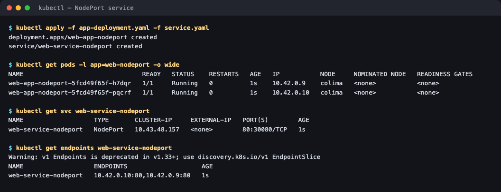
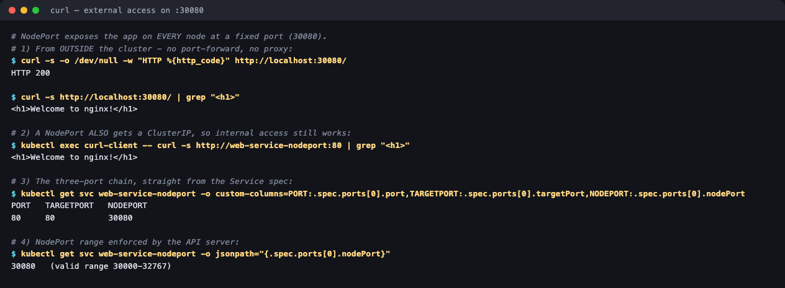

# 02 — NodePort Service

**Homework submission** · Lakshya Mewara · 24BCS10290

> **Cluster used:** k3s `v1.35.0+k3s1` in a Colima VM on macOS (Apple Silicon).
> Pod subnet `10.42.0.0/16`, service subnet `10.43.0.0/16`.

---

## What a NodePort is

`NodePort` builds **on top of** ClusterIP. It still gets an internal VIP, but it additionally opens **the same fixed port on every node in the cluster** and forwards it into the Service. That makes the app reachable from outside the cluster using `http://<any-node-ip>:<nodePort>` — no port-forward, no proxy, no cloud provider required.

The allowed range is **30000–32767** (the API server rejects anything outside it unless reconfigured). Omit `nodePort` and Kubernetes picks a free one for you; this manifest pins `30080` so the URL is predictable.

```
   outside world ──► <node-ip>:30080        ← NodePort (opened on every node)
                            │
                            ▼
                web-service-nodeport :80    ← ClusterIP it still has
                            │
              ┌─────────────┴─────────────┐
              ▼                           ▼
        10.42.0.9:80                10.42.0.10:80   ← targetPort
```

**Three ports, three meanings** — the thing that confuses everyone:

| Field | Value here | Meaning |
|---|---|---|
| `nodePort` | `30080` | Port opened on the **node**, for outside traffic |
| `port` | `80` | Port of the **Service** (internal ClusterIP access) |
| `targetPort` | `80` | Port the **container** actually listens on |

---

## Step 1 — Deploy and expose

```bash
kubectl apply -f app-deployment.yaml -f service.yaml
kubectl get pods -l app=web-nodeport -o wide
kubectl get svc web-service-nodeport
kubectl get endpoints web-service-nodeport
```



```
NAME                                READY   STATUS    RESTARTS   AGE   IP           NODE
web-app-nodeport-5fcd49f65f-h7dqr   1/1     Running   0          1s    10.42.0.9    colima
web-app-nodeport-5fcd49f65f-pqcrf   1/1     Running   0          1s    10.42.0.10   colima

NAME                   TYPE       CLUSTER-IP     EXTERNAL-IP   PORT(S)        AGE
web-service-nodeport   NodePort   10.43.48.157   <none>        80:30080/TCP   1s

NAME                   ENDPOINTS                    AGE
web-service-nodeport   10.42.0.10:80,10.42.0.9:80   1s
```

The `PORT(S)` column reads **`80:30080/TCP`** — service port 80 on the left, node port 30080 on the right. That colon-pair is the giveaway that this is a NodePort rather than a plain ClusterIP.

`EXTERNAL-IP` is still `<none>`, which surprised me at first: NodePort does **not** allocate an external IP. It reuses the nodes' own IPs, so there is nothing for Kubernetes to assign.

## Step 2 — Reach it from outside the cluster

```bash
curl http://localhost:30080/
```



```
$ curl -s -o /dev/null -w "HTTP %{http_code}" http://localhost:30080/
HTTP 200

$ curl -s http://localhost:30080/ | grep "<h1>"
<h1>Welcome to nginx!</h1>

# A NodePort ALSO gets a ClusterIP, so internal access still works:
$ kubectl exec curl-client -- curl -s http://web-service-nodeport:80 | grep "<h1>"
<h1>Welcome to nginx!</h1>

$ kubectl get svc web-service-nodeport -o custom-columns=PORT:...,TARGETPORT:...,NODEPORT:...
PORT   TARGETPORT   NODEPORT
80     80           30080
```

Both paths work simultaneously — that's the point of NodePort being a *superset* of ClusterIP.

## Step 3 — In the browser

Straight to `http://localhost:30080` with no tunnel running:


> **Why `localhost` works here:** on macOS the k3s node is the Colima VM, and Lima automatically forwards ports that start listening inside the VM out to the host. On a normal cluster you'd use the node's real IP — `curl http://<node-ip>:30080` — which is exactly what `colima ssh -- curl http://localhost:30080` does from the node itself (also HTTP 200, captured above).

---

## What I understood

- **NodePort is ClusterIP plus a door in every node.** It doesn't replace the ClusterIP, it layers on top. Every NodePort Service is still internally reachable by name, which is why the `kubectl exec` test above still succeeds.
- **Every node opens the port, not just the ones running Pods.** Hit any node and kube-proxy forwards to a healthy Pod wherever it lives — possibly on a different node. That's convenient, but it means a request can take an extra network hop.
- **The 30000–32767 range is a deliberate constraint.** Low ports would collide with host services and need root, so Kubernetes reserves a high band. It's also why you can't serve a NodePort on port 80 directly — the thing you actually want in production, which is what LoadBalancer and Ingress exist to solve.
- **The single biggest limitation:** clients need to know a node's IP, and nodes come and go. There's no single stable address and no built-in TLS or name-based routing. Fine for dev clusters, on-prem access and as the target that a real load balancer points at — but you would not hand `http://node-7:31534` to end users.

## Troubleshooting notes

| Symptom | Cause | Fix |
|---|---|---|
| `port 30080 is not in the valid range` | `nodePort` outside 30000–32767 | Pick a port in range, or omit it and let Kubernetes choose |
| `provided port is already allocated` | Another Service already holds that nodePort | Choose another, or `kubectl get svc -A` to find the holder |
| Works via ClusterIP, times out via NodePort | Firewall / security group blocking the node port | Open the port on the node's firewall |
| `ENDPOINTS` empty | Selector doesn't match Pod labels | Compare `spec.selector` with `template.metadata.labels` |

## Files

| File | Purpose |
|---|---|
| [`app-deployment.yaml`](./app-deployment.yaml) | 2 nginx replicas labelled `app: web-nodeport` |
| [`service.yaml`](./service.yaml) | The NodePort Service, pinned to `30080` |

## Cleanup

```bash
kubectl delete -f service.yaml -f app-deployment.yaml
```
