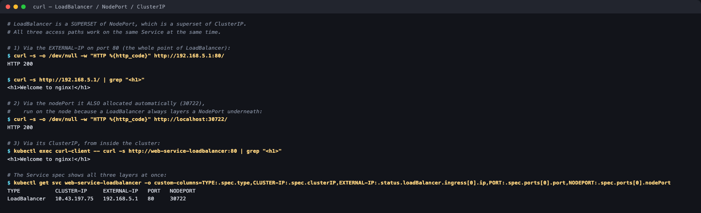

# 03 — LoadBalancer Service

**Homework submission** · Lakshya Mewara · 24BCS10290

> **Cluster used:** k3s `v1.35.0+k3s1` in a Colima VM on macOS (Apple Silicon).
> k3s ships **servicelb (klipper-lb)** built in, so `type: LoadBalancer` actually gets an
> `EXTERNAL-IP` here instead of sitting in `<pending>` forever as it would on a bare cluster.

---

## What a LoadBalancer is

`LoadBalancer` is the standard way to expose a Service to the internet. It is a **superset of NodePort**, which is itself a superset of ClusterIP — creating one gives you all three at once:

```
  internet ──► EXTERNAL-IP 192.168.5.1 : 80      ← LoadBalancer
                        │
                        ▼
              node-ip : 30722                    ← NodePort (auto-allocated)
                        │
                        ▼
          web-service-loadbalancer : 80          ← ClusterIP 10.43.197.75
                        │
        ┌───────────────┼───────────────┐
        ▼               ▼               ▼
  10.42.0.12:80   10.42.0.13:80   10.42.0.14:80  ← targetPort
```

On a cloud provider, creating this Service makes the cloud-controller-manager call the provider's API and provision a real load balancer (AWS ELB/NLB, GCP Network LB, Azure LB), then write its address back into `status.loadBalancer.ingress`. **Kubernetes itself has no load balancer implementation** — without a provider or something like MetalLB, the `EXTERNAL-IP` stays `<pending>`.

---

## Step 1 — Deploy and watch the EXTERNAL-IP get allocated

```bash
kubectl apply -f app-deployment.yaml -f service.yaml
kubectl get svc web-service-loadbalancer
```


```
NAME                                    READY   STATUS    RESTARTS   AGE   IP           NODE
web-app-loadbalancer-5bc7776f58-m7mgb   1/1     Running   0          16s   10.42.0.13   colima
web-app-loadbalancer-5bc7776f58-qk627   1/1     Running   0          16s   10.42.0.12   colima
web-app-loadbalancer-5bc7776f58-tq8wk   1/1     Running   0          16s   10.42.0.14   colima

NAME                       TYPE           CLUSTER-IP     EXTERNAL-IP   PORT(S)        AGE
web-service-loadbalancer   LoadBalancer   10.43.197.75   192.168.5.1   80:30722/TCP   16s
```

**This is the line that distinguishes LoadBalancer from everything before it** — `EXTERNAL-IP` is populated (`192.168.5.1`) instead of `<none>`. Both ClusterIP and NodePort leave that column empty.

Note `PORT(S)` still reads `80:30722/TCP`: a NodePort was allocated underneath automatically, even though the manifest never asked for one.

**Who actually allocated the IP** — k3s runs servicelb as a DaemonSet pod per LoadBalancer Service:

```
$ kubectl get pods -n kube-system -l svccontroller.k3s.cattle.io/svcname=web-service-loadbalancer -o wide
NAME                                            READY   STATUS    RESTARTS   AGE   IP           NODE
svclb-web-service-loadbalancer-39314103-zh87v   1/1     Running   0          16s   10.42.0.11   colima
```

On EKS/GKE/AKS that pod wouldn't exist — the cloud controller would have provisioned an actual external load balancer instead.

## Step 2 — All three access paths work at once



```
# 1) Via the EXTERNAL-IP on port 80:
$ curl -s -o /dev/null -w "HTTP %{http_code}" http://192.168.5.1:80/
HTTP 200
$ curl -s http://192.168.5.1/ | grep "<h1>"
<h1>Welcome to nginx!</h1>

# 2) Via the nodePort it also allocated (30722):
HTTP 200

# 3) Via its ClusterIP, from inside the cluster:
$ kubectl exec curl-client -- curl -s http://web-service-loadbalancer:80 | grep "<h1>"
<h1>Welcome to nginx!</h1>

$ kubectl get svc web-service-loadbalancer -o custom-columns=...
TYPE           CLUSTER-IP     EXTERNAL-IP   PORT   NODEPORT
LoadBalancer   10.43.197.75   192.168.5.1   80     30722
```

That last table is the clearest summary of the whole session: **one Service object, three addresses, three audiences** — internal pods, node-level access, and the outside world.

## Step 3 — In the browser, on port 80


Served on plain **port 80** — no `:30080`-style high port, which is exactly the limitation LoadBalancer removes compared to NodePort.

---

## What I understood

- **Each Service type wraps the previous one.** ClusterIP → NodePort → LoadBalancer is strictly additive. That's why `kubectl get svc` on a LoadBalancer still shows a CLUSTER-IP and a nodePort: they're all still there and all still work, as demonstrated above.
- **Kubernetes doesn't implement load balancing itself.** It just records a request in the Service spec and waits for *something* to fulfil it and write back `status.loadBalancer.ingress`. That something is the cloud controller manager, MetalLB, or here k3s's servicelb. A `<pending>` EXTERNAL-IP isn't a bug — it means nothing is listening for that request.
- **The cost model is the real-world catch.** Every LoadBalancer Service provisions a separate cloud load balancer, each with its own bill and its own IP. Twenty microservices means twenty load balancers. That economic pressure is the main reason **Ingress** exists — one load balancer, routing by hostname and path to many backing Services.
- **It's still Layer 4.** A LoadBalancer Service forwards TCP; it doesn't understand HTTP paths, hostnames, or TLS termination on its own. Anything routing-aware needs Ingress or a service mesh.

## Troubleshooting notes

| Symptom | Cause | Fix |
|---|---|---|
| `EXTERNAL-IP` stuck on `<pending>` | No cloud provider / no LB implementation in the cluster | Install MetalLB, use k3s servicelb, or fall back to NodePort |
| Works internally, not from outside | Cloud firewall / security group not opened | Allow the port on the LB and node security groups |
| `ENDPOINTS` empty | Selector doesn't match Pod labels | Compare `spec.selector` with `template.metadata.labels` |
| Each new Service costs money | One cloud LB per Service | Consolidate behind an Ingress controller |

## Files

| File | Purpose |
|---|---|
| [`app-deployment.yaml`](./app-deployment.yaml) | 3 nginx replicas labelled `app: web-loadbalancer` |
| [`service.yaml`](./service.yaml) | The LoadBalancer Service on port 80 |

## Cleanup

```bash
kubectl delete -f service.yaml -f app-deployment.yaml
```
