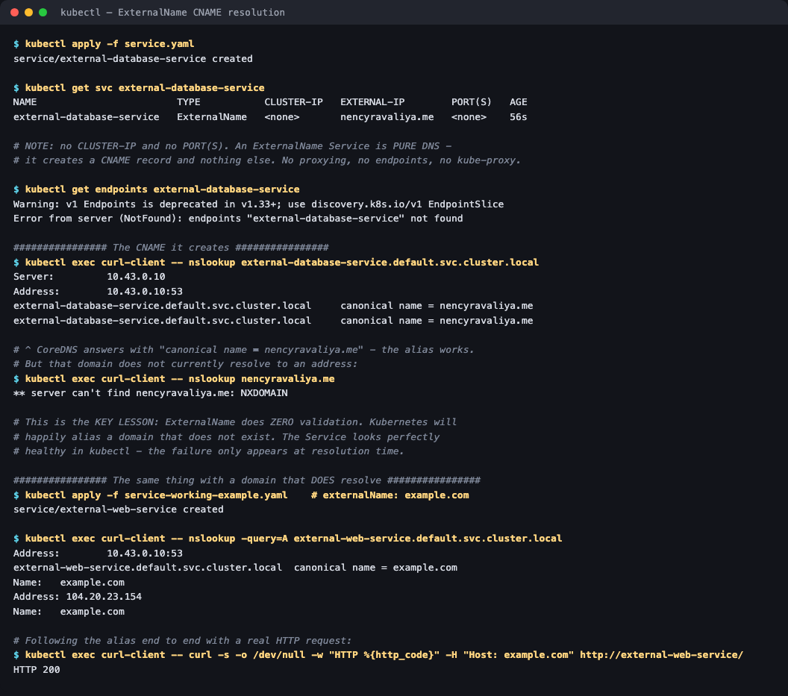

# 04 — ExternalName Service

**Homework submission** · Lakshya Mewara · 24BCS10290

> **Cluster used:** k3s `v1.35.0+k3s1` in a Colima VM on macOS (Apple Silicon). CoreDNS at `10.43.0.10`.

---

## What an ExternalName is

`ExternalName` is the odd one out. It creates **no ClusterIP, no endpoints, no proxying and no kube-proxy rules** — it is purely a **DNS CNAME record**. Requests to `<service>.<namespace>.svc.cluster.local` get an alias pointing at some hostname *outside* the cluster, and the pod's own resolver follows it from there.

```
  pod ──► external-database-service.default.svc.cluster.local
                            │
                       CoreDNS answers:
                     "canonical name = nencyravaliya.me"
                            │
                            ▼
             pod resolves that name itself and connects directly
             (traffic never passes through any Kubernetes component)
```

**What it's for:** giving an in-cluster name to something that lives outside — a managed RDS database, a third-party API, a legacy server still in the datacenter. Your app config says `db-service`, and which real host that points to becomes an environment concern rather than an application one. Migrate the database later and you only edit the Service.

---

## Step 1 — Create it and see what's *missing*

```bash
kubectl apply -f service.yaml
kubectl get svc external-database-service
```



```
NAME                        TYPE           CLUSTER-IP   EXTERNAL-IP        PORT(S)   AGE
external-database-service   ExternalName   <none>       nencyravaliya.me   <none>    56s
```

Two columns tell the whole story:

- **`CLUSTER-IP` is `<none>`** — no virtual IP is allocated at all. Every other Service type has one.
- **`PORT(S)` is `<none>`** — no ports are defined, because nothing is being proxied. Port selection is entirely up to the client.

And there are no endpoints, because there is nothing to have endpoints *of*:

```
$ kubectl get endpoints external-database-service
Error from server (NotFound): endpoints "external-database-service" not found
```

For any other Service type that error would mean something is broken. Here it's the expected, correct state.

## Step 2 — The CNAME it actually creates

```
$ kubectl exec curl-client -- nslookup external-database-service.default.svc.cluster.local
Server:    10.43.0.10
Address:   10.43.0.10:53
external-database-service.default.svc.cluster.local   canonical name = nencyravaliya.me
```

CoreDNS returns the alias exactly as configured. **The Service works.**

## Step 3 — ...but the target doesn't resolve, and Kubernetes doesn't care

```
$ kubectl exec curl-client -- nslookup nencyravaliya.me
** server can't find nencyravaliya.me: NXDOMAIN
```

The domain in the provided manifest has no DNS record at the moment. The Service object is still perfectly healthy — `kubectl get svc` shows nothing wrong, no warning, no event.

**This is the most important thing I learned here: `ExternalName` performs zero validation.** It will happily alias a domain that does not exist, was typo'd, or has expired. Because there is no ClusterIP, no endpoints and no health checking, there is nothing for Kubernetes to mark unhealthy. The failure surfaces only inside the application, at resolution time, usually as a confusing `Name or service not known`.

## Step 4 — The same thing against a domain that does resolve

To prove the alias works end to end, a second Service ([`service-working-example.yaml`](./service-working-example.yaml)) points at `example.com`:

```
$ kubectl exec curl-client -- nslookup -query=A external-web-service.default.svc.cluster.local
external-web-service.default.svc.cluster.local   canonical name = example.com
Name:    example.com
Address: 104.20.23.154

$ kubectl exec curl-client -- curl -s -o /dev/null -w "HTTP %{http_code}" \
      -H "Host: example.com" http://external-web-service/
HTTP 200
```

The pod asked for an in-cluster name, followed the CNAME out to the public internet, and got a real response — without any Kubernetes component sitting in the traffic path.

> The explicit `-query=A` matters: the default `nslookup` in this image asks for `AAAA` first and reports "No answer" when a domain has no IPv6 record, which looks like a failure but isn't.
>
> The `-H "Host: example.com"` header is needed because the CNAME only changes *name resolution*; the HTTP request still carries the original hostname, and a virtual-hosted server would otherwise not recognise it. That's a real-world gotcha with ExternalName and TLS/SNI too.

---

## What I understood

- **It's a DNS trick, not networking.** No VIP, no iptables rules, no load balancing, no traffic interception. Once the pod has the address, it talks to the external host directly. That also means **no metrics, no policy enforcement and no observability** for that traffic from Kubernetes' point of view.
- **Zero validation is the defining risk.** A typo'd `externalName` produces a Service that looks completely healthy and fails only at runtime. Anything critical deserves a real check, or a headless Service with manual `EndpointSlice`s instead.
- **The CNAME doesn't rewrite HTTP.** The `Host` header, TLS SNI and certificate validation all still use whatever name the client dialled. Aliasing `payments-service` → `api.stripe.com` will fail TLS unless the client is told the real hostname.
- **Its real value is decoupling.** Applications hardcode a stable internal name; where that actually points becomes a per-environment Service definition. Dev can alias a sandbox API and prod the real one, with identical application config.
- **`type: ExternalName` ignores ports entirely.** Defining `ports` on it does nothing — the client picks the port. That surprised me, and it's a common source of confusion when people expect port remapping.

## Troubleshooting notes

| Symptom | Cause | Fix |
|---|---|---|
| App gets `Name or service not known` | `externalName` domain doesn't resolve | `nslookup <externalName>` from a pod — Kubernetes will not warn you |
| `nslookup` says "No answer" | Resolver tried `AAAA` and the domain is IPv4-only | Query explicitly: `nslookup -query=A <name>` |
| HTTP 404 / wrong vhost through the alias | `Host` header still carries the in-cluster name | Send the real hostname, or terminate at an Ingress instead |
| TLS certificate errors | SNI uses the dialled name, not the CNAME target | Configure the client with the real hostname |
| `kubectl get endpoints` returns NotFound | Expected — ExternalName has no endpoints | Nothing to fix |

## Files

| File | Purpose |
|---|---|
| [`service.yaml`](./service.yaml) | The assignment's ExternalName Service (`nencyravaliya.me`) |
| [`service-working-example.yaml`](./service-working-example.yaml) | Second Service aliasing `example.com`, to demonstrate a resolvable target end to end |
| [`client-pod.yaml`](./client-pod.yaml) | DNS test client pod |

## Cleanup

```bash
kubectl delete -f service.yaml -f service-working-example.yaml
```
