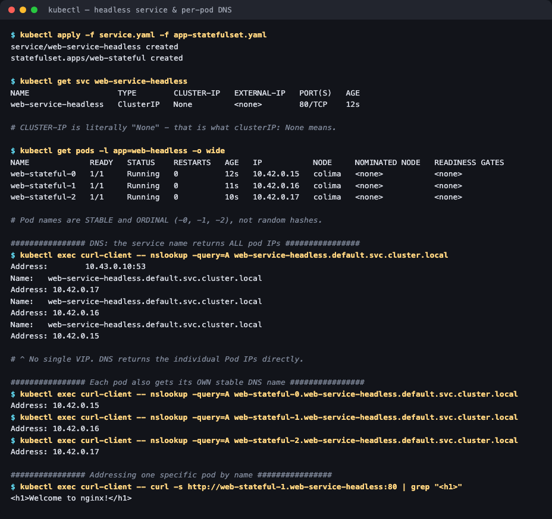
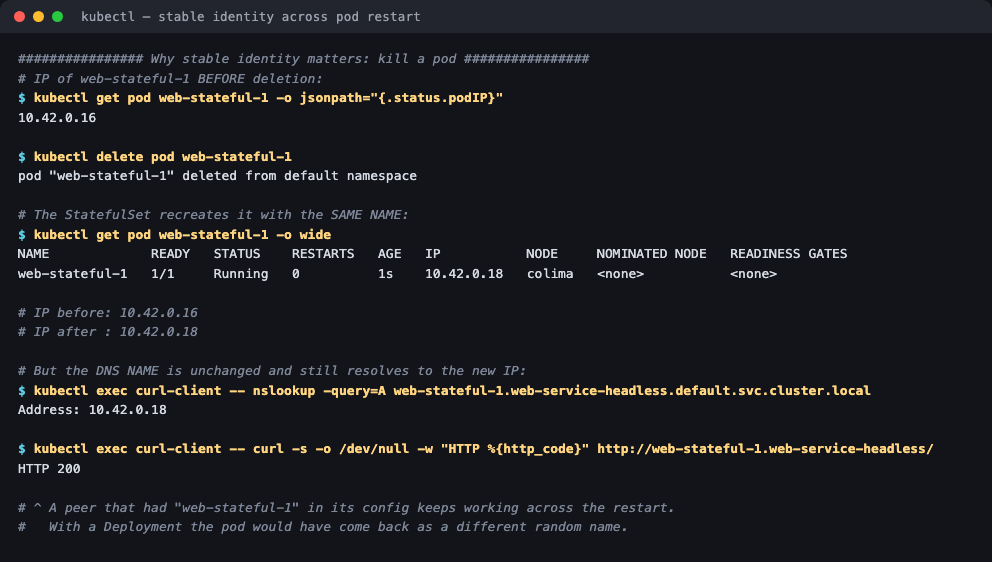

# 05 — Headless Service

**Homework submission** · Lakshya Mewara · 24BCS10290

> **Cluster used:** k3s `v1.35.0+k3s1` in a Colima VM on macOS (Apple Silicon). CoreDNS at `10.43.0.10`.

---

## What a Headless Service is

Setting **`clusterIP: None`** makes a Service *headless*: Kubernetes allocates **no virtual IP** and programs **no kube-proxy load-balancing rules**. Instead, CoreDNS returns the **individual Pod IPs** directly.

| | Normal ClusterIP | Headless (`clusterIP: None`) |
|---|---|---|
| Virtual IP | One stable VIP | **None** |
| DNS returns | The single VIP | **Every ready Pod's IP** |
| Load balancing | kube-proxy picks a Pod | **The client chooses** |
| Per-Pod DNS name | No | **Yes** — `<pod>.<service>.<ns>.svc.cluster.local` |

**Why you'd want that:** a normal Service deliberately hides which Pod you reach, which is exactly wrong for stateful systems. A Kafka producer must reach a *specific* broker holding a partition; a MySQL client must send writes to the *primary*, not a random replica; Cassandra and Elasticsearch nodes must discover and address each individual peer to form a cluster.

Paired with a **StatefulSet**, each Pod gets a stable ordinal name (`web-stateful-0`, `-1`, `-2`) and a stable DNS record that survives restarts and rescheduling.

---

## Step 1 — Deploy, and note what's different

```bash
kubectl apply -f service.yaml -f app-statefulset.yaml
kubectl get svc web-service-headless
kubectl get pods -l app=web-headless -o wide
```



```
NAME                   TYPE        CLUSTER-IP   EXTERNAL-IP   PORT(S)   AGE
web-service-headless   ClusterIP   None         <none>        80/TCP    12s

NAME             READY   STATUS    RESTARTS   AGE   IP           NODE
web-stateful-0   1/1     Running   0          12s   10.42.0.15   colima
web-stateful-1   1/1     Running   0          11s   10.42.0.16   colima
web-stateful-2   1/1     Running   0          10s   10.42.0.17   colima
```

`CLUSTER-IP` is the literal string **`None`** — not `<none>` like the ExternalName case, but the value `None`. And the Pod names are **ordinal** (`-0`, `-1`, `-2`), not the random hash suffixes a Deployment produces.

## Step 2 — The Service name returns *all* Pod IPs

```
$ kubectl exec curl-client -- nslookup -query=A web-service-headless.default.svc.cluster.local
Name:    web-service-headless.default.svc.cluster.local
Address: 10.42.0.17
Name:    web-service-headless.default.svc.cluster.local
Address: 10.42.0.16
Name:    web-service-headless.default.svc.cluster.local
Address: 10.42.0.15
```

Three A records for one name — the client gets the full membership list and decides what to do with it. A normal ClusterIP would have returned exactly one address, the VIP.

This is also how **peer discovery** works in clustered software: one DNS query returns every member.

## Step 3 — Each Pod has its own stable DNS name

```
$ nslookup web-stateful-0.web-service-headless.default.svc.cluster.local   → 10.42.0.15
$ nslookup web-stateful-1.web-service-headless.default.svc.cluster.local   → 10.42.0.16
$ nslookup web-stateful-2.web-service-headless.default.svc.cluster.local   → 10.42.0.17

$ kubectl exec curl-client -- curl -s http://web-stateful-1.web-service-headless:80 | grep "<h1>"
<h1>Welcome to nginx!</h1>
```

The addressing format is **`<pod-name>.<service-name>.<namespace>.svc.cluster.local`**, and it only exists because the StatefulSet's `serviceName: web-service-headless` ties the two together. Now a specific Pod can be targeted deliberately — impossible through a normal Service.

## Step 4 — The point of it all: identity survives a restart



```
# IP of web-stateful-1 before deletion:
10.42.0.16

$ kubectl delete pod web-stateful-1
pod "web-stateful-1" deleted from default namespace

$ kubectl get pod web-stateful-1 -o wide
NAME             READY   STATUS    RESTARTS   AGE   IP           NODE
web-stateful-1   1/1     Running   0          1s    10.42.0.18   colima

# IP before: 10.42.0.16
# IP after : 10.42.0.18      <-- the IP CHANGED

$ nslookup web-stateful-1.web-service-headless.default.svc.cluster.local
Address: 10.42.0.18          <-- the NAME still resolves, now to the new IP

$ curl -o /dev/null -w "HTTP %{http_code}" http://web-stateful-1.web-service-headless/
HTTP 200
```

**The Pod's IP changed, its name did not, and DNS followed it automatically.** A peer configured with `web-stateful-1.web-service-headless` never noticed. With a Deployment the replacement Pod would have come back as `web-app-7d9f8b-xk2p9` — a completely different name — and any peer holding a reference to the old one would be stranded.

---

## What I understood

- **Headless inverts the usual trade.** A normal Service abstracts *away* which Pod you reach; headless deliberately exposes it. Neither is better — they answer different questions. Stateless web tier: ClusterIP. Stateful cluster members: headless.
- **`clusterIP: None` changes the DNS contract, not just the IP.** One record becomes N records, and per-Pod names appear. The Service stops being a proxy and becomes a *service registry* that CoreDNS serves.
- **Load balancing becomes the client's job.** With N addresses returned, it's the client library that must pick, retry and fail over. gRPC and database drivers do this well; a naive HTTP client may just take the first record and hammer one Pod.
- **StatefulSet and headless Service are a pair.** `serviceName` in the StatefulSet is what creates the per-Pod DNS records. A headless Service alone gives you the multi-IP lookup but not the stable ordinal names; a StatefulSet without one loses the per-Pod DNS.
- **The IP is never the identity.** Demonstrated directly above — the address changed on restart and nothing broke, because every reference was by name. This is the same lesson as ClusterIP, one level deeper: there, the Service name is stable; here, each *Pod's* name is stable too.

## Troubleshooting notes

| Symptom | Cause | Fix |
|---|---|---|
| Per-Pod DNS names don't resolve | StatefulSet `serviceName` doesn't match the Service name | Set `spec.serviceName` to the headless Service |
| Only one IP returned | Service isn't actually headless | Confirm `clusterIP: None`; `kubectl get svc` must show `None` |
| Some Pods missing from DNS | Only *ready* Pods are published | Check readiness probes; `publishNotReadyAddresses: true` includes them |
| `nslookup` says "No answer" | Resolver asked for `AAAA` on an IPv4-only record | Query explicitly with `-query=A` |
| Traffic all hits one Pod | Client used only the first DNS record | Use a client that load-balances across all returned addresses |

## Files

| File | Purpose |
|---|---|
| [`service.yaml`](./service.yaml) | The headless Service (`clusterIP: None`) |
| [`app-statefulset.yaml`](./app-statefulset.yaml) | 3-replica StatefulSet bound via `serviceName` |
| [`client-pod.yaml`](./client-pod.yaml) | DNS/curl test client |

## Cleanup

```bash
kubectl delete -f app-statefulset.yaml -f service.yaml
```
