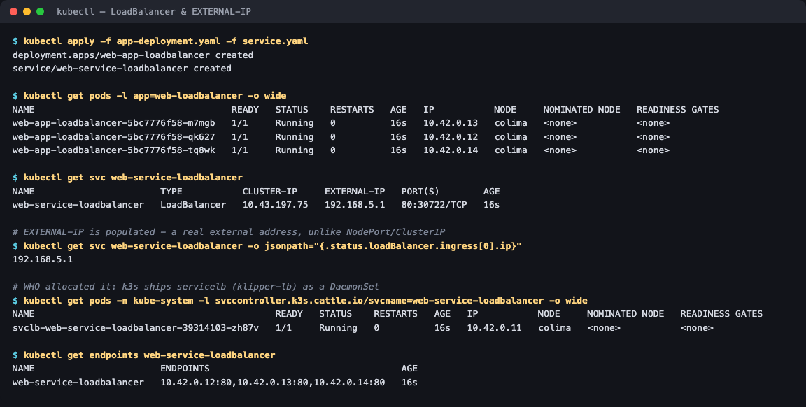

# Session 11 — Kubernetes Networking & Services

**Homework submission** · Lakshya Mewara · 24BCS10290

All five Service types deployed and verified on a real cluster. Every screenshot and every
command output in these folders was captured from an actual run.

> **Cluster:** k3s `v1.35.0+k3s1` on a single node (`colima`), running in a Colima VM on
> macOS/Apple Silicon. Pod subnet `10.42.0.0/16`, Service subnet `10.43.0.0/16`, CoreDNS at `10.43.0.10`.

## The five Service types

| # | Type | What it does | Proof captured | Folder |
|---|---|---|---|---|
| 1 | **ClusterIP** | Stable internal VIP, load-balanced across Pods. Not reachable from outside. | 3 endpoints bound; access by name, IP and FQDN; browser via port-forward | [`01-clusterip/`](./01-clusterip/) |
| 2 | **NodePort** | ClusterIP **+** a fixed port (30080) opened on every node. | HTTP 200 from outside the cluster; internal access still works | [`02-nodeport/`](./02-nodeport/) |
| 3 | **LoadBalancer** | NodePort **+** a real external IP from the infrastructure. | `EXTERNAL-IP 192.168.5.1`, served on port 80; all three paths verified | [`03-loadbalancer/`](./03-loadbalancer/) |
| 4 | **ExternalName** | Pure DNS CNAME to a host *outside* the cluster. No VIP, no endpoints. | CNAME resolution; plus a working target reached end-to-end | [`04-externalname/`](./04-externalname/) |
| 5 | **Headless** | `clusterIP: None` — DNS returns every Pod IP, each Pod gets its own name. | All 3 Pod IPs from one lookup; identity survived a Pod restart | [`05-headless/`](./05-headless/) |

## Evidence at a glance

| ClusterIP — in-cluster access 3 ways | NodePort — reached from outside |
|---|---|
|  |  |

| LoadBalancer — real EXTERNAL-IP | Headless — identity survives a restart |
|---|---|
|  |  |


Browser captures of the actual served pages:

| ClusterIP via port-forward | NodePort :30080 | LoadBalancer :80 |
|---|---|---|
|  |  |  |

## How they relate

```
ExternalName          ← pure DNS CNAME, stands apart from the rest
                        (no VIP, no endpoints, no proxying)

ClusterIP             ← internal VIP, load-balanced
   └── NodePort       ← + fixed port on every node
          └── LoadBalancer   ← + external IP from the infrastructure

Headless              ← ClusterIP with the VIP deliberately removed
                        (DNS returns Pod IPs; client does the choosing)
```

The nesting is real and was verified directly: the LoadBalancer Service still answered on its
ClusterIP *and* its auto-allocated NodePort *and* its external IP, all at the same time.

## The one idea that ties the session together

**A Pod's IP is never its identity.** Every Service type is a different answer to "how do I
reach something whose address keeps changing":

- ClusterIP → one stable name for a *group* of interchangeable Pods
- NodePort / LoadBalancer → the same, plus a route in from outside
- Headless → a stable name for each *individual* Pod, when they aren't interchangeable
- ExternalName → a stable in-cluster name for something that isn't in the cluster at all

This was demonstrated most directly in [`05-headless/`](./05-headless/): a Pod was deleted, came
back with a different IP (`10.42.0.16` → `10.42.0.18`), and everything kept working because every
reference was by name.

## A note on the screenshots

- **Browser screenshots** (`*-browser-*.png`) are genuine captures of the served pages.
- **Terminal images** are the *real, unedited* output of the commands shown, rendered to PNG for
  readability. Every line is reproduced verbatim in the READMEs as text as well, so nothing
  depends on reading an image.

## Reproducing

```bash
kubectl apply -f 01-clusterip/app-deployment.yaml -f 01-clusterip/service.yaml
kubectl apply -f 02-nodeport/app-deployment.yaml  -f 02-nodeport/service.yaml
kubectl apply -f 03-loadbalancer/app-deployment.yaml -f 03-loadbalancer/service.yaml
kubectl apply -f 04-externalname/service.yaml
kubectl apply -f 05-headless/service.yaml -f 05-headless/app-statefulset.yaml
kubectl get svc
```
