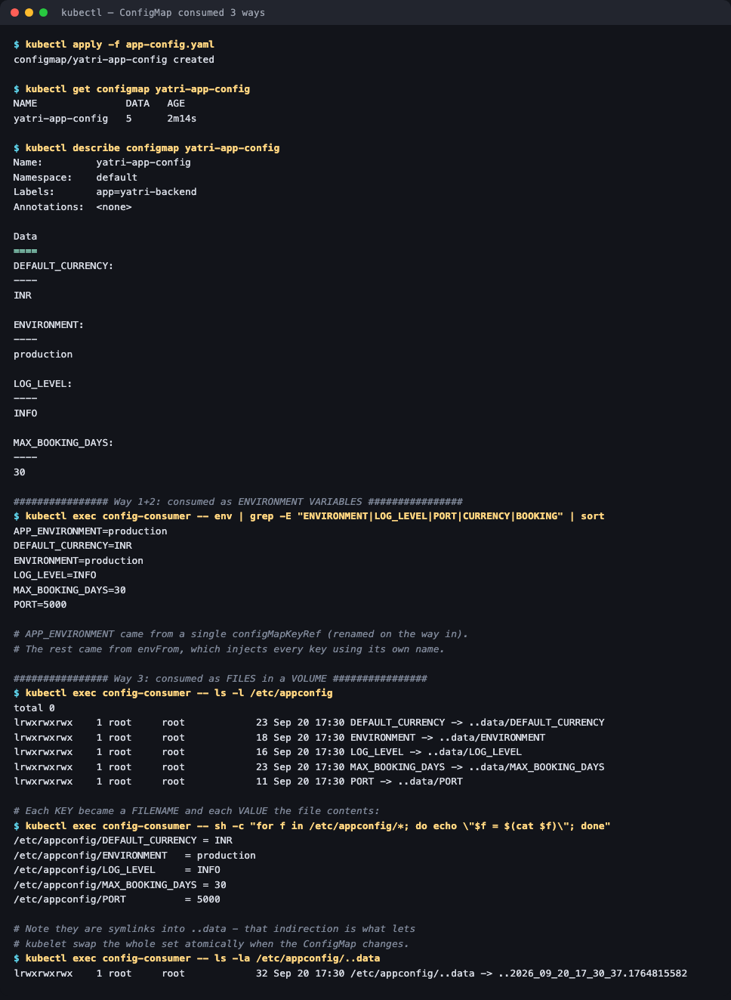

# 01 — ConfigMaps

**Homework submission** · Lakshya Mewara · 24BCS10290

> **Cluster:** k3s `v1.35.0+k3s1` on a Colima VM (macOS/Apple Silicon).

---

## What a ConfigMap is

A **ConfigMap** stores non-confidential configuration as key/value pairs, keeping it *out* of the container image. The same image can then run in dev, staging and production with different settings injected at runtime — which is the whole point: **build once, configure per environment**.

It is **not** for secrets. ConfigMap data is stored in plain text in etcd and readable by anyone with `get configmap` permission. Passwords and tokens belong in a [Secret](../02-secret/).

```yaml
data:
  ENVIRONMENT: "production"
  LOG_LEVEL: "INFO"
  PORT: "5000"
  DEFAULT_CURRENCY: "INR"
  MAX_BOOKING_DAYS: "30"
```

---

## Three ways to consume it

[`consumer-pod.yaml`](./consumer-pod.yaml) deliberately uses **all three at once** on the same ConfigMap, so they can be compared directly:

| # | Method | Manifest field | Result |
|---|---|---|---|
| 1 | One key as one env var | `env[].valueFrom.configMapKeyRef` | `APP_ENVIRONMENT=production` (renamed on the way in) |
| 2 | Every key as env vars | `envFrom.configMapRef` | `ENVIRONMENT`, `LOG_LEVEL`, `PORT`, … each under its own name |
| 3 | Every key as files | `volumes[].configMap` | One file per key under `/etc/appconfig/` |



```
$ kubectl exec config-consumer -- env | grep -E "ENVIRONMENT|LOG_LEVEL|PORT|CURRENCY|BOOKING" | sort
APP_ENVIRONMENT=production      <- method 1 (single key, renamed)
DEFAULT_CURRENCY=INR            <- method 2 (envFrom)
ENVIRONMENT=production
LOG_LEVEL=INFO
MAX_BOOKING_DAYS=30
PORT=5000

$ kubectl exec config-consumer -- ls -l /etc/appconfig
lrwxrwxrwx  DEFAULT_CURRENCY -> ..data/DEFAULT_CURRENCY
lrwxrwxrwx  ENVIRONMENT      -> ..data/ENVIRONMENT
lrwxrwxrwx  LOG_LEVEL        -> ..data/LOG_LEVEL
lrwxrwxrwx  MAX_BOOKING_DAYS -> ..data/MAX_BOOKING_DAYS
lrwxrwxrwx  PORT             -> ..data/PORT

/etc/appconfig/ENVIRONMENT   = production
/etc/appconfig/LOG_LEVEL     = INFO
/etc/appconfig/PORT          = 5000
```

**Each key became a filename and each value the file's contents.** Note they are *symlinks* into a hidden timestamped `..data` directory:

```
/etc/appconfig/..data -> ..2026_09_20_17_30_37.1764815582
```

That indirection isn't cosmetic — it's how kubelet swaps the entire set **atomically**. An application never sees a half-updated config directory, because only one symlink is repointed.

## The difference that actually matters: updates

Patch the ConfigMap while the pod keeps running:

```bash
kubectl patch configmap yatri-app-config --type merge -p '{"data":{"LOG_LEVEL":"DEBUG"}}'
```


```
# Waiting for kubelet to sync the projected volume...
  volume updated after ~37s

$ kubectl exec config-consumer -- cat /etc/appconfig/LOG_LEVEL     # the VOLUME
DEBUG                                                              <- updated live

$ kubectl exec config-consumer -- env | grep ^LOG_LEVEL            # the ENV VAR
LOG_LEVEL=INFO                                                     <- still stale

$ kubectl get pod config-consumer -o jsonpath='{...restartCount}'
0                                                                  <- never restarted
```

| | Env var | Mounted volume |
|---|---|---|
| Updates without restart | **No** | **Yes** (~37s here; kubelet polls, up to ~60s) |
| Value after the patch | `INFO` (stale) | `DEBUG` (current) |
| App must re-read the file | n/a | Yes — the file changes, the process must notice |

---

## What I understood

- **Environment variables are frozen at container start.** The kernel copies the environment when the process is created; there is no mechanism to change it afterwards. So a ConfigMap change can only reach an env var by recreating the pod — `kubectl rollout restart deployment/...`.
- **Volume mounts are the only live path**, and only halfway: kubelet updates the *file*, but the application still has to re-read it. Something like nginx needs an explicit `nginx -s reload`; a program that read the file once at startup will never notice. "Hot reload" is a shared responsibility, not a Kubernetes guarantee.
- **The `..data` symlink trick is genuinely clever.** Writing five files one by one would expose a window where config is half-old and half-new. Writing a new directory and flipping one symlink makes the swap atomic.
- **A ConfigMap change triggers nothing by itself.** No rollout, no event, no restart — Deployments do not watch their ConfigMaps. In production people either mount as a volume and reload, or hash the ConfigMap into a pod annotation so a change forces a new pod template.
- **`envFrom` is convenient and slightly dangerous.** It injects every key with its own name, so adding a key to a ConfigMap silently adds an env var to every consuming pod — which can shadow something the image relies on (a key named `PATH` or `HOME` would be a bad day).

## Troubleshooting notes

| Symptom | Cause | Fix |
|---|---|---|
| Pod stuck in `CreateContainerConfigError` | ConfigMap or key doesn't exist | `kubectl describe pod` names the missing key; create it or mark the ref `optional: true` |
| Config change had no effect | Consumed as env vars | `kubectl rollout restart deployment/<name>` |
| File updated but app didn't notice | App read it once at startup | Make the app watch the file, or reload it |
| Mount directory looks empty | `mountPath` collided with existing image content | Mount elsewhere, or use `subPath` for a single file |
| Values come out as the wrong type | ConfigMap values are always strings | Quote numbers in YAML (`PORT: "5000"`) and parse in the app |

## Files

| File | Purpose |
|---|---|
| [`app-config.yaml`](./app-config.yaml) | The ConfigMap (5 keys) |
| [`consumer-pod.yaml`](./consumer-pod.yaml) | Pod consuming it all three ways simultaneously |

## Cleanup

```bash
kubectl delete -f consumer-pod.yaml -f app-config.yaml
```
