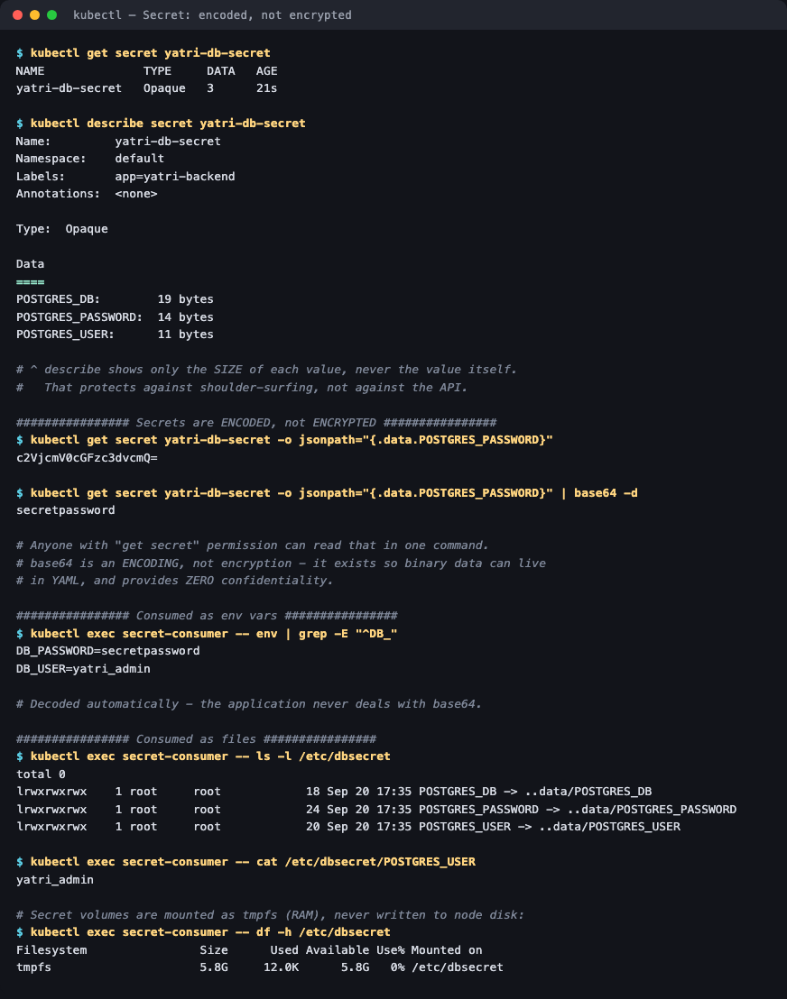
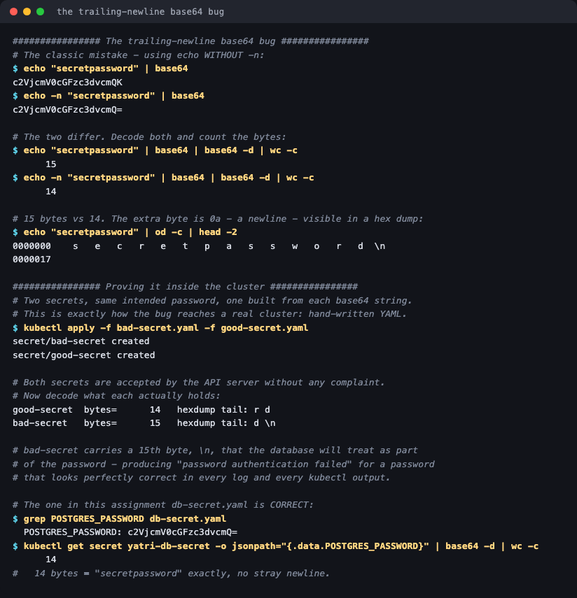

# 02 — Secrets

**Homework submission** · Lakshya Mewara · 24BCS10290

> **Cluster:** k3s `v1.35.0+k3s1` on a Colima VM (macOS/Apple Silicon).

---

## What a Secret is

A **Secret** holds small amounts of sensitive data — passwords, tokens, keys, TLS certificates. The API shape is almost identical to a ConfigMap, with three real differences:

1. Values are **base64-encoded** in the manifest (so binary data survives YAML).
2. Volume mounts are backed by **tmpfs** — RAM, never written to node disk.
3. `kubectl describe` **redacts** the values, showing only their size.

```yaml
type: Opaque
data:
  POSTGRES_USER: eWF0cmlfYWRtaW4=          # yatri_admin
  POSTGRES_PASSWORD: c2VjcmV0cGFzc3dvcmQ=  # secretpassword
  POSTGRES_DB: eWF0cmlfcHJvZHVjdGlvbl9kYg==
```

---

## Step 1 — Create it and look at what's hidden



```
$ kubectl get secret yatri-db-secret
NAME              TYPE     DATA   AGE
yatri-db-secret   Opaque   3      21s

$ kubectl describe secret yatri-db-secret
Data
====
POSTGRES_DB:        19 bytes
POSTGRES_PASSWORD:  14 bytes
POSTGRES_USER:      11 bytes
```

`describe` shows only **sizes**. That's real protection against shoulder-surfing and accidental log exposure — and nothing more, as the next step shows.

## Step 2 — Secrets are ENCODED, not ENCRYPTED

```
$ kubectl get secret yatri-db-secret -o jsonpath='{.data.POSTGRES_PASSWORD}'
c2VjcmV0cGFzc3dvcmQ=

$ kubectl get secret yatri-db-secret -o jsonpath='{.data.POSTGRES_PASSWORD}' | base64 -d
secretpassword
```

**One command, and the password is in plain text.** base64 is an encoding for transporting bytes, not a security control — it has no key and is trivially reversible. By default Secrets are also stored **unencrypted in etcd**.

What actually protects a Secret is therefore *not* the base64:

- **RBAC** — restricting who holds `get secret` on the namespace
- **Encryption at rest** — `EncryptionConfiguration` on the API server
- **External stores** — Vault, AWS/GCP Secret Manager, Sealed Secrets, External Secrets Operator

## Step 3 — Consuming it

```
# as environment variables (decoded automatically):
$ kubectl exec secret-consumer -- env | grep -E "^DB_"
DB_PASSWORD=secretpassword
DB_USER=yatri_admin

# as files:
$ kubectl exec secret-consumer -- cat /etc/dbsecret/POSTGRES_USER
yatri_admin

# and the mount is tmpfs - RAM, not node disk:
$ kubectl exec secret-consumer -- df -h /etc/dbsecret
Filesystem   Size   Used   Available   Use%   Mounted on
tmpfs        5.8G   12.0K  5.8G        0%     /etc/dbsecret
```

That `tmpfs` line is the concrete difference from a ConfigMap volume — secret material never touches the node's disk, so it can't be recovered from a stolen disk image and disappears when the pod does.

**Files are the safer of the two.** Environment variables leak easily: they appear in `kubectl describe pod`, in crash dumps, in `/proc/<pid>/environ`, and child processes inherit them.

## Step 4 — The trailing-newline bug

The single most common Secret bug, reproduced:



```
$ echo "secretpassword" | base64
c2VjcmV0cGFzc3dvcmQK              <- ends in "K"

$ echo -n "secretpassword" | base64
c2VjcmV0cGFzc3dvcmQ=              <- ends in "="

$ echo "secretpassword" | od -c | head -2
0000000   s  e  c  r  e  t  p  a  s  s  w  o  r  d  \n
```

Applied to a cluster as two YAML manifests, both accepted without a word of complaint:

```
good-secret  bytes=14   hexdump tail: r d
bad-secret   bytes=15   hexdump tail: d \n
```

**15 bytes instead of 14.** The database receives `secretpassword\n` and correctly rejects it — producing `FATAL: password authentication failed` for a password that looks perfectly right in every log, every `kubectl get`, and every code review.

Always `echo -n`. And when debugging an auth failure, count the bytes:

```bash
kubectl get secret <name> -o jsonpath='{.data.<key>}' | base64 -d | wc -c
```

The assignment's own manifest is correct — 14 bytes, no stray newline.

---

## What I understood

- **"Secret" is about handling, not secrecy.** The object gets redacted output, tmpfs mounts and separate RBAC verbs — but the data itself is no more hidden than a ConfigMap's. Treating base64 as protection is the mistake the whole exercise is built around.
- **Files beat env vars for anything sensitive.** Env vars end up in `describe pod` output, crash dumps and `/proc`, and every child process inherits them. A `0400` file read once at startup has a far smaller blast radius.
- **tmpfs is a real, checkable guarantee** — `df -h` inside the pod proves the mount never hits disk.
- **The base64 gotcha is a class of bug, not a one-off.** The value looks identical everywhere you'd normally look; only a byte count or hexdump reveals it. That's why the fix is a habit (`echo -n`) rather than vigilance.
- **Secrets are namespaced and not encrypted at rest by default** — two facts worth knowing before treating them as sufficient in production.

## Troubleshooting notes

| Symptom | Cause | Fix |
|---|---|---|
| `password authentication failed` with an obviously correct password | Trailing `\n` from `echo` without `-n` | `... | base64 -d | wc -c` and compare to the real length |
| `CreateContainerConfigError` | Secret or key missing | `kubectl describe pod` names it; create it or set `optional: true` |
| `illegal base64 data at input byte N` | Value in `data:` isn't valid base64 | Re-encode, or use `stringData:` and let Kubernetes encode it |
| Secret visible to the wrong people | RBAC too broad | Restrict `get/list` on secrets per namespace |
| Secret value in application logs | App logs its own config | Redact at the app; prefer file mounts over env vars |

## Files

| File | Purpose |
|---|---|
| [`db-secret.yaml`](./db-secret.yaml) | The Opaque Secret with three base64 values |
| [`consumer-pod.yaml`](./consumer-pod.yaml) | Pod consuming it as env vars and as a `0400` tmpfs volume |

## Cleanup

```bash
kubectl delete -f consumer-pod.yaml -f db-secret.yaml
kubectl delete secret good-secret bad-secret
```
