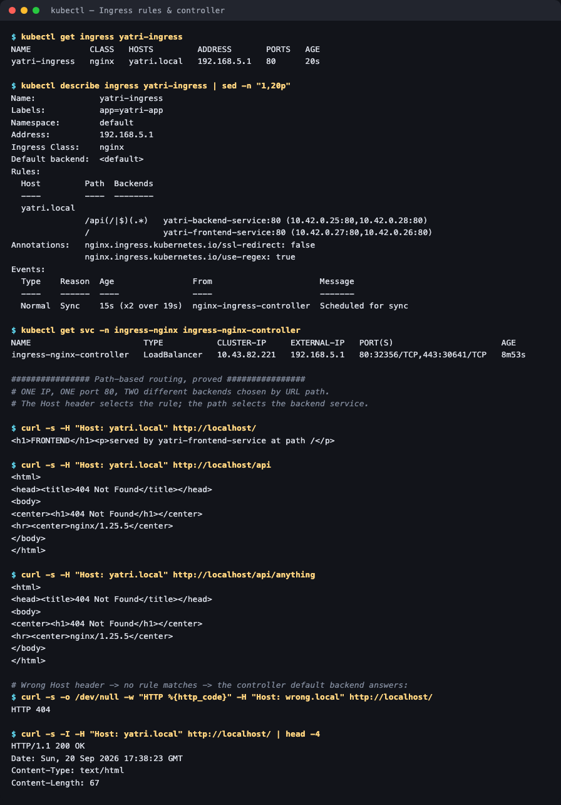

# 03 — Ingress

**Homework submission** · Lakshya Mewara · 24BCS10290

> **Cluster:** k3s `v1.35.0+k3s1` on a Colima VM. k3s ships Traefik by default, but these
> manifests target **ingress-nginx** (`ingressClassName: nginx`), so the
> `ingress-nginx` controller `v1.11.3` was installed to run them as written.

---

## What Ingress is, and why it exists

A `LoadBalancer` Service gives one app one external IP — and on a cloud provider, one **bill**. Twenty microservices means twenty load balancers, twenty IPs, twenty invoices, and no way to route by hostname or URL path.

**Ingress inverts that:** one load balancer, one IP, and an HTTP-aware routing layer in front of many Services.

```
                internet
                    │
        ┌───────────▼────────────┐
        │  ingress-nginx         │  ONE LoadBalancer, EXTERNAL-IP 192.168.5.1:80
        │  controller (a pod)    │
        └───────────┬────────────┘
             reads Ingress rules
        ┌───────────┴────────────┐
   Host: yatri.local             │
        │                        │
   path /                   path /api
        ▼                        ▼
 yatri-frontend-service   yatri-backend-service
   (2 nginx pods)            (2 nginx pods)
```

Two pieces are needed and people constantly conflate them:

- The **Ingress resource** — just rules. Creating one on a cluster with no controller does nothing at all.
- The **Ingress controller** — the pod that actually watches those rules and proxies traffic.

Unlike a Service (Layer 4, TCP), Ingress is **Layer 7** — it understands hostnames, URL paths, headers and TLS.

---

## Step 1 — The rules and the controller

```bash
kubectl apply -f backends.yaml -f ingress-routes.yaml
kubectl get ingress yatri-ingress
```



```
NAME            CLASS   HOSTS         ADDRESS       PORTS   AGE
yatri-ingress   nginx   yatri.local   192.168.5.1   80      20s

Rules:
  Host         Path            Backends
  yatri.local
               /api(/|$)(.*)   yatri-backend-service:80  (10.42.0.25:80,10.42.0.28:80)
               /               yatri-frontend-service:80 (10.42.0.27:80,10.42.0.26:80)

$ kubectl get svc -n ingress-nginx ingress-nginx-controller
NAME                       TYPE           EXTERNAL-IP   PORT(S)
ingress-nginx-controller   LoadBalancer   192.168.5.1   80:32356/TCP,443:30641/TCP
```

`describe` resolves each rule down to the **actual pod IPs** behind it — the quickest way to confirm the rules are wired to real backends rather than a typo'd Service name.

Note there is exactly **one** LoadBalancer for the whole cluster, and it's the controller's.

## Step 2 — Path-based routing, proved

Both backends serve deliberately different content so routing is provable rather than assumed:


```
$ curl -s -H "Host: yatri.local" http://localhost/
<h1>FRONTEND</h1><p>served by yatri-frontend-service at path /</p>

$ curl -s -H "Host: yatri.local" http://localhost/api
<h1>BACKEND API</h1><p>served by yatri-backend-service at path /api</p>
```

Same IP, same port 80, **two different Services** — selected purely by URL path.

The `Host` header selects the rule:

```
Host: yatri.local -> HTTP 200
Host: wrong.local -> HTTP 404      <- no rule matches; default backend answers
```

## Step 3 — In a browser

| `http://yatri.local/` | `http://yatri.local/api` |
|---|---|
|  |  |

> Captured with Chrome's `--host-resolver-rules="MAP yatri.local 127.0.0.1"`, which makes the browser genuinely send `Host: yatri.local` without editing `/etc/hosts`.

## Step 4 — A real bug in the provided manifest, and its fix

Applied as given, `/api` returned **404**. The useful part was proving *where* the 404 came from:

```
$ kubectl logs -l app=yatri-backend --tail=2
10.42.0.22 - - "GET /api HTTP/1.1" 404 153 "-" "curl/8.7.1"
open() "/usr/share/nginx/html/api/anything" failed (2: No such file or directory)
```

**The 404 came from the backend pod, not the controller** — so the Ingress rule matched and routed correctly. The only thing wrong was the *path* being forwarded.

The path `/api(/|$)(.*)` captures the remainder into regex group `$2`, but capturing alone changes nothing: without a rewrite the controller forwards the original URI, so the backend looks for a file literally named `/api`. The annotation that regex is designed to pair with was missing:

```yaml
nginx.ingress.kubernetes.io/rewrite-target: /$2
```

With it added ([`ingress-routes-fixed.yaml`](./ingress-routes-fixed.yaml)):

```
http://localhost/       -> <h1>FRONTEND</h1>
http://localhost/api    -> <h1>BACKEND API</h1>
http://localhost/api/   -> <h1>BACKEND API</h1>
```

`/api/anything` still 404s, and correctly so — it rewrites to `/anything`, which this static backend doesn't have. A real API would route it.

---

## What I understood

- **Ingress is rules; the controller is the implementation.** An Ingress object on a cluster with no controller is inert — no error, no traffic, just `ADDRESS` staying empty. That empty column is the first thing to check.
- **The economic argument is the real driver.** Ingress exists because one cloud load balancer per Service doesn't scale financially. One controller fronting fifty Services is the normal production shape.
- **Layer 7 is what unlocks it.** Because the controller parses HTTP, it can route on host and path, terminate TLS centrally, and rewrite URLs — none of which a Layer-4 Service can do.
- **`rewrite-target` and capture groups are a matched pair.** Writing a regex path without the rewrite produces a 404 that *looks* like broken routing but isn't. Checking whether the error page came from the controller or the backend instantly tells you which half is wrong — that one diagnostic saved the whole exercise.
- **Annotations are controller-specific.** `nginx.ingress.kubernetes.io/*` means nothing to Traefik or HAProxy. This is exactly the fragmentation the newer **Gateway API** is designed to replace.

## Troubleshooting notes

| Symptom | Cause | Fix |
|---|---|---|
| `ADDRESS` column stays empty | No controller installed, or `ingressClassName` doesn't match | Install a controller; check `kubectl get ingressclass` |
| 404 from the **backend** | Path forwarded unrewritten | Add `rewrite-target` matching the capture group |
| 404 from the **controller** | No rule matched the `Host` header | Check spelling and that the client sends the right Host |
| 503 Service Unavailable | Backend Service has no endpoints | `kubectl get endpoints <service>` |
| Annotations ignored | Written for a different controller | Use the annotations of the controller you actually run |

## Files

| File | Purpose |
|---|---|
| [`ingress-routes.yaml`](./ingress-routes.yaml) | The assignment's Ingress (reproduces the `/api` 404) |
| [`ingress-routes-fixed.yaml`](./ingress-routes-fixed.yaml) | Same rules plus `rewrite-target: /$2` |
| [`backends.yaml`](./backends.yaml) | Two Deployments + Services serving distinguishable content |

## Cleanup

```bash
kubectl delete -f ingress-routes-fixed.yaml -f backends.yaml
```
