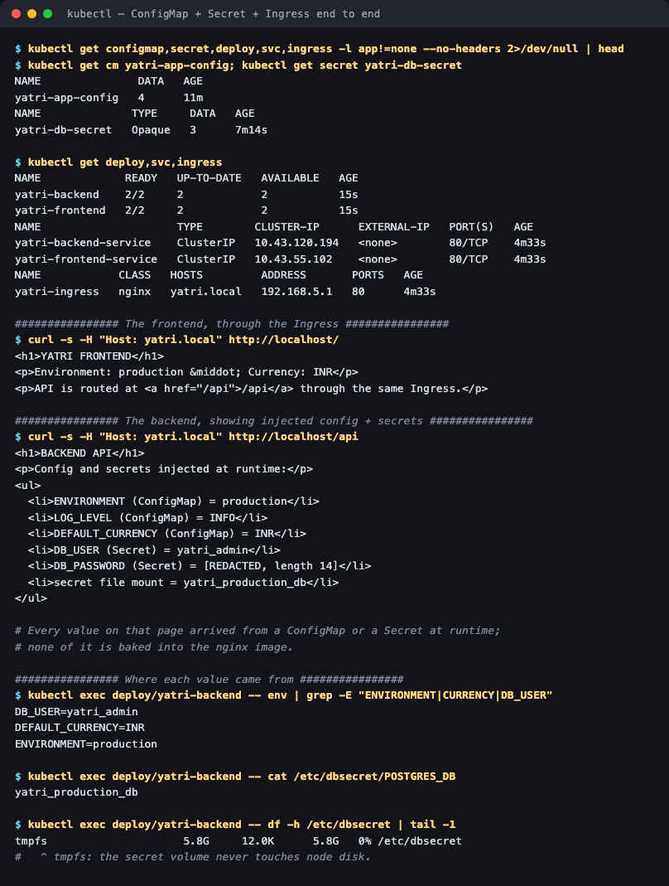

# 04 — Full Demo: ConfigMap + Secret + Ingress together

**Homework submission** · Lakshya Mewara · 24BCS10290

The capstone for session 12 — one stack that wires all three mechanisms together, deployed from a single manifest ([`full-stack.yaml`](./full-stack.yaml)).

```
                    Ingress (yatri.local, one IP, port 80)
                              │
              ┌───────────────┴───────────────┐
            path /                        path /api
              ▼                               ▼
     yatri-frontend-service          yatri-backend-service
              │                               │
      2x frontend pods                 2x backend pods
              │                               │
         ConfigMap                   ConfigMap  +  Secret
                                     (env vars)    (env vars + tmpfs file)
```

| Object | Role |
|---|---|
| `yatri-app-config` (ConfigMap) | Non-sensitive settings: `ENVIRONMENT`, `LOG_LEVEL`, `DEFAULT_CURRENCY`, `MAX_BOOKING_DAYS` |
| `yatri-db-secret` (Secret) | Credentials: `POSTGRES_USER`, `POSTGRES_PASSWORD`, `POSTGRES_DB` |
| `yatri-frontend` / `yatri-backend` | 2 replicas each, config injected at runtime |
| `yatri-*-service` | ClusterIP Services fronting each tier |
| `yatri-ingress` | Path routing: `/` → frontend, `/api` → backend |

**The backend renders its own status page from the injected values**, so the page itself is the proof that the wiring works — rather than asking you to trust a `kubectl describe`.

---

## Deploy

```bash
kubectl apply -f full-stack.yaml
kubectl get cm,secret,deploy,svc,ingress
```



```
NAME               DATA   AGE          NAME              TYPE     DATA   AGE
yatri-app-config   4      11m          yatri-db-secret   Opaque   3      7m14s

NAME             READY   UP-TO-DATE   AVAILABLE
yatri-backend    2/2     2            2
yatri-frontend   2/2     2            2

NAME            CLASS   HOSTS         ADDRESS       PORTS
yatri-ingress   nginx   yatri.local   192.168.5.1   80
```

## The result, through the Ingress

```
$ curl -s -H "Host: yatri.local" http://localhost/
<h1>YATRI FRONTEND</h1>
<p>Environment: production · Currency: INR</p>

$ curl -s -H "Host: yatri.local" http://localhost/api
<h1>BACKEND API</h1>
<ul>
  <li>ENVIRONMENT (ConfigMap) = production</li>
  <li>LOG_LEVEL (ConfigMap) = INFO</li>
  <li>DEFAULT_CURRENCY (ConfigMap) = INR</li>
  <li>DB_USER (Secret) = yatri_admin</li>
  <li>DB_PASSWORD (Secret) = [REDACTED, length 14]</li>
  <li>secret file mount = yatri_production_db</li>
</ul>
```

| `http://yatri.local/` | `http://yatri.local/api` |
|---|---|
|  |  |

Both tiers are reached through **one** IP on **one** port, told apart only by path — and every value on those pages came from a ConfigMap or Secret at runtime. Nothing is baked into the `nginx:1.25-alpine` image.

The password is deliberately printed as a **length, not a value** (`length 14`), which also doubles as a live check against the [trailing-newline bug](../02-secret/#step-4--the-trailing-newline-bug) — 14 bytes is exactly `secretpassword`, so no stray `\n` crept in.

## Verifying each injection path separately

```
$ kubectl exec deploy/yatri-backend -- env | grep -E "ENVIRONMENT|CURRENCY|DB_USER"
DB_USER=yatri_admin          <- Secret, via secretKeyRef
DEFAULT_CURRENCY=INR         <- ConfigMap, via envFrom
ENVIRONMENT=production       <- ConfigMap, via envFrom

$ kubectl exec deploy/yatri-backend -- cat /etc/dbsecret/POSTGRES_DB
yatri_production_db          <- Secret, via volume mount

$ kubectl exec deploy/yatri-backend -- df -h /etc/dbsecret | tail -1
tmpfs   5.8G   12.0K   5.8G   0%   /etc/dbsecret
```

Three distinct mechanisms — `envFrom`, `secretKeyRef`, and a `tmpfs` volume — all feeding one container.

---

## What I understood

- **The three objects divide cleanly by sensitivity and by lifecycle.** ConfigMap for things you'd happily print in a log, Secret for things you wouldn't, Ingress for how the outside world reaches any of it. Keeping them separate is what makes one image deployable to dev, staging and prod unchanged.
- **Twelve-factor config, concretely.** The same `nginx:1.25-alpine` image produces a "production/INR" page here and would produce "staging/USD" with nothing but a different ConfigMap. Config genuinely lives in the environment, not the artifact.
- **Two tiers, one load balancer.** The economic argument for Ingress becomes obvious once there's more than one Service — two `LoadBalancer` Services would have meant two external IPs and two cloud bills for what is one application.
- **Secrets still deserve care even when everything works.** `DB_PASSWORD` is in the pod's environment, so it shows up in `/proc/<pid>/environ` and any crash dump. Printing its length instead of its value is the habit worth keeping; mounting as a file instead of an env var is the better fix.
- **Nothing here reloads by itself.** Changing the ConfigMap would not update the running pages, because both tiers read their values into the HTML once at container start — the same limitation measured directly in [01-configmap](../01-configmap/#the-difference-that-actually-matters-updates).

## Files

| File | Purpose |
|---|---|
| [`full-stack.yaml`](./full-stack.yaml) | The entire stack: ConfigMap, Secret, 2 Deployments, 2 Services, Ingress |

## Cleanup

```bash
kubectl delete -f full-stack.yaml
```
