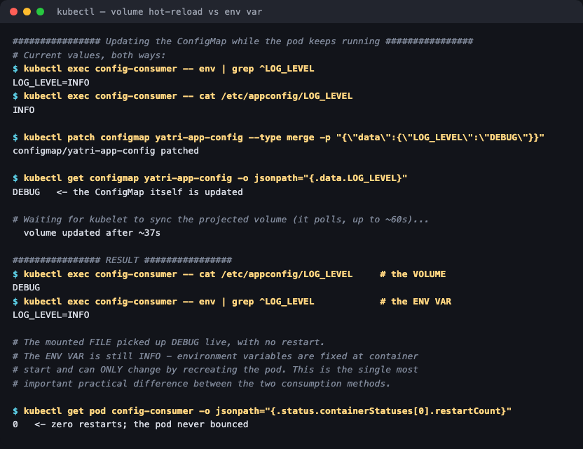
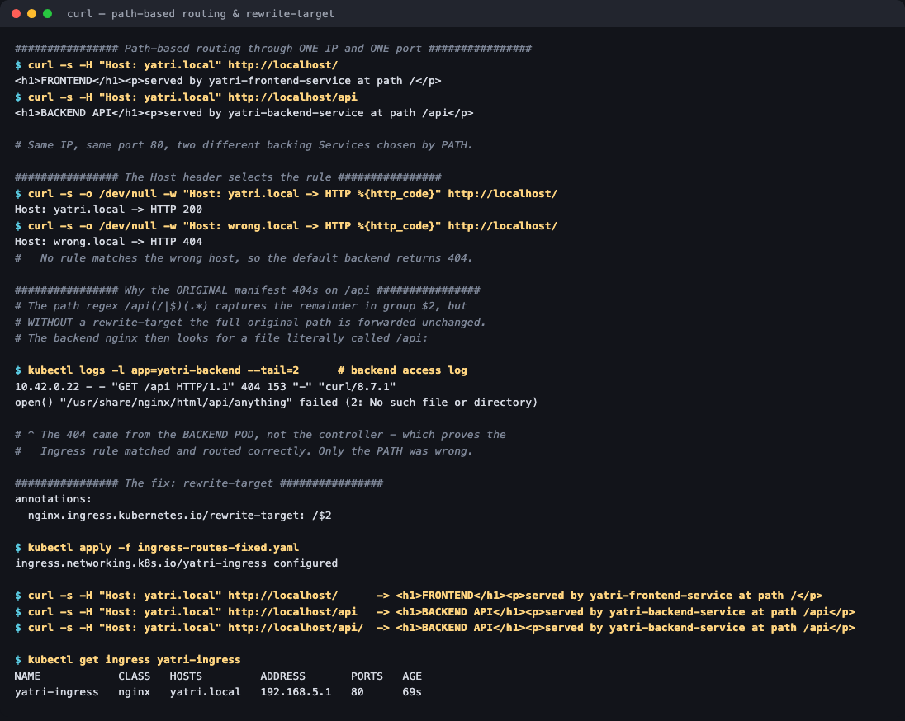

# Session 12 — Kubernetes Ingress, ConfigMaps & Secrets

**Homework submission** · Lakshya Mewara · 24BCS10290

> **Cluster:** k3s `v1.35.0+k3s1` on a single node (`colima`) in a Colima VM on macOS/Apple Silicon.
> k3s ships Traefik, but the session manifests target **ingress-nginx**, so the
> `ingress-nginx` controller `v1.11.3` was installed to run them exactly as written.

Every command output and screenshot in these folders came from a real run on that cluster.

## Contents

| # | Topic | What was proved | Folder |
|---|---|---|---|
| 1 | **ConfigMaps** | Consumed 3 ways at once; volume hot-reloaded in ~37s while the env var stayed stale, with 0 restarts | [`01-configmap/`](./01-configmap/) |
| 2 | **Secrets** | Decoded a "secret" in one command; tmpfs mount verified; the trailing-newline bug reproduced (14 vs 15 bytes) | [`02-secret/`](./02-secret/) |
| 3 | **Ingress** | Path routing on one IP; found and fixed a real bug in the provided manifest (`rewrite-target`) | [`03-ingress/`](./03-ingress/) |
| 4 | **Full demo** | All three wired together — backend renders a page from its own injected config and secrets | [`04-full-demo/`](./04-full-demo/) |

## Evidence at a glance

| ConfigMap — volume hot-reloads, env var does not | Secret — the base64 newline bug |
|---|---|
|  |  |



Browser captures through the Ingress — one IP, one port, two backends:

| `http://yatri.local/` | `http://yatri.local/api` |
|---|---|
|  |  |

The `/api` page is rendered by the backend from values injected out of a ConfigMap and a
Secret, so it proves all three mechanisms at once.

## The three ideas, in one line each

- **ConfigMap** — non-sensitive config, kept out of the image so one artifact runs anywhere.
- **Secret** — the same shape, but base64-encoded, tmpfs-mounted and redacted in output. **Encoded, not encrypted.**
- **Ingress** — one Layer-7 entry point routing by host and path to many Services, instead of one cloud load balancer per Service.

## Two findings worth calling out

**1. The `/api` route in the provided Ingress manifest 404s as written.** The path regex `/api(/|$)(.*)` captures the remainder into `$2`, but the `nginx.ingress.kubernetes.io/rewrite-target: /$2` annotation that pairs with it is missing, so the original path is forwarded unchanged. The diagnosis is in [`03-ingress/`](./03-ingress/#step-4--a-real-bug-in-the-provided-manifest-and-its-fix) — the backend's own access log proved the routing was fine and only the path was wrong. A corrected manifest is included alongside the original.

**2. Config updates behave completely differently depending on how they're consumed.** Measured directly: after patching the ConfigMap, the mounted file became `DEBUG` in ~37 seconds while the environment variable was still `INFO`, with the pod never restarting. That single result explains why `kubectl rollout restart` is such a common part of config changes.

## A note on the screenshots

- **Browser screenshots** are genuine captures of the served pages. The Ingress ones use Chrome's `--host-resolver-rules="MAP yatri.local 127.0.0.1"`, so the browser really sends `Host: yatri.local` without any `/etc/hosts` edit.
- **Terminal images** are the real, unedited output of the commands shown, rendered to PNG for readability. Every line also appears as text in the READMEs, so nothing depends on reading an image.

## Reproducing

```bash
# controller first (k3s ships Traefik, these manifests want nginx)
kubectl apply -f https://raw.githubusercontent.com/kubernetes/ingress-nginx/controller-v1.11.3/deploy/static/provider/cloud/deploy.yaml
kubectl wait -n ingress-nginx --for=condition=ready pod -l app.kubernetes.io/component=controller --timeout=300s

kubectl apply -f 01-configmap/app-config.yaml -f 01-configmap/consumer-pod.yaml
kubectl apply -f 02-secret/db-secret.yaml -f 02-secret/consumer-pod.yaml
kubectl apply -f 03-ingress/backends.yaml -f 03-ingress/ingress-routes-fixed.yaml
kubectl apply -f 04-full-demo/full-stack.yaml
```
