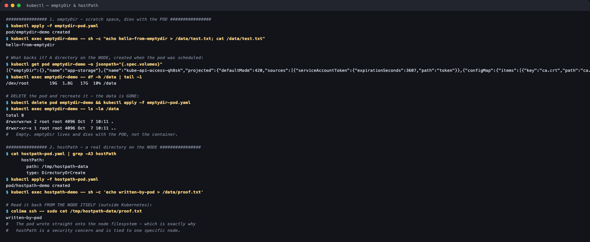
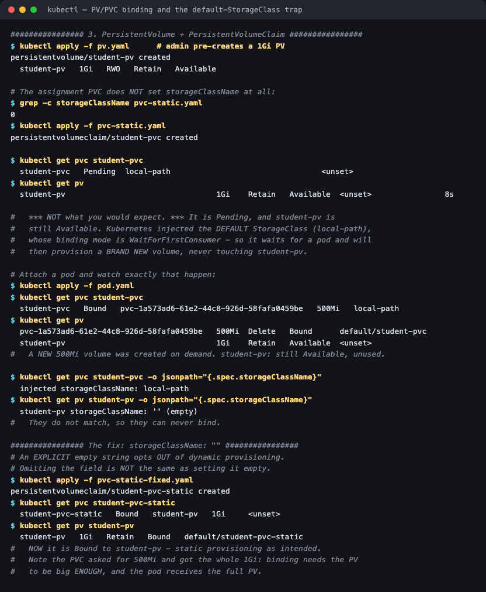
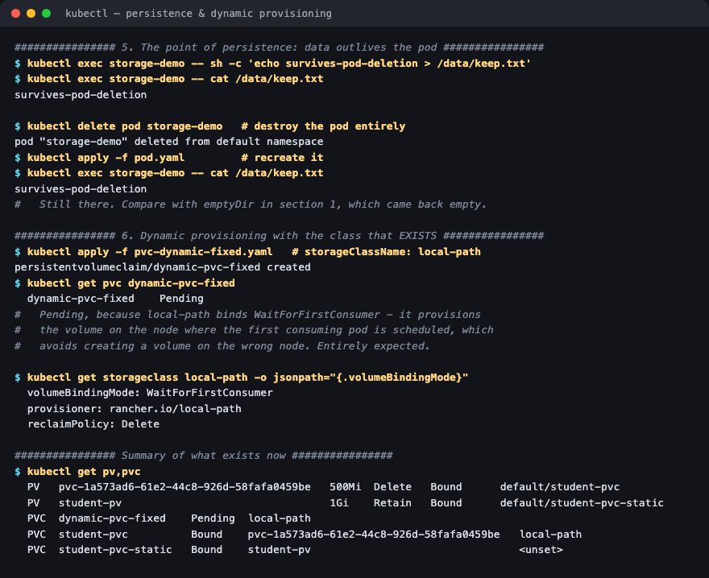

# 01 — Kubernetes Volumes

**Session 13 homework** · Lakshya Mewara · 24BCS10290

> **Cluster:** k3s `v1.35.0+k3s1`, single node (`colima`), Colima VM on macOS/Apple Silicon.
> Default StorageClass is **`local-path`** (`rancher.io/local-path`, `WaitForFirstConsumer`, reclaim `Delete`).

---

## The storage ladder

| Type | Lifetime | Scope | Use it for |
|---|---|---|---|
| **emptyDir** | The **pod** | One node, auto-created | Scratch space, caches, sharing files between containers in a pod |
| **hostPath** | The **node's disk** | One specific node | Node agents that must read the host (monitoring, logs) — rarely for apps |
| **PersistentVolume** | Independent of pods | Cluster resource | The actual storage, created by an admin or a provisioner |
| **PersistentVolumeClaim** | Independent of pods | Namespaced request | How a pod asks for storage without knowing what backs it |
| **StorageClass** | — | Cluster | A *template* for creating PVs on demand |
| **Dynamic provisioning** | — | — | PVs created automatically from a StorageClass when a PVC appears |

---

## 1. emptyDir — dies with the pod



```
$ kubectl exec emptydir-demo -- sh -c "echo hello-from-emptydir > /data/test.txt; cat /data/test.txt"
hello-from-emptydir

$ kubectl exec emptydir-demo -- df -h /data | tail -1
/dev/root        19G  1.8G   17G  10% /data
```

Delete the pod, recreate it from the same manifest:

```
$ kubectl exec emptydir-demo -- ls -la /data
total 8
drwxrwxrwx 2 root root 4096 ...
```

**Empty.** The crucial detail is *what* it's tied to: emptyDir survives a **container** restart (a crash, a liveness-probe kill) but not **pod** deletion or rescheduling. That makes it right for caches and for two containers in one pod exchanging files, and wrong for anything you'd miss.

## 2. hostPath — writes straight onto the node

```yaml
hostPath:
  path: /tmp/hostpath-data
  type: DirectoryOrCreate
```

```
$ kubectl exec hostpath-demo -- sh -c 'echo written-by-pod > /data/proof.txt'

# read back from the NODE itself, outside Kubernetes:
$ colima ssh -- sudo cat /tmp/hostpath-data/proof.txt
written-by-pod
```

The pod wrote directly to the node's filesystem. That is **exactly why hostPath is a security concern** — a pod that can mount `/` or `/var/run/docker.sock` effectively owns the node — and why it pins a workload to one machine.

## 3. PV + PVC — and a trap worth knowing



A 1Gi PV was pre-created, then the assignment's PVC applied. It did **not** bind to it:

```
$ kubectl get pvc student-pvc
  student-pvc   Pending   local-path

$ kubectl get pv
  student-pv   1Gi   Retain   Available     <- untouched
```

Attaching a pod makes what happened obvious:

```
$ kubectl get pvc student-pvc
  student-pvc   Bound   pvc-1a573ad6-...   500Mi   local-path

$ kubectl get pv
  pvc-1a573ad6-...   500Mi   Delete   Bound       default/student-pvc    <- a NEW volume
  student-pv         1Gi     Retain   Available                          <- still unused
```

**A brand-new volume was provisioned and `student-pv` was ignored.** The reason:

```
  PVC injected storageClassName: local-path
  PV  storageClassName:          '' (empty)
```

The PVC omitted `storageClassName`, so the **DefaultStorageClass admission controller** filled in the cluster default. A PVC and PV only bind when their classes match — `local-path` ≠ `""`, so they never could.

### The fix

```yaml
storageClassName: ""     # explicit empty string = opt OUT of dynamic provisioning
```

```
$ kubectl get pvc student-pvc-static
  student-pvc-static   Bound   student-pv   1Gi

$ kubectl get pv student-pv
  student-pv   1Gi   Retain   Bound   default/student-pvc-static
```

**Omitting the field and setting it to `""` are completely different things**, and nothing warns you — the PVC just quietly binds to the wrong thing. On a cluster with no default StorageClass the original manifest would have worked, which is why this bug travels badly between clusters.

Note the PVC asked for 500Mi and received the whole **1Gi**: binding requires the PV to be *at least* as big, and the pod gets all of it.

## 4. Persistence — the whole point



```
$ kubectl exec storage-demo -- sh -c 'echo survives-pod-deletion > /data/keep.txt'
$ kubectl delete pod storage-demo
pod "storage-demo" deleted
$ kubectl apply -f pod.yaml
$ kubectl exec storage-demo -- cat /data/keep.txt
survives-pod-deletion
```

Same test that wiped the emptyDir, and the data is still there.

## 5. StorageClass and dynamic provisioning

```
$ kubectl get storageclass
NAME                   PROVISIONER             RECLAIMPOLICY   VOLUMEBINDINGMODE       AGE
local-path (default)   rancher.io/local-path   Delete          WaitForFirstConsumer    16d
```

The assignment's dynamic PVC asks for `standard`:

```
$ kubectl get pvc dynamic-pvc
  dynamic-pvc   Pending

Warning  ProvisioningFailed   storageclass.storage.k8s.io "standard" not found
```

`standard` is the minikube/GKE default name; k3s calls its class `local-path`. With the right name ([`pvc-dynamic-fixed.yaml`](./pvc-dynamic-fixed.yaml)) it provisions normally — staying `Pending` until a pod exists, because:

```
  volumeBindingMode: WaitForFirstConsumer
  provisioner:       rancher.io/local-path
  reclaimPolicy:     Delete
```

`WaitForFirstConsumer` is a *feature*: the volume is created on the node where the consuming pod actually lands, so you never end up with a node-local volume stranded on the wrong machine.

---

## What I understood

- **The PVC is an interface, the PV is an implementation.** A pod asks for "500Mi, ReadWriteOnce" and never learns whether that's local-path, EBS or NFS. That indirection is what makes the same manifest portable across clusters.
- **`storageClassName` omitted ≠ `""`.** This cost me the most time and produced the most useful finding: a default StorageClass silently rewrites your PVC, so a static PV sits unused while a new volume appears. The symptom is a `Pending` PVC next to an `Available` PV, and the diagnosis is to compare the two `storageClassName` values.
- **Reclaim policy decides what happens to your data after the PVC goes.** `Delete` (local-path's default) destroys the volume with the claim; `Retain` (student-pv) keeps it for manual recovery. Getting this wrong on a database is unrecoverable.
- **`WaitForFirstConsumer` exists because storage has topology.** Binding immediately would risk provisioning on a node the pod can't be scheduled to.
- **emptyDir vs PVC is a question about the failure you're protecting against.** emptyDir survives a container crash; only a PVC survives the pod.

## Troubleshooting notes

| Symptom | Cause | Fix |
|---|---|---|
| PVC `Pending`, PV `Available` | `storageClassName` mismatch | Set `storageClassName: ""` on the PVC for static binding |
| `storageclass "standard" not found` | Class name differs per distribution | `kubectl get storageclass` and use the real name |
| PVC `Pending` with no events | `WaitForFirstConsumer` | Expected — create a pod that mounts it |
| Data gone after pod restart | emptyDir, not a PVC | Use a PersistentVolumeClaim |
| Volume deleted with the app | `reclaimPolicy: Delete` | Use `Retain` for anything valuable |

## Files

| File | Purpose |
|---|---|
| [`emptydir-pod.yaml`](./emptydir-pod.yaml) · [`hostpath-pod.yaml`](./hostpath-pod.yaml) | Ephemeral and node-backed volumes |
| [`pv.yaml`](./pv.yaml) · [`pvc-static.yaml`](./pvc-static.yaml) · [`pod.yaml`](./pod.yaml) | Static provisioning as provided |
| [`pvc-static-fixed.yaml`](./pvc-static-fixed.yaml) | Corrected static claim (`storageClassName: ""`) |
| [`pvc-dynamic.yaml`](./pvc-dynamic.yaml) · [`pvc-dynamic-fixed.yaml`](./pvc-dynamic-fixed.yaml) | Dynamic provisioning, as provided and with the real class name |

## Cleanup

```bash
kubectl delete pod emptydir-demo hostpath-demo storage-demo --ignore-not-found
kubectl delete pvc student-pvc student-pvc-static dynamic-pvc dynamic-pvc-fixed --ignore-not-found
kubectl delete pv student-pv --ignore-not-found
```
