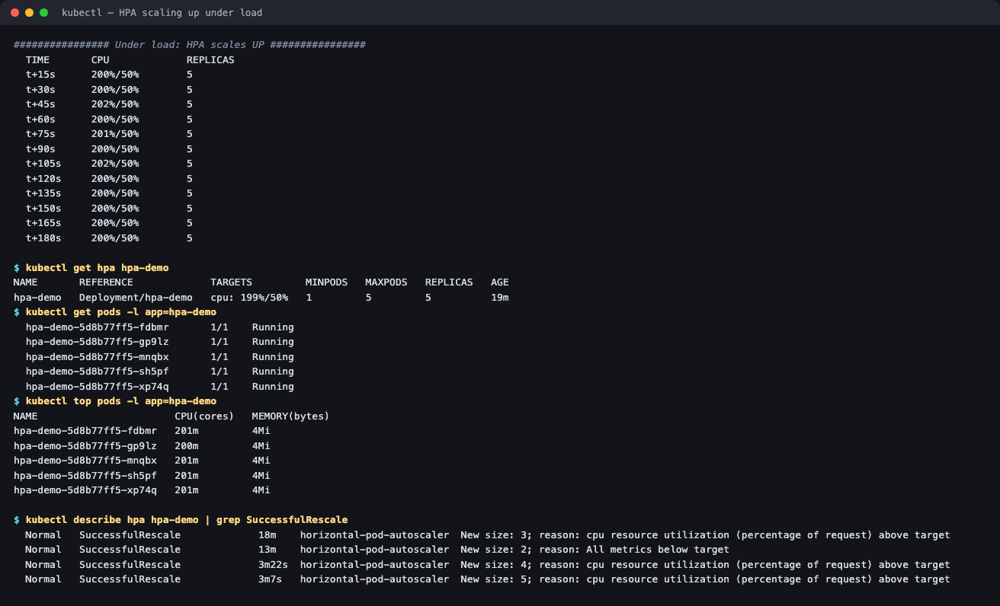
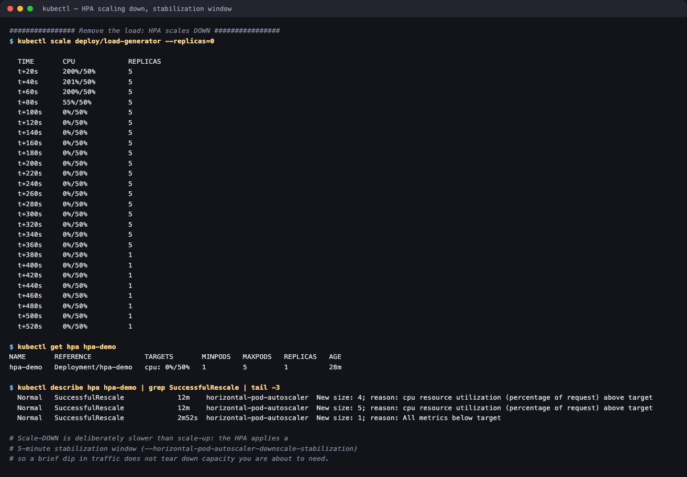

# 02 — Horizontal Pod Autoscaler

**Session 13 homework** · Lakshya Mewara · 24BCS10290

> **Cluster:** k3s `v1.35.0+k3s1`, single node, 4 CPU / 8 GB. `metrics-server` is the
> component the HPA reads from — without it the HPA reports `<unknown>` and never scales.

---

## The setup

```yaml
# deployment.yaml — the target
resources:
  requests: { cpu: 100m }
  limits:   { cpu: 200m }

# hpa.yaml — the autoscaler
minReplicas: 1
maxReplicas: 5
metrics:
  - type: Resource
    resource:
      name: cpu
      target: { type: Utilization, averageUtilization: 50 }
```

**The target percentage is of the CPU *request*, not of a core.** 50% of `100m` = **50m per pod**. This trips people up constantly: a pod using 150m with a 100m request shows as **150%**, not 15%.

```bash
kubectl apply -f deployment.yaml -f service.yaml -f hpa.yaml
kubectl get hpa hpa-demo
```

```
NAME       REFERENCE             TARGETS       MINPODS   MAXPODS   REPLICAS   AGE
hpa-demo   Deployment/hpa-demo   cpu: 0%/50%   1         5         1          31s
```

## Scaling up



```
  TIME       CPU             REPLICAS
  t+15s      200%/50%        5
  t+45s      202%/50%        5
  t+180s     200%/50%        5

$ kubectl top pods -l app=hpa-demo
hpa-demo-fdbmr   201m   4Mi
hpa-demo-gp9lz   200m   4Mi
hpa-demo-mnqbx   201m   4Mi
hpa-demo-sh5pf   201m   4Mi
hpa-demo-xp74q   201m   4Mi

SuccessfulRescale   New size: 4; reason: cpu resource utilization above target
SuccessfulRescale   New size: 5; reason: cpu resource utilization above target
```

Two things are worth reading carefully here:

- Each pod sits at **~200m**, which is exactly its CPU **limit**. The pods are throttled, so utilization stays pinned at 200% no matter how many replicas exist.
- The HPA therefore scales to `maxReplicas: 5` and **stops**. Demand exceeds what 5 throttled pods can serve, so it can never bring utilization back to 50%. That's `maxReplicas` doing its job — bounding cost — and it's what you'd investigate if a service stayed slow while "fully scaled".

## Scaling down



```
$ kubectl scale deploy/load-generator --replicas=0

  TIME       CPU             REPLICAS
  t+60s      0%/50%          5       <- CPU already at zero
  t+360s     0%/50%          5       <- still 5 replicas
  t+380s     0%/50%          1       <- finally scales in

SuccessfulRescale   New size: 1; reason: All metrics below target
```

**CPU hit zero within a minute, but the replicas did not drop for another ~5 minutes.** That delay is the **downscale stabilization window** (`--horizontal-pod-autoscaler-downscale-stabilization`, default 5m): the HPA takes the *highest* recommendation from the last 5 minutes, so a brief lull can't tear down capacity you're about to need again.

Scale-**up** has no such delay by default — it reacts in one 15-second polling cycle. The asymmetry is deliberate: being slow to add capacity costs you an outage, being slow to remove it costs you a few minutes of compute.

## The full observed cycle

| Event | Replicas |
|---|---|
| Idle | 1 |
| Light load | 3 |
| Load insufficient, scaled in | 2 |
| Real load applied | 4, then 5 (max) |
| Load removed, 5-min window | 5 → 1 |

---

## A load generator that actually works

The first attempt — the obvious busybox `wget` loop — **failed**, and understanding why mattered more than the fix:

```
  t+90s      36%/50%        2      <- oscillating, never sustained above target
```

`wget` spawns a **process per request**, so the generators consumed the node's CPU (the API server even timed out) while nginx stayed near-idle. The load generator became the bottleneck, not the target.

ApacheBench keeps many requests in flight from one cheap process:

```yaml
args:
  - while true; do ab -c 120 -n 200000 -q http://hpa-demo-service/ >/dev/null 2>&1; done
```

3 pods × 120 concurrent requests took nginx from 9% to **198%** immediately. The lesson generalises: **a load test proves nothing until you've confirmed the generator isn't the thing saturating.**

---

## What I understood

- **Utilization is relative to `requests`.** An HPA on a pod with no CPU request can't work at all — there's no denominator. Percentages above 100% are normal and just mean the pod uses more than it asked for.
- **`limits` cap what the HPA can observe.** Once pods are throttled at their limit, utilization freezes and the HPA scales to max and stays there. Autoscaling and resource limits interact in ways that aren't obvious until you watch it happen.
- **Scale-up and scale-down are deliberately asymmetric**, and the 5-minute down-stabilization is the single most surprising behaviour in practice — "why is it still at 5 replicas when traffic stopped?" is answered by the window, not by a bug.
- **The HPA is one more reconciliation loop**: read metric, compute `desired = ceil(current × actual/target)`, clamp to min/max, act. Same pattern as every other controller.
- **`metrics-server` is a hard dependency.** The first HPA events in this run were `FailedGetResourceMetric` — simply because metrics hadn't been collected yet for brand-new pods. Transient at startup, but a permanent version of that error means metrics-server is missing.

## Commands used

```bash
kubectl get hpa                    # current target vs actual, replica count
kubectl get pods                   # what actually got created
kubectl top pods                   # real CPU/memory per pod
kubectl describe hpa hpa-demo      # scaling decisions and events
```

## Files

| File | Purpose |
|---|---|
| [`deployment.yaml`](./deployment.yaml) · [`service.yaml`](./service.yaml) | The nginx target and its ClusterIP Service |
| [`hpa.yaml`](./hpa.yaml) | HorizontalPodAutoscaler, 1–5 replicas, 50% CPU target |
| [`load-generator.yaml`](./load-generator.yaml) | ApacheBench load generator (with a note on why `wget` doesn't work) |
| [`load_generator.sh`](./load_generator.sh) | The script provided with the session |

## Cleanup

```bash
kubectl delete -f load-generator.yaml -f hpa.yaml -f service.yaml -f deployment.yaml
```
