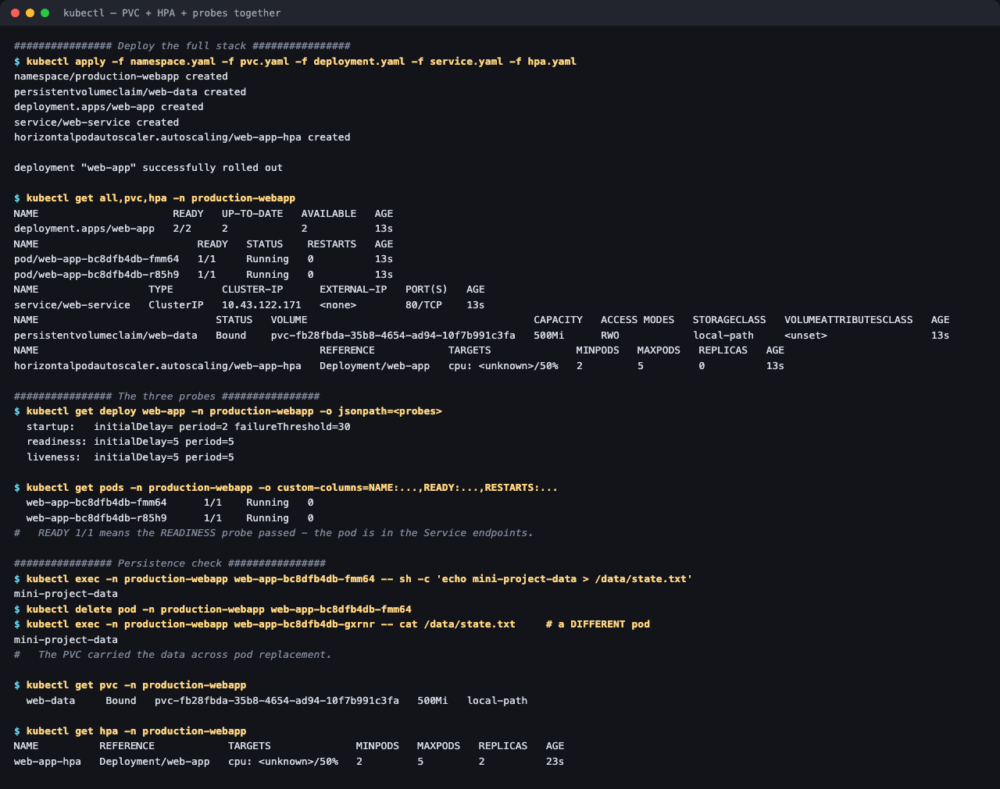

# 03 — Mini Project: Production-Ready Web App

**Session 13 homework** · Lakshya Mewara · 24BCS10290

The session-13 capstone — one namespace combining the three pillars from tasks 1 and 2:
**persistent state**, **elastic scaling**, and **health probes**.
(The original brief is kept as [`ASSIGNMENT-BRIEF.md`](./ASSIGNMENT-BRIEF.md).)

```
                    Service: web-service (ClusterIP :80)
                                 │
              ┌──────────────────┴──────────────────┐
              ▼                                     ▼
       Pod: web-app-1                        Pod: web-app-2
       ├─ startupProbe                       ├─ startupProbe
       ├─ readinessProbe                     ├─ readinessProbe
       ├─ livenessProbe                      ├─ livenessProbe
       └─ mounts /data ──────┐      ┌────────┘
                             ▼      ▼
                      PVC: web-data (500Mi, RWO)
                                 │
                      HPA: web-app-hpa (2–5, 50% CPU)
                                 ▲
                           metrics-server
```

---

## Deploy

```bash
kubectl apply -f namespace.yaml -f pvc.yaml -f deployment.yaml -f service.yaml -f hpa.yaml
```



```
NAME                      READY   UP-TO-DATE   AVAILABLE
deployment.apps/web-app   2/2     2            2

NAME                          READY   STATUS    RESTARTS
pod/web-app-bc8dfb4db-fmm64   1/1     Running   0
pod/web-app-bc8dfb4db-r85h9   1/1     Running   0

persistentvolumeclaim/web-data   Bound   pvc-fb28fbda-...   500Mi   RWO   local-path

horizontalpodautoscaler/web-app-hpa   Deployment/web-app   cpu: <unknown>/50%   2   5   2
```

> `cpu: <unknown>` immediately after deploy is normal — metrics-server hasn't sampled the
> brand-new pods yet. It resolves to a percentage within ~30s.

## The three probes

```
  startup:   period=2s  failureThreshold=30     -> up to 60s to boot before anything else runs
  readiness: initialDelay=5s  period=5s         -> gates Service traffic
  liveness:  initialDelay=5s  period=5s         -> restarts the container if it hangs
```

Each answers a different question, and that's why all three exist:

| Probe | Question | On failure |
|---|---|---|
| **Startup** | "Has it finished booting?" | Keep waiting; suppress the other two |
| **Readiness** | "Can it serve traffic *right now*?" | Remove from Service endpoints — **no restart** |
| **Liveness** | "Is it wedged and unrecoverable?" | **Restart the container** |

`READY 1/1` in the output above is precisely the readiness probe passing, which is what puts the pod into the Service's endpoint list.

The startup probe is the one people omit and then regret: without it, a slow-booting app gets killed by its own liveness probe before it ever comes up, producing an infinite restart loop that looks like a crash. `failureThreshold: 30 × period: 2s` buys this app 60 seconds to start, during which liveness is held off entirely.

## Persistence across pod replacement

```
$ kubectl exec web-app-bc8dfb4db-fmm64 -- sh -c 'echo mini-project-data > /data/state.txt'
mini-project-data

$ kubectl delete pod web-app-bc8dfb4db-fmm64
pod deleted

$ kubectl exec web-app-bc8dfb4db-gxrnr -- cat /data/state.txt     # a DIFFERENT pod
mini-project-data
```

The data was written by one pod and read back by **another pod that didn't exist when it was written**. That's the PVC doing its job — and the exact test that wiped an `emptyDir` in [task 1](../01-kubernetes-volumes/#1-emptydir--dies-with-the-pod).

---

## What I understood

- **The three pillars solve three unrelated failure modes.** The PVC survives pod death, the HPA survives traffic spikes, the probes survive application sickness. A deployment missing any one of them fails in a way the other two can't cover.
- **`ReadWriteOnce` quietly constrains the HPA.** This PVC is RWO, so every replica mounting it must land on the **same node**. On a single-node cluster that's invisible; on a real multi-node cluster the HPA would scale up and the new pods would fail to mount. Production answers are RWX storage (NFS/EFS), per-pod volumes via a StatefulSet, or keeping shared state in a database instead of a volume. **This is the most important thing the mini project taught me**, and it isn't visible from the manifests alone.
- **The PVC has no `storageClassName`**, so it took the cluster default (`local-path`) — exactly the behaviour dissected in task 1. The brief expects minikube's `standard`; the manifest is portable precisely *because* it omits the name, which is the right call for dynamic provisioning and the wrong one for static binding.
- **Readiness is what makes rolling updates safe**, and it's shared machinery: the same signal that adds a pod to a Service is what a Deployment waits on before retiring an old replica.

## Files

| File | Purpose |
|---|---|
| [`namespace.yaml`](./namespace.yaml) | `production-webapp` namespace |
| [`pvc.yaml`](./pvc.yaml) | 500Mi RWO claim |
| [`deployment.yaml`](./deployment.yaml) | 2 replicas, all three probes, mounts the PVC |
| [`service.yaml`](./service.yaml) | ClusterIP fronting the pods |
| [`hpa.yaml`](./hpa.yaml) | Autoscaler, 2–5 replicas at 50% CPU |
| [`ASSIGNMENT-BRIEF.md`](./ASSIGNMENT-BRIEF.md) | The original project brief |

## Cleanup

```bash
kubectl delete namespace production-webapp
```
