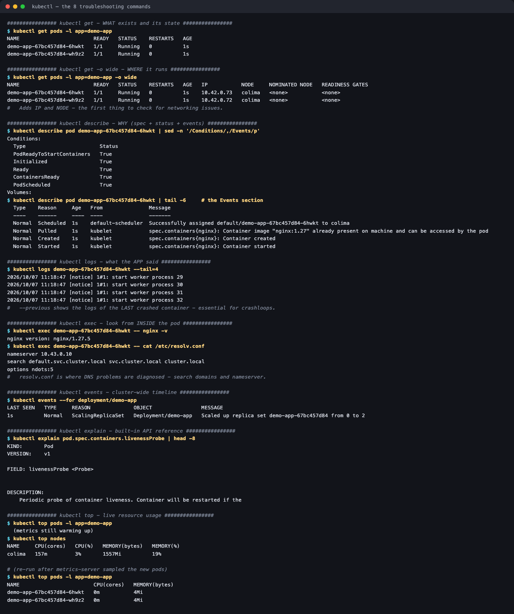

# The Troubleshooting Command Toolkit

**Session 14 homework** · Lakshya Mewara · 24BCS10290

> Cluster: k3s `v1.35.0+k3s1`, node `colima`. Raw output: [`transcript.txt`](./transcript.txt).

All eight commands the assignment asks for, run against a live two-replica nginx Deployment.



| Command | Question it answers | Reach for it when |
|---|---|---|
| `kubectl get` | *What* exists and its state | Always first |
| `kubectl get -o wide` | *Where* it runs — IP and node | Networking or node-specific issues |
| `kubectl describe` | *Why* — spec, conditions, **events** | Anything not `Running` |
| `kubectl logs` | What the **application** said | The app started but misbehaves |
| `kubectl exec` | What it looks like from **inside** | DNS, config files, connectivity tests |
| `kubectl events` | The cluster-wide timeline | Reconstructing what happened when |
| `kubectl explain` | What a field means | Writing or reading manifests |
| `kubectl top` | Live CPU / memory | OOM, throttling, HPA behaviour |

## Selected output

```
$ kubectl get pods -l app=demo-app -o wide
NAME                        READY   STATUS    RESTARTS   AGE   IP           NODE
demo-app-67bc457d84-6hwkt   1/1     Running   0          1s    10.42.0.73   colima
demo-app-67bc457d84-wh9z2   1/1     Running   0          1s    10.42.0.72   colima

$ kubectl exec demo-app-67bc457d84-6hwkt -- cat /etc/resolv.conf
nameserver 10.43.0.10
search default.svc.cluster.local svc.cluster.local cluster.local
options ndots:5

$ kubectl events --for deployment/demo-app
Normal   ScalingReplicaSet   Deployment/demo-app   Scaled up replica set demo-app-67bc457d84 from 0 to 2

$ kubectl top nodes
NAME     CPU(cores)   CPU(%)   MEMORY(bytes)   MEMORY(%)
colima   157m         3%       1557Mi          19%
```

## The order that actually works

```
get  ->  describe  ->  logs  ->  exec
```

`get` tells you *which* thing is wrong. `describe` tells you *why* — and its **Events** section answers most failures before you ever read a log. `logs` only helps once the container has actually run. `exec` is for checking the world from the pod's point of view.

Two things the scenarios in this session made concrete:

- **`logs` is useless for half the failure states.** Pending, ContainerCreating, ImagePullBackOff and CreateContainerConfigError all mean the container never ran — there are no logs to read. `describe` is the tool.
- **`/etc/resolv.conf` explains most DNS confusion.** The `search` line and `ndots:5` are why a short name works in one namespace and not another ([details](../05-service-dns/#b-dns--the-same-name-works-in-one-namespace-fails-in-another)).
