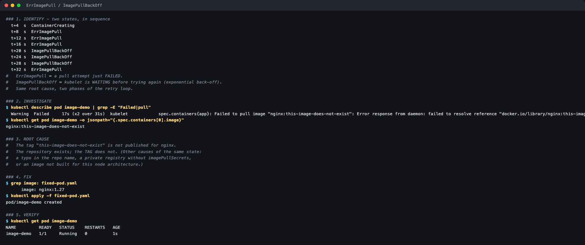

# ErrImagePull / ImagePullBackOff

**Session 14 homework** · Lakshya Mewara · 24BCS10290

> Cluster: k3s `v1.35.0+k3s1`, node `colima`. Full raw output: [`transcript.txt`](./transcript.txt).



## 1. Identify

Sampled every 4 seconds, the pod cycles between **two** states:

```
  t+4s   ContainerCreating
  t+8s   ErrImagePull
  t+20s  ImagePullBackOff
  t+32s  ErrImagePull
```

**`ErrImagePull`** = a pull attempt just failed. **`ImagePullBackOff`** = kubelet is *waiting* before the next attempt. Same root cause, two phases of one retry loop — the assignment lists them separately, but you'll see both on the same pod.

## 2. Investigate

```
$ kubectl describe pod image-demo | grep Failed
Failed to pull image "nginx:this-image-does-not-exist": ...
docker.io/library/nginx:this-image-does-not-exist: not found
```

## 3. Root cause

The repository `nginx` exists; the **tag** `this-image-does-not-exist` does not. The same state is produced by a typo'd repository name, a private registry without `imagePullSecrets`, or — as hit in [session 10](../../../session10-k8s-core-objects/HW/core-objects/) — an image that exists but not for the node's CPU architecture. The event message tells them apart: `not found`, `unauthorized`, or `no matching manifest for linux/arm64`.

## 4. Fix

Use a tag that exists: `nginx:1.27` ([`fixed-pod.yaml`](./fixed-pod.yaml)).

## 5. Verify

```
NAME         READY   STATUS    RESTARTS   AGE
image-demo   1/1     Running   0          1s
```
