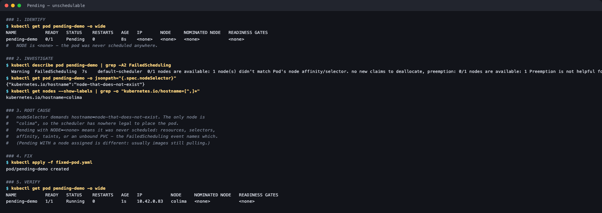

# Pending

**Session 14 homework** · Lakshya Mewara · 24BCS10290

> Cluster: k3s `v1.35.0+k3s1`, node `colima`. Full raw output: [`transcript.txt`](./transcript.txt).



## 1. Identify

```
$ kubectl get pod pending-demo -o wide
NAME           READY   STATUS    IP       NODE
pending-demo   0/1     Pending   <none>   <none>
```

`NODE <none>` is the key detail: the pod was **never scheduled**.

## 2. Investigate

```
$ kubectl describe pod pending-demo | grep FailedScheduling
FailedScheduling  0/1 nodes are available: 1 node(s) didn't match Pod's node affinity/selector.

$ kubectl get pod pending-demo -o jsonpath='{.spec.nodeSelector}'
{"kubernetes.io/hostname":"node-that-does-not-exist"}

$ kubectl get nodes --show-labels | grep -o "kubernetes.io/hostname=[^,]*"
kubernetes.io/hostname=colima
```

## 3. Root cause

The `nodeSelector` demands a hostname that doesn't exist; the only node is `colima`, so there's nowhere legal to place the pod. **Pending with `NODE=<none>` is a scheduling problem** — resources, selectors, affinity, taints or an unbound PVC — and the `FailedScheduling` event always names which one. (Pending *with* a node assigned is different: usually images still pulling.)

## 4. Fix

Remove the impossible selector ([`fixed-pod.yaml`](./fixed-pod.yaml)).

## 5. Verify

```
NAME           READY   STATUS    IP           NODE
pending-demo   1/1     Running   10.42.0.83   colima
```
