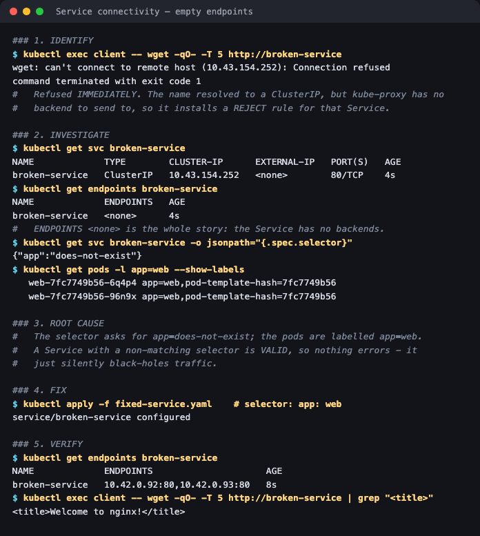
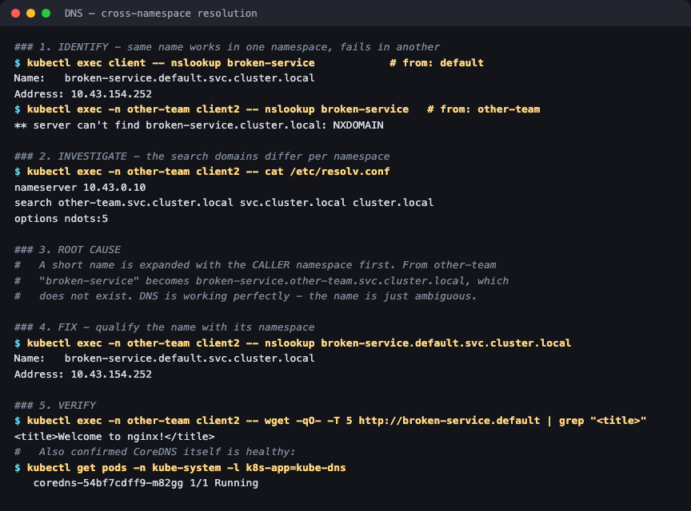

# Service Connectivity & DNS

**Session 14 homework** · Lakshya Mewara · 24BCS10290

> Cluster: k3s `v1.35.0+k3s1`, node `colima`. Raw output:
> [`transcript-service.txt`](./transcript-service.txt) · [`transcript-dns.txt`](./transcript-dns.txt)

Two different failures that both surface as "I can't reach the service".

---

## A. Service connectivity — empty endpoints



### 1. Identify
```
$ kubectl exec client -- wget -qO- -T 5 http://broken-service
wget: can't connect to remote host (10.43.19.10): Connection refused
```
Refused **immediately**. The name resolved to a ClusterIP, but kube-proxy has no backend to forward to, so it installs a REJECT rule for that Service.

### 2. Investigate
```
$ kubectl get endpoints broken-service
NAME             ENDPOINTS   AGE
broken-service   <none>      4s

$ kubectl get svc broken-service -o jsonpath='{.spec.selector}'
{"app":"does-not-exist"}

$ kubectl get pods -l app=web --show-labels
   web-7fc7749b56-rx5zw   app=web,pod-template-hash=7fc7749b56
```
**`ENDPOINTS <none>` is the whole story.**

### 3. Root cause
The selector asks for `app=does-not-exist`; the pods are labelled `app=web`. A Service with a non-matching selector is **valid**, so nothing errors — it silently black-holes traffic. (Contrast a *Deployment* with a mismatched selector, which the API server rejects outright — see [session 10](../../../session10-k8s-core-objects/HW/troubleshooting/).)

### 4. Fix
Correct the selector to `app: web` ([`fixed-service.yaml`](./fixed-service.yaml)).

### 5. Verify
```
$ kubectl get endpoints broken-service
broken-service   10.42.0.87:80,10.42.0.88:80

$ kubectl exec client -- wget -qO- -T 5 http://broken-service | grep "<title>"
<title>Welcome to nginx!</title>
```

---

## B. DNS — the same name works in one namespace, fails in another



### 1. Identify
```
$ kubectl exec client -- nslookup broken-service                  # from: default
Name:    broken-service.default.svc.cluster.local
Address: 10.43.19.10

$ kubectl exec -n other-team client2 -- nslookup broken-service   # from: other-team
** server can't find broken-service.cluster.local: NXDOMAIN
```

### 2. Investigate
```
$ kubectl exec -n other-team client2 -- cat /etc/resolv.conf
nameserver 10.43.0.10
search other-team.svc.cluster.local svc.cluster.local cluster.local
options ndots:5
```
The **search list starts with the caller's own namespace**.

### 3. Root cause
A short name is expanded with the caller's namespace first. From `other-team`, `broken-service` is tried as `broken-service.other-team.svc.cluster.local` — which doesn't exist. **DNS is working perfectly; the name is ambiguous.** CoreDNS itself was confirmed healthy (`coredns-…  1/1  Running`).

### 4. Fix
Qualify the name with its namespace:
```
$ kubectl exec -n other-team client2 -- nslookup broken-service.default.svc.cluster.local
Name:    broken-service.default.svc.cluster.local
Address: 10.43.154.252
```

### 5. Verify
```
$ kubectl exec -n other-team client2 -- wget -qO- -T 5 http://broken-service.default | grep "<title>"
<title>Welcome to nginx!</title>
```
`broken-service.default` (short) and the full FQDN both work across namespaces.

---

## What I understood

- **"Can't reach the service" has at least three different layers behind it** — DNS, endpoints, and the network. Checking them in order (`nslookup` → `get endpoints` → policies) localises the fault fast.
- **A short service name is only unambiguous inside its own namespace.** Anything cross-namespace should use `name.namespace` at minimum.
- **Empty endpoints fail loudly at the client but silently in the cluster.** No event, no error on the Service object — so `kubectl get endpoints` has to be a reflex.
