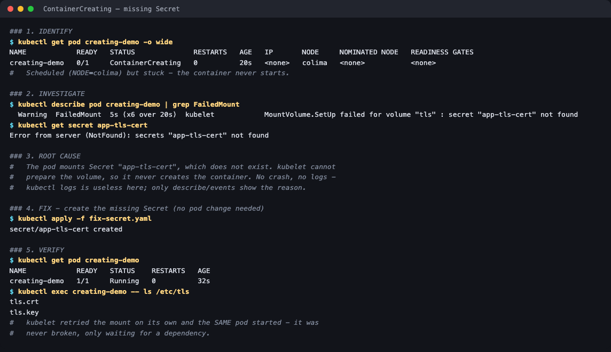

# ContainerCreating (stuck)

**Session 14 homework** · Lakshya Mewara · 24BCS10290

> Cluster: k3s `v1.35.0+k3s1`, node `colima`. Full raw output: [`transcript.txt`](./transcript.txt).



## 1. Identify

```
NAME            READY   STATUS              IP       NODE
creating-demo   0/1     ContainerCreating   <none>   colima
```

Unlike Pending, the pod **is** scheduled (`NODE=colima`) — it's stuck *after* scheduling.

## 2. Investigate

```
$ kubectl describe pod creating-demo | grep FailedMount
FailedMount  MountVolume.SetUp failed for volume "tls" : secret "app-tls-cert" not found

$ kubectl get secret app-tls-cert
Error from server (NotFound): secrets "app-tls-cert" not found
```

## 3. Root cause

The pod mounts a Secret that doesn't exist. kubelet can't prepare the volume, so it never creates the container. **There's no crash and no logs — `kubectl logs` is useless here**; only `describe`/events show the reason.

## 4. Fix

Create the missing Secret ([`fix-secret.yaml`](./fix-secret.yaml)). **No change to the pod at all.**

## 5. Verify

```
NAME            READY   STATUS    RESTARTS   AGE
creating-demo   1/1     Running   0          32s

$ kubectl exec creating-demo -- ls /etc/tls
tls.crt
tls.key
```

kubelet retried the mount on its own and the **same pod** started. It was never broken — only waiting on a dependency.
