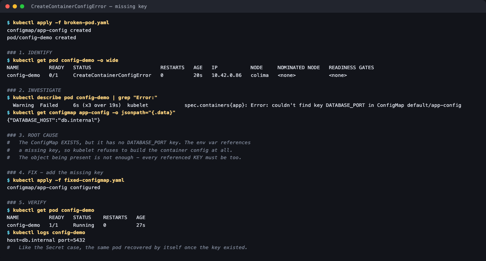

# Configuration issue — CreateContainerConfigError

**Session 14 homework** · Lakshya Mewara · 24BCS10290

> Cluster: k3s `v1.35.0+k3s1`, node `colima`. Full raw output: [`transcript.txt`](./transcript.txt).



## 1. Identify

```
NAME          READY   STATUS                       IP           NODE
config-demo   0/1     CreateContainerConfigError   10.42.0.86   colima
```

## 2. Investigate

```
$ kubectl describe pod config-demo | grep "Error:"
Error: couldn't find key DATABASE_PORT in ConfigMap default/app-config

$ kubectl get configmap app-config -o jsonpath='{.data}'
{"DATABASE_HOST":"db.internal"}
```

## 3. Root cause

The ConfigMap **exists** — but it has no `DATABASE_PORT` key, and an env var references that key. kubelet refuses to build the container config. **The object being present isn't enough; every referenced key must be too.** (Sampled live, the pod shows `ContainerCreating` for its first few seconds before settling into `CreateContainerConfigError`.)

## 4. Fix

Add the missing key ([`fixed-configmap.yaml`](./fixed-configmap.yaml)).

## 5. Verify

```
NAME          READY   STATUS    RESTARTS   AGE
config-demo   1/1     Running   0          27s

$ kubectl logs config-demo
host=db.internal port=5432
```

Like the Secret case, the same pod recovered by itself once the key existed.
