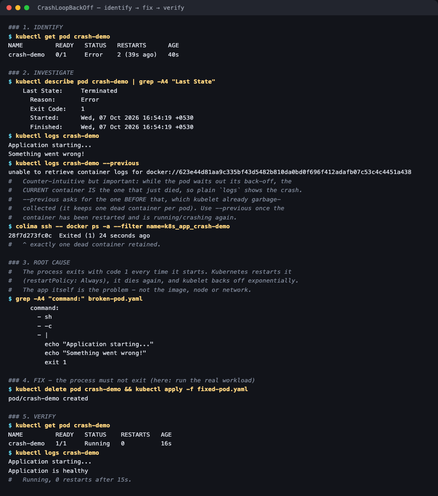
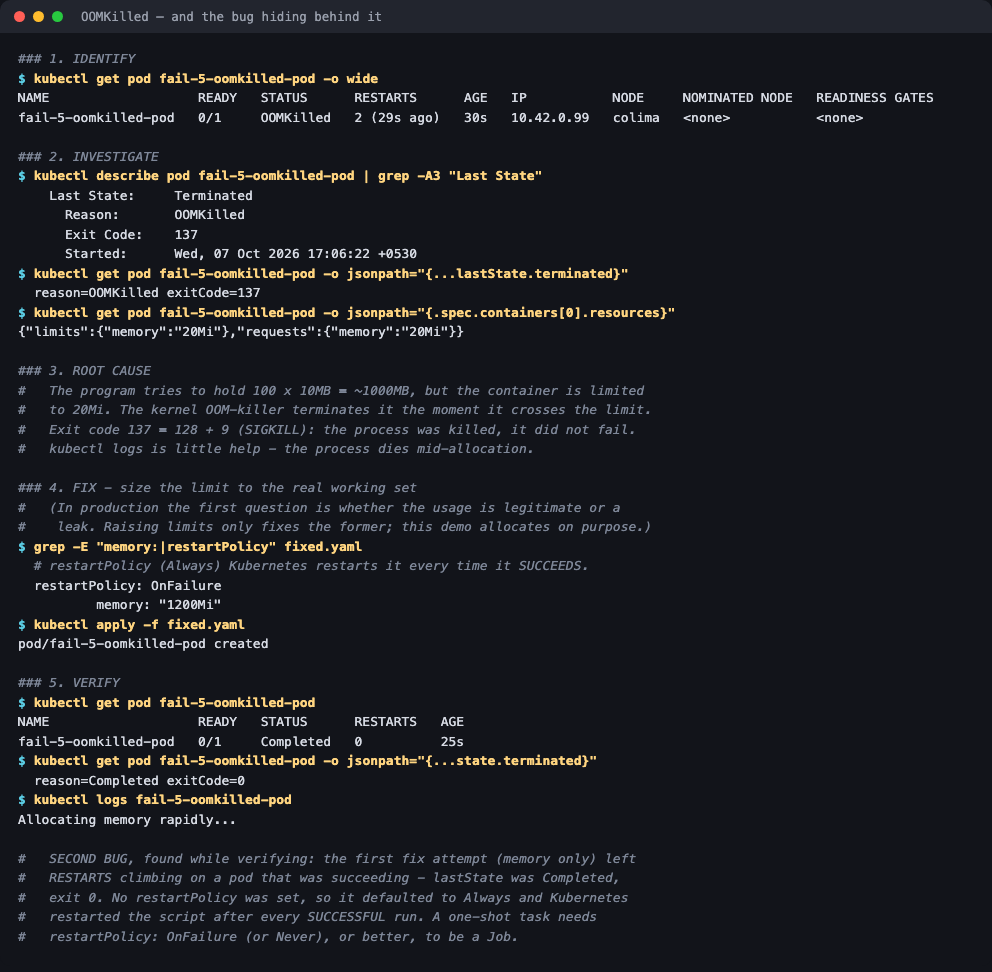
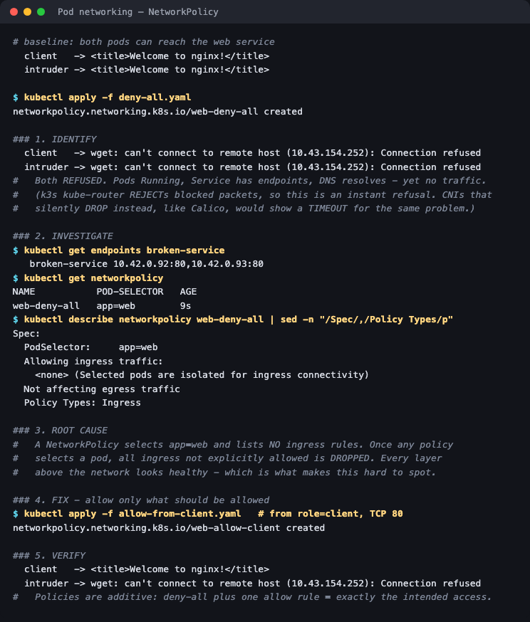
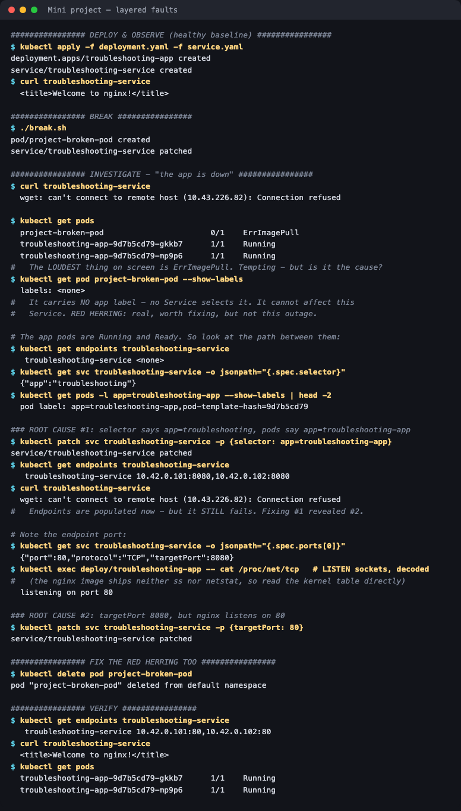

# Session 14 — Kubernetes Troubleshooting

**Homework submission** · Lakshya Mewara · 24BCS10290

> **Cluster:** k3s `v1.35.0+k3s1`, single node (`colima`), Colima VM on macOS/Apple Silicon.
> Every scenario was broken and fixed for real; each folder has the screenshot, the raw
> transcript, and the broken and fixed manifests.

Every issue follows the method the assignment asks for: **identify → investigate → root cause → fix → verify → document**.

## Task 1 — Troubleshooting commands

All eight commands (`get`, `get -o wide`, `describe`, `logs`, `exec`, `events`, `explain`, `top`), run against a live workload → [`01-commands/`](./01-commands/)

## Task 2 — Common issues

| Issue | Root cause found | Folder |
|---|---|---|
| **CrashLoopBackOff** | Process exits with code 1 every start | [`02-crashloopbackoff/`](./02-crashloopbackoff/) |
| **ErrImagePull / ImagePullBackOff** | Image tag doesn't exist — both states captured on the same pod | [`03-imagepullbackoff/`](./03-imagepullbackoff/) |
| **Pending** | `nodeSelector` targets a node that doesn't exist | [`04-pending/`](./04-pending/) |
| **ContainerCreating** | Mounts a Secret that doesn't exist | [`08-containercreating/`](./08-containercreating/) |
| **Service connectivity** | Selector matches no pods — `ENDPOINTS <none>` | [`05-service-dns/`](./05-service-dns/#a-service-connectivity--empty-endpoints) |
| **DNS** | Short name resolved in the caller's namespace | [`05-service-dns/`](./05-service-dns/#b-dns--the-same-name-works-in-one-namespace-fails-in-another) |
| **Pod networking** | A NetworkPolicy isolating the pods | [`10-pod-networking/`](./10-pod-networking/) |
| **Configuration** | Env var references a ConfigMap key that's missing | [`09-config-issue/`](./09-config-issue/) |
| **OOMKilled** *(bonus)* | 20Mi limit vs ~1000MB allocation — plus a second hidden bug | [`06-oomkilled/`](./06-oomkilled/) |

## Task 3 — Mini project

Three faults at once — one loud red herring and two real faults where fixing the first reveals the second → [`07-mini-project/`](./07-mini-project/)

## Evidence at a glance

| CrashLoopBackOff | OOMKilled — and the bug behind it |
|---|---|
|  |  |

| NetworkPolicy — the intended access only | Mini project — layered faults |
|---|---|
|  |  |

## Findings worth highlighting

**1. `kubectl logs --previous` didn't work for a crashloop — and the reason is useful.** While a pod waits out its back-off, the *current* container is the one that just died, so plain `kubectl logs` shows the crash. `--previous` asks for the one before, which kubelet had already garbage-collected. [Details](./02-crashloopbackoff/#2-investigate)

**2. Verifying a fix surfaced a second bug.** After fixing the OOM limit, `RESTARTS` kept climbing on a pod that was *succeeding* — no `restartPolicy` meant it defaulted to `Always`, restarting a one-shot script after every successful run. [Details](./06-oomkilled/#a-second-bug-found-while-verifying)

**3. The same fault looks different on different clusters.** A NetworkPolicy block showed as an instant *Connection refused* here, because k3s's kube-router REJECTs packets. Calico silently DROPs by default, which shows as a *timeout*. Worth knowing before trusting the error text. [Details](./10-pod-networking/#3-root-cause)

**4. The loudest error wasn't the cause.** In the mini project, `ErrImagePull` dominated the screen but the pod had no labels and couldn't affect the Service — the real faults were a selector typo and a wrong `targetPort`. [Details](./07-mini-project/)

## Which tool for which state

| State | Container ran? | Look at |
|---|---|---|
| Pending | No | `describe` → `FailedScheduling` |
| ContainerCreating | No | `describe` → `FailedMount` |
| CreateContainerConfigError | No | `describe` → `Error: couldn't find key` |
| ErrImagePull / ImagePullBackOff | No | `describe` → `Failed to pull image` |
| CrashLoopBackOff | Yes | `logs`, then `describe` → `Last State`, exit code |
| OOMKilled | Yes, killed | `describe` → `Reason: OOMKilled`, exit 137 |
| Running but unreachable | Yes | `get endpoints`, `exec` → DNS, NetworkPolicies |

**Half the failure states mean the container never ran, so `kubectl logs` has nothing to show.** `describe` and its Events section are the right first move for all of them.

## A note on the screenshots

Terminal images are the **real, unedited output** of the commands shown, rendered to PNG for readability. The raw text of every run is saved as `transcript.txt` beside each screenshot.
