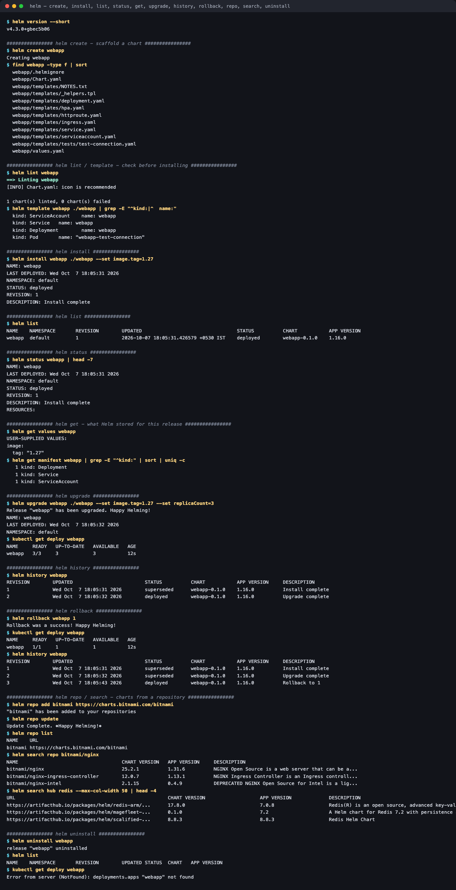
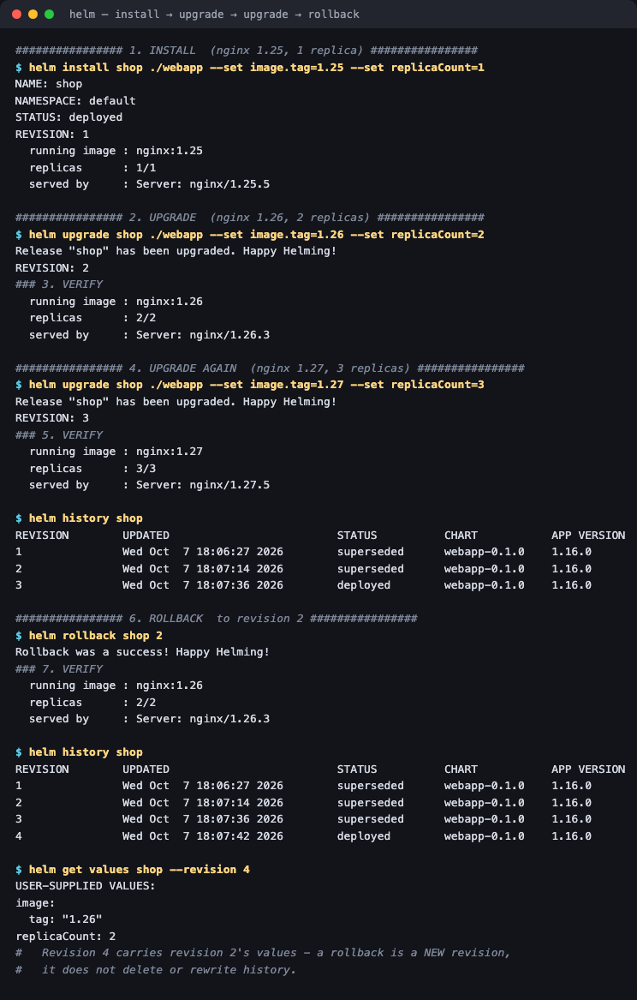
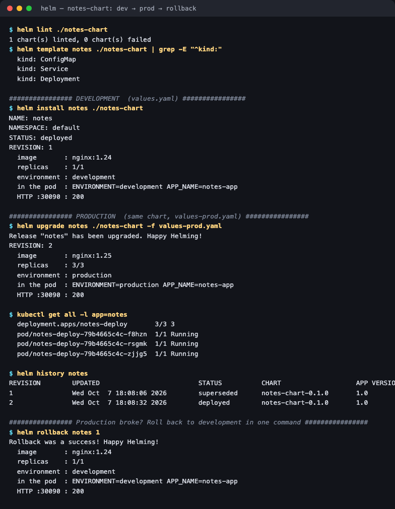
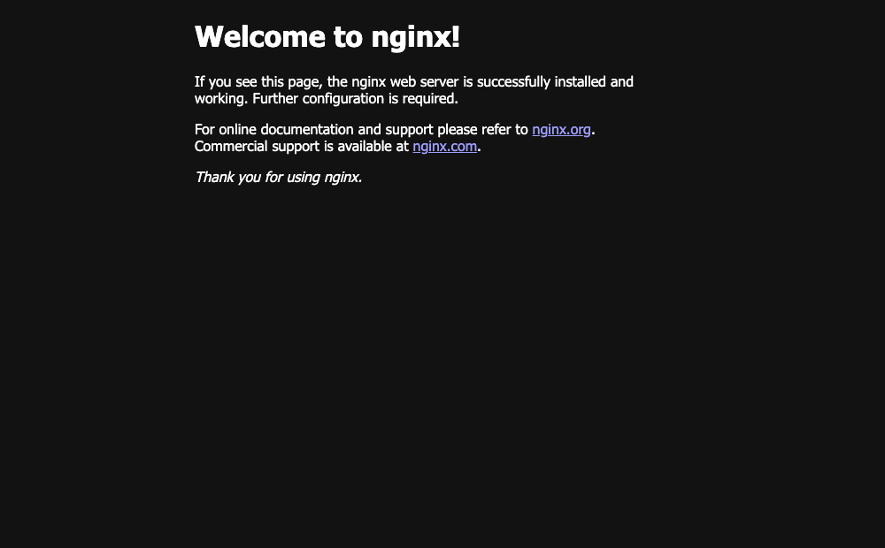

# Session 15 — Helm

**Homework submission** · Lakshya Mewara · 24BCS10290

> **Cluster:** k3s `v1.35.0+k3s1`, node `colima`. **Helm:** `v4.3.0`.
> Every command and screenshot below is from a real run. Raw output is saved as
> `transcript.txt` in each folder.

| Task | What was done | Folder |
|---|---|---|
| 1 — Helm commands | All 11 commands the assignment lists, plus `lint` and `template` | [`01-helm-commands/`](./01-helm-commands/) |
| 2 — Rollback workflow | Install → upgrade → verify → upgrade → verify → rollback → verify, with the **running** version checked each time | [`02-helm-rollback/`](./02-helm-rollback/) |
| 3 — Mini project | `notes-chart`: same chart deployed as development, then production, then rolled back | [`03-mini-project/`](./03-mini-project/) |

---

## What Helm is

Helm is a **package manager for Kubernetes**. A *chart* is a directory of templated manifests plus a `values.yaml` of defaults; a *release* is one installed instance of a chart. Helm renders the templates with the values, applies the result, and **records every revision** so it can upgrade and roll back as a unit.

```
Chart (templates + values.yaml)  ──helm install──►  Release "notes", revision 1
                                  ──helm upgrade──►  revision 2
                                  ──helm rollback─►  revision 3 (= revision 1's config)
```

The problem it solves: without Helm, an app is a pile of loose YAML files with environment differences hand-edited in. With Helm, it's one versioned package, and "staging vs production" is just a different values file.

---

## Task 1 — Every command



| Command | What it did here |
|---|---|
| `helm create webapp` | Scaffolded a chart: `Chart.yaml`, `values.yaml`, `templates/` (Deployment, Service, Ingress, HPA, ServiceAccount, a test hook) |
| `helm lint webapp` | `1 chart(s) linted, 0 chart(s) failed` |
| `helm template` | Rendered the manifests **without** touching the cluster — the best way to see what will be applied |
| `helm install` | Created release `webapp`, revision 1 |
| `helm list` | `webapp  default  1  deployed  webapp-0.1.0` |
| `helm status` | Release state, revision, last deploy time |
| `helm get values` | Showed only the user-supplied override: `image.tag: "1.27"` |
| `helm get manifest` | What Helm actually applied: 1 Deployment, 1 Service, 1 ServiceAccount |
| `helm upgrade` | Revision 2, replicas `1 → 3` |
| `helm history` | Every revision with status and description |
| `helm rollback webapp 1` | Revision 3, replicas back to `1` |
| `helm repo add / update / list` | Added the Bitnami repository |
| `helm search repo` / `hub` | Found `bitnami/nginx 25.2.1`; searched Artifact Hub for `redis` |
| `helm uninstall` | Removed the release *and every resource it created* |

The last row is quietly the most useful: `kubectl get deploy webapp` returns `NotFound` immediately afterwards. Helm tracks everything a release owns, so cleanup doesn't depend on remembering what was applied.

---

## Task 2 — The complete rollback workflow



Each verify step checks three things: the image **in the spec**, the ready replica count, and the `Server` header **nginx actually returns** — so the result is proven by what's serving, not by what Helm claims.

| Step | Revision | Image in spec | Replicas | Actually served by |
|---|---|---|---|---|
| Install | 1 | `nginx:1.25` | 1/1 | `nginx/1.25.5` |
| Upgrade → verify | 2 | `nginx:1.26` | 2/2 | `nginx/1.26.3` |
| Upgrade again → verify | 3 | `nginx:1.27` | 3/3 | `nginx/1.27.5` |
| **Rollback to 2** → verify | **4** | `nginx:1.26` | 2/2 | `nginx/1.26.3` |

```
$ helm history shop
REVISION  STATUS      DESCRIPTION
1         superseded  Install complete
2         superseded  Upgrade complete
3         superseded  Upgrade complete
4         deployed    Rollback to 2

$ helm get values shop --revision 4
image:
  tag: "1.26"
replicaCount: 2
```

**A rollback creates a new revision — it doesn't delete or rewind history.** Revision 4 carries revision 2's values, and revision 3 is still there to roll *forward* to if needed. The audit trail stays intact.

Note the rollback restored **both** the image and the replica count together. That's the real advantage over `kubectl rollout undo`, which only reverts a Deployment's pod template — Helm reverts the whole release: Services, ConfigMaps, replica counts, everything.

---

## Task 3 — Mini project: `notes-chart`

```
notes-chart/
├── Chart.yaml           # name, version 0.1.0, appVersion 1.0
├── values.yaml          # development defaults
├── values-prod.yaml     # production overrides
└── templates/
    ├── configmap.yaml   # APP_NAME, ENVIRONMENT
    ├── deployment.yaml  # consumes the ConfigMap via envFrom
    └── service.yaml     # NodePort 30090
```



The **same chart** deployed twice, changing nothing but the values file:

| | `helm install` (values.yaml) | `helm upgrade -f values-prod.yaml` | `helm rollback notes 1` |
|---|---|---|---|
| Image | `nginx:1.24` | `nginx:1.25` | `nginx:1.24` |
| Replicas | 1/1 | 3/3 | 1/1 |
| `ENVIRONMENT` in the ConfigMap | development | production | development |
| `ENVIRONMENT` **inside the pod** | development | production | development |
| HTTP on `:30090` | 200 | 200 | 200 |



**This is the core value of Helm:** one tested chart, and the difference between environments reduced to a reviewable values file.

### A subtlety worth knowing

The environment variable inside the pod changed *because the pods were recreated* — the image and replica count changed in the same upgrade. If an upgrade had changed **only** the ConfigMap, the running pods would have kept the old value: environment variables are fixed at container start (measured directly in [session 12](../../session-12-ingress-configmaps-secrets/HW/01-configmap/)), and Helm doesn't restart pods on a ConfigMap change by itself. The standard fix is a checksum annotation on the pod template:

```yaml
annotations:
  checksum/config: {{ include (print $.Template.BasePath "/configmap.yaml") . | sha256sum }}
```

so any config change alters the template and triggers a rollout.

---

## What I understood

- **A chart is a template; a release is an instance.** The same chart can be installed many times under different release names — that's how `{{ .Release.Name }}` keeps them from colliding.
- **`values.yaml` is the API of a chart.** Everything a user should be able to change belongs there; everything else stays fixed in the templates. Good charts are mostly about choosing that boundary well.
- **`helm template` before `helm install`.** Rendering locally shows exactly what will hit the cluster and catches templating mistakes without any risk.
- **Rollback is release-wide and history is append-only** — both demonstrated above, and both things `kubectl` alone doesn't give you.
- **Helm tracks ownership.** `helm uninstall` removed every resource cleanly because Helm knows what each release created.

## Files

| Path | Contents |
|---|---|
| [`01-helm-commands/webapp/`](./01-helm-commands/webapp/) | The chart scaffolded by `helm create` (also used for task 2) |
| [`03-mini-project/notes-chart/`](./03-mini-project/notes-chart/) | The Notes chart with dev and prod values |
| `*/transcript.txt` | Raw output of every run |

## Cleanup

```bash
helm uninstall notes shop
```
