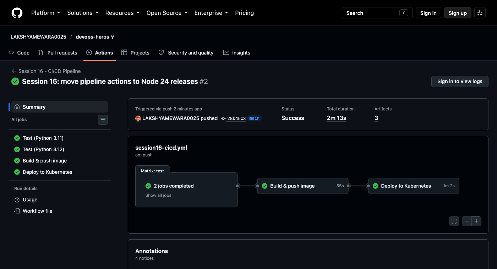
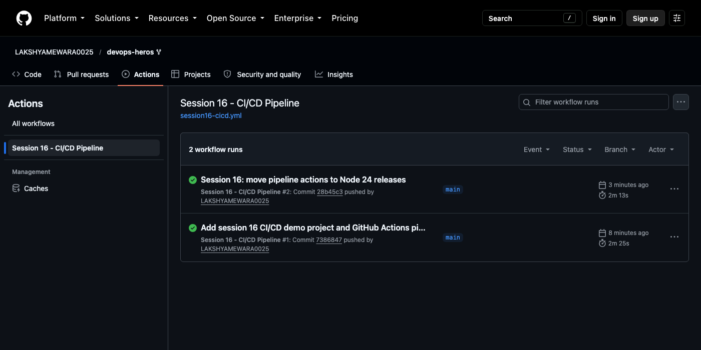
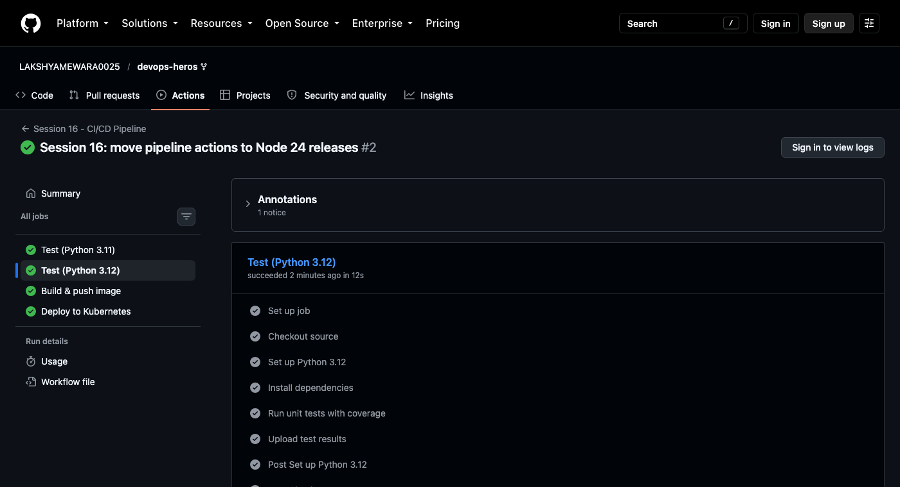
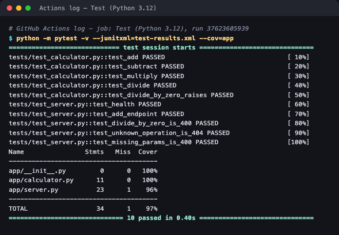
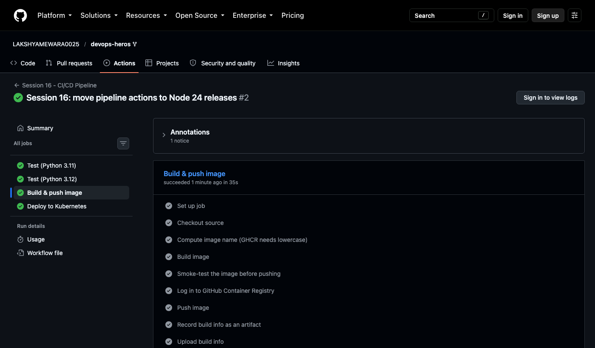
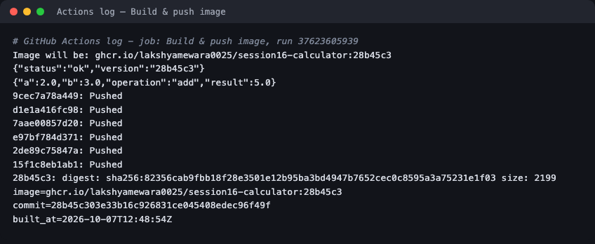
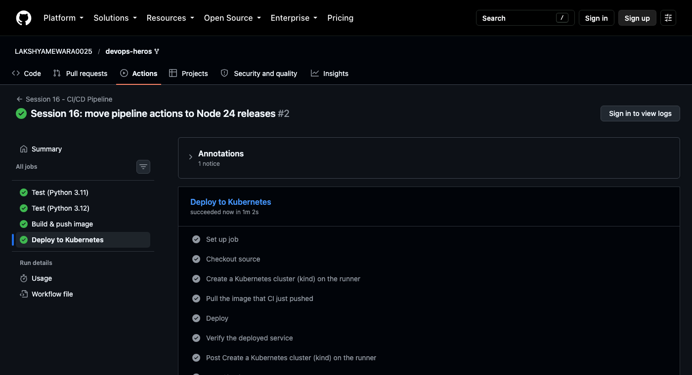
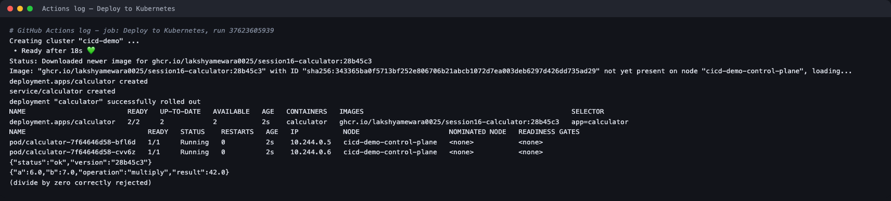

# Session 16 — CI/CD & GitHub Actions

**Homework submission** · Lakshya Mewara · 24BCS10290

A complete CI/CD pipeline that **actually ran on GitHub Actions** and went green — test,
build, push to a container registry, deploy to Kubernetes, and verify the live service.

| | |
|---|---|
| **Workflow** | [`.github/workflows/session16-cicd.yml`](../../.github/workflows/session16-cicd.yml) |
| **Project** | [`cicd-demo/`](./cicd-demo/) — Python calculator API, Dockerfile, tests, Kubernetes manifest |
| **Live runs** | [Actions → Session 16 - CI/CD Pipeline](https://github.com/LAKSHYAMEWARA0025/devops-heros/actions/workflows/session16-cicd.yml) |
| **Result** | Run #2 — **Success**, all 5 jobs green, **0 warnings** |
| **Image published** | `ghcr.io/lakshyamewara0025/session16-calculator:28b45c3` |

> The workflow lives at the **repository root** in `.github/workflows/` because that's the only
> place GitHub runs workflows from. A `paths:` filter limits it to changes in this project.

---

## The pipeline



```
  ┌──────────── CI ─────────────────────────────┐   ┌───────── CD ─────────┐
  Test (Py 3.11) ┐
                 ├──►  Build & push image  ──────────►  Deploy to Kubernetes
  Test (Py 3.12) ┘     (build, smoke-test,             (kind cluster, deploy,
   (matrix)             push to GHCR)                   rollout, verify)
```

| Job | Result | Time | What it proves |
|---|---|---|---|
| Test (Python 3.11) | ✅ | ~14s | 10/10 tests pass on 3.11 |
| Test (Python 3.12) | ✅ | ~11s | 10/10 tests pass on 3.12, 97% coverage |
| Build & push image | ✅ | ~27s | Image builds, **passes a smoke test**, is pushed to GHCR |
| Deploy to Kubernetes | ✅ | ~1m 31s | The pushed image runs on a real cluster and serves correct answers |



---

## CI — test, build, push

### Test (matrix)





```
tests/test_calculator.py::test_add PASSED
tests/test_calculator.py::test_divide_by_zero_raises PASSED
tests/test_server.py::test_health PASSED
tests/test_server.py::test_divide_by_zero_is_400 PASSED
tests/test_server.py::test_unknown_operation_is_404 PASSED
...
app/calculator.py      11      0   100%
app/server.py          23      1    96%
TOTAL                  34      1    97%
============================== 10 passed in 0.33s ==============================
```

The tests cover both layers: the pure calculator logic **and** the HTTP API's error handling (404 for an unknown operation, 400 for missing parameters or divide-by-zero).

### Build & push





```
Image will be: ghcr.io/lakshyamewara0025/session16-calculator:28b45c3
{"status":"ok","version":"28b45c3"}                      <- smoke test, BEFORE pushing
{"a":2.0,"b":3.0,"operation":"add","result":5.0}
28b45c3: digest: sha256:82356cab9fbb18f2...  size: 2199  <- pushed
```

**The image is smoke-tested before it's pushed.** A build that compiles but can't start never reaches the registry. Tagging with the short commit SHA (`28b45c3`) makes every image traceable to the exact code that built it — `latest` would make that impossible.

---

## CD — deploy and verify





```
Creating cluster "cicd-demo" ...  Ready after 18s
Status: Downloaded newer image for ghcr.io/lakshyamewara0025/session16-calculator:28b45c3
deployment.apps/calculator created
deployment "calculator" successfully rolled out

deployment.apps/calculator   2/2   ...   ghcr.io/lakshyamewara0025/session16-calculator:28b45c3
pod/calculator-7f64646d58-bfl6d   1/1   Running
pod/calculator-7f64646d58-cvv6z   1/1   Running

{"status":"ok","version":"28b45c3"}                       <- running version == commit
{"a":6.0,"b":7.0,"operation":"multiply","result":42.0}
(divide by zero correctly rejected)
```

The deploy job **pulls the exact image CI pushed** rather than rebuilding it — build once, deploy the same artifact. The final `/health` call returns `version: 28b45c3`, closing the loop from commit → image → running pod.

> **Where it deploys:** a throwaway Kubernetes cluster created *inside the runner* with kind. A real
> pipeline would target a persistent cluster using kubeconfig credentials stored as a repository
> secret; the deploy, rollout and verification steps would be identical. A cluster on a laptop
> isn't reachable from GitHub's runners, so an ephemeral one is the honest way to prove CD end to end.

---

## Concepts, mapped to this pipeline

| Concept | Where it appears |
|---|---|
| **CI vs CD** | CI = `test` + `build` (is the change good, and package it). CD = `deploy` (ship the package). CI runs on pull requests too; CD is skipped for them (`if: github.event_name != 'pull_request'`) |
| **Workflow** | The YAML file, triggered by `push`, `pull_request` and manual `workflow_dispatch` |
| **Jobs** | `test`, `build`, `deploy` — each gets a **fresh** VM |
| **Steps** | Ordered commands inside a job (checkout, install, test, …) |
| **Runners** | `ubuntu-latest`, GitHub-hosted. The `test` job runs on **two** runners in parallel via a matrix |
| **Dependencies** | `needs: test` and `needs: build` force the order — a failing test stops everything downstream |
| **Secrets** | `secrets.GITHUB_TOKEN` authenticates to GHCR. It's created per run, scoped by the `permissions:` block (`packages: write`), and masked in logs |
| **Artifacts** | `test-results-py3.11`, `test-results-py3.12` (JUnit + coverage XML) and `build-info` |
| **Job outputs** | `build` exports the image name; `deploy` consumes it as `needs.build.outputs.image` |
| **Build** | `docker build` with the commit SHA baked in as `APP_VERSION` |
| **Test** | `pytest` with coverage, on two Python versions |
| **Execution** | 2 runs, both green; run #2 has zero warnings |

---

## Something worth knowing: the first run had warnings

Run #1 passed but carried **3 warnings**: `actions/upload-artifact@v4` targets Node.js 20, which GitHub has deprecated and now forces onto Node 24. It works today but is the kind of thing that silently breaks later. I checked the latest releases, moved to `upload-artifact@v7`, `checkout@v7` and `login-action@v4`, and run #2 came back with **no warnings at all** — only GitHub's informational notice about `ubuntu-latest` migrating to Ubuntu 26.

A green tick isn't the same as a clean pipeline; annotations are worth reading.

---

## What I understood

- **CI answers "is this change safe?"; CD answers "get it running."** Splitting them into jobs with `needs:` means a broken test can never produce a deployment.
- **Each job is a fresh machine.** Nothing carries over between jobs except what's passed deliberately — job outputs, artifacts, or a registry. That's why `deploy` *pulls* the image instead of finding it on disk.
- **Build once, deploy the same artifact.** Rebuilding in the deploy stage would mean the thing deployed was never the thing tested.
- **`GITHUB_TOKEN` is the safest secret available** — it's minted per run, expires when the run ends, and its power is set by `permissions:` in the workflow itself. No long-lived credential to leak.
- **Matrix builds are cheap insurance.** Two Python versions in parallel cost nothing in wall-clock time and catch version-specific breakage before users do.

## Project files

| File | Purpose |
|---|---|
| [`cicd-demo/app/calculator.py`](./cicd-demo/app/calculator.py) | Pure calculator logic |
| [`cicd-demo/app/server.py`](./cicd-demo/app/server.py) | Flask HTTP API: `/health`, `/add`, `/subtract`, `/multiply`, `/divide` |
| [`cicd-demo/tests/`](./cicd-demo/tests/) | 10 unit tests across both layers |
| [`cicd-demo/Dockerfile`](./cicd-demo/Dockerfile) | `python:3.12-slim`, non-root user, gunicorn |
| [`cicd-demo/k8s/deployment.yaml`](./cicd-demo/k8s/deployment.yaml) | 2 replicas with readiness/liveness probes, plus a Service |
| [`logs/`](./logs/) | Raw log excerpts pulled from the Actions run via the GitHub API |

## Run it locally

```bash
cd cicd-demo
pip install -r requirements-dev.txt && python -m pytest -v
docker build -t calculator . && docker run -p 8080:8080 calculator
curl "localhost:8080/multiply?a=6&b=7"
```
