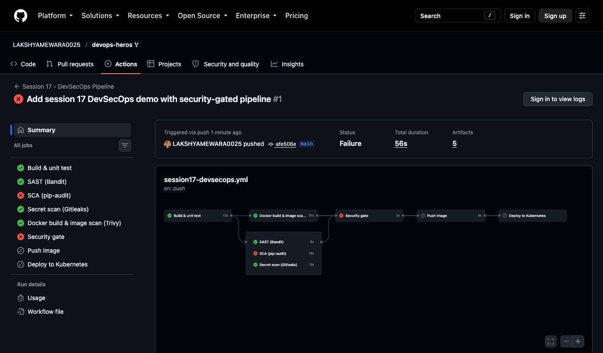
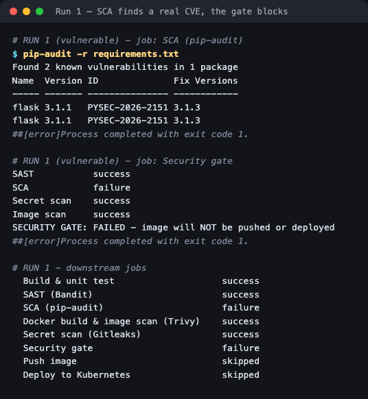
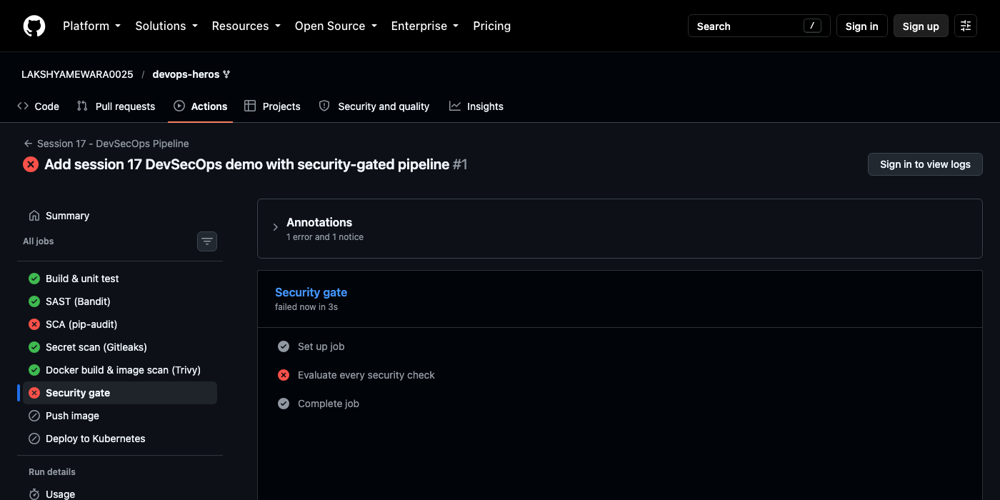
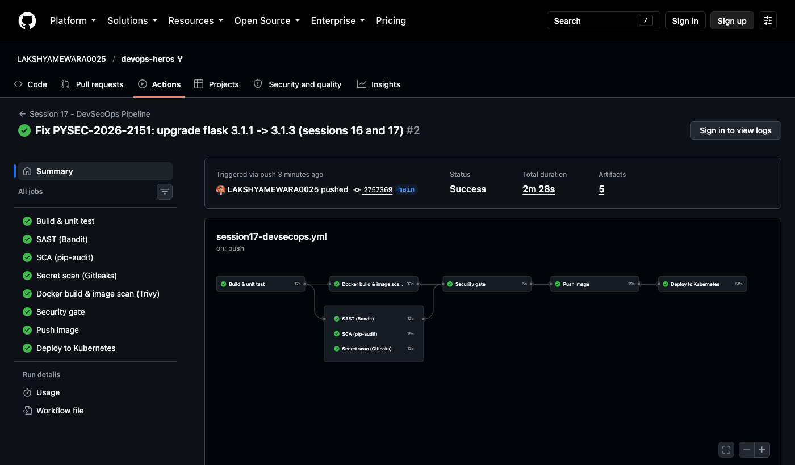
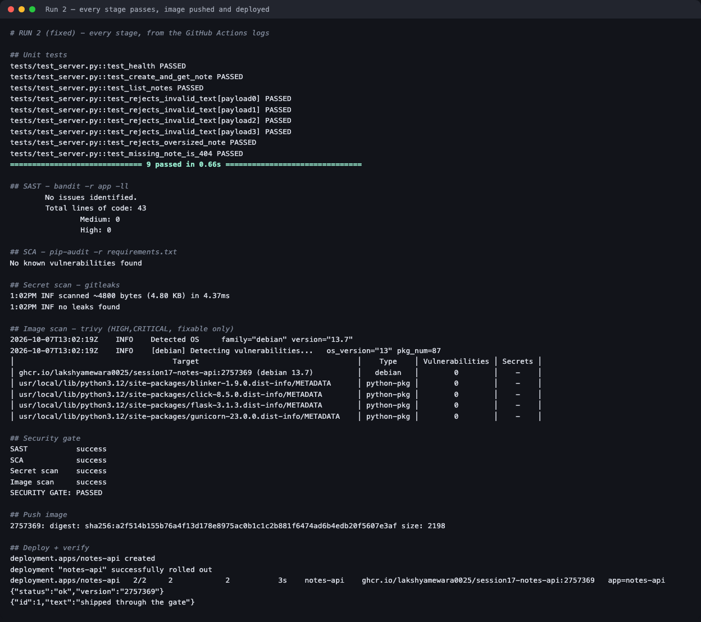
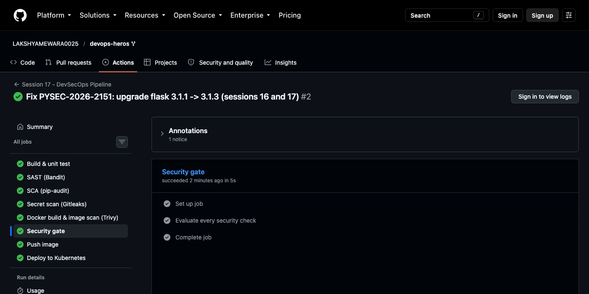
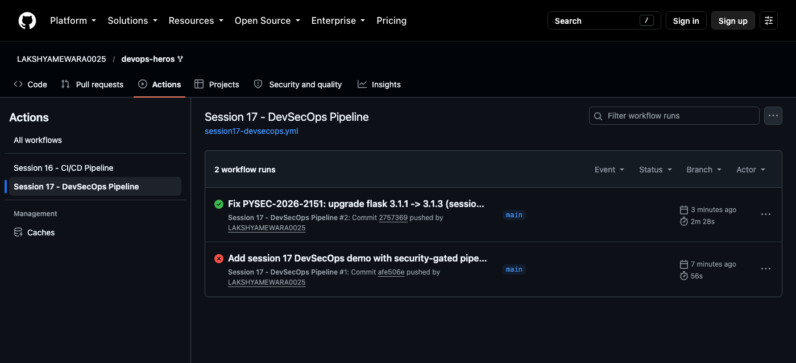

# Session 17 — Complete CI/CD & DevSecOps

**Homework submission** · Lakshya Mewara · 24BCS10290

A CI/CD pipeline with security built into every stage, which **ran for real on GitHub Actions** — and whose security gate **caught a genuine, unplanned vulnerability and blocked the deploy**, before going green once the fix landed.

| | |
|---|---|
| **Workflow** | [`.github/workflows/session17-devsecops.yml`](../../.github/workflows/session17-devsecops.yml) |
| **Project** | [`devsecops-demo/`](./devsecops-demo/) — Flask notes API, tests, hardened Dockerfile, Kubernetes manifests |
| **Run #1** | ❌ **Blocked** — real CVE in `flask 3.1.1` stopped the push and deploy |
| **Run #2** | ✅ **All 8 jobs green** — image pushed to GHCR and deployed |
| **Live runs** | [Actions → Session 17 - DevSecOps Pipeline](https://github.com/LAKSHYAMEWARA0025/devops-heros/actions/workflows/session17-devsecops.yml) |

---

## The pipeline — exactly the flow the assignment specifies

```
Code → Build → Unit Test → SAST → SCA → Secret Scan → Docker Build
     → Container Image Scan → SECURITY GATE → Push Image → Deploy to Kubernetes
```

| Stage | Tool | Fails the build on |
|---|---|---|
| Build + unit test | pip, pytest | Any failing test |
| **SAST** — static analysis | Bandit | MEDIUM or HIGH severity code issues |
| **SCA** — dependency analysis | pip-audit | Any known vulnerability in a dependency |
| **Secret scanning** | Gitleaks | Any committed credential |
| Docker build | docker | Build failure |
| **Container image scan** | Trivy | Fixable HIGH or CRITICAL vulnerabilities |
| **Security gate** | workflow logic | **Any** of the four checks above not succeeding |
| Push image | GHCR | — runs only if the gate passes |
| Deploy | kind + kubectl | Rollout or verification failure |

SAST, SCA, secret scanning and the image scan run **in parallel** after the tests, and the gate waits for all four. That keeps the pipeline fast without weakening the guarantee: nothing reaches the registry unless *every* check passed.

---

## Run #1 — the gate blocks a real vulnerability

I didn't plant this. While calibrating the scanners locally, `pip-audit` flagged the Flask version I'd pinned:





```
$ pip-audit -r requirements.txt
Found 2 known vulnerabilities in 1 package
Name  Version ID              Fix Versions
----- ------- --------------- ------------
flask 3.1.1   PYSEC-2026-2151 3.1.3
flask 3.1.1   PYSEC-2026-2151 3.1.3
##[error]Process completed with exit code 1.

SAST           success
SCA            failure
Secret scan    success
Image scan     success
SECURITY GATE: FAILED - image will NOT be pushed or deployed
```

| Job | Result |
|---|---|
| Build & unit test · SAST · Secret scan · Image scan | ✅ success |
| **SCA (pip-audit)** | ❌ **failure** |
| **Security gate** | ❌ **failure** |
| Push image | ⏭ **skipped** |
| Deploy to Kubernetes | ⏭ **skipped** |



**The vulnerable image never reached the registry, let alone the cluster.** Every other check passed — the code was clean, no secrets, the OS packages were fine — and it was still correctly blocked by a single dependency. That is the whole point of a gate: one failure anywhere is enough.

## The fix

```diff
- flask==3.1.1
+ flask==3.1.3
```

Verified locally before pushing (`pip-audit` → `No known vulnerabilities found`), then committed. **Session 16's calculator pinned the same Flask version**, so the same commit fixes it there too — a nice illustration of why SCA belongs in *every* pipeline, not just the security-focused one.

## Run #2 — everything passes, image ships





```
## Unit tests        9 passed in 0.66s
## SAST              No issues identified.  Medium: 0  High: 0
## SCA               No known vulnerabilities found
## Secret scan       no leaks found
## Image scan        debian 13.7: 0  ·  flask-3.1.3: 0  ·  gunicorn-23.0.0: 0  ...
## Security gate     SAST success · SCA success · Secret scan success · Image scan success
                     SECURITY GATE: PASSED
## Push image        2757369: digest: sha256:a2f514b155b76a4f...
## Deploy + verify   deployment "notes-api" successfully rolled out
                     {"status":"ok","version":"2757369"}
                     {"id":1,"text":"shipped through the gate"}
```



The deployed API reports version `2757369` — the commit that fixed the CVE — and accepts a write. The image that's running is precisely the one that was scanned.



---

## Design decisions worth explaining

**Build once, push the scanned image.** The image-scan job saves the image it scanned (`docker save`) as an artifact, and the push job loads *that* file. Rebuilding in the push stage would mean the thing pushed was never the thing scanned — a subtle gap that defeats image scanning entirely.

**`python:3.12-slim`, not alpine — chosen by measurement.** A local Trivy scan of both candidate bases (fixable HIGH/CRITICAL only):

| Base image | Fixable HIGH | Fixable CRITICAL |
|---|---|---|
| `python:3.12-slim` | **0** | 0 |
| `python:3.12-alpine` | **7** | 0 |

The common advice that "alpine is more secure because it's smaller" was the wrong call here.

**`--ignore-unfixed` on Trivy.** Failing on vulnerabilities that have *no* fix available yet would block every build with nothing the developer can do about it. The gate fails on what can actually be fixed.

**Defence in depth at runtime too.** The Kubernetes manifest runs as non-root (UID 10001), drops **all** Linux capabilities, forbids privilege escalation, uses a **read-only root filesystem** (with a small `emptyDir` for `/tmp`), and applies the `RuntimeDefault` seccomp profile. Scanning catches known flaws; these settings limit the damage from unknown ones.

**One deliberate suppression, documented.** `app.run(host="0.0.0.0")` trips Bandit's B104 ("binding to all interfaces"). In a container that is required — otherwise nothing outside the container can reach it — so it carries an inline `# nosec B104` with the reason. Suppressions belong next to a justification, never silently.

**`GITHUB_TOKEN`, not a stored credential.** Registry authentication uses the per-run token, scoped by `permissions: packages: write`. Nothing long-lived to leak.

---

## The security checks, explained

| Check | Looks at | Catches | Doesn't catch |
|---|---|---|---|
| **SAST** | Your source code | Injection, unsafe calls, weak crypto, hardcoded binds | Vulnerabilities in libraries |
| **SCA** | Your dependency list | Known CVEs in third-party packages — *this run's finding* | Bugs in your own code |
| **Secret scanning** | File contents | API keys, tokens, private keys committed by mistake | Secrets stored safely elsewhere |
| **Image scanning** | The built container | Vulnerable OS packages and installed libraries | Application logic flaws |

They overlap very little, which is why all four are needed. In this project the source code was clean and the OS packages were clean, and the real vulnerability sat in a dependency — exactly the gap only SCA covers.

## What I understood

- **A gate has to be able to say no.** A pipeline that runs scanners but always deploys anyway is theatre. Run #1 proved this one genuinely blocks.
- **Shift left is about cost.** The CVE was found minutes after the dependency was pinned, fixed with a one-line change, and never ran anywhere. The same issue found in production would mean an incident.
- **Scan what you ship.** The `docker save`/`load` hand-off guarantees the pushed image is the scanned image, byte for byte.
- **Measure, don't assume.** Two "best practices" — alpine is safer, and scanners need a planted bug to demonstrate — both turned out to be wrong in practice here.

## Project files

| File | Purpose |
|---|---|
| [`devsecops-demo/app/server.py`](./devsecops-demo/app/server.py) | Notes API with input validation |
| [`devsecops-demo/tests/test_server.py`](./devsecops-demo/tests/test_server.py) | 9 tests including invalid and oversized input |
| [`devsecops-demo/Dockerfile`](./devsecops-demo/Dockerfile) | `python:3.12-slim`, non-root, gunicorn |
| [`devsecops-demo/k8s/deployment.yaml`](./devsecops-demo/k8s/deployment.yaml) | Hardened Deployment + Service |
| [`logs/run1-blocked.log`](./logs/run1-blocked.log) · [`logs/run2-passed.log`](./logs/run2-passed.log) | Log excerpts pulled from both runs via the GitHub API |
