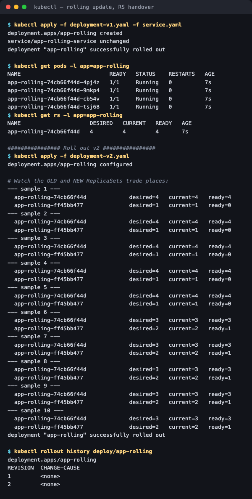
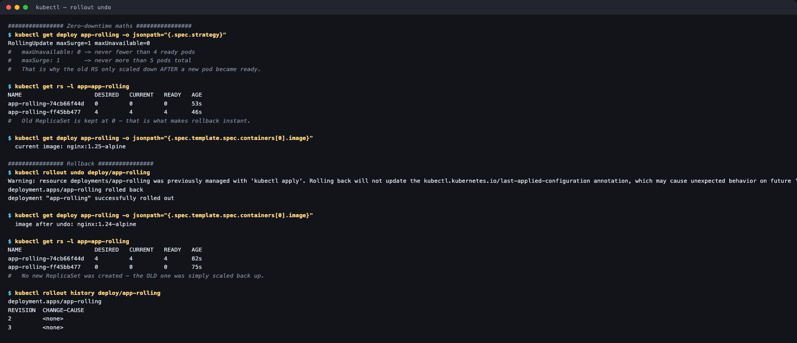

# 01 — Rolling Update

**Homework submission** · Lakshya Mewara · 24BCS10290

> **Cluster:** k3s `v1.35.0+k3s1`, single node, Colima VM on macOS/Apple Silicon.

The **default** Deployment strategy: replace pods gradually so the app stays available throughout.

```yaml
strategy:
  type: RollingUpdate
  rollingUpdate:
    maxSurge: 1          # at most 1 pod ABOVE the desired count
    maxUnavailable: 0    # never fewer than `replicas` ready  -> zero downtime
```

With `replicas: 4`, those two numbers mean the pod count stays between **4 and 5** for the entire rollout.

---

## The rollout, sampled live

```bash
kubectl apply -f deployment-v1.yaml -f service.yaml   # nginx:1.24-alpine
kubectl apply -f deployment-v2.yaml                   # nginx:1.25-alpine
```



```
--- sample 1 ---
  app-rolling-74cb66f44d   desired=4  current=4  ready=4     <- v1 (old)
  app-rolling-ff45bb477    desired=1  current=1  ready=0     <- v2 (new, starting)

--- sample 6 ---
  app-rolling-74cb66f44d   desired=3  current=3  ready=3     <- v1 scaling DOWN
  app-rolling-ff45bb477    desired=2  current=2  ready=1     <- v2 scaling UP
```

**Two ReplicaSets exist simultaneously** and trade places. Reading sample 1: the new RS added one pod (that's `maxSurge: 1`) while the old RS still had all four ready — total 5 pods, 4 ready. The old RS only dropped to 3 **after** a new pod became ready, which is `maxUnavailable: 0` being enforced.

```
$ kubectl get deploy app-rolling -o jsonpath='{.spec.strategy}'
RollingUpdate maxSurge=1 maxUnavailable=0
```

That is the whole zero-downtime guarantee, expressed as two numbers.

## Rollback is instant, because the old ReplicaSet is kept



```
$ kubectl get rs -l app=app-rolling          # after the rollout finished
app-rolling-74cb66f44d   0   0   0           <- v1, kept at zero
app-rolling-ff45bb477    4   4   4           <- v2, live

  current image: nginx:1.25-alpine

$ kubectl rollout undo deploy/app-rolling
deployment.apps/app-rolling rolled back

  image after undo: nginx:1.24-alpine

$ kubectl get rs -l app=app-rolling
app-rolling-74cb66f44d   4   4   4           <- v1 scaled back UP
app-rolling-ff45bb477    0   0   0           <- v2 scaled to zero
```

**No new ReplicaSet was created.** The rollback simply scaled the old one back up — which is why `rollout undo` completes in seconds rather than rebuilding anything. The old RS sitting at 0 replicas costs nothing but keeps the previous version one command away.

```
$ kubectl rollout history deploy/app-rolling
REVISION  CHANGE-CAUSE
2         <none>
3         <none>
```

Revision 3 *is* the rolled-back v1 — an undo is recorded as a new revision rather than erasing history.

> `kubectl rollout undo` prints a warning that it doesn't update the `last-applied-configuration` annotation, so a later `kubectl apply` of the v2 file would re-apply v2. In practice you roll back to stop the bleeding, then fix the manifest in git.

---

## What I understood

- **A Deployment rolls out by manipulating ReplicaSets, not pods.** Every image change creates a *new* ReplicaSet; the rollout is just the two being scaled in opposite directions. Seeing both in `kubectl get rs` mid-rollout made the architecture click.
- **`maxSurge` and `maxUnavailable` are a capacity-vs-speed trade.** `maxUnavailable: 0` guarantees no lost capacity but needs room for an extra pod and rolls slower. `maxUnavailable: 1, maxSurge: 0` rolls without extra resources but runs degraded. Neither is "correct" — it depends on whether spare capacity or full capacity matters more.
- **Old ReplicaSets are the rollback mechanism.** They're retained (`revisionHistoryLimit`, default 10) at 0 replicas precisely so `undo` is a scale operation. Setting that limit to 0 would make rollbacks impossible.
- **Readiness probes are what make this safe.** "Ready" is how the Deployment decides it may retire an old pod. Without a meaningful readiness probe, Kubernetes counts a container as ready the moment it starts, and a rolling update will happily replace working pods with broken ones at full speed.
- **Rolling update can't do everything.** Both versions serve traffic at once, so it's unsuitable for breaking schema changes — that's what [blue-green](../02-blue-green/) and [canary](../03-canary/) address.

## Files

| File | Purpose |
|---|---|
| [`deployment-v1.yaml`](./deployment-v1.yaml) | 4 replicas, `nginx:1.24-alpine` |
| [`deployment-v2.yaml`](./deployment-v2.yaml) | Same, `nginx:1.25-alpine` |
| [`service.yaml`](./service.yaml) | Service fronting both versions |

## Cleanup

```bash
kubectl delete -f deployment-v1.yaml -f service.yaml
```
