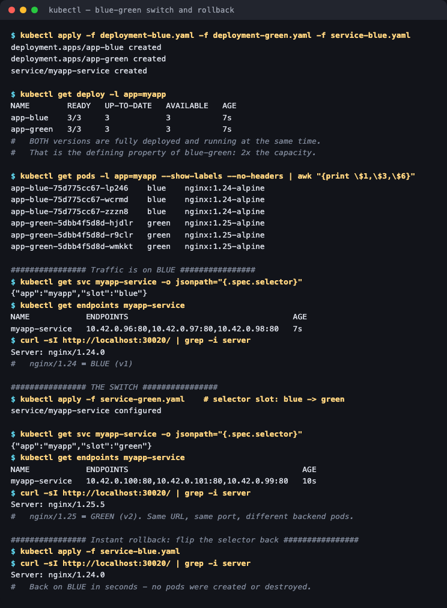

# 02 — Blue-Green Deployment

**Homework submission** · Lakshya Mewara · 24BCS10290

Two complete environments run side by side. **Blue** (v1) serves live traffic while **green** (v2) sits fully deployed and idle. Releasing means flipping a Service selector — one label change, all traffic moves at once.

```
                  myapp-service (NodePort 30020)
                     selector: slot: blue
                              │
        ┌─────────────────────┴─────────────────────┐
        ▼  receiving traffic                        ▼  idle, but running
   app-blue  (3 pods, nginx:1.24)            app-green (3 pods, nginx:1.25)
   slot: blue                                slot: green
```

---

## Both versions running at once

```bash
kubectl apply -f deployment-blue.yaml -f deployment-green.yaml -f service-blue.yaml
```



```
NAME        READY   UP-TO-DATE   AVAILABLE
app-blue    3/3     3            3
app-green   3/3     3            3

app-blue-75d775cc67-lp246    blue    nginx:1.24-alpine
app-green-5dbb4f5d8d-hjdlr   green   nginx:1.25-alpine
```

Six pods for a three-pod application — **blue-green costs double the capacity** for the whole window both are up. That's the price of the guarantee.

## The switch

```
# BEFORE
$ kubectl get svc myapp-service -o jsonpath='{.spec.selector}'
{"app":"myapp","slot":"blue"}

$ kubectl get endpoints myapp-service
10.42.0.96:80,10.42.0.97:80,10.42.0.98:80

$ curl -sI http://localhost:30020/ | grep -i server
Server: nginx/1.24.0                          <- BLUE

# THE SWITCH — one selector label
$ kubectl apply -f service-green.yaml

# AFTER
$ kubectl get svc myapp-service -o jsonpath='{.spec.selector}'
{"app":"myapp","slot":"green"}

$ kubectl get endpoints myapp-service
10.42.0.100:80,10.42.0.101:80,10.42.0.99:80   <- completely different pods

$ curl -sI http://localhost:30020/ | grep -i server
Server: nginx/1.25.5                          <- GREEN
```

Same URL, same port, **entirely different backend pods**. The endpoint list is the mechanism: changing the selector makes the endpoints controller rewrite which pod IPs sit behind the Service, and kube-proxy follows.

## Rollback is the same operation, backwards

```
$ kubectl apply -f service-blue.yaml
$ curl -sI http://localhost:30020/ | grep -i server
Server: nginx/1.24.0
```

Back on v1 in seconds — **no pods created or destroyed**, because blue never stopped running.

---

## What I understood

- **The Service selector is the release switch.** Deployments don't have to change at all; releasing is a metadata edit. That's why the cutover is atomic — there's no window where some requests go to v1 and others to v2, unlike a rolling update.
- **Rollback is genuinely instant, and that's the whole point.** A rolling update rollback still has to scale pods back up; here the old version is already running at full capacity. For a risky release, seconds-to-recover is worth paying double for.
- **Double capacity is the real cost**, and it's not just money: quotas, node capacity and any shared resource (database connections, licences) must tolerate 2x.
- **It doesn't solve state.** Both versions talk to the same database. A release with a breaking schema change can't be rolled back by flipping a selector, because green may already have written data blue can't read. Blue-green protects the *application* tier only.
- **Compared to the alternatives:** rolling update is cheap but mixes versions during the roll; blue-green is expensive but atomic; [canary](../03-canary/) is a deliberate partial mix so you can measure before committing.

## Files

| File | Purpose |
|---|---|
| [`deployment-blue.yaml`](./deployment-blue.yaml) | v1, 3 replicas, `slot: blue` |
| [`deployment-green.yaml`](./deployment-green.yaml) | v2, 3 replicas, `slot: green` |
| [`service-blue.yaml`](./service-blue.yaml) | Service selecting `slot: blue` |
| [`service-green.yaml`](./service-green.yaml) | Same Service, selector flipped to `slot: green` |

## Cleanup

```bash
kubectl delete -f deployment-blue.yaml -f deployment-green.yaml -f service-blue.yaml
```
