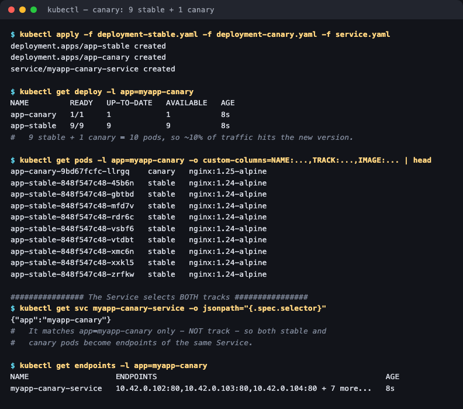
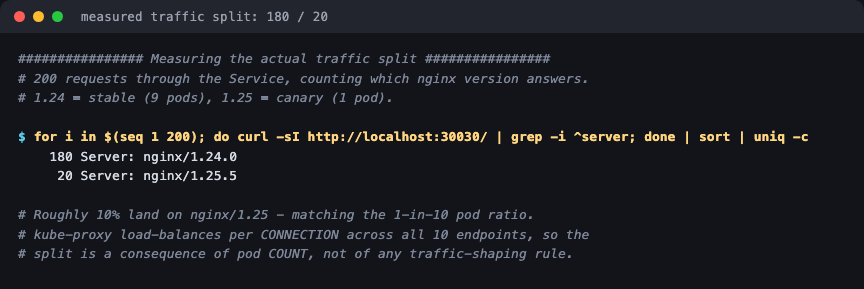

# 03 — Canary Deployment

**Homework submission** · Lakshya Mewara · 24BCS10290

Release the new version to a **small slice of real traffic** first, watch it, then widen or abort. Unlike blue-green's atomic switch, a canary deliberately runs both versions at once and lets a measured fraction of users hit the new one.

```
              myapp-canary-service   (selector: app=myapp-canary ONLY)
                          │
        ┌─────────────────┴──────────────────┐
        ▼  9 endpoints                       ▼  1 endpoint
   app-stable (v1, nginx:1.24)         app-canary (v2, nginx:1.25)
   track: stable                       track: canary
             ~90% of traffic                  ~10% of traffic
```

---

## Deploy both tracks

```bash
kubectl apply -f deployment-stable.yaml -f deployment-canary.yaml -f service.yaml
```



```
NAME         READY   UP-TO-DATE   AVAILABLE
app-canary   1/1     1            1
app-stable   9/9     9            9

app-canary-9bd67fcfc-llrgq    canary   nginx:1.25-alpine
app-stable-848f547c48-45b6n   stable   nginx:1.24-alpine
... (8 more stable pods)
```

**The trick is in the Service selector:**

```
$ kubectl get svc myapp-canary-service -o jsonpath='{.spec.selector}'
{"app":"myapp-canary"}
```

It matches `app` **but not `track`**. Both Deployments set `app: myapp-canary`, so all ten pods become endpoints of the same Service, and the traffic ratio is decided purely by **how many pods each track has**.

## Measuring the real split

200 requests through the Service, counting which nginx version answers:



```
$ for i in $(seq 1 200); do curl -sI http://localhost:30030/ | grep -i ^server; done | sort | uniq -c

    180 Server: nginx/1.24.0      <- stable   (90.0%)
     20 Server: nginx/1.25.5      <- canary   (10.0%)
```

**Exactly 90/10**, matching the 9:1 pod ratio. Nothing configured that percentage — it falls out of kube-proxy load-balancing evenly across ten endpoints.

Widening the canary is therefore just scaling:

```bash
kubectl scale deploy/app-canary --replicas=3   # ~25%
kubectl scale deploy/app-stable --replicas=7
```

and aborting is `kubectl scale deploy/app-canary --replicas=0` — instant, with stable untouched.

---

## What I understood

- **The percentage is pod count, not policy.** With plain Services you can only express ratios your replica counts allow: 1-in-10 is easy, 1% needs 100 pods. Real percentage-based routing needs an ingress controller with traffic-splitting, or a service mesh (Istio, Linkerd) — this is the main limitation of the plain-Kubernetes approach.
- **Omitting a label from the selector is the whole mechanism.** Both Deployments share `app`, differ on `track`, and the Service ignores `track`. That one deliberate omission is what merges the two into one endpoint pool.
- **Canary answers a different question than blue-green.** Blue-green asks "does v2 work?" and switches everything at once. Canary asks "does v2 work *for real users, under real traffic*?" and limits the blast radius while you measure. Blue-green risks 100% of users for a short time; canary risks 10% for a long one.
- **It's only useful with observability.** Exposing 10% of traffic is pointless unless error rates and latency are being compared per version. The deployment mechanics here are the easy half.
- **Sessions can break.** Requests are balanced per connection, so a user can hit v1 and v2 on successive requests. Anything with sticky state or incompatible APIs between versions needs session affinity or a mesh that pins users to a track.

## Files

| File | Purpose |
|---|---|
| [`deployment-stable.yaml`](./deployment-stable.yaml) | v1, **9** replicas, `track: stable` |
| [`deployment-canary.yaml`](./deployment-canary.yaml) | v2, **1** replica, `track: canary` |
| [`service.yaml`](./service.yaml) | Selects `app` only, so it fronts both tracks |

## Cleanup

```bash
kubectl delete -f deployment-stable.yaml -f deployment-canary.yaml -f service.yaml
```
