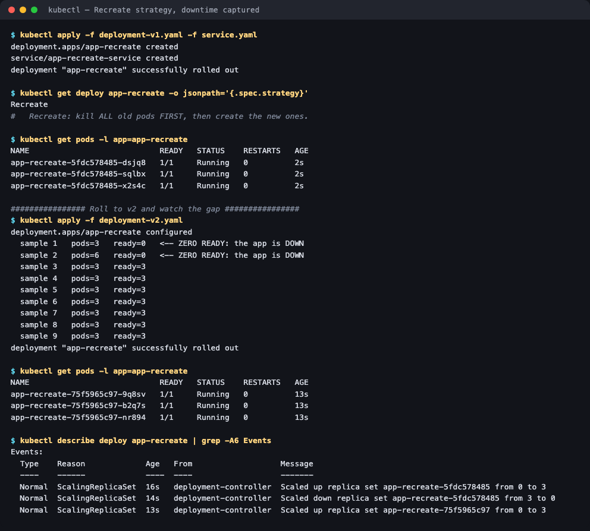

# 04 — Recreate Strategy

**Homework submission** · Lakshya Mewara · 24BCS10290

The simplest strategy, and the only one that **accepts downtime by design**: terminate every old pod first, then start the new ones.

```yaml
strategy:
  type: Recreate
```

There are no tuning knobs — no `maxSurge`, no `maxUnavailable`, because the answer to both is "all of them".

---

## The downtime, captured

```bash
kubectl apply -f deployment-v1.yaml -f service.yaml   # nginx:1.24-alpine
kubectl apply -f deployment-v2.yaml                   # nginx:1.25-alpine
```



```
  sample 1   pods=3   ready=0   <-- ZERO READY: the app is DOWN
  sample 2   pods=6   ready=0   <-- ZERO READY: the app is DOWN
  sample 3   pods=3   ready=3
```

**Two consecutive samples with zero ready pods.** During that window the Service has no endpoints and every request fails. With a rolling update, `readyReplicas` never drops below `replicas - maxUnavailable`; here it goes to **0** every single time.

The controller events show the exact ordering:

```
ScalingReplicaSet   Scaled up   replica set app-recreate-5fdc578485 from 0 to 3   <- v1 created
ScalingReplicaSet   Scaled down replica set app-recreate-5fdc578485 from 3 to 0   <- ALL v1 killed
ScalingReplicaSet   Scaled up   replica set app-recreate-75f5965c97 from 0 to 3   <- THEN v2 created
```

Scale-down completes **before** scale-up begins. That's the whole strategy in three lines.

> `pods=6` in sample 2 is the old pods still terminating while the new ones are being created — the pods exist, but none is *ready*, which is what the Service cares about.

---

## When you'd actually choose this

Downtime sounds like a strict downgrade, but Recreate is the right answer when running two versions simultaneously is **unsafe or impossible**:

- **Breaking schema migrations** — v1 and v2 cannot both talk to the database during the change.
- **`ReadWriteOnce` volumes** — only one pod can mount the volume, so a new pod physically cannot start until the old one releases it. A rolling update would deadlock: the new pod waits for the volume, the old pod waits for the new one to be ready.
- **Licensing or singleton constraints** — software that refuses to run two instances.
- **Dev and staging**, where a few seconds of downtime is cheaper than the extra capacity a rolling update needs.

---

## The four strategies compared

| Strategy | Downtime | Extra capacity | Versions live at once | Rollback speed |
|---|---|---|---|---|
| **Recreate** | **Yes** | None | Never | Slow (full restart) |
| [Rolling update](../01-rolling-update/) | No | `maxSurge` | Briefly, mixed | Fast (scale old RS up) |
| [Blue-green](../02-blue-green/) | No | **2x** | Both, but only one serves | **Instant** (flip selector) |
| [Canary](../03-canary/) | No | Small | Deliberately, by ratio | Fast (scale canary to 0) |

## What I understood

- **`readyReplicas` hitting 0 is the measurable definition of downtime** — not pod count. Sample 2 had *six* pods and still served nothing, because readiness, not existence, decides Service endpoints.
- **Recreate exists for state, not for simplicity.** The interesting cases are `ReadWriteOnce` volumes and incompatible schema versions, where a rolling update doesn't just risk errors — it can deadlock outright.
- **The strategy choice is really a question about compatibility**, not about downtime tolerance: *can v1 and v2 coexist?* If no, Recreate. If yes, everything else is available.
- **Two ReplicaSets still exist**, so `kubectl rollout undo` works exactly as with a rolling update — it just incurs the same downtime again on the way back.

## Files

| File | Purpose |
|---|---|
| [`deployment-v1.yaml`](./deployment-v1.yaml) | 3 replicas, `nginx:1.24-alpine`, `strategy: Recreate` |
| [`deployment-v2.yaml`](./deployment-v2.yaml) | Same, `nginx:1.25-alpine` |
| [`service.yaml`](./service.yaml) | Service fronting the Deployment |

## Cleanup

```bash
kubectl delete -f deployment-v1.yaml -f service.yaml
```
