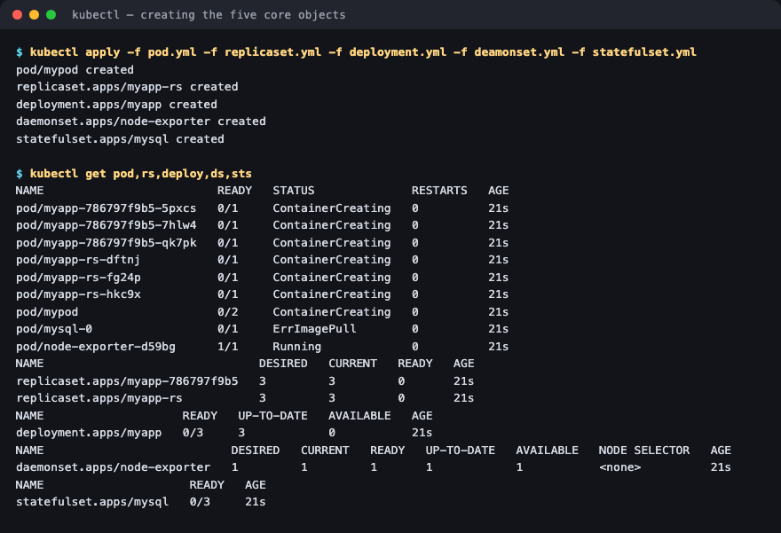
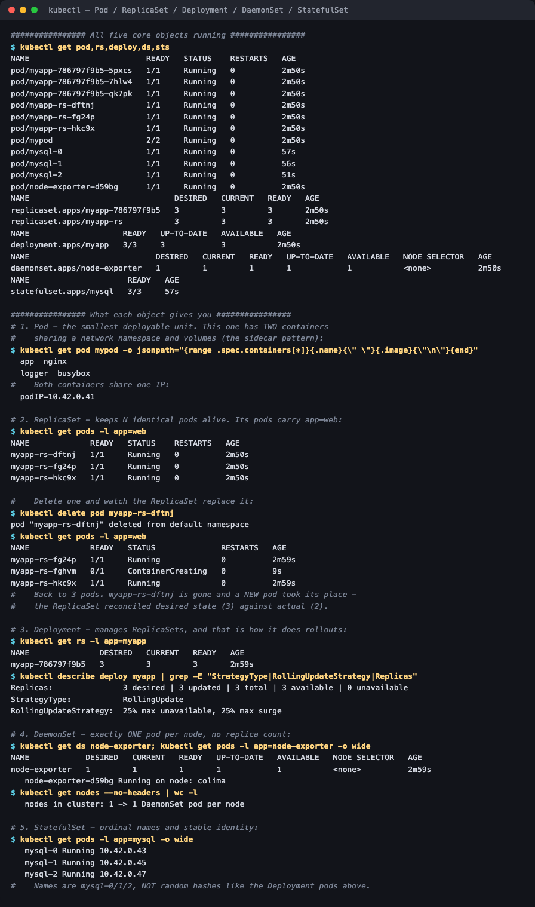
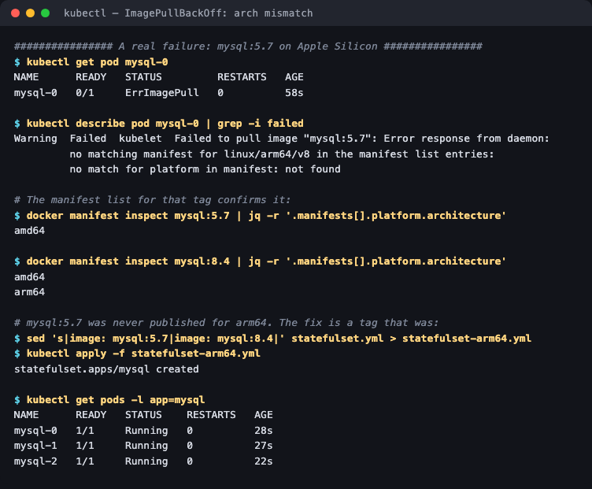

# Kubernetes Core Objects

**Homework submission** · Lakshya Mewara · 24BCS10290

> **Cluster:** k3s `v1.35.0+k3s1`, single node (`colima`), on a Colima VM on macOS/Apple Silicon.

All five core workload objects deployed side by side, so the differences between them can be observed rather than described.

---

## All five, running together

```bash
kubectl apply -f pod.yml -f replicaset.yml -f deployment.yml -f deamonset.yml -f statefulset.yml
kubectl get pod,rs,deploy,ds,sts
```



```
pod/mypod                    2/2   Running   <- a bare Pod (2 containers)
pod/myapp-rs-*               1/1   Running   <- 3 pods from the ReplicaSet
pod/myapp-786797f9b5-*       1/1   Running   <- 3 pods from the Deployment
pod/mysql-0,1,2              1/1   Running   <- 3 pods from the StatefulSet
pod/node-exporter-d59bg      1/1   Running   <- 1 pod from the DaemonSet

replicaset.apps/myapp-rs           3/3
replicaset.apps/myapp-786797f9b5   3/3   <- created BY the Deployment
deployment.apps/myapp              3/3
daemonset.apps/node-exporter       1/1
statefulset.apps/mysql             3/3
```

Notice the pod **naming** already tells you which controller made each one: random suffix (ReplicaSet), hash + random suffix (Deployment), ordinal `-0/-1/-2` (StatefulSet).

---

## What each object actually gives you



### 1. Pod — the smallest deployable unit

```
$ kubectl get pod mypod -o jsonpath='{range .spec.containers[*]}{.name} {.image}{"\n"}{end}'
  app     nginx
  logger  busybox

  podIP=10.42.0.41
```

Two containers, **one IP**. That's the definition of a Pod: containers that share a network namespace and volumes, so they reach each other on `localhost`. This is the sidecar pattern — here an app plus a log shipper.

A bare Pod has **no self-healing**. Delete it and it's simply gone.

### 2. ReplicaSet — keeps N pods alive

```
$ kubectl delete pod myapp-rs-dftnj
pod "myapp-rs-dftnj" deleted

$ kubectl get pods -l app=web
myapp-rs-fg24p   1/1   Running             2m59s
myapp-rs-fghvm   0/1   ContainerCreating   9s     <- brand new pod
myapp-rs-hkc9x   1/1   Running             2m59s
```

Back to three within seconds. The ReplicaSet controller continuously compares **desired state (3)** against **actual state (2)** and acts on the difference. That reconciliation loop is the core idea behind every Kubernetes controller.

### 3. Deployment — manages ReplicaSets

```
$ kubectl get rs -l app=myapp
NAME               DESIRED   CURRENT   READY
myapp-786797f9b5   3         3         3

$ kubectl describe deploy myapp | grep -E "StrategyType|RollingUpdate"
StrategyType:           RollingUpdate
RollingUpdateStrategy:  25% max unavailable, 25% max surge
```

**A Deployment doesn't manage pods — it manages ReplicaSets, which manage pods.** That extra layer is exactly what makes rollouts and rollbacks possible: a new version means a *new* ReplicaSet, scaled up while the old one scales down. The old ReplicaSet is kept at 0 replicas so `kubectl rollout undo` can scale it straight back. Demonstrated in [`../01-rolling-update/`](../01-rolling-update/).

### 4. DaemonSet — exactly one pod per node

```
$ kubectl get ds node-exporter
NAME            DESIRED   CURRENT   READY
node-exporter   1         1         1

   nodes in cluster: 1 -> 1 DaemonSet pod per node
```

There is **no replica count** to set. The desired number *is* the node count, and it changes automatically as nodes join or leave. That's why monitoring agents, log collectors and CNI plugins are DaemonSets — you want one per machine, not N per cluster.

### 5. StatefulSet — stable, ordinal identity

```
$ kubectl get pods -l app=mysql -o wide
   mysql-0   Running   10.42.0.43
   mysql-1   Running   10.42.0.45
   mysql-2   Running   10.42.0.47
```

Names are `mysql-0/1/2`, not hashes — predictable, ordered, and stable across restarts. Pods are also created and deleted **in order**, which matters when `-0` is a primary that must exist before replicas attach. Paired with a headless Service each also gets its own DNS name; that's demonstrated in [session 11](../../../session-11-kubernetes-services/HW/05-headless/).

---

## A real failure worth keeping: `mysql:5.7` won't run here

The provided StatefulSet failed immediately on this cluster:



```
$ kubectl get pod mysql-0
mysql-0   0/1   ErrImagePull

$ kubectl describe pod mysql-0 | grep -i failed
Failed to pull image "mysql:5.7": no matching manifest for linux/arm64/v8
in the manifest list entries: no match for platform in manifest: not found
```

Not a Kubernetes problem at all — **`mysql:5.7` was never published for arm64**:

```
$ docker manifest inspect mysql:5.7 | jq -r '.manifests[].platform.architecture'
amd64

$ docker manifest inspect mysql:8.4 | jq -r '.manifests[].platform.architecture'
amd64
arm64
```

Fixed by switching tags in [`statefulset-arm64.yml`](./statefulset-arm64.yml), after which all three replicas started. Both files are kept so the original and the fix can be compared.

---

## What I understood

- **Everything is a reconciliation loop.** Nothing "creates three pods"; controllers repeatedly compare desired to actual and close the gap. That's why deleting a ReplicaSet pod is pointless, and why the same mechanism gives you self-healing, scaling and rollouts for free.
- **The layering is deliberate:** Pod ← ReplicaSet ← Deployment. Each layer adds one capability — co-located containers, then replication and self-healing, then versioned rollouts. Knowing which layer owns which behaviour makes debugging much faster.
- **You almost never write a bare Pod or a bare ReplicaSet.** A Pod has no recovery; a ReplicaSet has no rollout story. Deployments are the default for stateless work, StatefulSets when identity matters, DaemonSets when "one per node" is the requirement.
- **`ErrImagePull` is not always a typo or a registry auth problem.** Here the image name was perfect and the registry was reachable — the *architecture* didn't match. On Apple Silicon this is a routine trap, and `docker manifest inspect` answers it in one command.
- **Pod names are diagnostic.** A hash-plus-suffix name means a Deployment made it; a plain suffix means a ReplicaSet; an ordinal means a StatefulSet. You can often infer the owner before running `kubectl describe`.

## Files

| File | Object |
|---|---|
| [`pod.yml`](./pod.yml) | Multi-container Pod (app + logger sidecar) |
| [`replicaset.yml`](./replicaset.yml) | ReplicaSet, 3 replicas, selector `app=web` |
| [`deployment.yml`](./deployment.yml) | Deployment, 3 replicas, RollingUpdate |
| [`deamonset.yml`](./deamonset.yml) | DaemonSet (node-exporter pattern) |
| [`statefulset.yml`](./statefulset.yml) | StatefulSet as provided (`mysql:5.7`, amd64-only) |
| [`statefulset-arm64.yml`](./statefulset-arm64.yml) | Same, with `mysql:8.4` so it runs on arm64 |

## Cleanup

```bash
kubectl delete -f pod.yml -f replicaset.yml -f deployment.yml -f deamonset.yml -f statefulset-arm64.yml
```
