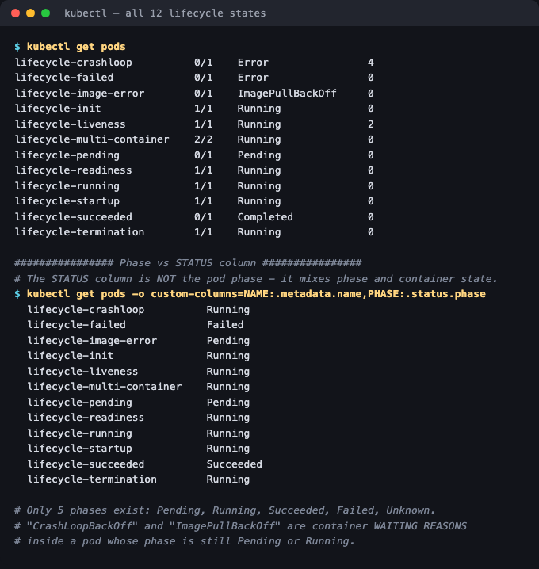
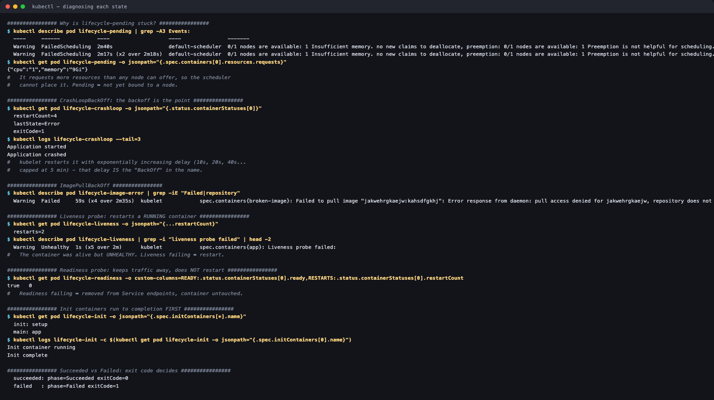

# Pod Lifecycle

**Homework submission** · Lakshya Mewara · 24BCS10290

> **Cluster:** k3s `v1.35.0+k3s1`, single node, on a Colima VM (macOS/Apple Silicon).

Twelve pods deployed at once, each engineered to sit in a different lifecycle state — including the ones that are *supposed* to fail.

---

## All twelve states, side by side

```bash
kubectl apply -f .
kubectl get pods
```



```
lifecycle-running            1/1   Running            0
lifecycle-pending            0/1   Pending            0
lifecycle-succeeded          0/1   Completed          0
lifecycle-failed             0/1   Error              0
lifecycle-crashloop          0/1   Error              4
lifecycle-image-error        0/1   ImagePullBackOff   0
lifecycle-readiness          1/1   Running            0
lifecycle-liveness           1/1   Running            2
lifecycle-startup            1/1   Running            0
lifecycle-init               1/1   Running            0
lifecycle-multi-container    2/2   Running            0
lifecycle-termination        1/1   Running            0
```

## The distinction that actually matters: STATUS ≠ phase

The `STATUS` column people read every day is **not** the pod phase. There are only **five** phases; `STATUS` blends the phase with the container's waiting reason:

```
$ kubectl get pods -o custom-columns=NAME:.metadata.name,PHASE:.status.phase

  lifecycle-crashloop      Running     <- STATUS said "Error"/CrashLoopBackOff
  lifecycle-image-error    Pending     <- STATUS said "ImagePullBackOff"
  lifecycle-failed         Failed
  lifecycle-succeeded      Succeeded
  lifecycle-pending        Pending
```

**`CrashLoopBackOff` and `ImagePullBackOff` are not phases** — they're container *waiting reasons* inside a pod whose phase is still `Running` or `Pending`. That's why a crashlooping pod can show phase `Running`: the pod is scheduled and alive, its container just keeps dying.

| Phase | Meaning |
|---|---|
| `Pending` | Accepted, but not yet running — unscheduled, or images still pulling |
| `Running` | Bound to a node, at least one container started |
| `Succeeded` | All containers exited **0** and will not restart |
| `Failed` | All containers terminated, at least one with **non-zero** exit |
| `Unknown` | Node unreachable |

---

## Diagnosing each state



### `Pending` — the scheduler can't place it

```
Warning  FailedScheduling  0/1 nodes are available: 1 Insufficient memory.

$ kubectl get pod lifecycle-pending -o jsonpath='{.spec.containers[0].resources.requests}'
{"cpu":"1","memory":"9Gi"}
```

It asks for 9 GiB on a 6 GiB node. **Pending means unscheduled** — always read the `FailedScheduling` event, which names the exact constraint (insufficient resources, taints, node selectors, unbound PVCs).

### `CrashLoopBackOff` — the container starts, then dies, repeatedly

```
restartCount=4
lastState=Error
exitCode=1

$ kubectl logs lifecycle-crashloop --tail=3
Application started
Application crashed
```

The **BackOff** part is the important half: kubelet waits longer between each restart (10s, 20s, 40s… capped at 5 min) so a broken pod can't spin the node. `kubectl logs` shows the current attempt; `kubectl logs --previous` shows the one that died.

### `ImagePullBackOff` — the image can't be fetched

```
Failed to pull image "jakwehrgkaejw:kahsdfgkhj": pull access denied for
jakwehrgkaejw, repository does not exist or may require 'docker login'
```

Here it's a nonsense name, but the same state covers a typo'd tag, a private registry without `imagePullSecrets`, or — as hit in [`../core-objects/`](../core-objects/#a-real-failure-worth-keeping-mysql57-wont-run-here) — an image that exists but not for your **architecture**.

### `Succeeded` vs `Failed` — the exit code decides

```
succeeded: phase=Succeeded  exitCode=0
failed   : phase=Failed     exitCode=1
```

Identical pods, different exit codes. This is why Jobs and CronJobs care about exit status, and why a container must exit non-zero on error rather than swallowing it.

### Liveness vs readiness — the pair people mix up

```
# liveness pod
restarts=2
Warning  Unhealthy  Liveness probe failed:

# readiness pod
READY   RESTARTS
true    0
```

| Probe | On failure | Container restarted? |
|---|---|---|
| **Liveness** | Container is killed and restarted | **Yes** |
| **Readiness** | Pod removed from Service endpoints | **No** |
| **Startup** | Holds the other probes off until the app has booted | Only after it gives up |

The liveness pod accumulated **2 restarts** while staying `Running` — proof that a liveness failure restarts a container that hasn't crashed. Readiness stayed at **0 restarts**: it only controls traffic.

Getting this backwards is a classic outage: a liveness probe pointed at a slow dependency restarts healthy pods in a loop.

### Init containers — run to completion, in order, first

```
  init: setup
  main: app

$ kubectl logs lifecycle-init -c setup
Init container running
Init complete
```

Init containers finish **before** any app container starts. Used for waiting on a database, running migrations, or fetching config — and because they're separate containers, they can carry tools you don't want in the runtime image.

### Multi-container — `2/2` in the READY column

`lifecycle-multi-container` shows `2/2`: two containers sharing a network namespace and volumes. `kubectl logs` then needs `-c <container>` to disambiguate.

---

## What I understood

- **`kubectl get pods` is a summary, not the truth.** The `STATUS` column merges two different concepts. When something looks strange, `.status.phase` plus `.status.containerStatuses[*].state` tells you what's actually happening.
- **Each failure state points at a different layer.** `Pending` → scheduler (resources/constraints). `ImagePullBackOff` → registry/image. `CrashLoopBackOff` → your application. Reading the state correctly narrows the search before you look at a single log line.
- **The `RESTARTS` column is a signal, not noise.** Restarts on a `Running` pod usually mean a liveness probe is firing — an application that looks up but is failing its own health check.
- **Probes have completely different consequences** and are the easiest thing to misconfigure: liveness kills, readiness only steers traffic. Startup probes exist specifically so slow-booting apps aren't killed by a liveness probe before they're up.
- **Exit codes matter.** `Succeeded` and `Failed` differ only by `0` vs non-zero, and everything downstream — Jobs, restart policies, alerting — keys off that.

## Files

| File | State demonstrated |
|---|---|
| [`01-running.yaml`](./01-running.yaml) | `Running` |
| [`02-pending.yaml`](./02-pending.yaml) | `Pending` — unschedulable (9Gi request) |
| [`03-succeeded.yaml`](./03-succeeded.yaml) | `Succeeded` — exit 0 |
| [`04-failed.yaml`](./04-failed.yaml) | `Failed` — exit 1 |
| [`05-crashloopbackoff.yaml`](./05-crashloopbackoff.yaml) | `CrashLoopBackOff` |
| [`06-imagepullbackoff.yaml`](./06-imagepullbackoff.yaml) | `ImagePullBackOff` |
| [`07-readiness.yaml`](./07-readiness.yaml) | Readiness probe |
| [`08-liveness.yaml`](./08-liveness.yaml) | Liveness probe (restarts) |
| [`09-startup.yaml`](./09-startup.yaml) | Startup probe |
| [`10-init-container.yaml`](./10-init-container.yaml) | Init container |
| [`11-multi-container.yaml`](./11-multi-container.yaml) | Multi-container pod |
| [`12-termination.yaml`](./12-termination.yaml) | Graceful termination |

## Cleanup

```bash
kubectl delete -f .
```
