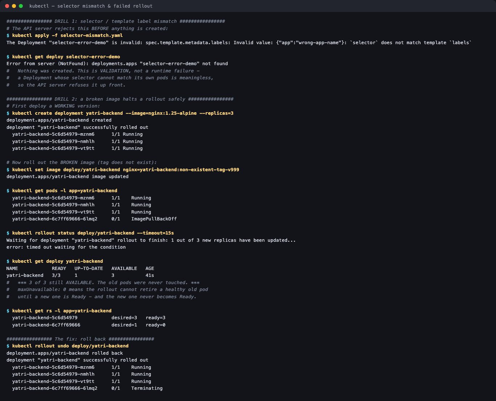

# Troubleshooting Drills

**Homework submission** · Lakshya Mewara · 24BCS10290

Two deliberately broken manifests, applied to a real cluster to see exactly how and *when* Kubernetes rejects them.



---

## Drill 1 — Selector / template label mismatch

[`selector-mismatch.yaml`](./selector-mismatch.yaml) has a Deployment whose `selector` and pod template labels disagree:

```yaml
selector:
  matchLabels:
    app: correct-app-name
template:
  metadata:
    labels:
      app: wrong-app-name        # <- does not match
```

```
$ kubectl apply -f selector-mismatch.yaml
The Deployment "selector-error-demo" is invalid:
spec.template.metadata.labels: Invalid value: {"app":"wrong-app-name"}:
`selector` does not match template `labels`

$ kubectl get deploy selector-error-demo
Error from server (NotFound): deployments.apps "selector-error-demo" not found
```

**Nothing was created.** This is *admission-time validation*, not a runtime failure — a Deployment whose selector can never match its own pods would spin forever creating pods it doesn't recognise, so the API server refuses it up front.

Worth contrasting with the **Service** version of this bug: a Service whose selector matches nothing is perfectly legal and is created happily — it just has zero endpoints and silently blackholes traffic. Same mistake, completely different failure mode:

| Object | Selector matches nothing | Result |
|---|---|---|
| **Deployment** | Rejected at `apply` time | Loud, immediate, impossible to miss |
| **Service** | Accepted | Silent — empty `ENDPOINTS`, connections fail |

That's why `kubectl get endpoints` is the first check for a Service that "doesn't work".

## Drill 2 — A broken image halts a rollout without taking the app down

Start from a healthy deployment, then roll out an image tag that doesn't exist:

```
$ kubectl create deployment yatri-backend --image=nginx:1.25-alpine --replicas=3
  yatri-backend-5c6d54979-mznm6   1/1 Running
  yatri-backend-5c6d54979-nmhlh   1/1 Running
  yatri-backend-5c6d54979-vt9tt   1/1 Running

$ kubectl set image deploy/yatri-backend nginx=yatri-backend:non-existent-tag-v999
deployment.apps/yatri-backend image updated
```

The API server **accepts** this — an image tag can't be validated without contacting a registry, so the failure can only surface at pull time:

```
$ kubectl get pods -l app=yatri-backend
  yatri-backend-5c6d54979-mznm6    1/1   Running             <- old, untouched
  yatri-backend-5c6d54979-nmhlh    1/1   Running             <- old, untouched
  yatri-backend-5c6d54979-vt9tt    1/1   Running             <- old, untouched
  yatri-backend-6c7ff69666-6lmq2   0/1   ImagePullBackOff    <- new, stuck

$ kubectl rollout status deploy/yatri-backend --timeout=15s
Waiting for deployment "yatri-backend" rollout to finish: 1 out of 3 new replicas have been updated...
error: timed out waiting for the condition

$ kubectl get deploy yatri-backend
NAME            READY   UP-TO-DATE   AVAILABLE   AGE
yatri-backend   3/3     1            3           41s
```

**`3/3` still AVAILABLE.** The three original pods have the same names before and after — they were never touched.

```
$ kubectl get rs -l app=yatri-backend
  yatri-backend-5c6d54979    desired=3   ready=3     <- old RS, still serving everything
  yatri-backend-6c7ff69666   desired=1   ready=0     <- new RS, stuck at one broken pod
```

**Why the app survived:** this Deployment uses the default `maxUnavailable: 25%`, and 25% of 3 replicas **rounds down to 0**. So the rollout is not allowed to retire a single healthy old pod until a new one becomes Ready — and the new one never does. The rollout stalls permanently rather than degrading the service.

```
$ kubectl rollout undo deploy/yatri-backend
deployment.apps/yatri-backend rolled back
  yatri-backend-5c6d54979-mznm6    1/1  Running
  yatri-backend-6c7ff69666-6lmq2   0/1  Terminating      <- the broken pod is cleaned up
```

---

## What I understood

- **Kubernetes validates what it can, when it can.** A label mismatch is structurally checkable, so it's rejected at `apply`. An image tag isn't, so it fails later at pull time. Knowing *which* kind of error you have tells you where to look.
- **A stalled rollout is a feature.** The instinct on seeing `ImagePullBackOff` is that something is badly broken — but production was never at risk. `maxUnavailable` turns "the new version is broken" into "the rollout stops", not "the app goes down".
- **Percentage rollout settings round down for `maxUnavailable`** (and up for `maxSurge`). At 3 replicas the default 25% silently means *zero* unavailable — a stricter, safer guarantee than the number suggests. At 10 replicas the same setting would have allowed 2 pods down.
- **`READY` vs `UP-TO-DATE` are the diagnostic pair.** `3/3 READY` with `1 UP-TO-DATE` says plainly: fully available, rollout incomplete. That one line distinguishes a stuck rollout from an outage.
- **The same bug can be loud or silent depending on the object.** Deployment selector mismatch is rejected instantly; Service selector mismatch is accepted and fails silently. The silent one is far more dangerous, which is why endpoints are always worth checking.

## Files

| File | Scenario |
|---|---|
| [`selector-mismatch.yaml`](./selector-mismatch.yaml) | Deployment selector ≠ template labels → rejected at admission |
| [`broken-image.yaml`](./broken-image.yaml) | Non-existent image tag → `ImagePullBackOff`, rollout stalls safely |

## Cleanup

```bash
kubectl delete deploy yatri-backend --ignore-not-found
```
