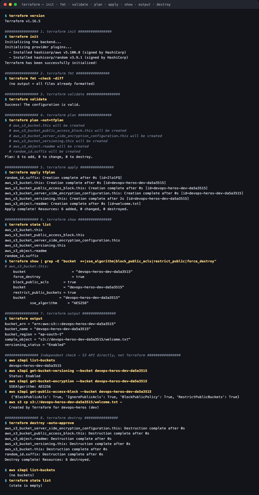
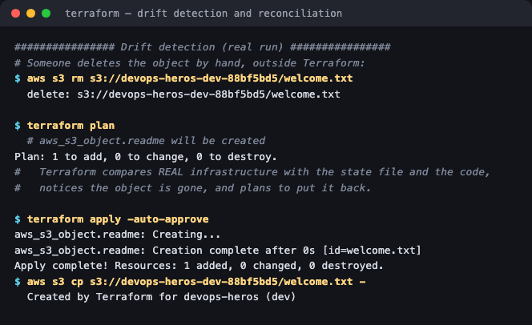
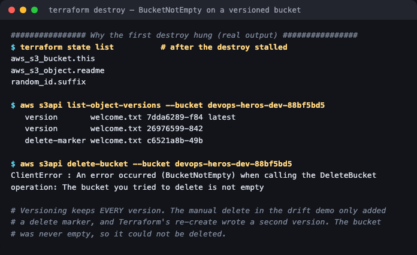

# Terraform S3 Demo

**Session 18 homework — Task 1** · Lakshya Mewara · 24BCS10290

Creates an **S3 bucket** with Terraform, run through the complete workflow the assignment lists:
`init → fmt → validate → plan → apply → show → output → destroy`.

```
terraform-s3-demo/
├── main.tf            # bucket, versioning, encryption, public-access block, sample object
├── variables.tf       # inputs, with validation on `environment`
├── outputs.tf         # bucket name, ARN, region, versioning status, object URI
├── provider.tf        # AWS + random providers
├── terraform.tfvars   # values for this deployment
└── README.md
```

> **Where it runs.** The AWS provider points at **Moto**, an open-source AWS emulator running
> locally in Docker, exposing the real S3 API on `localhost:4566`. Every Terraform command runs
> for real against a real AWS-compatible API — only the endpoint differs. (LocalStack was the first
> choice but now requires an account even for its free tier.) Setting `use_local_emulator = false`
> targets real AWS, with credentials supplied through the environment or SSO — never in code.

---

## What it creates

| Resource | Purpose |
|---|---|
| `random_id.suffix` | S3 names are **globally unique**, so a random suffix avoids collisions |
| `aws_s3_bucket.this` | The bucket: `devops-heros-dev-<suffix>` |
| `aws_s3_bucket_versioning.this` | Keep every version of every object |
| `aws_s3_bucket_server_side_encryption_configuration.this` | AES-256 encryption at rest |
| `aws_s3_bucket_public_access_block.this` | Block all four forms of public access |
| `aws_s3_object.readme` | A sample object, proving data actually lands |

Modern AWS provider versions split bucket settings into **separate resources** (versioning, encryption, public-access block) rather than nesting them inside the bucket — each can be managed and changed independently.

---

## The full workflow



| # | Command | Result |
|---|---|---|
| 1 | `terraform init` | Downloaded `hashicorp/aws v5.100.0` and `hashicorp/random v3.9.1` |
| 2 | `terraform fmt -check` | No changes — every file already in canonical format |
| 3 | `terraform validate` | `Success! The configuration is valid.` |
| 4 | `terraform plan -out=tfplan` | `Plan: 6 to add, 0 to change, 0 to destroy.` |
| 5 | `terraform apply tfplan` | `Apply complete! Resources: 6 added` |
| 6 | `terraform show` / `state list` | Bucket, `force_destroy = true`, `sse_algorithm = AES256`, public access blocked |
| 7 | `terraform output` | Bucket name, ARN, region, `versioning_status = "Enabled"`, object URI |
| 8 | `terraform destroy` | `Destroy complete! Resources: 6 destroyed.` |

```
$ terraform output
bucket_arn        = "arn:aws:s3:::devops-heros-dev-da5a3515"
bucket_name       = "devops-heros-dev-da5a3515"
bucket_region     = "ap-south-1"
sample_object     = "s3://devops-heros-dev-da5a3515/welcome.txt"
versioning_status = "Enabled"
```

**Plan was saved to a file and applied from it** (`plan -out=tfplan` → `apply tfplan`). That guarantees the apply does exactly what was reviewed, even if the code or the infrastructure changed in between.

### Verified independently, not just through Terraform

Terraform reporting success isn't proof by itself, so the bucket was checked straight through the S3 API:

```
$ aws s3api list-buckets
  devops-heros-dev-da5a3515
$ aws s3api get-bucket-versioning     ->  Status: Enabled
$ aws s3api get-bucket-encryption     ->  SSEAlgorithm: AES256
$ aws s3api get-public-access-block   ->  {'BlockPublicAcls': True, 'IgnorePublicAcls': True,
                                           'BlockPublicPolicy': True, 'RestrictPublicBuckets': True}
$ aws s3 cp s3://devops-heros-dev-da5a3515/welcome.txt -
  Created by Terraform for devops-heros (dev)
```

And after `destroy`: `list-buckets` → *(no buckets)*, `terraform state list` → *(empty)*.

---

## Drift detection



The object was deleted **by hand**, outside Terraform. The next plan noticed and offered to restore it:

```
$ aws s3 rm s3://devops-heros-dev-88bf5bd5/welcome.txt
$ terraform plan
  # aws_s3_object.readme will be created
Plan: 1 to add, 0 to change, 0 to destroy.
$ terraform apply -auto-approve
Apply complete! Resources: 1 added, 0 changed, 0 destroyed.
```

Terraform compares **three** things — the code, the state file, and the real infrastructure — so manual changes don't silently persist. The code stays the source of truth.

---

## Two real problems found along the way

### 1. `terraform destroy` hung: `BucketNotEmpty`



After the drift demo, destroy stalled. Querying S3 directly showed why:

```
$ aws s3api list-object-versions --bucket devops-heros-dev-88bf5bd5
   version       welcome.txt 7dda6289  latest
   version       welcome.txt 26976599
   delete-marker welcome.txt c6521a8b

$ aws s3api delete-bucket --bucket devops-heros-dev-88bf5bd5
An error occurred (BucketNotEmpty): The bucket you tried to delete is not empty
```

With versioning on, **deleting an object only adds a delete marker** — the data stays. One manual delete plus Terraform's re-create left three entries, so the bucket was never empty. The fix:

```hcl
force_destroy = var.environment != "prod"
```

`force_destroy` purges every version before deleting the bucket. It's **deliberately off for `prod`**, where an automatic data wipe must never be possible — a dev convenience shouldn't become a production hazard.

### 2. A missing `depends_on`

```hcl
resource "aws_s3_object" "readme" {
  ...
  depends_on = [aws_s3_bucket_versioning.this]
}
```

Without it, nothing ordered the object against the versioning setting: the object could be written before versioning was on, and on destroy, versioning could be **suspended before the object was removed**, stranding versions. HashiCorp's provider docs recommend exactly this dependency. With it, the clean run's destroy order is correct — `aws_s3_object.readme` is destroyed *before* `aws_s3_bucket_versioning.this` — and the whole teardown completes in 0 seconds.

> **Being precise about the cause:** the stalled destroy *also* involved an emulator quirk — Moto
> mishandles per-version deletes on a bucket whose versioning has just been suspended, and returned
> HTTP 500 on a direct `DeleteObjects` call. On real S3, `force_destroy` alone resolves
> `BucketNotEmpty`. The `depends_on` fix is a genuine best practice either way, and it's what made
> the run fully clean.

---

## What I understood

- **Infrastructure as Code means the code is the source of truth.** Drift detection proved it: a manual change was noticed and reverted on the next apply.
- **State is the bridge between code and reality.** Terraform needs `terraform.tfstate` to know what it manages. It's excluded from git here because it can contain sensitive values; a team would keep it in a remote backend (S3 with DynamoDB locking — see [S3](../aws-services/03-s3/) and [DynamoDB](../aws-services/05-dynamodb-rds/)).
- **`plan` is the safety net.** Saving a plan and applying exactly that plan is how infrastructure changes get reviewed like code.
- **Dependencies aren't always inferable.** Terraform works out most ordering from references, but the object never referenced the versioning resource, so the order had to be stated explicitly.
- **Destroy is a feature that needs design too.** Versioned buckets, `force_destroy`, and environment-specific safety all matter when tearing infrastructure down — not just when building it.
