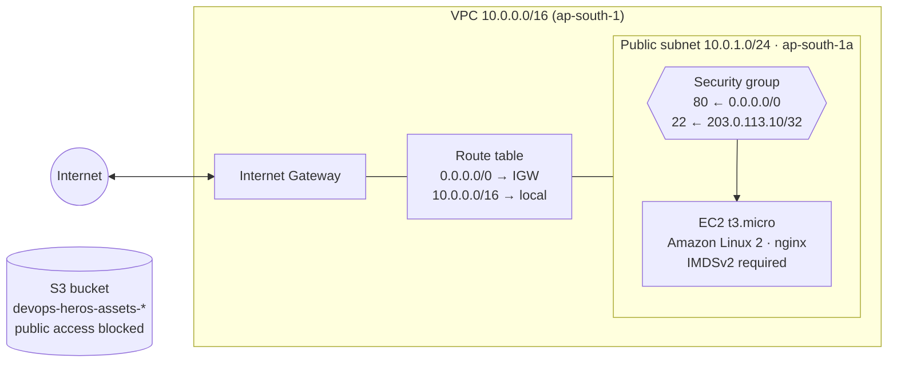
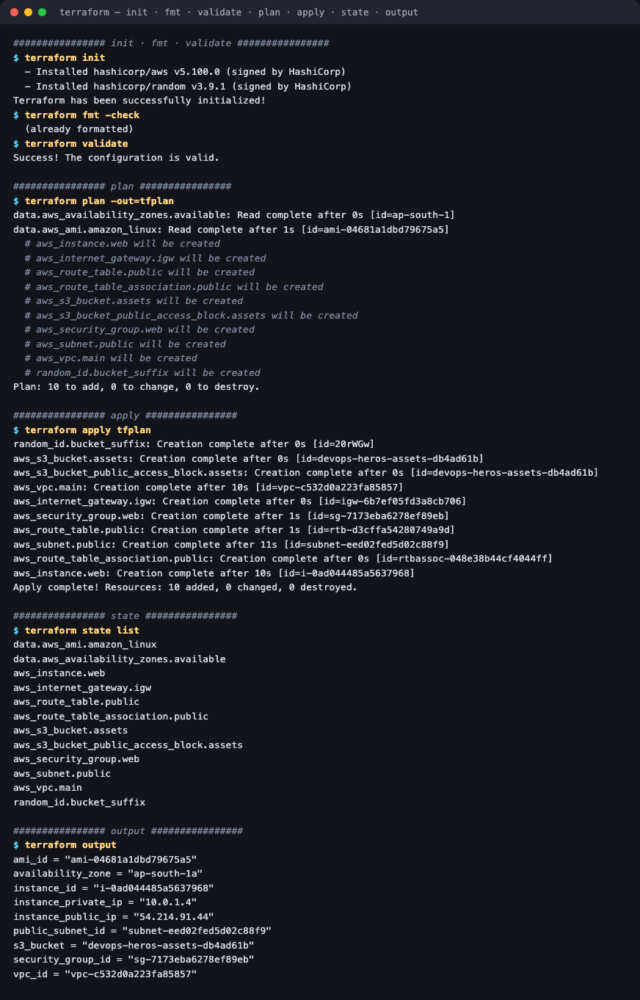
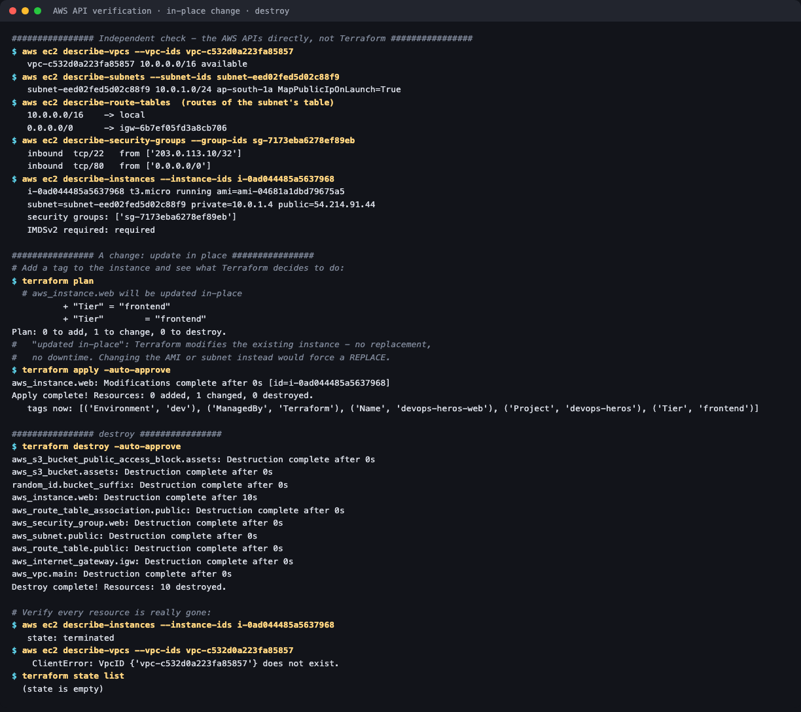
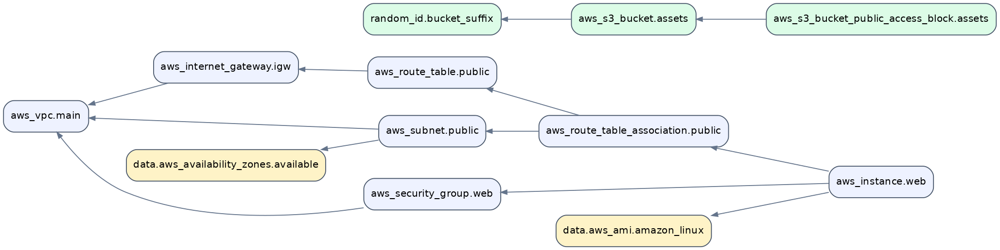

# Session 19 — Cloud & Terraform in Action

**Homework submission** · Lakshya Mewara · 24BCS10290

An end-to-end AWS infrastructure project built with Terraform — **VPC, subnet, internet gateway, route table, security group, EC2 instance and S3 bucket** — taken through `plan`, `apply`, an in-place change and `destroy`, with every resource verified independently through the AWS APIs.

> **Terraform:** `v1.16.5` · **AWS provider:** `v5.100.0` · **Target:** Moto, an open-source AWS
> emulator serving the real EC2, VPC and S3 APIs locally (LocalStack now requires an account even
> for its free tier). Every command ran for real. Setting `use_local_emulator = false` deploys the
> same code to real AWS, with credentials from the environment or SSO — never in code.

Project: [`cloud-infra/`](./cloud-infra/) — `provider.tf` · `variables.tf` · `main.tf` · `outputs.tf` · `terraform.tfvars`

---

## Architecture



| Component | Configuration |
|---|---|
| **VPC** | `10.0.0.0/16`, DNS support and hostnames on |
| **Internet Gateway** | Attached to the VPC |
| **Public subnet** | `10.0.1.0/24` in the first available AZ, public IPs auto-assigned |
| **Route table** | `0.0.0.0/0 → IGW` — the route that makes the subnet *public* |
| **Security group** | HTTP from anywhere; **SSH from one CIDR only**, enforced by a variable validation that rejects `0.0.0.0/0` |
| **EC2** | `t3.micro`, AMI found by a data source, nginx installed via `user_data`, **IMDSv2 enforced** |
| **S3** | Random-suffixed name, all public access blocked, `force_destroy` only outside `prod` |

---

## Concepts the assignment asks for, and where they appear

| Concept | In this project |
|---|---|
| **Providers** | `hashicorp/aws v5.100.0` and `hashicorp/random v3.9.1`, pinned with `~>` constraints |
| **Variables** | 9 inputs, two with **validation rules** — `environment` must be dev/staging/prod; `ssh_allowed_cidr` may never be `0.0.0.0/0` |
| **Data sources** | `aws_ami` (latest Amazon Linux 2 — AMI IDs differ per region) and `aws_availability_zones` |
| **Resources** | 10 managed resources |
| **Outputs** | 9 — VPC, subnet, AZ, SG, AMI, instance ID, private and public IP, bucket |
| **Dependencies** | 12 inferred from references, plus one explicit `depends_on` (below) |
| **State** | `terraform state list` shows every tracked object; state files are git-ignored |
| **plan / apply / destroy** | All run and verified |

---

## 1. init → validate → plan → apply → output



```
data.aws_ami.amazon_linux: Read complete after 1s [id=ami-04681a1dbd79675a5]
Plan: 10 to add, 0 to change, 0 to destroy.

aws_vpc.main:                       Creation complete [id=vpc-c532d0a223fa85857]
aws_internet_gateway.igw:           Creation complete [id=igw-6b7ef05fd3a8cb706]
aws_security_group.web:             Creation complete [id=sg-7173eba6278ef89eb]
aws_route_table.public:             Creation complete [id=rtb-d3cffa54280749a9d]
aws_subnet.public:                  Creation complete [id=subnet-eed02fed5d02c88f9]
aws_route_table_association.public: Creation complete [id=rtbassoc-048e38b44cf4044ff]
aws_instance.web:                   Creation complete [id=i-0ad044485a5637968]   <- created LAST
Apply complete! Resources: 10 added, 0 changed, 0 destroyed.
```

```
$ terraform output
ami_id              = "ami-04681a1dbd79675a5"
availability_zone   = "ap-south-1a"
instance_id         = "i-0ad044485a5637968"
instance_private_ip = "10.0.1.4"
instance_public_ip  = "54.214.91.44"
public_subnet_id    = "subnet-eed02fed5d02c88f9"
s3_bucket           = "devops-heros-assets-db4ad61b"
security_group_id   = "sg-7173eba6278ef89eb"
vpc_id              = "vpc-c532d0a223fa85857"
```

The private IP is **`10.0.1.4`, not `.1`** — AWS reserves the first four addresses of every subnet (network, router, DNS, future use), so `.4` is the first one an instance can get.

> The public IP is assigned by the emulator, not routable on the real internet. On real AWS it would
> be, and `curl http://<instance_public_ip>` would return the nginx page written by `user_data`.

## 2. Verified through the AWS APIs, not just Terraform



```
$ aws ec2 describe-vpcs           ->  vpc-c532d0a223fa85857  10.0.0.0/16  available
$ aws ec2 describe-subnets        ->  subnet-eed02fed5d02c88f9  10.0.1.0/24  ap-south-1a  MapPublicIpOnLaunch=True
$ aws ec2 describe-route-tables   ->  10.0.0.0/16 -> local
                                      0.0.0.0/0   -> igw-6b7ef05fd3a8cb706
$ aws ec2 describe-security-groups->  inbound tcp/22 from ['203.0.113.10/32']
                                      inbound tcp/80 from ['0.0.0.0/0']
$ aws ec2 describe-instances      ->  i-0ad044485a5637968  t3.micro  running  ami-04681a1dbd79675a5
                                      private=10.0.1.4  public=54.214.91.44
                                      IMDSv2 required: required
```

Every setting in the code exists in the cloud exactly as written.

## 3. Dependencies



Generated from the real configuration with `terraform graph` and Graphviz (the [full graph](./cloud-infra/screenshots/03-terraform-dependency-graph.png), including every variable and output, is also included). Terraform infers almost all of these from references — the subnet references `aws_vpc.main.id`, so it must come after the VPC.

**The one dependency it couldn't infer:**

```hcl
resource "aws_instance" "web" {
  ...
  depends_on = [aws_internet_gateway.igw, aws_route_table_association.public]
}
```

Nothing in the instance references the gateway or the route association, so Terraform has no way to know the instance needs them. Without the hint, the instance could boot before its subnet has a route out, and `user_data`'s `yum install nginx` would fail on first boot — a problem that shows up as a "working" instance with no web server. The apply log confirms the effect: **the instance was created last**.

A detail the graph reveals: although `depends_on` lists *both* the gateway and the association, the graph only draws the edge to the association. Terraform applies **transitive reduction** — the gateway is already reachable through association → route table → gateway, so the direct edge is redundant.

## 4. An in-place change

Adding a `Tier = "frontend"` tag to the instance:

```
$ terraform plan
  # aws_instance.web will be updated in-place
          + "Tier" = "frontend"
Plan: 0 to add, 1 to change, 0 to destroy.

$ terraform apply -auto-approve
aws_instance.web: Modifications complete after 0s [id=i-0ad044485a5637968]
   tags now: [... ('Tier', 'frontend')]
```

**Same instance ID before and after — modified, not replaced.** Changing the AMI or subnet would instead show `must be replaced`, destroying and recreating the instance. Reading `plan` for that one phrase is the most important review habit in Terraform.

## 5. Destroy

```
aws_instance.web:                   Destruction complete after 10s   <- first
aws_route_table_association.public: Destruction complete
aws_security_group.web:             Destruction complete
aws_subnet.public:                  Destruction complete
aws_route_table.public:             Destruction complete
aws_internet_gateway.igw:           Destruction complete
aws_vpc.main:                       Destruction complete             <- last
Destroy complete! Resources: 10 destroyed.

$ aws ec2 describe-instances  ->  state: terminated
$ aws ec2 describe-vpcs       ->  VpcID {'vpc-c532d0a223fa85857'} does not exist.
$ terraform state list        ->  (state is empty)
```

Destroy runs the dependency graph **in reverse**: the instance goes first, the VPC last. A VPC can't be deleted while anything is still inside it, so the order matters — and Terraform derives it automatically from the same graph used for creation.

---

## Security decisions

- **SSH is restricted by validation, not by convention.** `ssh_allowed_cidr` rejects `0.0.0.0/0` at plan time, so opening SSH to the world can't happen by accident.
- **IMDSv2 enforced** (`http_tokens = "required"`), which blocks the SSRF-to-credentials attack against the instance metadata service.
- **No credentials in code** — the provider reads them from the environment for real AWS.
- **S3 public access fully blocked**, and `force_destroy` only outside `prod`.
- **State and plan files are git-ignored** — they can contain sensitive values.

## What I understood

- **The dependency graph is the core of Terraform.** It decides creation order, destroy order (reversed) and what can run in parallel. References build it automatically; `depends_on` is for the relationships references can't express.
- **Data sources make code portable.** Looking the AMI up by filter rather than hardcoding `ami-...` lets the same code run in any region.
- **`plan` tells you the blast radius before anything happens.** "Update in-place" and "must be replaced" look similar but mean the difference between a tag change and a new server.
- **Validation moves mistakes earlier.** A bad CIDR or environment name fails at `plan`, before any API call.
- **Verify outside the tool.** Terraform's own success message is a claim; the AWS API is the evidence.
