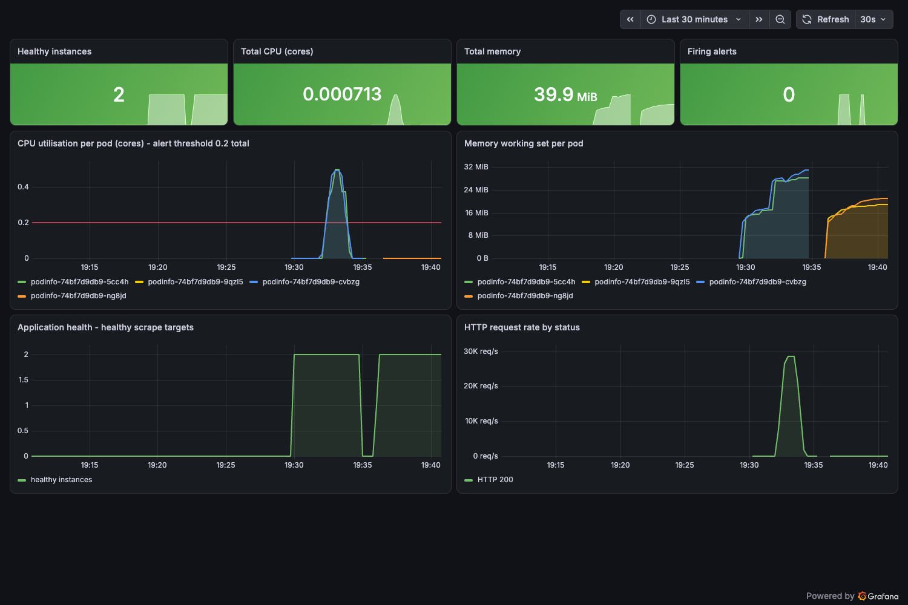
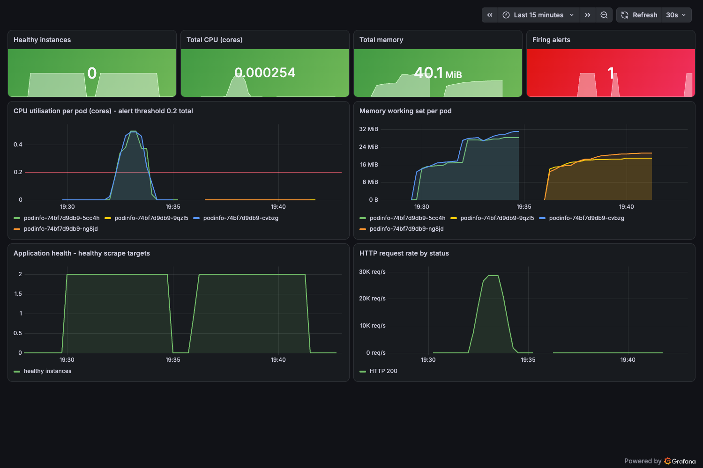
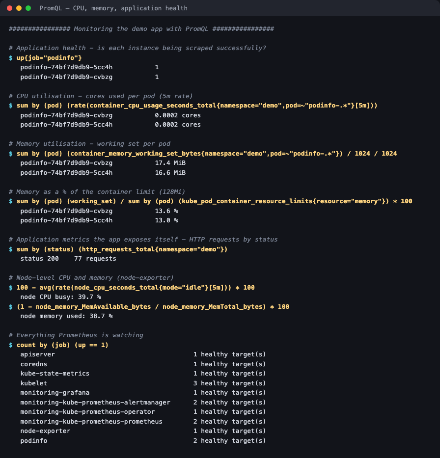
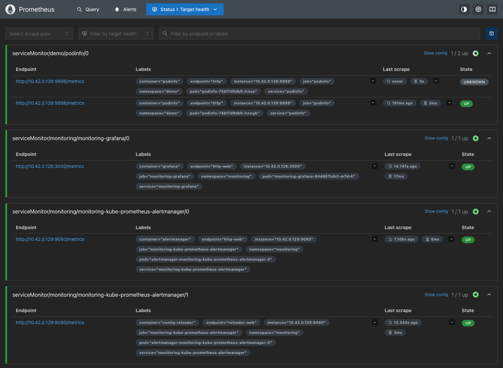
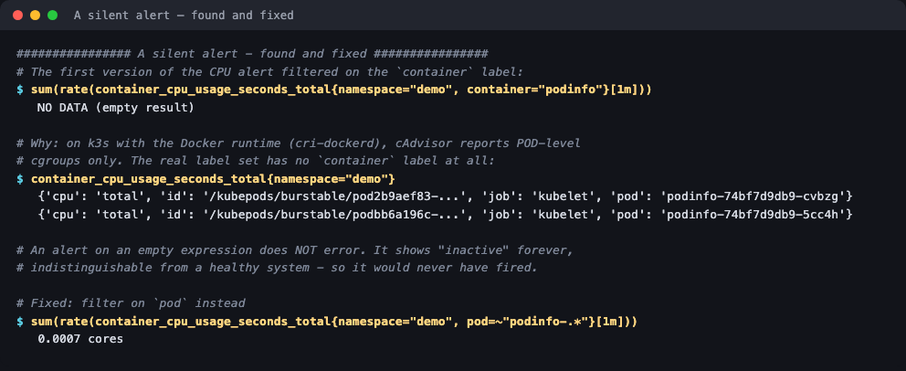
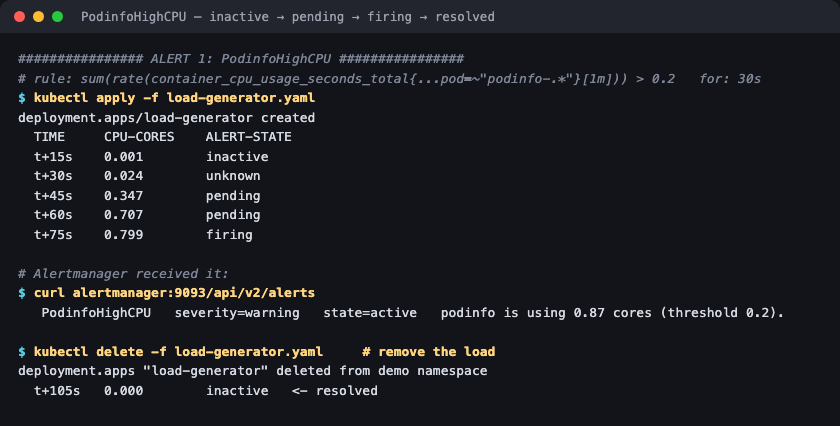
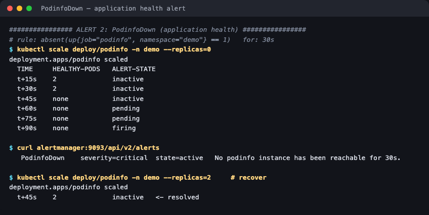
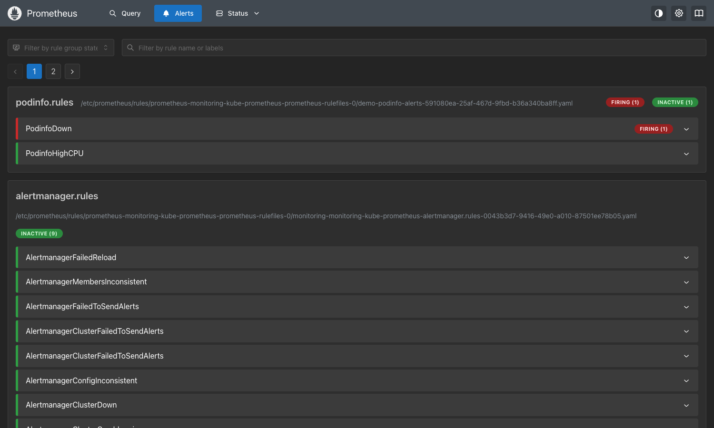
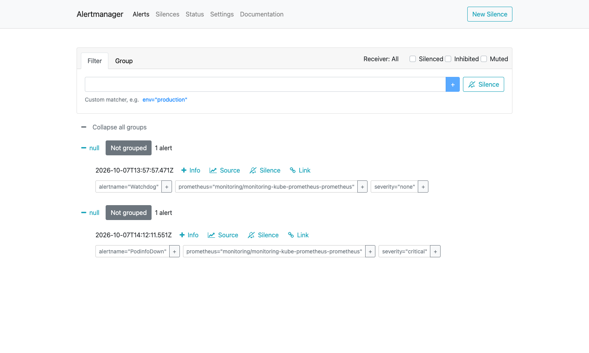
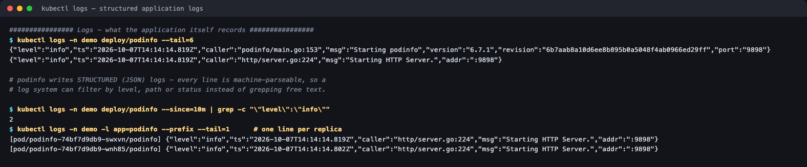

# 01 — Monitoring

**Session 20 homework — Task 1** · Lakshya Mewara · 24BCS10290

> **Stack:** `kube-prometheus-stack` (Prometheus, Grafana, Alertmanager, node-exporter,
> kube-state-metrics) on k3s `v1.35.0`. **Demo app:** podinfo `6.7.1`, which exposes Prometheus
> metrics and health endpoints. Everything below is from a real run.

The assignment asks for **metrics, logs, alerts, CPU utilisation, memory utilisation and application health** — all six are covered, and both alerts were genuinely triggered and resolved.

---

## The dashboard — both incidents on one screen



Provisioned **as code** ([`grafana-dashboard.yaml`](./grafana-dashboard.yaml)) — a ConfigMap labelled `grafana_dashboard=1`, which Grafana's sidecar loads automatically. It shows everything the assignment lists, and both incidents triggered below are visible on it:

| Panel | Shows |
|---|---|
| **CPU utilisation per pod** | The load spike to ~0.5 cores per pod, crossing the red **0.2 alert threshold** |
| **Memory working set per pod** | ~17 MiB per pod; new pod names appear after the outage recovery |
| **Application health** | Healthy instances drop **2 → 0** during the outage, then back to 2 |
| **HTTP request rate** | Load test peaking near **28K req/s** |
| Stats row | Healthy instances, total CPU, total memory, firing alerts |

During the outage:



---

## Metrics — CPU, memory and health with PromQL



```
# Application health
up{job="podinfo"}                                        ->  1, 1

# CPU utilisation (cores per pod)
sum by (pod) (rate(container_cpu_usage_seconds_total{namespace="demo",pod=~"podinfo-.*"}[5m]))
                                                         ->  0.0002 cores each

# Memory utilisation
sum by (pod) (container_memory_working_set_bytes{...})   ->  17.4 MiB, 16.6 MiB
... as % of the 128Mi limit                              ->  13.6 %, 13.0 %

# Node level (node-exporter)
node CPU busy: 51.0 %          node memory used: 38.0 %
```

Prometheus was scraping **15 healthy targets** across 10 jobs — the API server, kubelet, CoreDNS, node-exporter, kube-state-metrics, the monitoring stack itself, and the demo app.



---

## A silent alert — found and fixed

This is the most important result in the session.



The first CPU alert filtered on the `container` label, as nearly every example online does:

```
sum(rate(container_cpu_usage_seconds_total{namespace="demo", container="podinfo"}[1m]))
   NO DATA (empty result)
```

On this cluster (k3s with the Docker runtime via cri-dockerd) cAdvisor reports **pod-level cgroups only**. The real label set has **no `container` label at all**:

```
{'cpu': 'total', 'id': '/kubepods/burstable/pod2b9aef83-...', 'job': 'kubelet', 'pod': 'podinfo-...'}
```

**An alert whose expression matches nothing does not error.** It shows `inactive` forever — indistinguishable from a healthy system — so it would never have fired, no matter how high CPU went. The fix filters on `pod`:

```
sum(rate(container_cpu_usage_seconds_total{namespace="demo", pod=~"podinfo-.*"}[1m]))
   0.0007 cores
```

The same assumption is baked into the stock Kubernetes dashboards, which is why the dashboard here was written from scratch. **Lesson: an alert is only proven by watching it fire.**

---

## Alerts — both triggered for real

Two rules in [`alert-rules.yaml`](./alert-rules.yaml), loaded as a `PrometheusRule`.

### `PodinfoHighCPU` — CPU utilisation



```
$ kubectl apply -f load-generator.yaml
  TIME     CPU-CORES    ALERT-STATE
  t+15s    0.001        inactive
  t+45s    0.347        pending       <- over 0.2, waiting out "for: 30s"
  t+75s    0.799        firing

Alertmanager:  PodinfoHighCPU  severity=warning  state=active
               podinfo is using 0.87 cores (threshold 0.2).

$ kubectl delete -f load-generator.yaml
  t+105s   0.000        inactive   <- resolved
```

(One sample at t+30s read `unknown` before the rule's evaluation settled.)

### `PodinfoDown` — application health



```
$ kubectl scale deploy/podinfo -n demo --replicas=0
  TIME     HEALTHY-PODS   ALERT-STATE
  t+15s    2              inactive      <- Prometheus hasn't noticed yet
  t+45s    none           inactive
  t+60s    none           pending
  t+90s    none           firing

Alertmanager:  PodinfoDown  severity=critical  state=active
               No podinfo instance has been reachable for 30s.
```

| Prometheus — alert firing | Alertmanager — alert received |
|---|---|
|  |  |

**Time-to-alert was ~90 seconds**, not instant: Prometheus kept reporting 2 healthy pods for ~30–45s after they were gone. Detection time = **scrape interval + target-discovery lag + the `for:` duration**. Worth knowing before promising anyone "instant" alerting — and why `for:` exists at all (without it, a single bad scrape would page someone at 3am).

The always-firing `Watchdog` alert in Alertmanager is deliberate: a "dead man's switch" that proves the whole alerting pipeline is alive. If it ever *stops* arriving, alerting itself is broken.

---

## Logs



```
$ kubectl logs -n demo deploy/podinfo --tail=6
{"level":"info","ts":"2026-10-07T14:14:14.819Z","caller":"podinfo/main.go:153","msg":"Starting podinfo","version":"6.7.1",...}
{"level":"info","ts":"2026-10-07T14:14:14.819Z","caller":"http/server.go:224","msg":"Starting HTTP Server.","addr":":9898"}
```

**Structured JSON**, so a log system can filter by field rather than grepping text.

And a useful negative result: the tens of thousands of requests from the load test **do not appear in the logs** — podinfo only logs requests at debug level. The **metrics** recorded every one of them. Neither signal is complete alone, which is the argument for [observability's three pillars](../02-observability/).

---

## Setup decisions

- **k3s components disabled** in [`monitoring-values.yaml`](./monitoring-values.yaml). k3s runs the scheduler, controller-manager, proxy and etcd inside one binary without the metrics endpoints the chart expects; left on, they show as permanently down and fire false alerts. With them off, the baseline was clean — only `Watchdog`.
- **Selectors opened up** (`serviceMonitorSelectorNilUsesHelmValues: false`) so Prometheus picks up monitors and rules from any namespace, not only ones labelled with the Helm release.
- **Grafana anonymous read-only** access, for this local demo only — so screenshots need no login. Never on a networked cluster.

## Files

| File | Purpose |
|---|---|
| [`monitoring-values.yaml`](./monitoring-values.yaml) | Helm values for kube-prometheus-stack |
| [`demo-app.yaml`](./demo-app.yaml) | podinfo Deployment, Service and ServiceMonitor |
| [`alert-rules.yaml`](./alert-rules.yaml) | `PodinfoDown` and `PodinfoHighCPU` |
| [`grafana-dashboard.yaml`](./grafana-dashboard.yaml) | The dashboard, as code |
| [`load-generator.yaml`](./load-generator.yaml) | ApacheBench load used to trigger the CPU alert |
| [`logs/`](./logs/) | Raw output of every step |

```bash
helm upgrade --install monitoring prometheus-community/kube-prometheus-stack \
  -n monitoring --create-namespace -f monitoring-values.yaml
kubectl apply -f demo-app.yaml -f alert-rules.yaml -f grafana-dashboard.yaml
```
