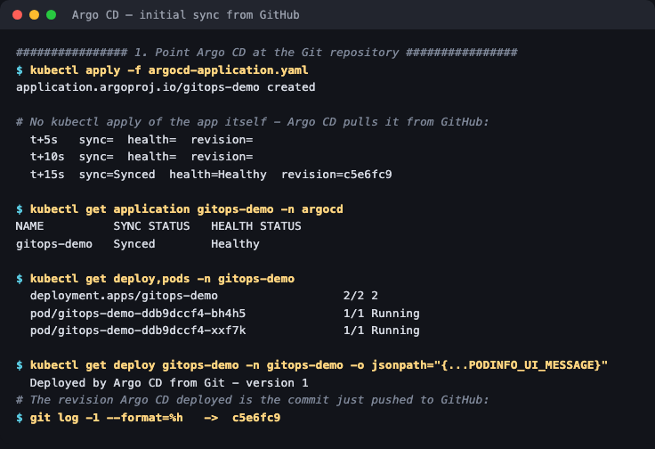
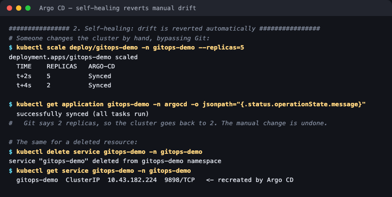
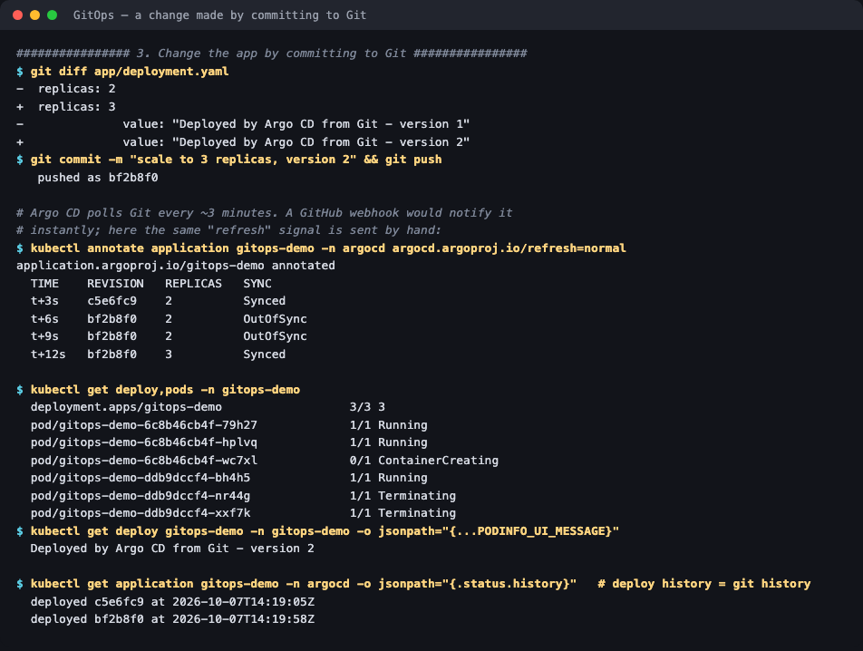
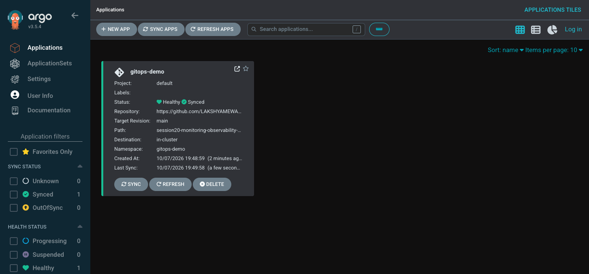

# 03 — GitOps with Argo CD

**Session 20 homework — Task 3** · Lakshya Mewara · 24BCS10290

> **Argo CD:** `v3.5.4` on k3s `v1.35.0`. The application's manifests live in **this GitHub
> repository** under [`app/`](./app/) — Argo CD pulls them from GitHub, not from the laptop.

## What GitOps is

GitOps uses **Git as the single source of truth for what should be running**. Nobody runs `kubectl apply` against production; instead an agent inside the cluster continuously compares the cluster with the Git repo and makes them match.

| Principle | Meaning | Demonstrated below |
|---|---|---|
| **Git as the source of truth** | The repo defines the desired state; the cluster follows it | Deployed revision = the pushed commit |
| **Declarative configuration** | Describe *what* should exist, not the steps to get there | Plain Kubernetes YAML in [`app/`](./app/) |
| **Continuous reconciliation** | An agent keeps checking actual vs desired and closes the gap | Manual changes reverted within seconds |
| **Pull, not push** | The cluster pulls changes; CI never holds cluster credentials | Argo CD reads a public repo; nothing pushes into the cluster |

## The GitOps workflow

```
 developer ──commit──► Git (main) ──pull──► Argo CD ──apply──► cluster
                          ▲                    │
                          │                    └── watches the cluster too:
                    review / merge                 drift is detected and reverted
                    (the change process)
```

A change to production becomes a **pull request**: reviewed, approved, merged — and the merge *is* the deployment. Rollback is `git revert`.

## The Application

[`argocd-application.yaml`](./argocd-application.yaml):

```yaml
source:
  repoURL: https://github.com/LAKSHYAMEWARA0025/devops-heros.git
  targetRevision: main
  path: session20-monitoring-observability-gitops/HW/03-gitops/app
destination:
  namespace: gitops-demo
syncPolicy:
  automated:
    prune: true      # delete resources removed from Git
    selfHeal: true   # undo manual changes made in the cluster
```


**Healthy · Synced to `main (bf2b8f0)` · Sync OK**, with the commit author and message, and the resource tree: Application → Service + Deployment → the current ReplicaSet (rev 2, 3 pods) and the previous one (rev 1, scaled to zero).

---

## 1. Initial sync — straight from GitHub



```
$ kubectl apply -f argocd-application.yaml       # the ONLY thing applied by hand
  t+5s   sync=        health=
  t+15s  sync=Synced  health=Healthy  revision=c5e6fc9

  deployment.apps/gitops-demo   2/2
  PODINFO_UI_MESSAGE = "Deployed by Argo CD from Git - version 1"

$ git log -1 --format=%h   ->  c5e6fc9
```

The app itself was **never applied with kubectl**. The deployed revision `c5e6fc9` is exactly the commit pushed to GitHub moments before.

## 2. Self-healing — manual drift is reverted



```
$ kubectl scale deploy/gitops-demo -n gitops-demo --replicas=5     # bypassing Git
  TIME    REPLICAS
  t+2s    5
  t+4s    2              <- reverted

$ kubectl delete service gitops-demo -n gitops-demo
$ kubectl get service gitops-demo -n gitops-demo
  gitops-demo  ClusterIP  10.43.182.224  9898/TCP   <- recreated by Argo CD
```

Git says 2 replicas, so the cluster goes back to 2 **within about 4 seconds**. A deleted Service comes straight back.

This is what makes GitOps auditable: a hotfix applied by hand at 3am doesn't silently become the new reality — it's undone, and the fix has to go through Git. (Note the recreated Service has a **new** ClusterIP: self-healing restores the *object*, not its runtime identity — which is why apps should address services by DNS name.)

## 3. Changing the app — by committing to Git



```
$ git diff app/deployment.yaml
-  replicas: 2
+  replicas: 3
-  value: "Deployed by Argo CD from Git - version 1"
+  value: "Deployed by Argo CD from Git - version 2"
$ git commit && git push                                   -> bf2b8f0

  TIME    REVISION   REPLICAS   SYNC
  t+3s    c5e6fc9    2          Synced
  t+6s    bf2b8f0    2          OutOfSync      <- Argo CD sees the new commit
  t+12s   bf2b8f0    3          Synced         <- cluster updated

  PODINFO_UI_MESSAGE = "Deployed by Argo CD from Git - version 2"

$ kubectl get application gitops-demo -n argocd -o jsonpath='{.status.history}'
  deployed c5e6fc9 at 2026-10-07T14:19:05Z
  deployed bf2b8f0 at 2026-10-07T14:19:58Z
```

**The deployment history is the Git history.** Every change to what runs has an author, a timestamp, a message and a diff.

> **On timing:** Argo CD polls Git every ~3 minutes by default. In production a GitHub **webhook**
> notifies it on every push and sync is near-instant. Here the same "refresh" signal was sent by
> hand with an annotation (`argocd.argoproj.io/refresh=normal`) to avoid the 3-minute wait.



---

## Kubernetes + GitOps

Kubernetes is unusually well suited to GitOps, because it's **already declarative and reconciling**: every controller compares desired state with actual state and closes the gap ([session 10](../../../session10-k8s-core-objects/HW/core-objects/) showed a ReplicaSet doing exactly that). GitOps simply moves the *desired* state one level up — from the API server into Git — and adds one more reconciliation loop, Argo CD, to keep the two in step.

| | Push-based CI/CD ([sessions 16–17](../../../session-17-devsecops/HW/)) | GitOps (pull-based) |
|---|---|---|
| Who changes the cluster | The pipeline runs `kubectl apply` | An agent *inside* the cluster |
| Cluster credentials | Stored in CI | **Never leave the cluster** |
| Manual drift | Persists until the next deploy | **Reverted automatically** |
| Rollback | Re-run an old pipeline | `git revert` |
| Audit trail | Pipeline logs | Git history |

In practice they combine: **CI** builds, tests, scans and pushes an image, then commits the new tag to a GitOps repo; **Argo CD** deploys it.

## What I understood

- **Git becomes the control plane for change.** The only `kubectl apply` in this whole task was registering the Application.
- **Self-healing is the feature that changes behaviour.** Knowing that manual changes will be reverted is what forces every change through review.
- **`prune` and `selfHeal` are deliberate choices.** Without `selfHeal` Argo CD only *reports* drift; without `prune`, deleting a file from Git leaves the resource running.
- **Rollback is just Git.** Every previous state is a commit away.
- **GitOps is reconciliation, applied one level higher** — the same idea as every Kubernetes controller, with Git as the desired state.

## Files

| File | Purpose |
|---|---|
| [`app/deployment.yaml`](./app/deployment.yaml) · [`app/service.yaml`](./app/service.yaml) | The desired state Argo CD syncs |
| [`argocd-application.yaml`](./argocd-application.yaml) | The Argo CD Application |
| [`logs/`](./logs/) | Raw output of every step |
