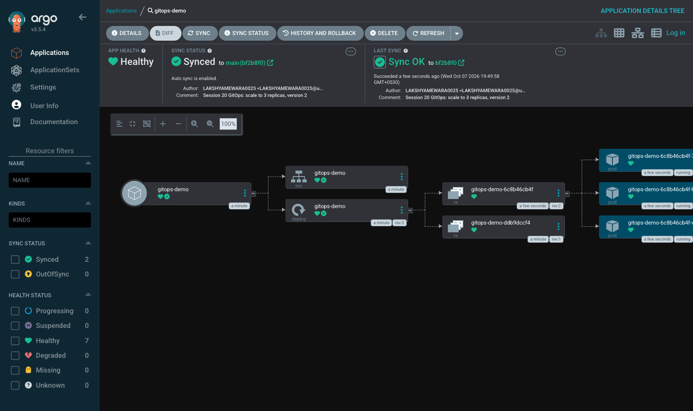

# Session 20 — Monitoring, Observability & GitOps

**Homework submission** · Lakshya Mewara · 24BCS10290

> **Cluster:** k3s `v1.35.0`. **Monitoring:** kube-prometheus-stack (Prometheus, Grafana,
> Alertmanager, node-exporter, kube-state-metrics). **GitOps:** Argo CD `v3.5.4`, syncing from
> this GitHub repository. Every screenshot is from a real run.

| Task | What was done | Folder |
|---|---|---|
| **1 — Monitoring** | Metrics, logs, CPU, memory and app health; **two alerts triggered for real** and resolved; dashboard as code | [`01-monitoring/`](./01-monitoring/) |
| **2 — Observability** | The three pillars, why it's needed, tools, Kubernetes observability | [`02-observability/`](./02-observability/) |
| **3 — GitOps** | Argo CD deploying from GitHub, **self-healing** manual drift, and a change shipped purely by `git push` | [`03-gitops/`](./03-gitops/) |

## Evidence at a glance

*Both incidents on one real dashboard: the CPU spike crossing the 0.2 alert threshold, and healthy instances dropping 2 → 0 → 2 during the outage.*

| Prometheus — alert firing | Alertmanager — alert received |
|---|---|
|  |  |

*Argo CD: Healthy, Synced to `main (bf2b8f0)` — the exact commit pushed to GitHub.*

## Results

| | Result |
|---|---|
| `PodinfoHighCPU` | inactive → pending → **firing** at 0.87 cores → resolved |
| `PodinfoDown` | inactive → pending → **firing** (critical) → resolved |
| Time-to-alert | ~90s = scrape interval + discovery lag + `for:` |
| Self-healing | Manual scale to 5 reverted to 2 in **~4s**; deleted Service recreated |
| Change via Git | `git push` → OutOfSync → Synced at 3 replicas in **~12s** |

## Findings worth highlighting

**1. A silent alert that could never have fired.** The CPU alert filtered on the `container` label, as most examples do. On this cluster cAdvisor emits **no `container` label**, so the expression matched nothing — and an empty alert expression doesn't error, it just shows `inactive` forever, indistinguishable from healthy. Found by querying the data, fixed by filtering on `pod`, and then proven by actually triggering it. [Details](./01-monitoring/#a-silent-alert--found-and-fixed)

**2. Logs and metrics each miss things.** Tens of thousands of load-test requests never appeared in the logs (the app logs requests only at debug level), while the metrics recorded every one. That's the practical case for more than one pillar. [Details](./02-observability/#2-logs--what-happened-in-detail)

**3. Platform defaults cause false alerts.** k3s runs its control-plane components inside one binary, so the chart's default scrapes of them show as permanently down. Disabling them gave a clean baseline where only the deliberate `Watchdog` fires.

## A note on access

Grafana and Argo CD were configured with **anonymous read-only** access for this local demo, so screenshots needed no login. That setting is for a laptop cluster only — never one reachable from a network.
