# Session 21 — DevOps Final Capstone: StockPilot

**Capstone submission** · Lakshya Mewara · 24BCS10290

> **StockPilot** is an inventory-management application for a small electronics store. Staff
> track products, receive and issue stock, and see what needs reordering. Every stock change is
> recorded as an audited movement. The application domain is my own; the DevOps layer follows the
> architecture the course asks for.
>
> It travels the full path: **React + FastAPI + PostgreSQL → pytest → Docker → GitHub Actions →
> Trivy gate → GHCR → Helm on Kubernetes (Ingress, HPA) → Prometheus + Grafana**, with the AWS
> network and **EKS** cluster defined in **Terraform**.
>
> Every screenshot is a real browser capture or a render of real command output. Problems found
> while building it, including one that crashed a pod, are documented, not hidden
> ([§15](#15-engineering-findings)).

| | |
|---|---|
| **Frontend** | React 19 + Vite 8, responsive dashboard, served by unprivileged nginx |
| **Backend** | FastAPI (Python 3.12), SQLAlchemy 2, Alembic, 10 REST endpoints |
| **Database** | PostgreSQL 18: 2 tables via 2 Alembic migrations |
| **Tests** | 20 pytest tests on a throwaway SQLite DB; migrations also verified on real Postgres in CI |
| **CI/CD** | GitHub Actions, 9 jobs → images in **GHCR tagged with the commit SHA** → Helm deploy + smoke test |
| **Security** | Trivy on both images (fails on fixable HIGH/CRITICAL), Gitleaks, Bandit, `npm audit` |
| **Kubernetes** | Helm chart: backend + frontend Deployments (2 replicas each), Postgres StatefulSet, Ingress, HPA, PDBs |
| **Observability** | `/metrics`, ServiceMonitor, 5 alert rules (incl. a business alert), Grafana dashboard as code |
| **Infrastructure** | Terraform: AWS VPC (2 public + 2 private subnets, NAT), EKS + managed node group, `ap-south-1` |

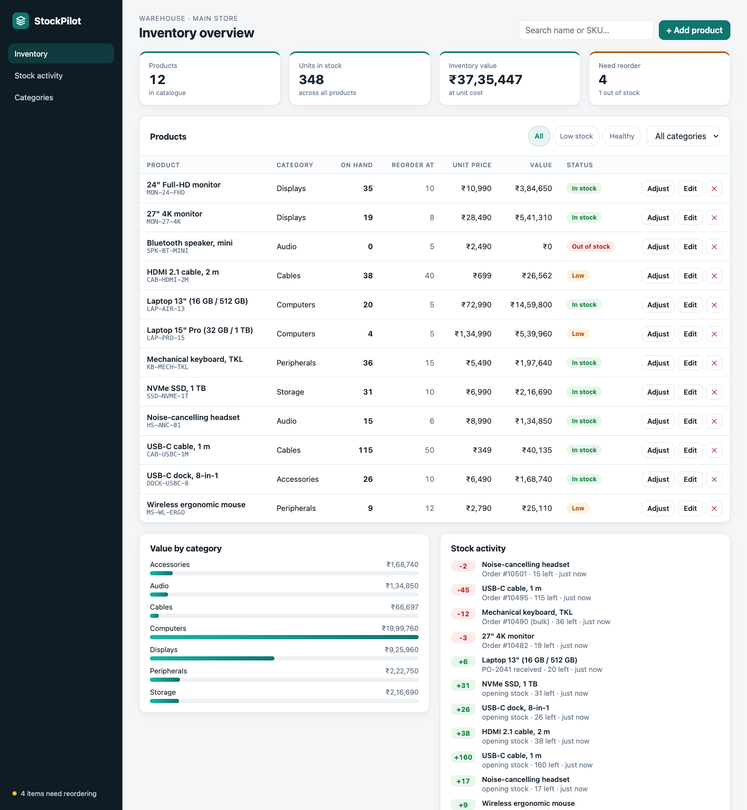

---

## Contents

1. [What StockPilot does](#1-what-stockpilot-does)
2. [Architecture](#2-architecture)
3. [Repository structure](#3-repository-structure)
4. [Run it locally](#4-run-it-locally)
5. [M1 — Application](#5-m1--application-frontend--backend--database)
6. [M2 — Testing](#6-m2--testing)
7. [M3 — Git and GitHub](#7-m3--git-and-github)
8. [M4 — Docker](#8-m4--docker)
9. [M5 — CI/CD](#9-m5--cicd-github-actions)
10. [M6 — DevSecOps](#10-m6--devsecops-trivy)
11. [M7 — Terraform](#11-m7--terraform-aws-vpc--eks)
12. [M8 — Kubernetes + Helm](#12-m8--kubernetes--helm)
13. [M9 — Observability](#13-m9--observability-prometheus--grafana)
14. [Troubleshooting lab](#14-troubleshooting-lab)
15. [Engineering findings](#15-engineering-findings)
16. [M10 — Live demo script](#16-m10--live-demo-script)
17. [Submission checklist](#17-submission-checklist)

---

## 1. What StockPilot does

- **Catalogue:** products with SKU, category, unit price and a **reorder level**.
- **Stock in / stock out:** every change goes through `POST /adjust` and is written to an
  **audit trail** (`stock_movements`). Stock can never go negative: the database has a
  `CHECK` constraint, and the API answers `409` before it gets that far.
- **Dashboard:**
  - KPI cards: products, units, inventory value, items to reorder.
  - Status badges (In stock / Low / Out of stock), search, category and status filters.
  - Value-by-category bars and a live stock-activity feed.
- **Live business metrics:** inventory value and the low-stock count are exported to Prometheus,
  and a business alert fires when products need reordering.

| Method | Endpoint | Purpose |
|---|---|---|
| GET | `/health` | liveness: process up (no DB call) |
| GET | `/ready` | readiness: DB reachable **and** schema migrated, else `503` |
| GET | `/metrics` | Prometheus metrics |
| GET | `/api/products` | list, with `?category=`, `?low_stock=`, `?q=` filters |
| GET | `/api/products/{id}` | one product (`404` if missing) |
| POST | `/api/products` | create (`409` duplicate SKU, `422` invalid) |
| PUT | `/api/products/{id}` | update name/category/price/reorder level |
| DELETE | `/api/products/{id}` | delete product and its history |
| POST | `/api/products/{id}/adjust` | stock in/out with a reason (`409` if it would go negative) |
| GET | `/api/movements` | recent stock movements (activity feed) |
| GET | `/api/stats` | KPIs and value by category |

Swagger UI is at `/docs` (through the Ingress too).

---

## 2. Architecture

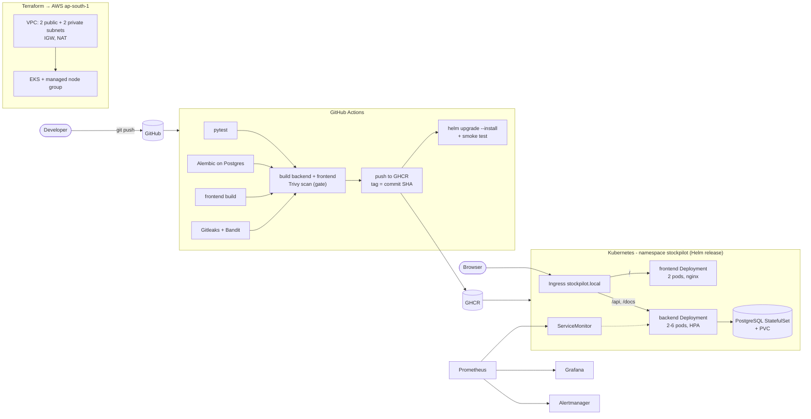
```mermaid
flowchart LR
    dev([Developer]) -- git push --> gh[(GitHub)]
    gh --> ci

    subgraph ci["GitHub Actions"]
        direction LR
        t1[pytest] --> img
        t2[Alembic on Postgres] --> img
        t3[frontend build] --> img
        t4[Gitleaks + Bandit] --> img
        img["build backend + frontend<br/>Trivy scan (gate)"] --> push["push to GHCR<br/>tag = commit SHA"]
        push --> dep["helm upgrade --install<br/>+ smoke test"]
    end

    push --> ghcr[(GHCR)]

    subgraph tf["Terraform → AWS ap-south-1"]
        vpc["VPC: 2 public + 2 private subnets<br/>IGW, NAT"] --> eks["EKS + managed node group"]
    end

    subgraph k8s["Kubernetes - namespace stockpilot (Helm release)"]
        ing["Ingress stockpilot.local"] -- "/" --> fe["frontend Deployment<br/>2 pods, nginx"]
        ing -- "/api, /docs" --> be["backend Deployment<br/>2-6 pods, HPA"]
        be --> pg[("PostgreSQL StatefulSet<br/>+ PVC")]
        sm[ServiceMonitor] -.-> be
    end

    ghcr --> k8s
    user([Browser]) --> ing
    prom[Prometheus] --> sm
    prom --> graf[Grafana]
    prom --> am[Alertmanager]
```

- The browser only ever talks to **one hostname**. The Ingress sends `/api`, `/docs` and
  `/openapi.json` to the backend and everything else to the frontend.
- Locally (Docker Compose), the frontend's nginx proxies `/api` to the backend instead, so the same
  build works in both places.

---

## 3. Repository structure

```text
session21-capstone/
├── frontend/                     React app, nginx config template, multi-stage Dockerfile
│   └── src/  App.jsx, api.js, components/, styles.css
├── backend/                      FastAPI application
│   ├── app/                      main.py (routes), models.py, schemas.py, db.py, config.py, metrics.py
│   ├── alembic/versions/         0001_create_products.py, 0002_create_stock_movements.py
│   ├── tests/                    conftest.py (SQLite test DB) + test_api.py (20 tests)
│   ├── pytest.ini, requirements.txt, requirements-dev.txt, Dockerfile, docker-entrypoint.sh
├── docker-compose.yml            postgres + backend + frontend
├── terraform/                    AWS VPC + EKS (versions.tf, variables.tf, main.tf, outputs.tf, terraform.tfvars.example)
├── helm/stockpilot/              Helm chart (values.yaml, values-dev.yaml, values-prod.yaml, templates/, dashboards/)
├── k8s/namespace.yaml            namespace bootstrap
├── monitoring/                   kube-prometheus-stack values + how the app plugs in
├── security/                     trivy.yaml, .gitleaks.toml, bandit.yaml
├── troubleshooting/              broken-image.yaml, broken-service.yaml
├── scripts/                      seed.sh (demo catalogue), load-test.sh (HPA / dashboard traffic)
├── .github/workflows/ci-cd.yml   reference copy of the pipeline
└── screenshots/
```

> GitHub only runs workflows from the repository root, so the live pipeline is
> [`/.github/workflows/session21-capstone.yml`](../.github/workflows/session21-capstone.yml).
> [`.github/workflows/ci-cd.yml`](./.github/workflows/ci-cd.yml) here is an identical copy.

---

## 4. Run it locally

```bash
docker compose up --build            # http://localhost:3000 - API docs at http://localhost:8000/docs
./scripts/seed.sh                    # load a demo catalogue through the API
docker compose down                  # stop  (add -v to also delete the database volume)
```

Backend on its own:

```bash
cd backend
python -m venv .venv && source .venv/bin/activate
pip install -r requirements-dev.txt
export DATABASE_URL='postgresql+psycopg://stockpilot:<password>@localhost:5432/stockpilot'
alembic upgrade head
uvicorn app.main:app --reload --port 8000
```

Frontend dev server (proxies `/api` to `localhost:8000`): `cd frontend && npm install && npm run dev`.

---

## 5. M1 — Application (frontend + backend + database)

**Backend** ([`backend/app/`](./backend/app/)):

- FastAPI with Pydantic validation (SKU pattern, non-negative prices and quantities).
- SQLAlchemy 2 models and the 10 endpoints above.
- `/ready` only reports ready when the database is reachable **and** the schema exists, so Kubernetes
  never routes traffic to a pod that can't serve it.

**Database** ([`backend/alembic/versions/`](./backend/alembic/versions/)):

- Two migrations: `products` (unique SKU index, two `CHECK` constraints) and `stock_movements`
  (foreign key with `ON DELETE CASCADE`).
- Every backend container runs `alembic upgrade head` on start. A **Postgres advisory lock** in
  [`alembic/env.py`](./backend/alembic/env.py) makes concurrent replicas take turns
  ([§12](#12-m8--kubernetes--helm) shows the race test).

**Frontend** ([`frontend/src/`](./frontend/src/)):

- React components for the KPI cards, product table, add/edit and stock-adjust modals,
  category bars and activity feed.
- Loading and API-error states.
- Responsive: below 760px the sidebar becomes a top bar and table rows become cards.

| Desktop | Phone (390px) |
|---|---|
|  | 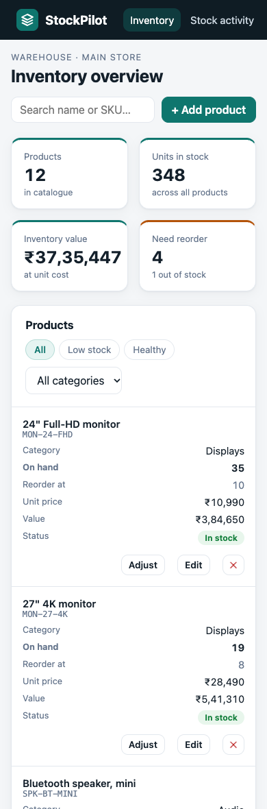 |

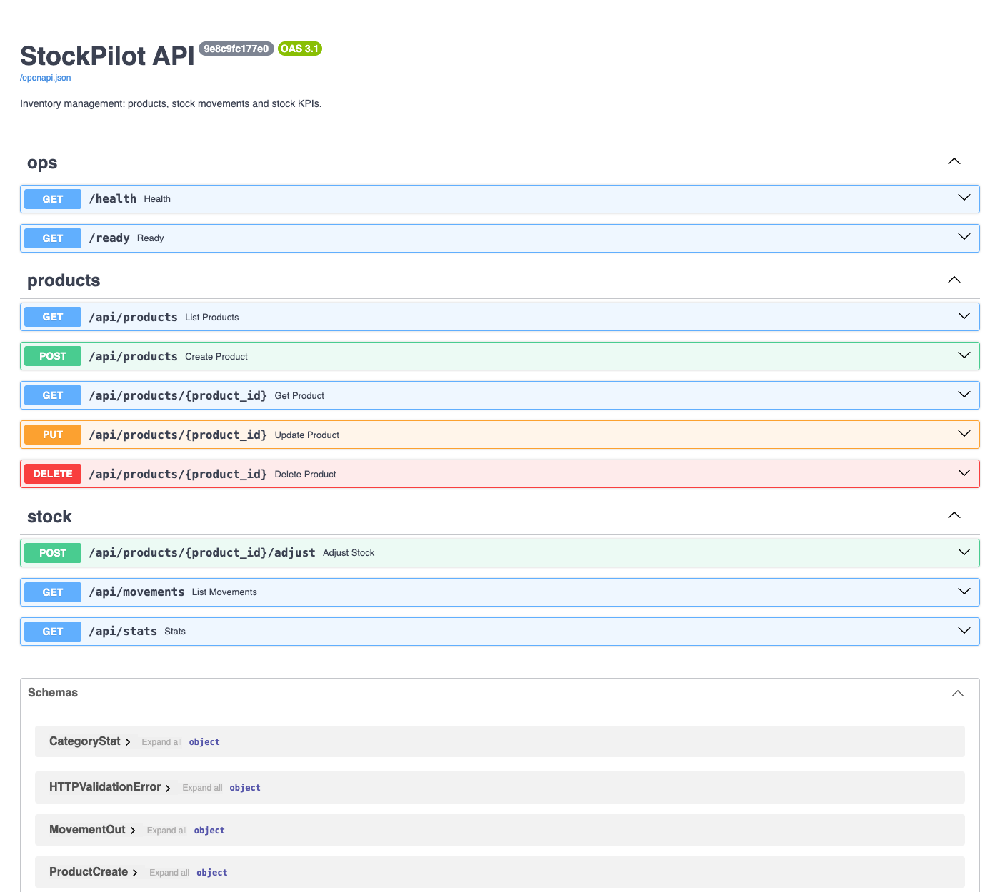

---

## 6. M2 — Testing

```bash
cd backend && python -m pytest -v --cov=app
```

- **20 tests** cover **all 11 routes** (the 10 API endpoints plus `/metrics`): health, ready, list
  (filters), get, create (incl. duplicate and 4 invalid payloads), update, delete, adjust (in/out,
  overdraw `409`, zero `422`), movements, stats, metrics.
- **Test database, never production.** [`tests/conftest.py`](./backend/tests/conftest.py) sets
  `DATABASE_URL` to a throwaway **SQLite** file *before* the app is imported. It then builds the
  schema by running the **real Alembic migrations**, so the migration files are tested too. Each
  test starts from an empty catalogue.
- [`pytest.ini`](./backend/pytest.ini) configures discovery.
- In CI a second job runs the migrations against a **real PostgreSQL 18** service container:
  `upgrade → downgrade → upgrade`, which proves every migration is reversible.

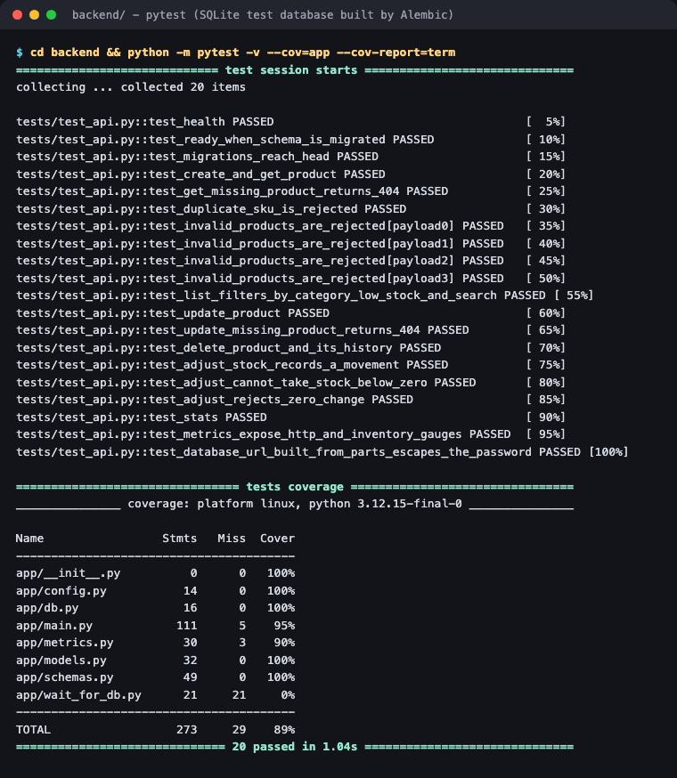

---

## 7. M3 — Git and GitHub

- Public repository: <https://github.com/LAKSHYAMEWARA0025/devops-heros> (this folder: `session21-capstone/`).
- One commit per logical piece of work, with descriptive messages (backend, frontend, compose,
  Helm, CI/CD, Terraform, then fixes found while deploying).
- [`.gitignore`](./.gitignore) excludes `.env`, `__pycache__/`, `node_modules/`, `.venv/`, build
  output and Terraform state.

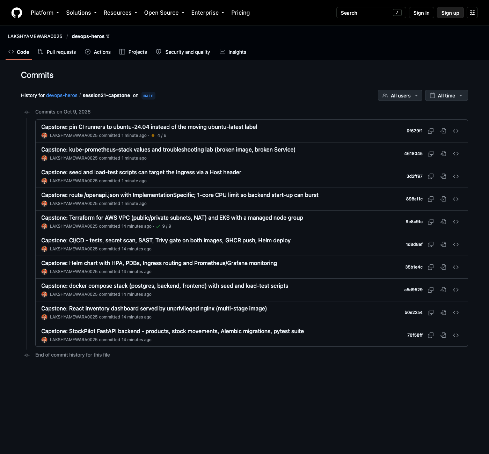

---

## 8. M4 — Docker

| Image | Build | Runtime | User |
|---|---|---|---|
| **backend** ([Dockerfile](./backend/Dockerfile)) | `python:3.12-slim`; dependencies cached in their own layer | `docker-entrypoint.sh`: wait for DB → `alembic upgrade head` → `uvicorn` | **UID 10001** |
| **frontend** ([Dockerfile](./frontend/Dockerfile)) | **multi-stage**: `node:22-alpine` runs `npm ci && npm run build` | `nginx-unprivileged`: only the static `dist/`, no Node or source | **UID 101** |

[`docker-compose.yml`](./docker-compose.yml) starts all three services with health checks and
dependency ordering: postgres must be *healthy* before the backend starts, and the backend's
`/ready` must pass before the frontend starts.

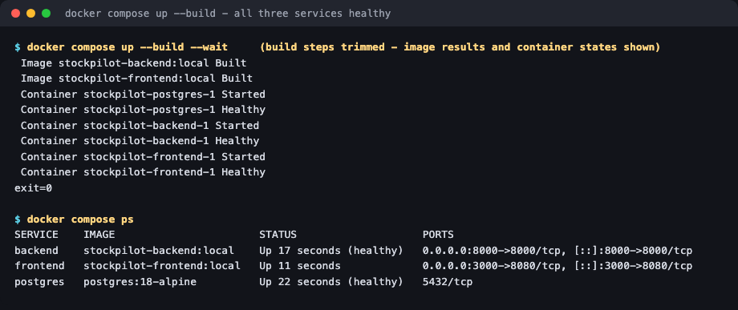

The running stack: full CRUD over HTTP, the tables Alembic created, and both containers non-root:

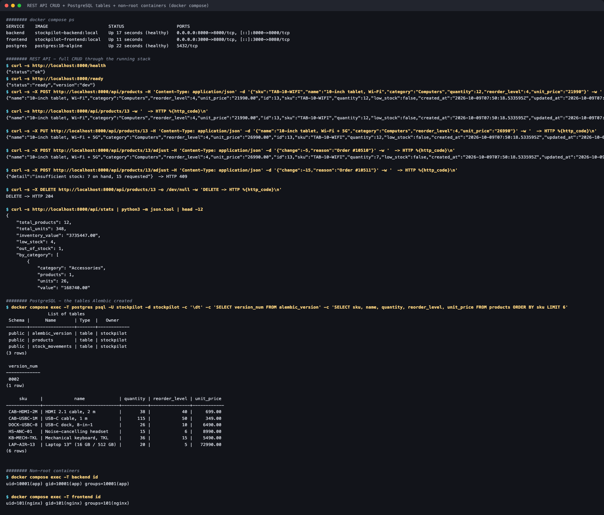

---

## 9. M5 — CI/CD (GitHub Actions)

Workflow: [`.github/workflows/session21-capstone.yml`](../.github/workflows/session21-capstone.yml).
It runs on every push to `main` (and on PRs) that touches this project.

| Job | What it does |
|---|---|
| Backend tests (pytest) | `pytest -v --cov`; **any failure stops the pipeline**, so no image is built |
| Alembic migrations on PostgreSQL | `upgrade → downgrade → upgrade` against a Postgres 18 service container |
| Frontend build | `npm ci`, `npm run build`, `npm audit --audit-level=high` |
| Secret scan + SAST | Gitleaks (no credentials in the repo), Bandit (Python) |
| Build + Trivy scan ×2 | builds **both** images and scans each; a fixable HIGH/CRITICAL fails the job |
| Push to GHCR ×2 | pushes **the exact image that was scanned** (saved as an artifact, never rebuilt) |
| Deploy with Helm + smoke test | kind cluster → `helm upgrade --install` → creates a product through nginx → backend → Postgres |

**Image tags are the full commit SHA**, never `latest`, so every image traces back to the commit
that built it. Pushing uses the job's short-lived `GITHUB_TOKEN`; no registry password is stored.

| Run | Commit | Result |
|---|---|---|
| [#1](https://github.com/LAKSHYAMEWARA0025/devops-heros/actions/runs/37902650773) | `9e8c9fc` | ✅ 9/9 jobs, 3m 26s |
| [#2](https://github.com/LAKSHYAMEWARA0025/devops-heros/actions/runs/37903990075) | `0f629f1` | ✅ 9/9 jobs |

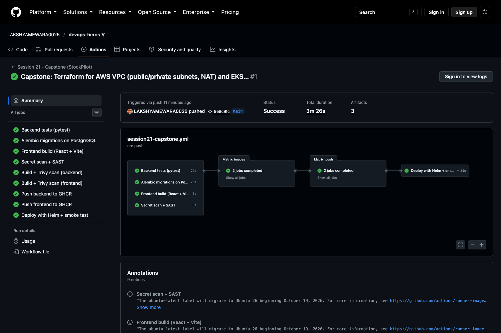

Published images: [stockpilot-backend](https://github.com/users/LAKSHYAMEWARA0025/packages/container/package/stockpilot-backend)
and [stockpilot-frontend](https://github.com/users/LAKSHYAMEWARA0025/packages/container/package/stockpilot-frontend).
Both are public, with one tag per pipeline run:

| Backend | Frontend |
|---|---|
| 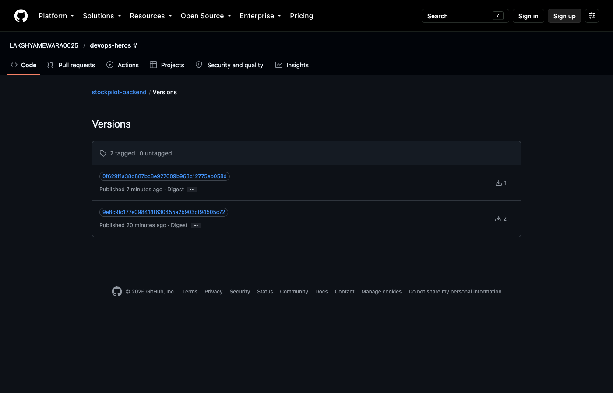 | 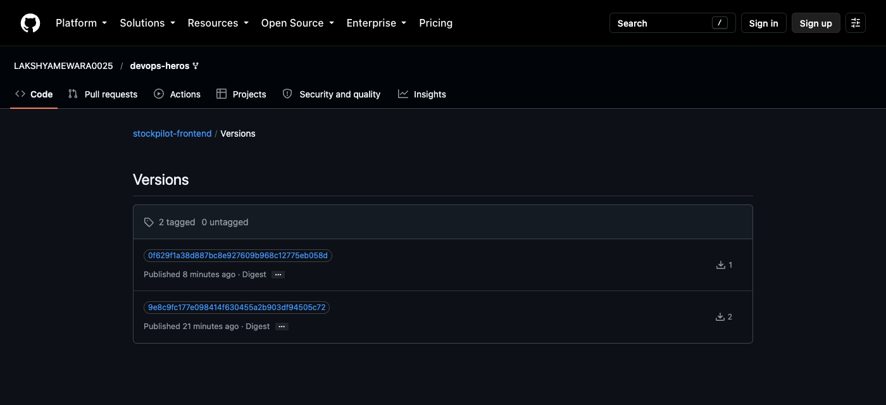 |

---

## 10. M6 — DevSecOps (Trivy)

[`security/trivy.yaml`](./security/trivy.yaml) sets the gate: `severity: [HIGH, CRITICAL]`,
`exit-code: 1` and `vulnerability.ignore-unfixed: true`.

**What Trivy scanned and what the result means.** Trivy inspected every OS package (Debian in the
backend image, Alpine in the frontend image) and every Python package in both images, checking
them against its vulnerability database. The pipeline result is **0 fixable HIGH/CRITICAL
vulnerabilities in either image**, so the gate passed and the images were pushed. The scan only
fails on findings with a fix available: blocking on vulnerabilities nobody can patch yet would
stop every build without making anything safer.

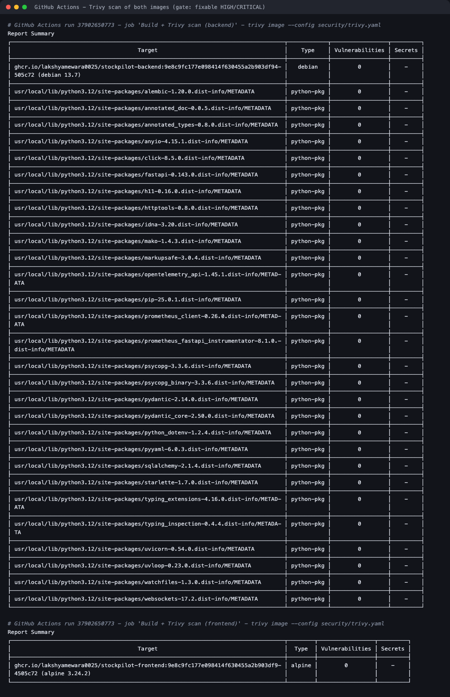

**The gate genuinely blocks.** The first frontend build failed it. The nginx base image ships
`libtiff` (pulled in by nginx's image-filter module) with **CVE-2026-4775** (HIGH; a crafted TIFF
can cause code execution or denial of service), and Alpine had already published the fix
(4.7.2-r0). Adding `apk upgrade` to the runtime stage cleared it. Here is the same scan on the
unpatched base image, exiting **1**:

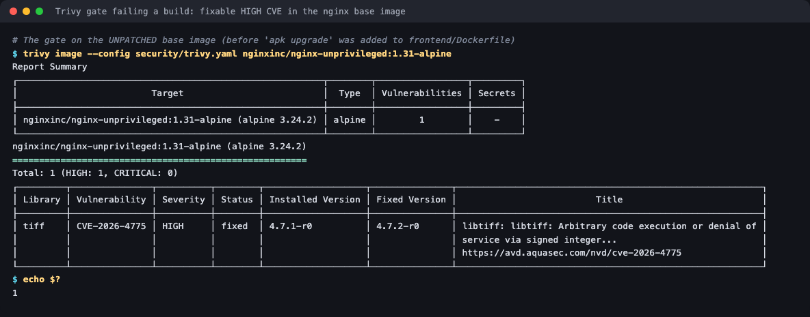

Other layers: **Gitleaks** (secrets; the allowlist covers only documented demo values),
**Bandit** (Python SAST), **`npm audit`** (frontend dependencies), and runtime hardening in the chart
(non-root, read-only root filesystem, all capabilities dropped, `RuntimeDefault` seccomp).

---

## 11. M7 — Terraform (AWS VPC + EKS)

[`terraform/`](./terraform/) provisions, in **`ap-south-1`**:

| Resource | Details |
|---|---|
| VPC | `10.42.0.0/16`, DNS hostnames on (required for EKS nodes) |
| Public subnets ×2 | 2 AZs, tagged `kubernetes.io/role/elb` for internet-facing load balancers |
| Private subnets ×2 | worker nodes; no public IPs; outbound through NAT; tagged `internal-elb` |
| Internet gateway, NAT gateway + Elastic IP, 2 route tables | public → IGW, private → NAT |
| IAM roles | cluster role (`AmazonEKSClusterPolicy`); node role (worker, CNI, ECR read-only) |
| **EKS cluster** | access entries (`authentication_mode = "API"`), creator gets admin; public endpoint restricted by `api_allowed_cidrs` |
| **Managed node group** | `t3.medium` × 2 (min 1, max 3) in the **private** subnets |

```bash
cd terraform
cp terraform.tfvars.example terraform.tfvars   # set owner, ideally your IP in api_allowed_cidrs
terraform init
terraform plan -out=tfplan
terraform apply tfplan
aws eks update-kubeconfig --region ap-south-1 --name stockpilot-eks   # printed as an output
terraform destroy                                                    # always, after evaluation
```

- **No credentials in the code.** Terraform reads them from `aws configure`. `*.tfvars` and
  `*.tfstate` are git-ignored, and only [`terraform.tfvars.example`](./terraform/terraform.tfvars.example)
  is committed.
- **Cost-conscious:** one NAT gateway instead of one per AZ (documented trade-off), and small
  nodes. The whole stack was destroyed straight after the evidence was taken.

<!-- AWS-EVIDENCE -->

---

## 12. M8 — Kubernetes + Helm

```bash
kubectl apply -f k8s/namespace.yaml
helm upgrade --install stockpilot ./helm/stockpilot -n stockpilot \
  --set backend.image.repository=ghcr.io/lakshyamewara0025/stockpilot-backend   --set backend.image.tag=<commit-sha> \
  --set frontend.image.repository=ghcr.io/lakshyamewara0025/stockpilot-frontend --set frontend.image.tag=<commit-sha>
```

The chart ([`helm/stockpilot/`](./helm/stockpilot/)):

| Object | Configuration |
|---|---|
| backend Deployment | **2 replicas** (HPA 2–6 at 60% CPU); startup, liveness (`/health`) and readiness (`/ready`) probes; config from a ConfigMap, password from a Secret; checksum annotations roll pods when either changes |
| frontend Deployment | **2 replicas**; probes on `/healthz`; read-only root FS (nginx renders its config into an `emptyDir`) |
| Services | `ClusterIP` for backend (8000) and frontend (80); headless Service for Postgres |
| PostgreSQL | StatefulSet + 1Gi PVC (`volumeClaimTemplates`), runs as UID 70 |
| Ingress | class `nginx`, host `stockpilot.local`: `/` → frontend; `/api`, `/docs`, `/openapi.json` → backend |
| HPA, PDBs | backend 2–6 replicas; at most one pod of each tier evicted at a time |
| Monitoring | ServiceMonitor, PrometheusRule, Grafana dashboard ConfigMap |

`values-dev.yaml` (1 replica, no HPA) and `values-prod.yaml` (3–10 replicas, external database via
`existingSecret`, no in-cluster Postgres) both lint cleanly.

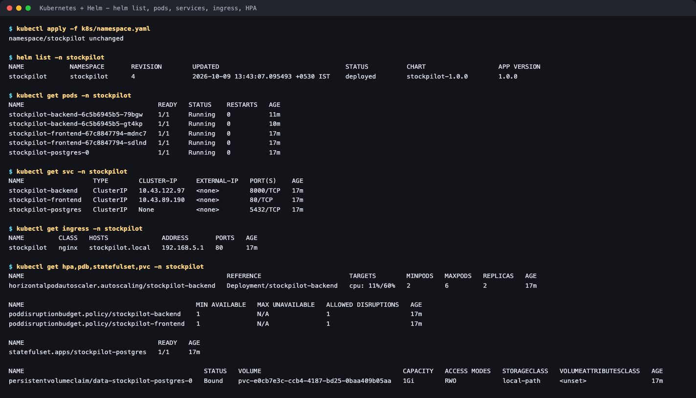

The application through the Ingress hostname, in a browser:

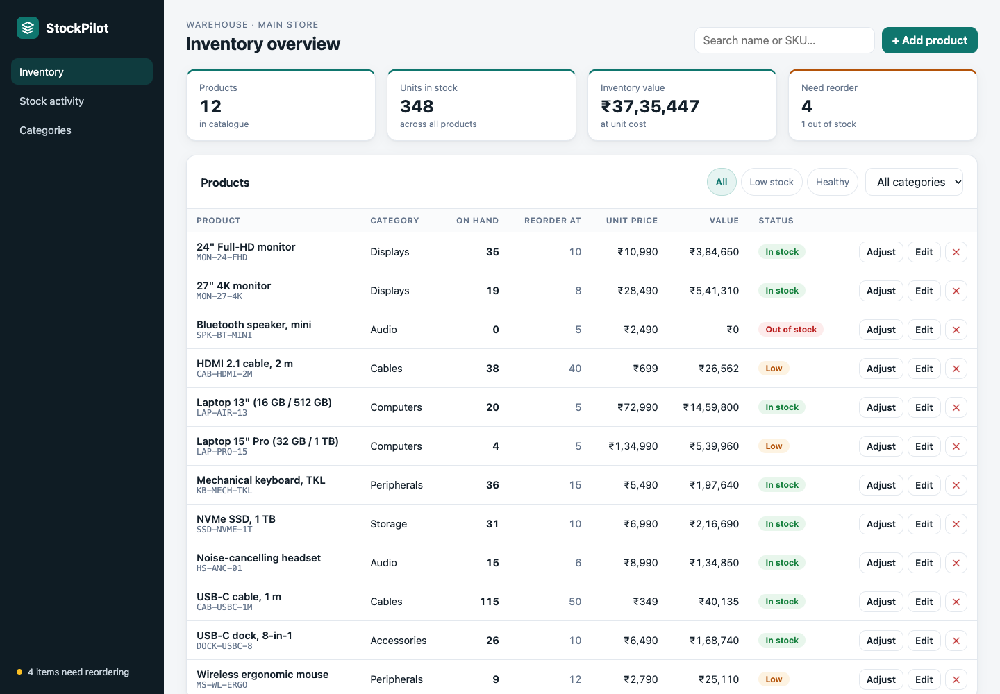

Full CRUD through the Ingress, data in the in-cluster PostgreSQL, and the startup migrations:

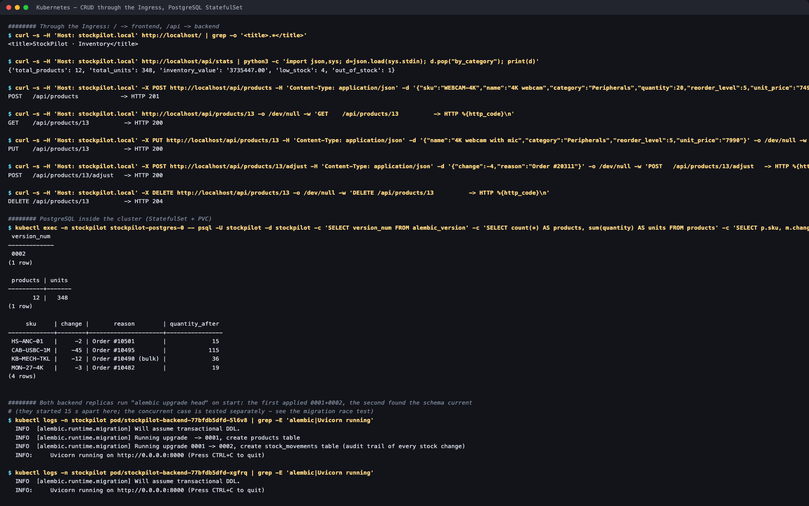

**Migration race test.** Three pods ran `alembic upgrade head` against an empty database within
57 ms of each other. One applied both migrations; the other two **waited on the advisory lock**,
found the schema current, and exited 0.

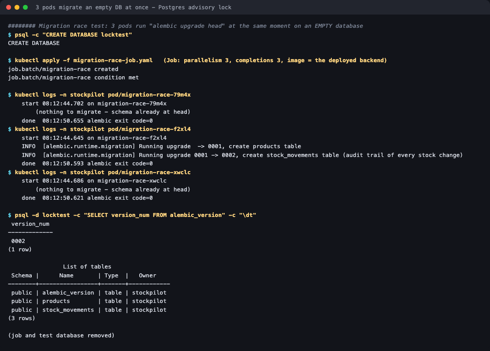

**Autoscaling.** Five minutes of load through the Ingress, sampled every 15 s. CPU reached 580% of
target, and the HPA went **2 → 6** within 15 s, with all six Ready 15 s later. When the load
stopped it scaled **back to 2** about 75 s later (60 s stabilization window). The event list also
counts an earlier scale-up caused by a test of mine ([§15](#15-engineering-findings)).

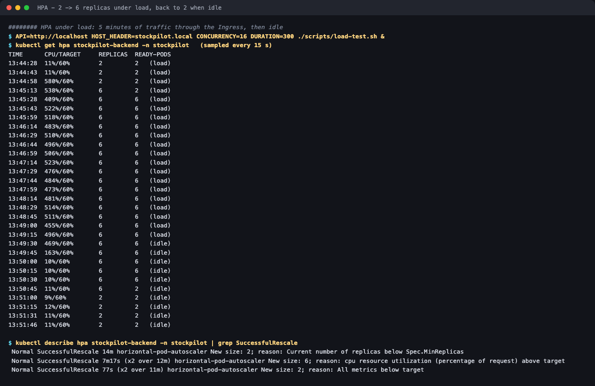

At 6 replicas the single 4-CPU node was at **96% CPU**. The HPA adds pods, not machines, so at
its maximum latency rose and the `StockPilotAutoscalerAtMax` and `StockPilotSlowRequests` alerts
went pending, exactly as designed. On EKS, the Cluster Autoscaler or Karpenter would add a node here.

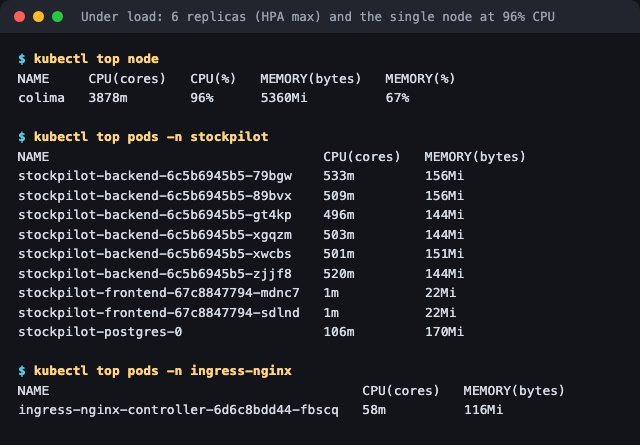

---

## 13. M9 — Observability (Prometheus + Grafana)

Install: [`monitoring/`](./monitoring/) (kube-prometheus-stack values). The chart plugs the app in
automatically.

- **`/metrics`:**
  - HTTP request count and latency per route (millisecond histogram buckets).
  - Business gauges read from the database at scrape time: `inventory_products`,
    `inventory_units`, `inventory_value`, `inventory_low_stock_products`.

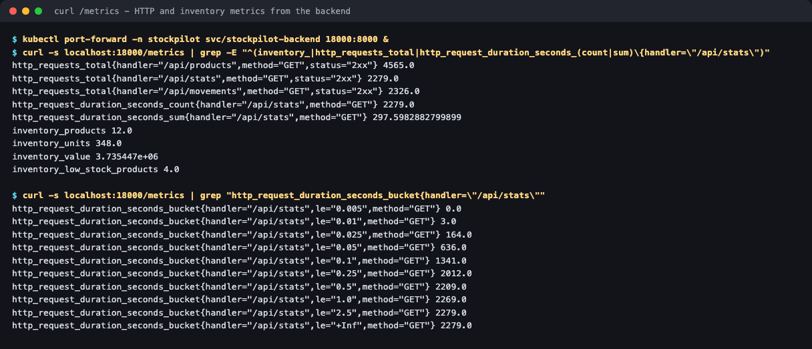

- **Prometheus** scrapes every backend pod via the ServiceMonitor (6/6 UP during the load test):

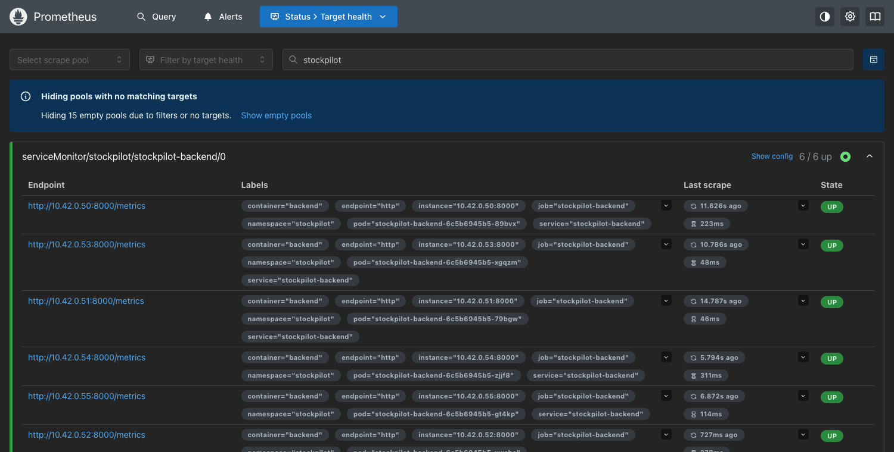

- **Alert rules:**
  - Availability: backend down, 5xx ratio > 5%, p95 > 500 ms, HPA at max.
  - **Business:** products at or below their reorder level.

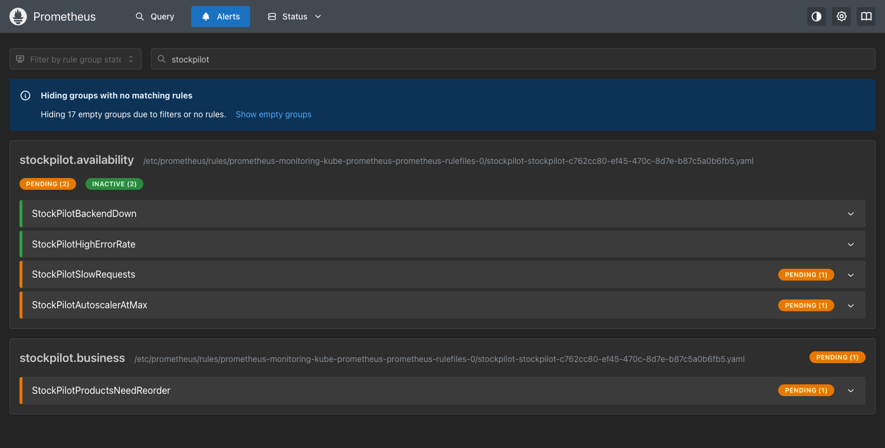

- **Grafana:** the **StockPilot** dashboard ships with the chart
  ([`dashboards/stockpilot.json`](./helm/stockpilot/dashboards/stockpilot.json)). Captured after
  the load test, it shows the whole cycle: request rate, status classes, p95 per route, HPA
  replicas 2 → 6 → 2, CPU and memory per pod, and stock levels.

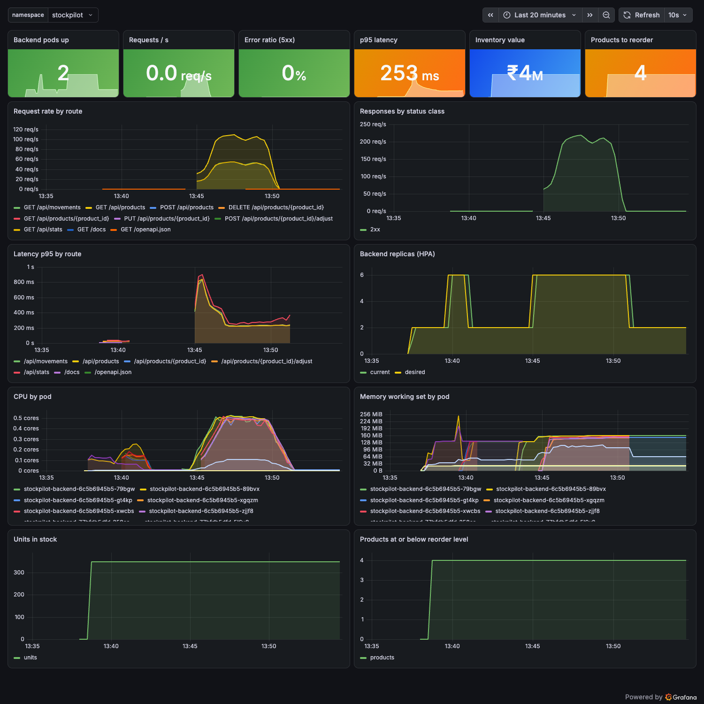

---

## 14. Troubleshooting lab

| Lab | Symptom | Investigation | Root cause | Fix |
|---|---|---|---|---|
| [`broken-image.yaml`](./troubleshooting/broken-image.yaml) | pods `ImagePullBackOff` | `describe pod` → *failed to resolve reference … not found* | image tag typo `1.31-alpinee` | `kubectl set image` to the real tag → rollout succeeds |
| [`broken-service.yaml`](./troubleshooting/broken-service.yaml) | pods Running/Ready, but requests to the Service fail | EndpointSlice empty; Service selector vs `--show-labels` | selector `app=catalog-wbe` matches no pod | patch the selector → 2 endpoints, HTTP 200 |

| Lab 1 | Lab 2 |
|---|---|
| 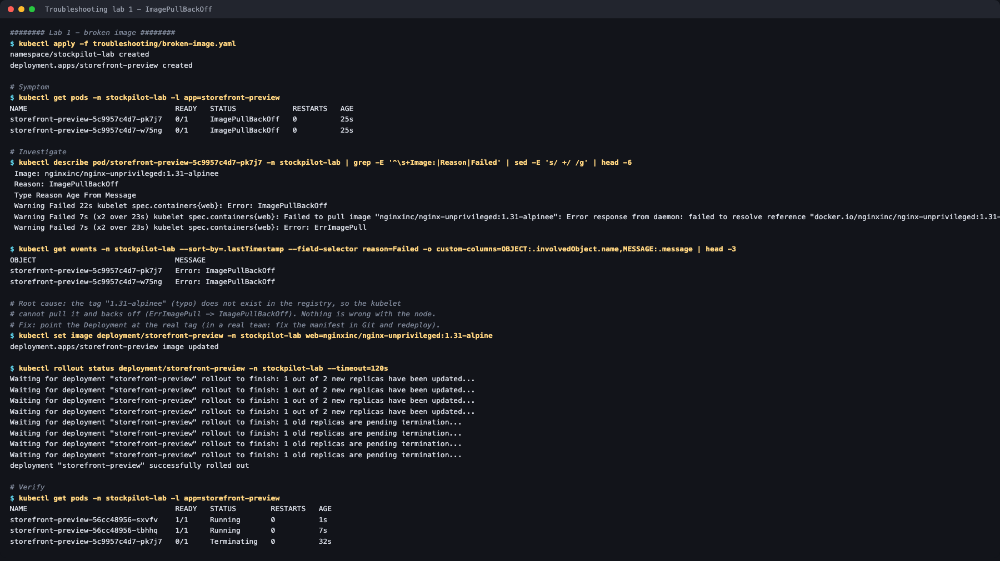 | 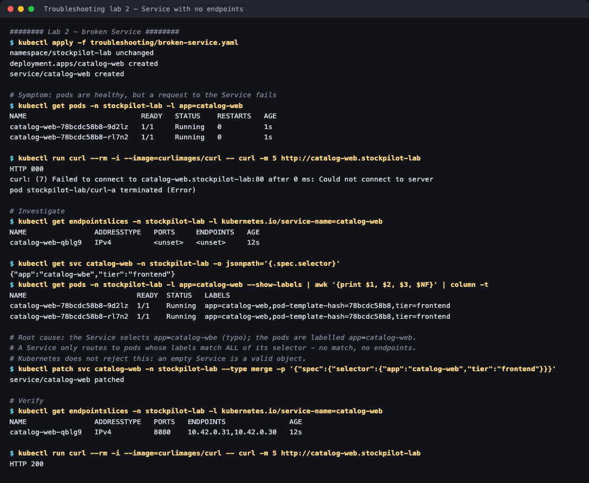 |

---

## 15. Engineering findings

Real problems found by running the system, not just writing it:

1. **Migrations couldn't import the app in the container.** `alembic` is a console script, so the
   working directory isn't on `sys.path`. Under pytest it worked only because pytest adds the
   project root itself. `docker compose up` caught it, and `prepend_sys_path = .` fixed it.
2. **A fixable HIGH CVE in the nginx base image** (above): the gate failed the build, and
   `apk upgrade` fixed it.
3. **Responses echoed the request, not the database.** `POST` returned `"21990"` while `GET`
   returned `"21990.00"`. The fix re-reads the row after commit, and a test pins it.
4. **Latency histogram useless by default.** The per-route buckets were 0.1/0.5/1 s, so every
   millisecond request fell in the first bucket and p95 was just an interpolation. I set buckets
   from 5 ms, with a test.
5. **Ingress path validation.** ingress-nginx rejects dots in `Prefix`/`Exact` paths, so
   `/openapi.json` uses `ImplementationSpecific`.
6. **My own test OOM-killed a pod.** To test the migration lock I first squeezed two extra
   migration processes into a running backend pod. Its 256Mi limit was exceeded, the kernel
   killed the main process (`OOMKilled`), and the extra CPU made the HPA scale to 6. In normal
   operation migrations run *before* uvicorn starts, so they never coexist. I redid the test with
   one migration per pod (a Job), which gave the clean result above.
7. **Slow start-ups.** Four pods starting at once under a 500m CPU limit took about 50 s to become
   Ready. Raising the *limit* to 1 core (request unchanged at 100m) cut this to about 15 s, as seen
   in the HPA test.
8. **Stock changes lock the row** (`SELECT … FOR UPDATE`), so two replicas adjusting the same
   product can't lose an update.

---

## 16. M10 — Live demo script

1. Open `http://stockpilot.local`, add a product, and adjust its stock. Show `/docs`.
2. Run `kubectl exec -n stockpilot stockpilot-postgres-0 -- psql -U stockpilot -c 'TABLE products'`.
3. Make a small visible change (for example the header text in `frontend/src/App.jsx`), then
   `git commit` and `git push`.
4. Watch the 9 jobs in GitHub Actions (tests, scans, images to GHCR tagged with the new SHA,
   Helm deploy and smoke test).
5. Roll the local cluster to the new SHA:
   `helm upgrade stockpilot ./helm/stockpilot -n stockpilot --reuse-values --set backend.image.tag=<sha> --set frontend.image.tag=<sha>`.
   Then `helm history stockpilot -n stockpilot`, and refresh the browser.
6. Run `API=http://stockpilot.local ./scripts/load-test.sh` (without a hosts entry:
   `API=http://localhost HOST_HEADER=stockpilot.local`), then watch `kubectl get hpa -n stockpilot -w`
   and the Grafana dashboard.
7. Apply `troubleshooting/broken-service.yaml` and diagnose it live (see §14).

---

## 17. Submission checklist

| Requirement | Evidence |
|---|---|
| GitHub repository URL | <https://github.com/LAKSHYAMEWARA0025/devops-heros> (`session21-capstone/`) |
| Application runs via `docker compose up --build` | [§8](#8-m4--docker) |
| ≥ 4 REST endpoints (GET, POST, PUT, DELETE) | 10 endpoints: [§1](#1-what-stockpilot-does), Swagger in [§5](#5-m1--application-frontend--backend--database) |
| Alembic migration files | [`backend/alembic/versions/`](./backend/alembic/versions/) (2 migrations) |
| pytest passes, ≥ 5 tests | 20 tests: [§6](#6-m2--testing) |
| backend Dockerfile builds; frontend multi-stage; both non-root | [§8](#8-m4--docker) |
| Workflow on push to `main`; pytest in pipeline; GHCR with SHA tags | [§9](#9-m5--cicd-github-actions) |
| Trivy in pipeline; no secrets committed | [§10](#10-m6--devsecops-trivy) |
| `terraform plan`, VPC + EKS in AWS Console, `terraform destroy` | [§11](#11-m7--terraform-aws-vpc--eks) |
| `kubectl get pods` (all Running), `helm list`, app via Ingress | [§12](#12-m8--kubernetes--helm) |
| `/metrics`, Prometheus targets UP, Grafana dashboard | [§13](#13-m9--observability-prometheus--grafana) |
| README; live demo | this file; demo script in [§16](#16-m10--live-demo-script) |
