# Session 21 — Final DevOps Project: Task Tracker

**Final project submission** · Lakshya Mewara · 24BCS10290

> One small application taken through the **whole DevOps lifecycle**: tested code → a hardened
> container image → security scanning with a hard gate → a container registry → a Helm chart →
> Kubernetes, deployed by **GitOps** (Argo CD) → monitored with Prometheus and Grafana, with the
> cloud infrastructure defined in **Terraform**. A **troubleshooting challenge** breaks a release
> six ways and fixes it from the cluster's own signals.
>
> Everything here was run for real. Every screenshot is a real browser capture or a render of
> real command output. Building and running it surfaced **seven genuine bugs**, all fixed and
> documented below (lost writes, a probe race, three metrics bugs, a silently ignored scanner
> setting, and a missing disruption budget). Two empty dashboard panels and an uninformative
> latency histogram were fixed too.

| | |
|---|---|
| **Application** | Task Tracker REST API — Python 3.12, Flask, gunicorn |
| **Cluster** | k3s `v1.35.0` · ingress-nginx `v1.11.3` · Argo CD `v3.5.4` · kube-prometheus-stack |
| **CI/CD** | GitHub Actions → GHCR, then a Helm deploy to a fresh kind cluster: **4 runs, all green** |
| **Infrastructure** | Terraform `v1.16.5`, AWS provider 5.x, run against a local AWS API emulator (Moto) |
| **Final release** | `1.2.1`, live through `task-tracker.local`, synced by Argo CD from commit `bf74fb9` |

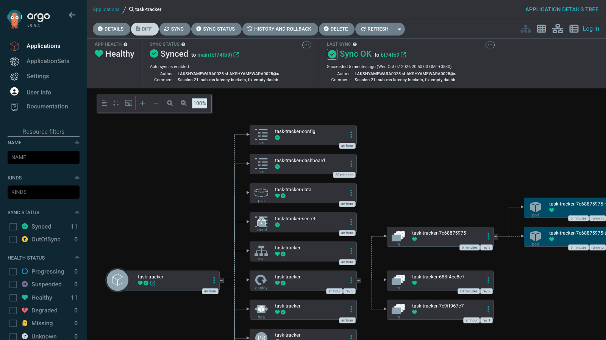

*Argo CD deploying this folder's Helm chart from GitHub: Synced to `main (bf74fb9)`, Healthy, every object green.*

---

## Contents

1. [Project overview](#1-project-overview)
2. [Architecture](#2-architecture)
3. [Repository structure](#3-repository-structure)
4. [Technologies](#4-technologies)
5. [Application](#5-application)
6. [Docker](#6-docker)
7. [Kubernetes](#7-kubernetes)
8. [Helm](#8-helm)
9. [Terraform](#9-terraform)
10. [CI/CD pipeline](#10-cicd-pipeline)
11. [DevSecOps](#11-devsecops)
12. [Monitoring](#12-monitoring)
13. [GitOps](#13-gitops)
14. [Troubleshooting challenge](#14-troubleshooting-challenge)
15. [Screenshots](#15-screenshots)
16. [Lessons learned](#16-lessons-learned)

---

## 1. Project overview

**Task Tracker** is a small REST API for creating and listing tasks. It is deliberately simple,
but it exercises every platform feature the project needs:

| Platform feature | How the app uses it |
|---|---|
| **ConfigMap** | `APP_ENV`, `LOG_LEVEL`, `MAX_TASKS` |
| **Secret** | `API_TOKEN`, required (as a Bearer token) for every write |
| **PersistentVolume** | tasks are stored as JSON on a PVC, so they survive pod restarts |
| **Liveness / readiness probes** | `/healthz` (process alive) and `/readyz` (token configured **and** storage writable) |
| **Prometheus metrics** | `/metrics`: request counter, latency histogram, stored-tasks gauge |
| **Ingress** | served at `http://task-tracker.local/` through ingress-nginx |
| **Autoscaling** | HPA, 2–5 replicas on CPU, with a PodDisruptionBudget |

**Requirement → where → evidence**

| Requirement | Where | Evidence |
|---|---|---|
| Application + tests | [`application/`](./application/) | 13 tests, 96% coverage — [§5](#5-application) |
| Containerisation | [`docker/Dockerfile`](./docker/Dockerfile) | non-root image, 0 fixable HIGH/CRITICAL — [§6](#6-docker) |
| Kubernetes manifests | [`kubernetes/`](./kubernetes/) | Ingress, ConfigMap, Secret, PVC, probes verified — [§7](#7-kubernetes) |
| Helm chart | [`helm/task-tracker/`](./helm/task-tracker/) | lints clean (dev + prod values) — [§8](#8-helm) |
| Infrastructure as Code | [`terraform/`](./terraform/) | 18 resources: plan → apply → verify → destroy — [§9](#9-terraform) |
| CI/CD | [`.github/workflows/`](./.github/workflows/) | 4 green runs, deploy verified in-pipeline — [§10](#10-cicd-pipeline) |
| DevSecOps | [`security/`](./security/) | SAST, SCA, secrets, image scan, gate — [§11](#11-devsecops) |
| Monitoring | [`monitoring/`](./monitoring/), chart templates | scraped, alert rules loaded, dashboard as code — [§12](#12-monitoring) |
| GitOps | [`gitops/`](./gitops/) | 4 deploys = 4 commits, drift self-healed in 2 s — [§13](#13-gitops) |
| Troubleshooting | [`troubleshooting/`](./troubleshooting/) | 6 faults: symptom → root cause → fix → verify — [§14](#14-troubleshooting-challenge) |

---

## 2. Architecture

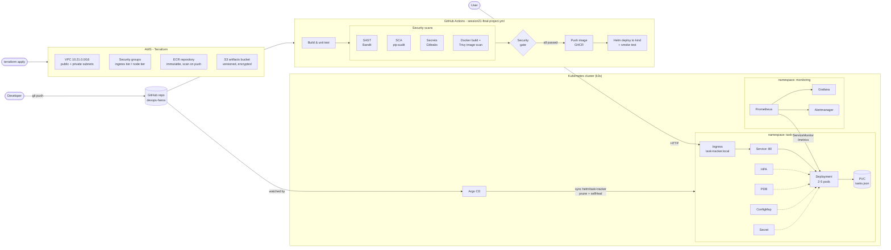
```mermaid
flowchart LR
    dev([Developer]) -- git push --> repo[(GitHub repo<br/>devops-heros)]

    subgraph CI["GitHub Actions - session21-final-project.yml"]
        direction LR
        test[Build & unit test] --> scans
        subgraph scans[Security scans]
            sast[SAST<br/>Bandit]
            sca[SCA<br/>pip-audit]
            sec[Secrets<br/>Gitleaks]
            img[Docker build +<br/>Trivy image scan]
        end
        scans --> gate{Security<br/>gate}
        gate -- all passed --> push[Push image<br/>GHCR]
        push --> kind[Helm deploy to kind<br/>+ smoke test]
    end
    repo --> CI

    subgraph K8S["Kubernetes cluster (k3s)"]
        argo[Argo CD] -- "sync helm/task-tracker<br/>prune + selfHeal" --> ns
        subgraph ns["namespace: task-tracker"]
            ing[Ingress<br/>task-tracker.local] --> svc[Service :80]
            svc --> pods[Deployment<br/>2-5 pods]
            hpa[HPA] -.-> pods
            pdb[PDB] -.-> pods
            cm[ConfigMap] -.-> pods
            secret[Secret] -.-> pods
            pods --> pvc[(PVC<br/>tasks.json)]
        end
        subgraph mon["namespace: monitoring"]
            prom[Prometheus] --> graf[Grafana]
            prom --> am[Alertmanager]
        end
        prom -- "ServiceMonitor<br/>/metrics" --> pods
    end
    repo -- watched by --> argo
    user([User]) -- HTTP --> ing

    subgraph AWS["AWS - Terraform"]
        vpc[VPC 10.21.0.0/16<br/>public + private subnets]
        sg[Security groups<br/>ingress tier / node tier]
        ecr[ECR repository<br/>immutable, scan on push]
        s3[S3 artifacts bucket<br/>versioned, encrypted]
    end
    tf([terraform apply]) --> AWS
```

**The two delivery paths**

- **CI (GitHub Actions)** proves every commit: tests, four security scans, a gate. Only an image
  that passes **all** of them is pushed to GHCR and deployed to a throwaway kind cluster, where
  it is exercised over HTTP.
- **CD (Argo CD)** makes Git the source of truth for the long-lived cluster. A `git push` that
  changes the chart is rolled out automatically, and any manual change in the cluster is reverted.

---

## 3. Repository structure

```text
final-devops-project/
├── application/                 Flask app + tests
│   ├── app/server.py
│   ├── tests/test_server.py     13 tests (incl. a multi-process concurrency test)
│   ├── requirements.txt         runtime deps (pinned)
│   └── requirements-dev.txt     + pytest, pytest-cov
├── docker/Dockerfile            non-root, single worker + threads
├── kubernetes/
│   ├── namespace.yaml
│   └── task-tracker.yaml        plain manifests rendered from the chart (for kubectl users)
├── helm/task-tracker/
│   ├── Chart.yaml               version / appVersion 1.2.1
│   ├── values.yaml              dev defaults
│   ├── values-prod.yaml         prod overrides (existingSecret, 3-10 replicas, 2Gi)
│   ├── dashboards/task-tracker.json   Grafana dashboard (as code)
│   └── templates/               deployment, service, ingress, configmap, secret, pvc,
│                                hpa, pdb, servicemonitor, prometheusrule, grafana-dashboard
├── terraform/                   VPC, subnets, routing, SGs, ECR, S3
├── .github/workflows/pipeline.yml   reference copy (the live workflow is at the repo root)
├── security/                    bandit.yaml, trivy.yaml, .gitleaks.toml, SECURITY.md
├── monitoring/                  kube-prometheus-stack values
├── gitops/argocd-application.yaml
├── troubleshooting/broken-values.yaml
└── screenshots/
```

> GitHub only runs workflows from the **repository root**, so the live pipeline is
> [`/.github/workflows/session21-final-project.yml`](../../.github/workflows/session21-final-project.yml).
> [`.github/workflows/pipeline.yml`](./.github/workflows/pipeline.yml) in this folder is an identical, annotated copy.

---

## 4. Technologies

| Area | Tools |
|---|---|
| Application | Python 3.12, Flask 3.1, gunicorn 23 (gthread), prometheus-client |
| Testing | pytest, pytest-cov |
| Containers | Docker, `python:3.12-slim` base |
| Orchestration | Kubernetes (k3s v1.35), ingress-nginx, local-path storage, metrics-server |
| Packaging | Helm 3 chart (linted and rendered with Helm v4.3) |
| Infrastructure as Code | Terraform v1.16.5, `hashicorp/aws` ~> 5.0, `hashicorp/random` |
| CI/CD | GitHub Actions, GitHub Container Registry, kind |
| Security | Bandit (SAST), pip-audit (SCA), Gitleaks (secrets), Trivy (image) |
| Monitoring | Prometheus Operator (kube-prometheus-stack), Grafana, Alertmanager |
| GitOps | Argo CD v3.5.4 (automated sync, prune, self-heal) |

---

## 5. Application

**Endpoints**

| Method | Path | Auth | Purpose |
|---|---|---|---|
| GET | `/` | – | service info and version |
| GET | `/healthz` | – | liveness: the process is up |
| GET | `/readyz` | – | readiness: token configured **and** `/data` writable, else `503` with the reason |
| GET | `/metrics` | – | Prometheus metrics |
| GET | `/api/tasks` | – | list tasks |
| POST | `/api/tasks` | Bearer token | create `{"title": "..."}` — `401` without token, `400` bad title, `409` at `MAX_TASKS` |

**Run and test locally**

```bash
cd application
pip install -r requirements-dev.txt
python -m pytest -v --cov=app            # 13 passed, 96% coverage
API_TOKEN=dev DATA_DIR=/tmp/tasks python -m app.server
```

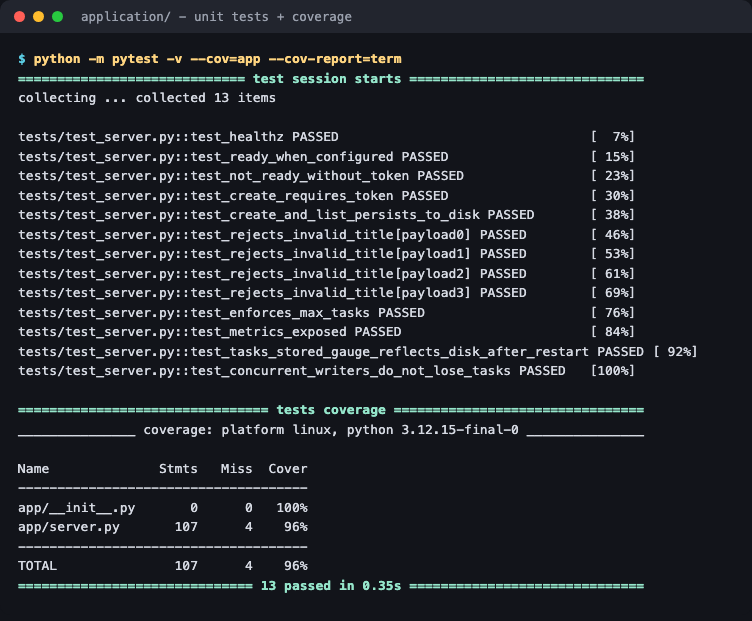

**Bug found and fixed — lost writes under concurrency.** The original code guarded writes
with a `threading.Lock`. That lock only covers the threads of *one* process. gunicorn runs
worker processes and every replica mounts the same volume, so two writers could each read
`tasks.json`, append, and overwrite each other. The new test
`test_concurrent_writers_do_not_lose_tasks` (4 processes × 25 writes) proved it against the
original code: **only 25 of 100 tasks survived**. The fix is an `fcntl.flock` on the volume (RWO
volumes are single-node, where flock is honoured). The same test now passes, and in the cluster
41 writes through the Ingress (1, then 40 in parallel), split 21/20 across both pods, all landed:
41 tasks, 41 unique IDs (see [§7](#7-kubernetes)).

**Also fixed — readiness probe race.** Every replica wrote and then deleted the *same*
`/data/.probe` file. One pod could delete another's file mid-check and fail its readiness. Each
pod and worker now uses its own probe file.

---

## 6. Docker

[`docker/Dockerfile`](./docker/Dockerfile) — build context is `application/`:

```bash
docker build -f docker/Dockerfile --build-arg APP_VERSION=1.2.1 -t task-tracker:1.2.1 application/
```

| Decision | Why |
|---|---|
| `python:3.12-slim` | small Debian base with a maintained security feed |
| dependencies installed before the code is copied | the pip layer is cached across code changes |
| non-root user, UID **10001** | matches `runAsUser` / `runAsNonRoot` in the chart |
| `/data` owned by the app user | the PVC mount point is writable without running as root |
| `.dockerignore` excludes `tests/`, caches | smaller image, no test code shipped |
| `--workers 1 --threads 4` | one metrics registry per pod (see [§12](#12-monitoring)); scale by replicas, not workers |
| `APP_VERSION` build arg | the running version is visible at `/` and `/readyz` |

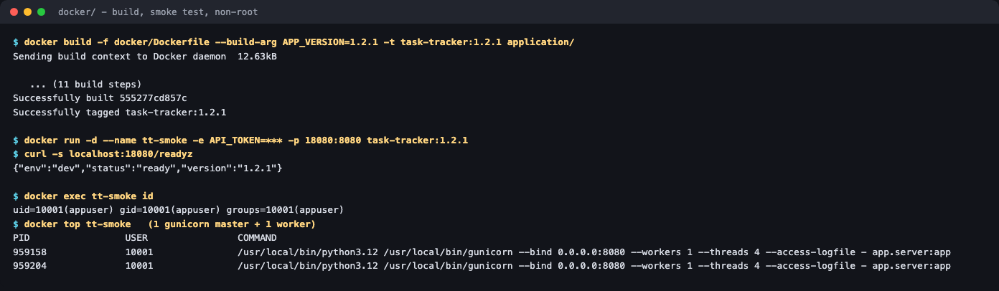

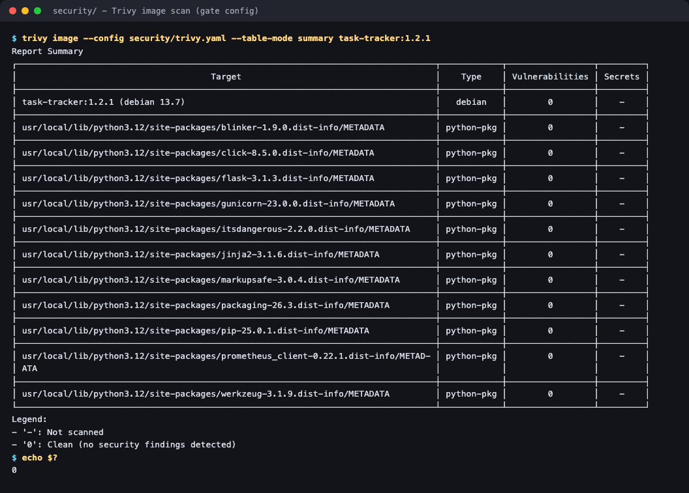

*Trivy with the gate configuration: 0 fixable HIGH/CRITICAL findings, exit code 0.*

---

## 7. Kubernetes

The chart renders these objects. A plain-YAML copy for `kubectl` users is in
[`kubernetes/task-tracker.yaml`](./kubernetes/task-tracker.yaml), generated with `helm template`:

| Object | Key settings |
|---|---|
| **Deployment** | liveness `/healthz`, readiness `/readyz`; requests 50m/64Mi, limits 300m/192Mi; non-root, read-only root FS, all capabilities dropped, `RuntimeDefault` seccomp; `checksum/config` and `checksum/secret` annotations roll the pods when config changes |
| **Service** | ClusterIP `:80` → named port `http` |
| **Ingress** | class `nginx`, host `task-tracker.local` |
| **ConfigMap** | `APP_ENV`, `LOG_LEVEL`, `MAX_TASKS` (loaded with `envFrom`) |
| **Secret** | `API_TOKEN`, demo value in dev; prod uses `existingSecret` |
| **PersistentVolumeClaim** | 256Mi RWO, cluster default storage class |
| **HorizontalPodAutoscaler** | 2–5 replicas at 60% CPU |
| **PodDisruptionBudget** | `minAvailable: 1`, rendered only when there are ≥ 2 replicas |
| **ServiceMonitor / PrometheusRule / dashboard ConfigMap** | monitoring (see [§12](#12-monitoring)) |

```bash
kubectl apply -f kubernetes/namespace.yaml
kubectl apply -f kubernetes/task-tracker.yaml -n task-tracker
```

**End-to-end verification through the Ingress** covers config and secret injection, token
enforcement and concurrent writes:

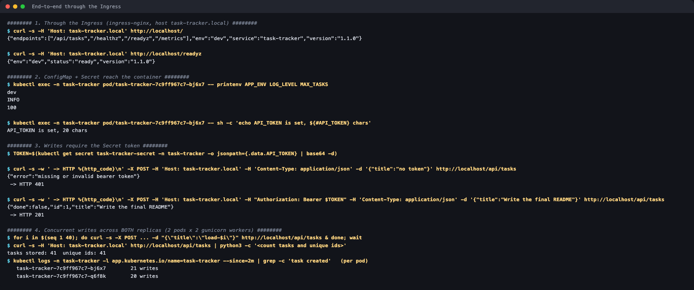

The same page in a real browser (Chrome resolving `task-tracker.local` to the Ingress):

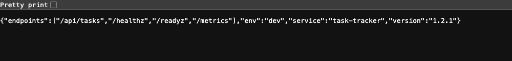

**Persistence:** every pod was deleted at once. The replacement pods mounted the same PVC and
all 41 tasks were still there.

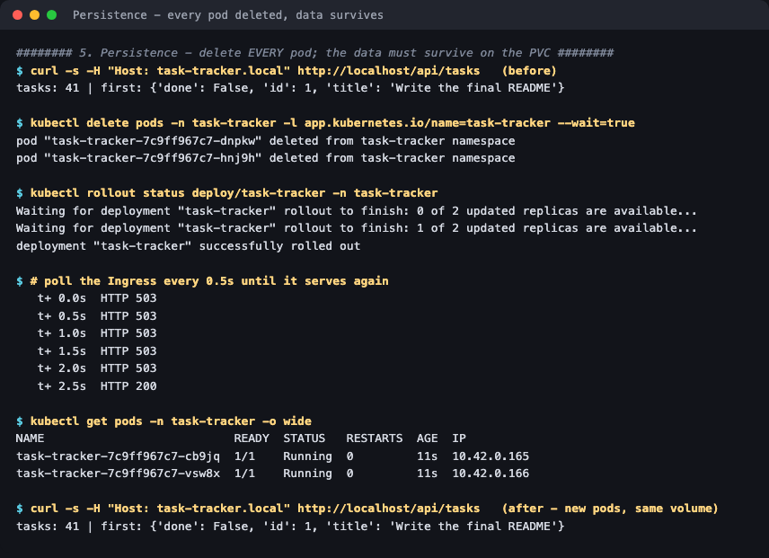

> **Finding:** for about **2.5 s** after `rollout status` reported success, the Ingress
> returned `503`. Deleting *all* pods leaves the Service with zero endpoints, and ingress-nginx
> refreshes its upstream list slightly after pods become Ready. Real voluntary disruptions
> (node drains, upgrades) go through the eviction API, so the chart now ships a
> **PodDisruptionBudget**: evictions are allowed only while another pod stays available.

---

## 8. Helm

```bash
helm lint helm/task-tracker                                        # dev values
helm lint helm/task-tracker -f helm/task-tracker/values-prod.yaml  # prod values
helm template task-tracker helm/task-tracker -n task-tracker       # render
helm upgrade --install task-tracker helm/task-tracker -n task-tracker --create-namespace
```

| | `values.yaml` (dev) | `values-prod.yaml` |
|---|---|---|
| replicas / HPA | 2 / 2–5 | 3 / 3–10 |
| `LOG_LEVEL`, `MAX_TASKS` | INFO, 100 | WARNING, 1000 |
| API token | demo value rendered into a Secret | `existingSecret: task-tracker-api-token` — never in Git |
| storage | 256Mi | 2Gi |
| resources | 50m / 64Mi → 300m / 192Mi | 100m / 128Mi → 500m / 256Mi |

Chart design points:

- **Checksum annotations.** Env vars are fixed at container start, so a ConfigMap change alone
  would never reach running pods. A hash of the rendered ConfigMap and Secret in the pod
  template makes Helm and Argo CD roll the pods whenever either changes.
- **The PDB is conditional.** With a single replica, `minAvailable: 1` would block every node drain.
- **Monitoring is optional.** ServiceMonitor, PrometheusRule and dashboard are behind
  `monitoring.enabled`, so the chart also installs on clusters without the Prometheus Operator
  (the CI kind cluster sets it to `false`).

---

## 9. Terraform

[`terraform/`](./terraform/) provisions the AWS foundation the cluster would run on:

| Resource | Configuration |
|---|---|
| `aws_vpc` | `10.21.0.0/16`, DNS support and hostnames |
| `aws_subnet.public` ×2 | `10.21.0.0/24`, `10.21.1.0/24` across 2 AZs, public IPs on launch |
| `aws_subnet.private` ×2 | `10.21.10.0/24`, `10.21.11.0/24`, **no** public IPs (worker nodes) |
| `aws_internet_gateway`, `aws_route_table` (+2 associations) | public subnets route `0.0.0.0/0` to the IGW |
| `aws_security_group.ingress` | 80/443 from the internet, nothing else |
| `aws_security_group.nodes` | NodePorts **only from the ingress SG**; 6443 only from `admin_cidr`; node-to-node |
| `aws_ecr_repository` + lifecycle policy | **IMMUTABLE** tags, scan on push, AES256, keep last 20 images |
| `aws_s3_bucket` + versioning, SSE, public-access block | artifacts and backups; all four public-access blocks on |

Guard-rails written into the code:

- `environment` is validated (`dev | staging | prod`).
- `admin_cidr` **must not be `0.0.0.0/0`**: the plan fails before anything is created.
- `force_destroy` / `force_delete` are only true outside `prod`, so a prod bucket or registry is never emptied automatically.
- Credentials never live in the code. With `use_local_emulator = false` they come from the environment, a profile or SSO.

```bash
cd terraform
terraform init && terraform fmt -check && terraform validate
terraform plan -out=tfplan
terraform apply tfplan
terraform output
terraform destroy
```

> **Where it ran:** against **Moto**, a local AWS API emulator serving the real EC2, S3, ECR and
> STS APIs, so the full lifecycle ran without a cloud bill. Switching to real AWS only means
> setting `use_local_emulator = false`.

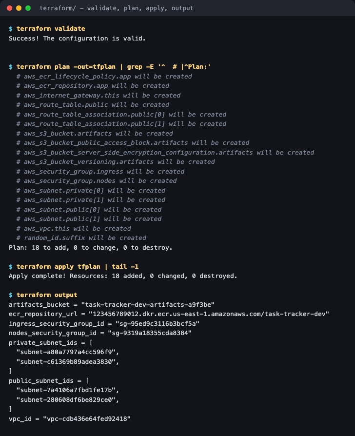

The resources were then checked **independently of Terraform**, directly through the AWS APIs,
before being destroyed:

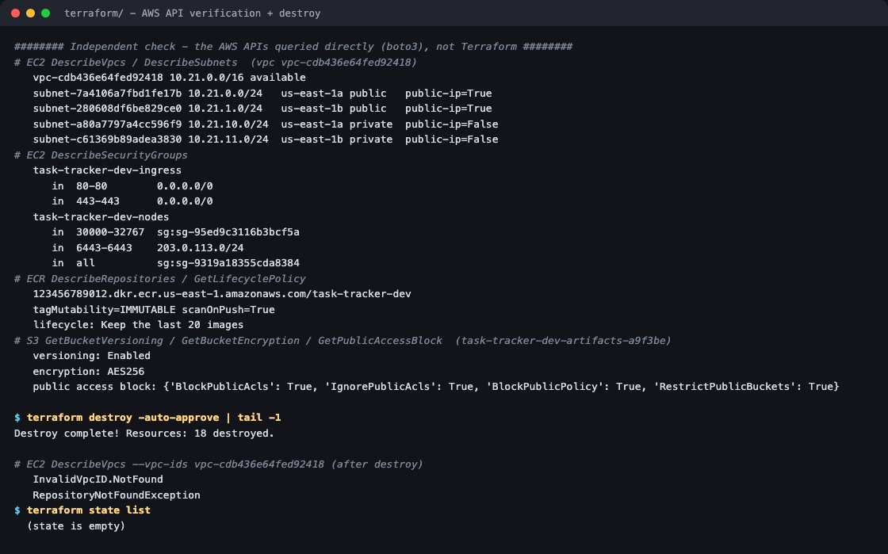

---

## 10. CI/CD pipeline

[`session21-final-project.yml`](../../.github/workflows/session21-final-project.yml) runs on every
push or PR that touches this project:

```text
build-test ──┬── sast (Bandit) ───────────┐
             ├── sca (pip-audit) ─────────┤
             ├── secret-scan (Gitleaks) ──┼── security-gate ── push-image (GHCR) ── deploy (Helm → kind + verify)
             └── image-scan (build+Trivy) ┘
```

| Job | What it does |
|---|---|
| **Build & unit test** | installs deps, runs pytest with coverage, uploads JUnit results |
| **SAST / SCA / Secret scan** | run in parallel; configuration is read from [`security/`](./security/) |
| **Docker build & image scan** | builds `ghcr.io/<owner>/session21-task-tracker:<short-sha>`, scans it, and saves it as an artifact |
| **Security gate** | `if: always()`; prints a summary table and **fails unless all four scans succeeded** |
| **Push image** | loads the **exact scanned artifact** (no rebuild) and pushes it to GHCR with the job's `GITHUB_TOKEN` — no stored credentials |
| **Helm deploy to Kubernetes** | creates a kind cluster, pulls the pushed image, runs `helm upgrade --install`, then creates and reads a task over HTTP |

Pull requests run everything up to the gate; only pushes to `main` publish and deploy.

| Run | Commit | Result |
|---|---|---|
| [#1](https://github.com/LAKSHYAMEWARA0025/devops-heros/actions/runs/37638092490) | `ddf2c5f` initial project | ✅ success |
| [#2](https://github.com/LAKSHYAMEWARA0025/devops-heros/actions/runs/37639250750) | `84ae365` concurrency + metrics fixes (v1.2.0) | ✅ success (3m 18s) |
| [#3](https://github.com/LAKSHYAMEWARA0025/devops-heros/actions/runs/37642058403) | `3b363a5` Grafana dashboard | ✅ success |
| [#4](https://github.com/LAKSHYAMEWARA0025/devops-heros/actions/runs/37642440629) | `bf74fb9` latency buckets (v1.2.1) | ✅ success |

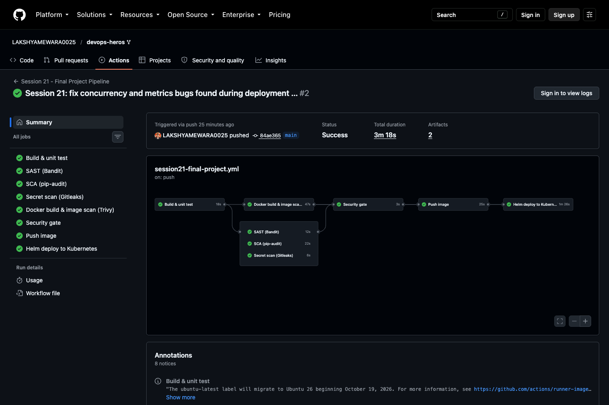

The deploy job's own output: the release is installed on a fresh cluster and answers over HTTP.

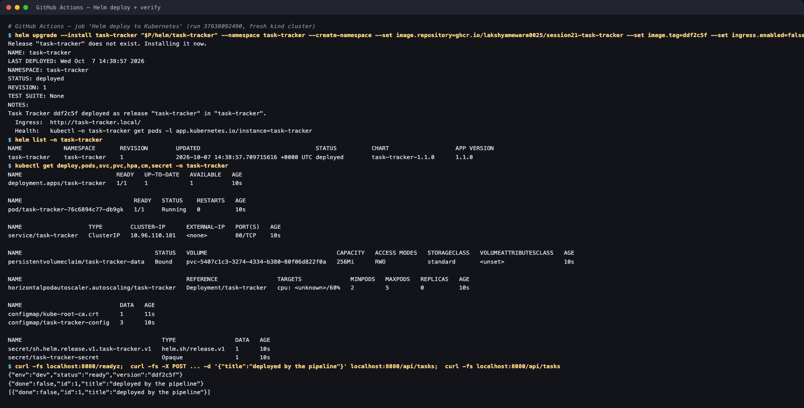

---

## 11. DevSecOps

| Control | Tool | Config | Fails the pipeline on |
|---|---|---|---|
| SAST | Bandit | [`security/bandit.yaml`](./security/bandit.yaml) | MEDIUM severity and above |
| SCA | pip-audit | `application/requirements.txt` | any known vulnerability |
| Secret scanning | Gitleaks | [`security/.gitleaks.toml`](./security/.gitleaks.toml) | any finding |
| Image scanning | Trivy | [`security/trivy.yaml`](./security/trivy.yaml) | fixable HIGH / CRITICAL |
| Gate | workflow logic | `security-gate` job | any scan not `success` — the image is never pushed |

**Runtime hardening:** non-root UID 10001, `readOnlyRootFilesystem`, all Linux capabilities
dropped, `allowPrivilegeEscalation: false`, `RuntimeDefault` seccomp. Writable paths are only the
PVC (`/data`) and an `emptyDir` at `/tmp`.

**Secrets:** dev uses a clearly-labelled demo token. Prod points `secret.existingSecret` at a
Secret created out-of-band (Sealed Secrets / External Secrets), so no credential is ever in Git.
CI pushes to GHCR with the short-lived `GITHUB_TOKEN`. Full summary in
[`security/SECURITY.md`](./security/SECURITY.md).

Two security-tooling issues were found and fixed before the pipeline went live:

1. **Trivy was silently ignoring `ignore-unfixed`.** In current Trivy that key lives under
   `vulnerability:`. At the top level it is an unknown key and is dropped without a warning. The
   gate therefore failed (exit 1) on **44 HIGH findings in Debian packages that have no fix
   available** (`affected` / `fix_deferred`), so it would have blocked every build. With the
   key moved, the gate fails only on findings you can act on.
2. **Gitleaks false positive.** The `checksum/secret` annotation (a SHA-256 of the rendered
   Secret) looks like a high-entropy key. Instead of allowlisting the whole file, the allowlist
   matches only the exact annotation pattern. A planted GitHub token was **still caught**
   afterwards, which proves the exception is narrow.

---

## 12. Monitoring

The chart ships its own monitoring, so it is deployed (and versioned) with the app:

- **ServiceMonitor:** Prometheus scrapes `/metrics` on every pod (2/2 targets up).
- **PrometheusRule:**
  - `TaskTrackerDown` (critical): no healthy target for 30 s.
  - `TaskTrackerHighErrorRate` (warning): more than 5% of requests are 5xx for 1 min.
  - `TaskTrackerHighCPU` (warning): above 0.4 cores for 1 min.
- **Grafana dashboard as code:** [`helm/task-tracker/dashboards/task-tracker.json`](./helm/task-tracker/dashboards/task-tracker.json),
  shipped as a ConfigMap labelled `grafana_dashboard: "1"`. Grafana's sidecar loads it from any namespace.

| Metric | Type | Labels |
|---|---|---|
| `tasks_http_requests_total` | counter | `method`, `path`, `status` |
| `tasks_http_request_duration_seconds` | histogram (0.5 ms … 1 s) | `path` |
| `tasks_stored` | gauge | – |

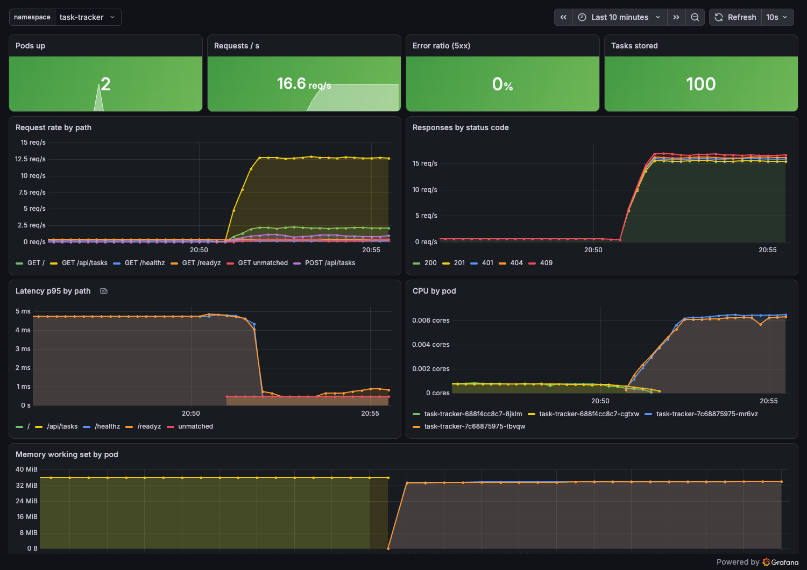

*The dashboard shipped with the chart, under steady test traffic. **Latency p95** shows the v1.2.1 rollout at about 20:50: the flat 4.75 ms line (the old 5 ms first bucket) gives way to real sub-millisecond values. **Tasks stored** reached `MAX_TASKS` = 100, so later writes return `409` (visible under status codes): the limit working as designed.*

| Prometheus — targets | Prometheus — alert rules |
|---|---|
| 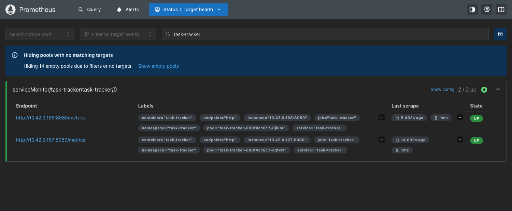 | 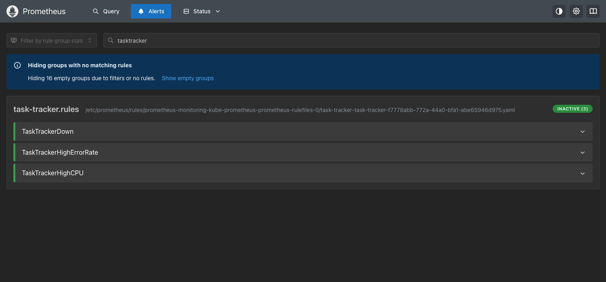 |

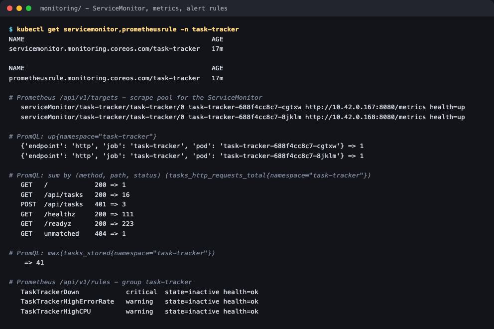

**Monitoring bugs found by looking at the real data, and fixed:**

| Symptom | Root cause | Fix |
|---|---|---|
| Per-route query showed only `endpoint="http"` | The app's `endpoint` label collided with the `endpoint` target label that Prometheus Operator adds, and was silently renamed `exported_endpoint` | label renamed to `path`; a test asserts no `endpoint=` label |
| `tasks_stored` = **0** with 41 tasks on disk | the gauge was only set on write, so every restarted pod reported 0 | computed from disk at scrape time; regression test added |
| Counters jumped between scrapes | 2 gunicorn workers = 2 separate registries; each scrape hit a random one and `rate()` saw false counter resets | 1 worker × 4 threads per pod |
| p95 latency flat at exactly 4.75 ms | every request was under the first default bucket (5 ms), so the quantile was pure interpolation | buckets from 0.5 ms |
| "Error ratio" and "Memory" panels: *No data* | no 5xx series exist when all is well; this cluster's cAdvisor emits no `image` label | `or vector(0)`; filter on `pod` only |

---

## 13. GitOps

[`gitops/argocd-application.yaml`](./gitops/argocd-application.yaml) points Argo CD at
`helm/task-tracker` on `main`, with `automated: {prune: true, selfHeal: true}` and `CreateNamespace=true`.

```bash
kubectl apply -f gitops/argocd-application.yaml     # the only manual step - from here on, Git drives
```

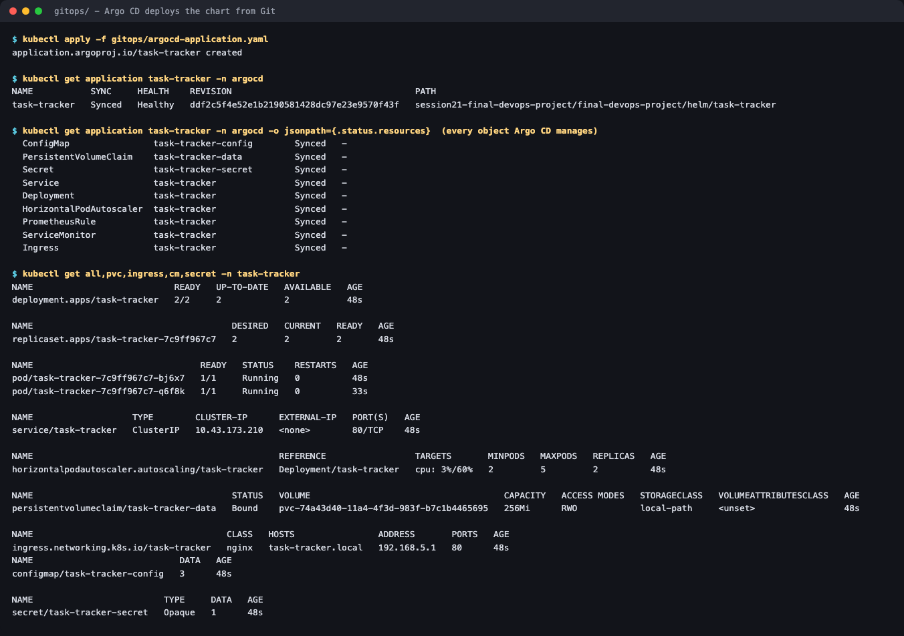

**Shipping a change is a `git push`.** v1.2.0 was released by pushing the commit; Argo CD rolled
it out and the data survived the upgrade:

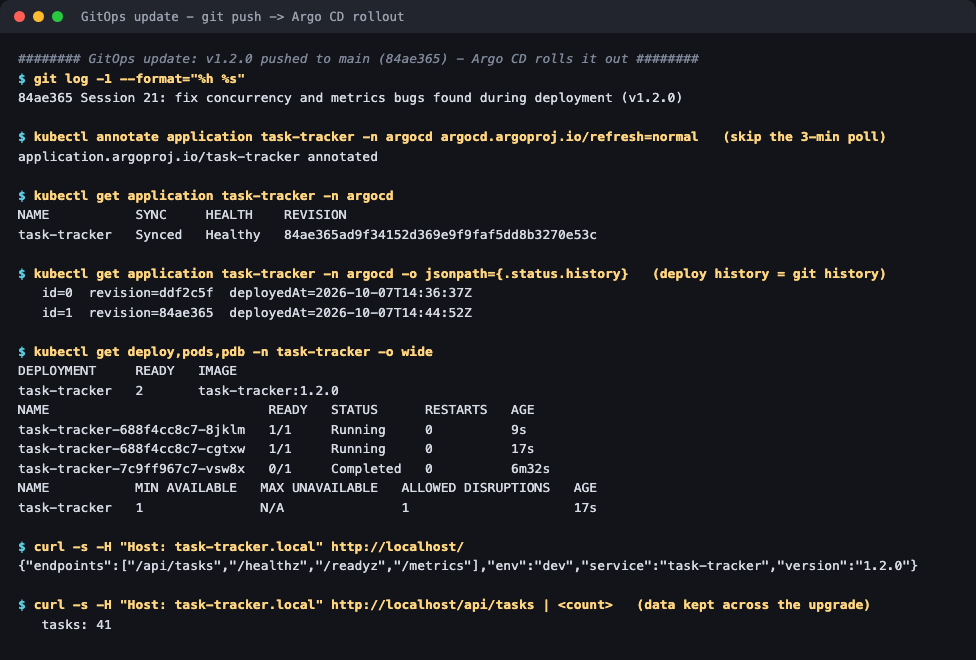

After four pushes, the deploy history is exactly the git history:

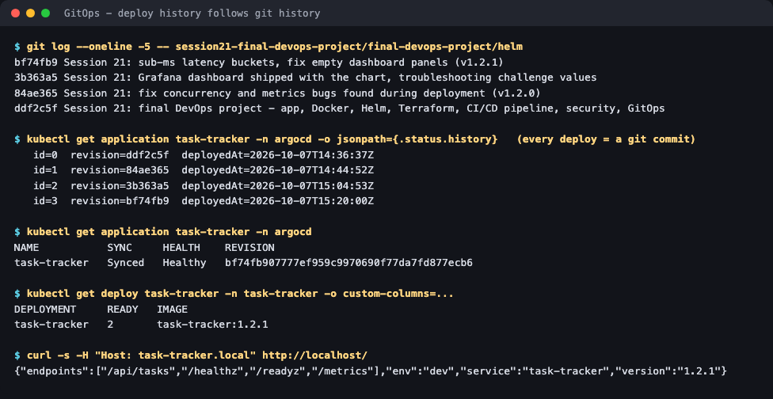

**Self-healing.** A manual `kubectl patch` of the ConfigMap (`LOG_LEVEL=DEBUG`) was reverted to
the Git value within about **2 seconds**:

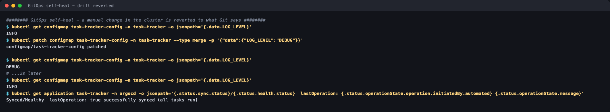

---

## 14. Troubleshooting challenge

[`troubleshooting/broken-values.yaml`](./troubleshooting/broken-values.yaml) is a deliberately
broken configuration of the same chart. It was installed into a scratch namespace (`tt-lab`, not
managed by Argo CD), together with a Secret created the way a hurried operator might:
`--from-literal=API_TOKEN=$LAB_TOKEN`, with `LAB_TOKEN` never set. **`helm lint` passes on all
of it.** Lint checks structure, not whether the release can run.

```bash
kubectl create secret generic task-tracker-lab-token -n tt-lab --from-literal=API_TOKEN=$LAB_TOKEN
helm install task-tracker-lab ../helm/task-tracker -n tt-lab --create-namespace -f broken-values.yaml
```

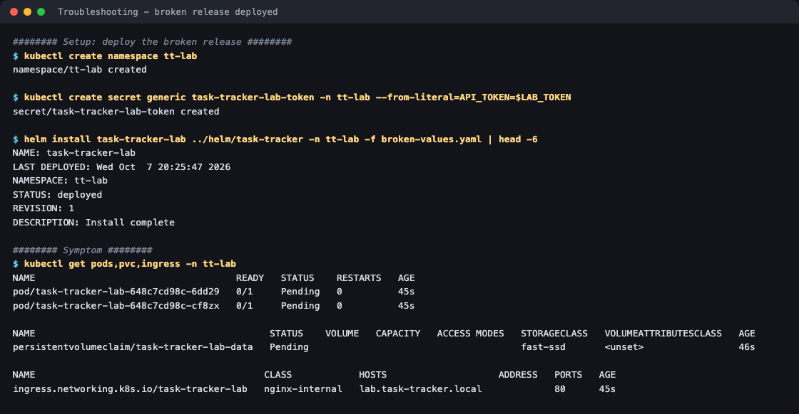

The faults were layered: each fix revealed the next, as in a real incident. Every one was
diagnosed from cluster signals (events, `describe`, logs, endpoints), never from the values file.

| # | Symptom | Investigation | Root cause | Fix | Verified by |
|---|---|---|---|---|---|
| 1 | Pods `Pending` | pod events: *unbound PersistentVolumeClaims*; PVC events: *storageclass "fast-ssd" not found*; `kubectl get storageclass` | PVC requests a class that doesn't exist | storage class → cluster default. **PVC specs are immutable**, so the upgrade was rejected; the claim had never bound (no volume, no data), so it was deleted and recreated | PVC `Bound` |
| 2 | `ImagePullBackOff` | `describe`: *pull access denied for task-tracker*; `docker images` lists no `1.3.0` | tag `1.3.0` was never built; with `IfNotPresent` the kubelet falls back to Docker Hub | deploy `1.2.0`, the scanned release at the time | image pulled |
| 3 | New pod restarting; **rollout stalled** with the old broken pods kept | `lastState: Error, exit 137` — events: *Liveness probe failed: dial tcp :8000: connection refused*; logs: *Listening at 0.0.0.0:8080* | `containerPort` / probe port **8000** but gunicorn binds **8080**. `containerPort` is only metadata | target port → 8080 | probes reach the app |
| 4 | Probes now **time out**; logs full of *Worker was sent SIGKILL! Perhaps out of memory?* | `kubectl top` on the healthy release: **33Mi**; limit is **24Mi** | memory limit below the app's footprint. The kernel kills the gunicorn **worker** (a child), not PID 1, so the pod never shows `OOMKilled` | limit 192Mi / request 64Mi | 0 SIGKILLs, 0 restarts |
| 5 | `Running` but `0/1` Ready; Service has **no endpoints** | in-pod `/readyz` → `503 API_TOKEN not configured`; Secret's `API_TOKEN` is **0 bytes** | the Secret was created from an unset shell variable | recreate it with a generated value, then `rollout restart`: env vars are read at start, and the chart's checksum only covers Secrets **it** renders | 2/2 Ready, 2 endpoints |
| 6 | Pods healthy, but the URL returns **404** | Ingress has no ADDRESS; `kubectl get ingressclass` shows only `nginx`; controller log: *Ignoring ingress … error while validating ingress class* | `ingressClassName: nginx-internal` doesn't exist, so no controller claims the Ingress | class → `nginx` | `/readyz` 200 and an authenticated write through the Ingress |

| | |
|---|---|
| 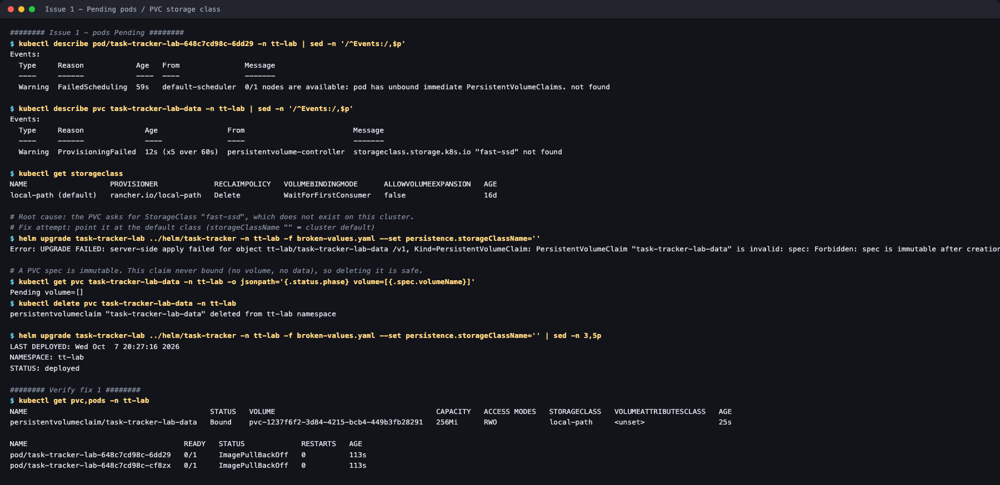 | 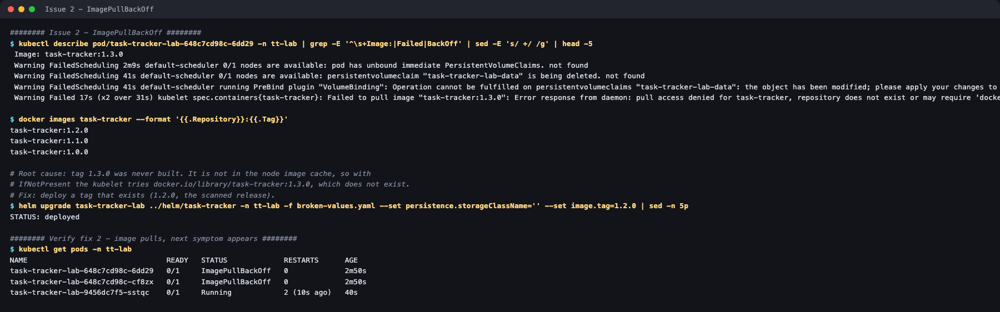 |
| 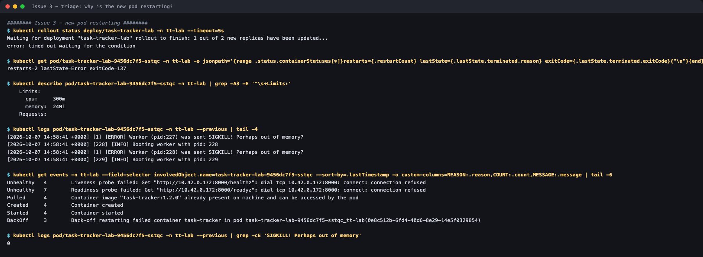 | 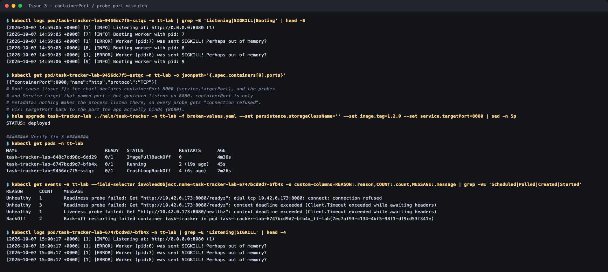 |
| 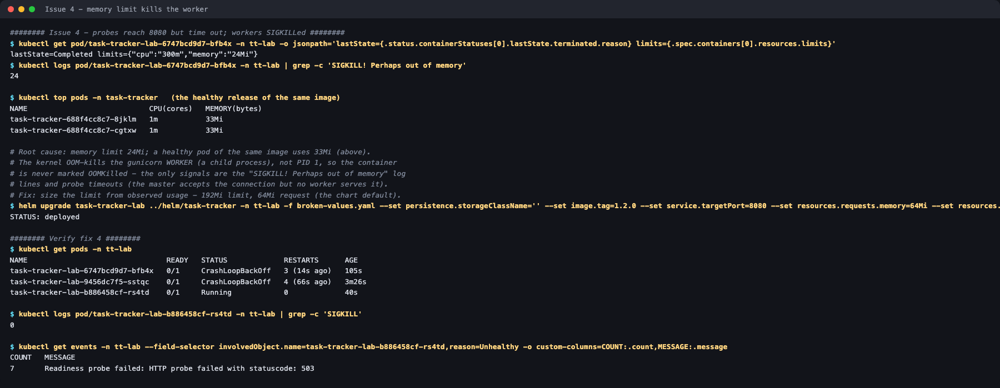 | 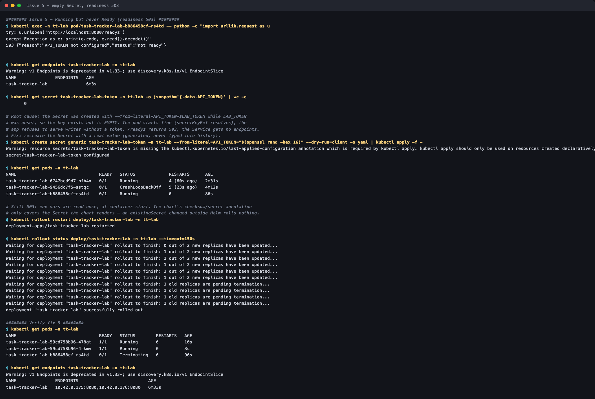 |

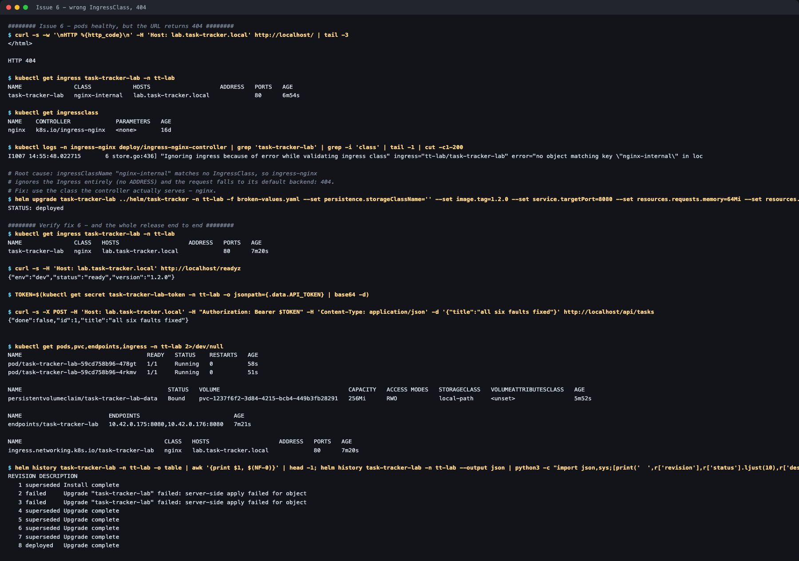

What the challenge taught:

- **Read events before logs.** Issues 1, 2, 3 and 6 were named outright by events or controller logs.
- **One symptom can have two causes.** Issue 3's restarts had both a wrong probe port *and*
  OOM-killed workers. Fixing the port turned "connection refused" into "timeout", which exposed the memory fault.
- **A stalled rollout keeps the old pods.** With `maxUnavailable: 0` (the default for 2 replicas),
  the old pods stay until a new one is Ready. That's safe, but it means fixing the new pods is what unblocks it.
- **`OOMKilled` is not the only signature of OOM.** When a child process is killed, look for
  exit 137, `SIGKILL` lines in the logs and probe timeouts.
- **Valid ≠ correct.** An empty secret, a non-existent class, an unbuilt tag: all pass schema
  validation. Only the running system shows them, which is why readiness checks that validate
  real dependencies matter.

---

## 15. Screenshots

| # | Screenshot | Section |
|---|---|---|
| 01 | [Argo CD application tree](./screenshots/01-argocd-app-tree.png) | GitOps |
| 02 | [Grafana dashboard](./screenshots/02-grafana-dashboard.png) | Monitoring |
| 03 | [GitHub Actions pipeline run](./screenshots/03-github-actions-pipeline.png) | CI/CD |
| 04 | [Prometheus targets](./screenshots/04-prometheus-targets.png) | Monitoring |
| 05 | [Prometheus alert rules](./screenshots/05-prometheus-alert-rules.png) | Monitoring |
| 06 | [Unit tests + coverage](./screenshots/06-tests-coverage.png) | Application |
| 07 | [Docker build + smoke test](./screenshots/07-docker-build-smoke.png) | Docker |
| 08 | [Trivy image scan](./screenshots/08-trivy-image-scan.png) | DevSecOps |
| 09 | [Terraform plan + apply](./screenshots/09-terraform-plan-apply.png) | Terraform |
| 10 | [Terraform verify + destroy](./screenshots/10-terraform-verify-destroy.png) | Terraform |
| 11 | [CI Helm deploy + verify](./screenshots/11-ci-helm-deploy-verify.png) | CI/CD |
| 12 | [Argo CD sync + resources](./screenshots/12-argocd-sync-resources.png) | GitOps |
| 13 | [End-to-end via Ingress](./screenshots/13-e2e-ingress-config-secret.png) | Kubernetes |
| 14 | [Persistence](./screenshots/14-persistence-pvc.png) | Kubernetes |
| 15 | [GitOps update](./screenshots/15-gitops-update-v1.2.0.png) | GitOps |
| 16 | [GitOps self-heal](./screenshots/16-gitops-selfheal.png) | GitOps |
| 17 | [Monitoring via Prometheus API](./screenshots/17-monitoring-prometheus.png) | Monitoring |
| 18–25 | Troubleshooting [0](./screenshots/18-lab-0-broken-release.png) · [1](./screenshots/19-lab-1-pvc-storageclass.png) · [2](./screenshots/20-lab-2-imagepullbackoff.png) · [3a](./screenshots/21-lab-3-triage-restarts.png) · [3b](./screenshots/22-lab-3-port-mismatch.png) · [4](./screenshots/23-lab-4-memory-limit.png) · [5](./screenshots/24-lab-5-empty-secret.png) · [6](./screenshots/25-lab-6-ingress-class.png) | Troubleshooting |
| 26 | [GitOps deploy history](./screenshots/26-gitops-deploy-history.png) | GitOps |
| 27 | [App in a browser via Ingress](./screenshots/27-app-via-ingress-browser.png) | Kubernetes |

---

## 16. Lessons learned

1. **Deploying is where the bugs are.** Unit tests passed from day one, yet running the system
   for real exposed lost writes, a probe race and three separate metrics bugs. None was visible
   until there were real replicas, real workers and a real Prometheus.
2. **A lock is only as wide as its scope.** `threading.Lock` → one process. Replicas and workers
   needed a lock on the shared resource itself. A test that used real processes was the only thing that proved it.
3. **Security tooling can fail silently.** One misplaced YAML key made Trivy block every build on
   unfixable findings. Gate configuration needs testing like code: check what it passes *and* what it blocks.
4. **Make exceptions narrow and prove it.** The Gitleaks allowlist matches one annotation
   pattern, and a planted token is still caught.
5. **Metrics need the same care as code.** Reserved labels, per-process registries and default
   histogram buckets each produced plausible-looking but wrong numbers.
6. **Immutable artifacts.** The image that passed the scans is the one pushed (saved as an
   artifact, never rebuilt), ECR tags are immutable, and a fixed release got a new version
   (`1.2.0` → `1.2.1`) instead of overwriting a tag.
7. **Git as the source of truth pays off.** Every deploy maps to a commit, rollback is a
   revert, and manual drift was undone in 2 seconds.
8. **Guard-rails belong in code.** Terraform validation rejects an open admin CIDR, `force_destroy`
   is off in prod, and the PDB only renders when it can't block a drain.
