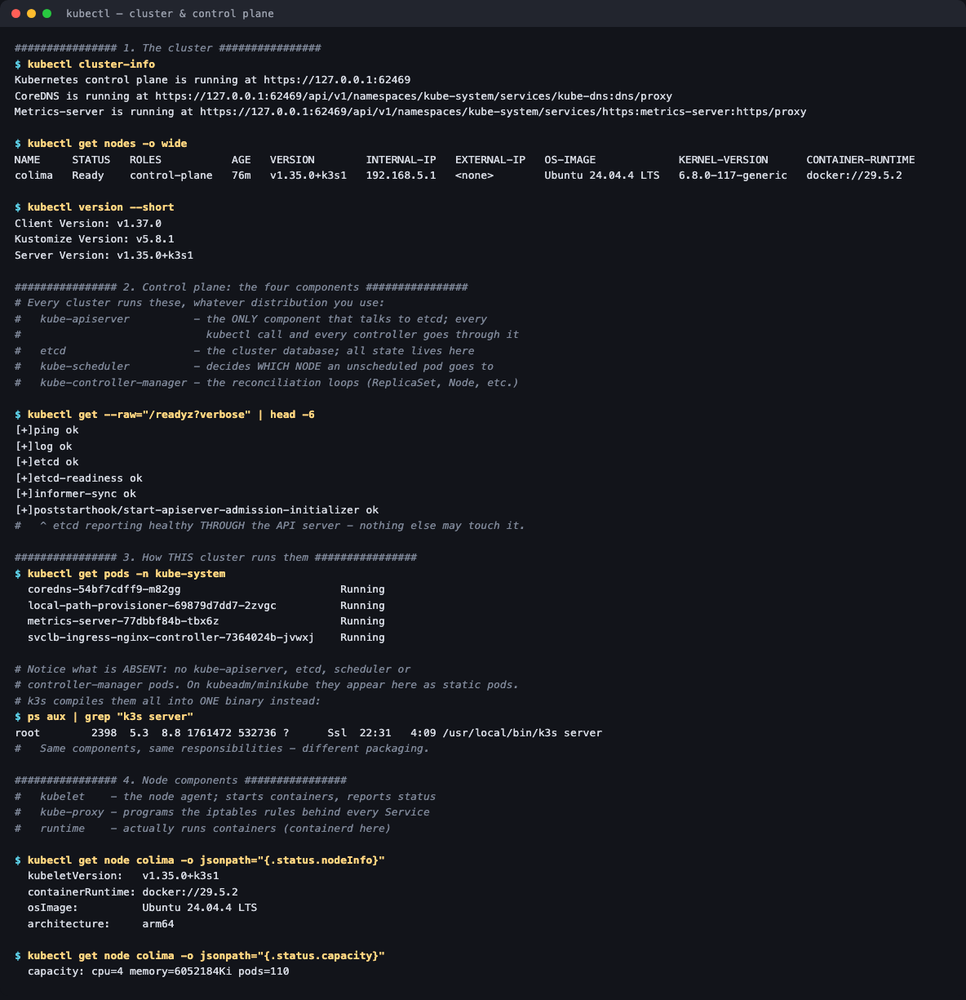
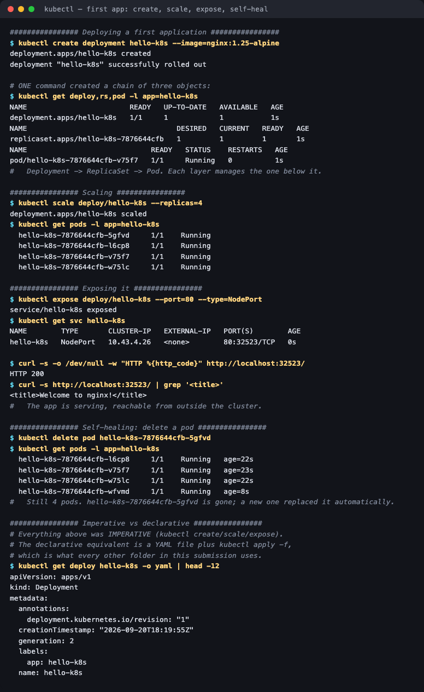

# Session 9 — Kubernetes Fundamentals

**Homework submission** · Lakshya Mewara · 24BCS10290

> **Cluster:** k3s `v1.35.0+k3s1`, single node (`colima`), Ubuntu 24.04, arm64, running in a
> Colima VM on macOS/Apple Silicon. Everything below was run against that live cluster.

---

## 1. The cluster

```bash
kubectl cluster-info
kubectl get nodes -o wide
```



```
Kubernetes control plane is running at https://127.0.0.1:62469
CoreDNS is running at https://127.0.0.1:62469/api/v1/namespaces/kube-system/services/kube-dns:dns/proxy

NAME     STATUS   ROLES           AGE   VERSION        INTERNAL-IP   OS-IMAGE             CONTAINER-RUNTIME
colima   Ready    control-plane   76m   v1.35.0+k3s1   192.168.5.1   Ubuntu 24.04.4 LTS   docker://29.5.2
```

A single node carrying the `control-plane` role — on a production cluster the control plane and workers are separate machines, and workers would show `<none>` or `worker` here.

## 2. Control plane — the four components

Every cluster runs these, regardless of distribution:

| Component | Responsibility |
|---|---|
| **kube-apiserver** | The front door. The **only** component that talks to etcd; every `kubectl` call, every controller and every kubelet goes through it |
| **etcd** | The cluster database — all state lives here, and nothing else is authoritative |
| **kube-scheduler** | Decides **which node** an unscheduled pod lands on |
| **kube-controller-manager** | Runs the reconciliation loops (ReplicaSet, Node, Endpoints, …) |

```
$ kubectl get --raw='/readyz?verbose' | head -6
[+]ping ok
[+]log ok
[+]etcd ok
[+]etcd-readiness ok
[+]informer-sync ok
```

Note *how* etcd's health is reported: **through the API server**. That's the architecture in one line — no component reaches the datastore directly.

## 3. How this particular cluster runs them

```
$ kubectl get pods -n kube-system
  coredns-54bf7cdff9-m82gg                        Running
  local-path-provisioner-69879d7dd7-2zvgc         Running
  metrics-server-77dbbf84b-tbx6z                  Running
  svclb-ingress-nginx-controller-7364024b-jvwxj   Running
```

**What's missing is the interesting part.** There are no `kube-apiserver`, `etcd`, `kube-scheduler` or `kube-controller-manager` pods. On kubeadm or minikube they appear here as static pods. k3s compiles all of them into a single binary:

```
$ ps aux | grep "k3s server"
root  2398  5.3  8.8  1761472 532736 ?  Ssl  22:31  4:09  /usr/local/bin/k3s server
```

Same components, same responsibilities, different **packaging** — which is exactly why k3s fits on a laptop or a Raspberry Pi. It also means "look at the control-plane pods" is not a universal debugging step; on k3s you read the `k3s` service logs instead.

## 4. Node components

| Component | Responsibility |
|---|---|
| **kubelet** | The node agent — takes pod specs from the API server, tells the runtime to start containers, reports status back |
| **kube-proxy** | Programs the iptables/IPVS rules that make Service VIPs work |
| **container runtime** | Actually runs containers (containerd/Docker) |

```
  kubeletVersion:   v1.35.0+k3s1
  containerRuntime: docker://29.5.2
  osImage:          Ubuntu 24.04.4 LTS
  architecture:     arm64
  capacity: cpu=4 memory=6052184Ki pods=110
```

That `pods=110` capacity is the kubelet's per-node limit — a real scheduling constraint, separate from CPU and memory.

## 5. Deploying a first application



```
$ kubectl create deployment hello-k8s --image=nginx:1.25-alpine
deployment.apps/hello-k8s created

$ kubectl get deploy,rs,pod -l app=hello-k8s
deployment.apps/hello-k8s        1/1
replicaset.apps/hello-k8s-7876644cfb   1  1  1
pod/hello-k8s-7876644cfb-slq7r       1/1   Running
```

**One command created three objects.** Deployment → ReplicaSet → Pod, each layer managing the one below it.

### Scaling

```
$ kubectl scale deploy/hello-k8s --replicas=4
  hello-k8s-7876644cfb-4lqm5   1/1  Running
  hello-k8s-7876644cfb-5flhp   1/1  Running
  hello-k8s-7876644cfb-p5vxn   1/1  Running
  hello-k8s-7876644cfb-slq7r   1/1  Running
```

### Exposing

```
$ kubectl expose deploy/hello-k8s --port=80 --type=NodePort
NAME        TYPE       CLUSTER-IP   PORT(S)
hello-k8s   NodePort   10.43.4.26   80:32523/TCP

$ curl -s -o /dev/null -w "HTTP %{http_code}" http://localhost:32523/
HTTP 200
$ curl -s http://localhost:32523/ | grep '<title>'
<title>Welcome to nginx!</title>
```


### Self-healing

```
$ kubectl delete pod hello-k8s-7876644cfb-4lqm5
$ kubectl get pods -l app=hello-k8s
  hello-k8s-7876644cfb-2xcnz   1/1  Running  age=8s     <- NEW
  hello-k8s-7876644cfb-5flhp   1/1  Running  age=16s
  hello-k8s-7876644cfb-p5vxn   1/1  Running  age=16s
  hello-k8s-7876644cfb-slq7r   1/1  Running  age=17s
```

Still four pods. The `age` column gives it away — one pod is 8 seconds old while the others are 16. Nobody asked for a replacement; the ReplicaSet controller noticed actual (3) ≠ desired (4) and closed the gap.

## 6. Imperative vs declarative

Everything in section 5 was **imperative** — `kubectl create`, `scale`, `expose`. It's the fastest way to learn and to poke at a cluster, but it leaves no record of intent.

The **declarative** equivalent is a YAML file plus `kubectl apply -f`, which is what every other folder in this submission uses. `kubectl get <object> -o yaml` shows the full stored spec, including everything the imperative command filled in by default.

---

## What I understood

- **Everything goes through the API server.** Controllers don't talk to each other, kubelets don't talk to etcd, `kubectl` has no special access. That single choke point is what makes RBAC, auditing and admission control possible at all.
- **Kubernetes is a set of reconciliation loops, not an orchestrator issuing commands.** Nothing "created a replacement pod" when I deleted one — a controller observed a difference between desired and actual state and acted. Self-healing, scaling and rollouts are all the same mechanism.
- **The declared architecture and its packaging are different things.** k3s runs one process where kubeadm runs five static pods, and the cluster behaves identically. Knowing which you're on changes *how you debug*, not what the components do.
- **The Deployment → ReplicaSet → Pod chain is worth internalising early.** Almost every later topic — rollouts, rollbacks, canaries — is an operation on that chain rather than on pods directly.
- **`kubectl get -o yaml` is the best learning tool available.** Creating something imperatively and then reading back the full stored object shows exactly which defaults Kubernetes applied.

## Files

The cluster used for the whole submission was created with:

```bash
colima start --kubernetes --cpu 4 --memory 6 --disk 40
kubectl get nodes
```

## Cleanup

```bash
kubectl delete deploy hello-k8s
kubectl delete svc hello-k8s
```
